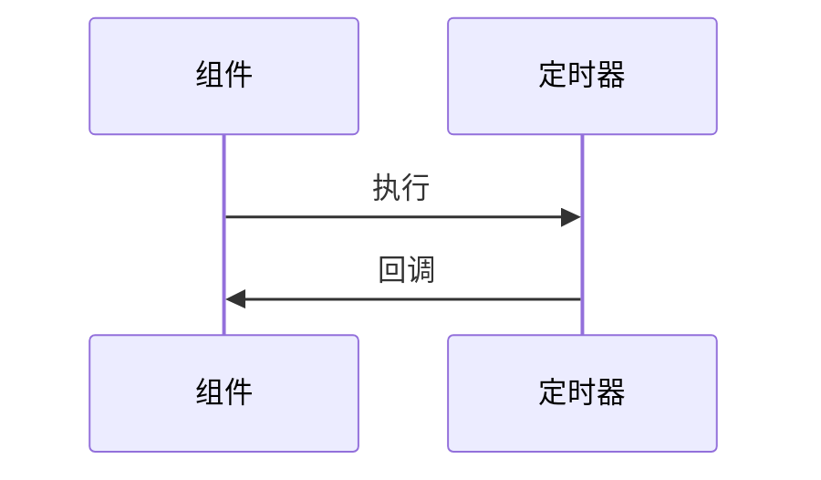

# vuepress-notes
学习笔记

## 参考资料：

### 框架：
https://vuepress.vuejs.org/zh/

### 主题：
http://v1.vuepress-reco.recoluan.com/views/1.x/

### 文章：
https://juejin.cn/post/7189073364365869093?searchId=20231019100419A26FC2508D2F3E32F2BA#heading-18
自动化部署
https://juejin.cn/post/6937532951223599141

### 插件：

樱花效果
vuepress-plugin-sakura
```shell
npm install vuepress-plugin-sakura -D
```

鼠标点击效果
vuepress-plugin-cursor-effects
```shell
npm install vuepress-plugin-cursor-effects -D
```

### 部署

项目使用 GitHub Actions 自动构建与部署。

**工作流文件：** `.github/workflows/doc.yml`

流程：
1. 推送到 `main` 分支自动触发
2. 使用 Node 18 安装依赖（`npm ci`）
3. 构建静态文件（`npm run docs:build`）
4. 通过 `peaceiris/actions-gh-pages` 将构建产物推送到 `gh-pages` 分支
5. GitHub Pages 自动从 `gh-pages` 分支部署

> **注意：** 由于 VuePress 1.x 依赖 webpack 4，在 Node 17+ 上构建需设置 `NODE_OPTIONS=--openssl-legacy-provider`，已在 CI 中配置。

## Mermaid 图表

项目支持使用 [Mermaid](https://mermaid.js.org/) 在 Markdown 中绘制流程图、时序图、类图等。

### 实现方式

不使用第三方 VuePress 插件（避免 VuePress 1.x 兼容性问题），而是直接在项目中实现：

| 文件 | 作用 |
|------|------|
| `docs/.vuepress/mermaid/markdown-it-mermaid.js` | 自定义 markdown-it 插件，将 ` ```mermaid ` 代码块转换为 `<div class="mermaid">` |
| `docs/.vuepress/enhanceApp.js` | 页面渲染后从 CDN 加载 Mermaid 并渲染图表 |
| `docs/.vuepress/config.ts` | `markdown.extendMarkdown` 注册自定义 markdown-it 插件 |

Mermaid 核心库通过 CDN `https://cdn.jsdelivr.net/npm/mermaid@8/dist/mermaid.min.js` 按需加载（增强应用中动态注入 `<script>` 标签），避免 webpack 4 无法打包 ESM-only 的 Mermaid 包。

### 使用方式

在 Markdown 中使用标准的 fenced code block，语言指定为 `mermaid`：

````markdown

````

支持 Mermaid 8 的所有图表类型：
- `sequenceDiagram` — 时序图
- `graph` / `flowchart` — 流程图
- `classDiagram` — 类图
- `stateDiagram-v2` — 状态图
- `gantt` — 甘特图
- `pie` — 饼图
- `erDiagram` — ER 图

### 注意事项

1. **Mermaid 版本**：使用 Mermaid v8（`mermaid@8`），不是最新的 v10+。语法以 v8 为准。
2. **避免特殊字符**：节点文本中不要使用 `()` 括号、`=>` 箭头、`⇒` 等符号，否则 Mermaid v8 词法解析会报错。改用文字描述替代。
3. **子图方向**：`graph LR` 下子图默认继承 LR 方向，不要在子图内使用 `direction` 覆盖（Mermaid v8 中可能导致 dagre 布局失败）。
4. **性能**：图表通过客户端渲染，首次加载需下载 Mermaid 库（约 3.5MB 压缩后 800KB+）。
5. **SSR 不支持**：图表在客户端 Vue 路由切换后渲染，构建生成的静态 HTML 中不会包含渲染后的 SVG。

