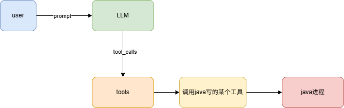
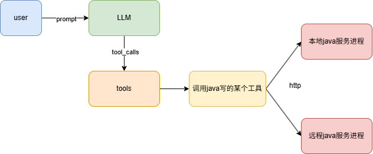
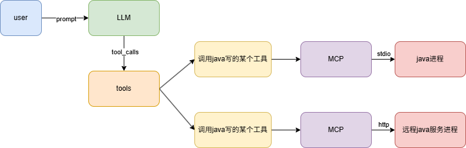
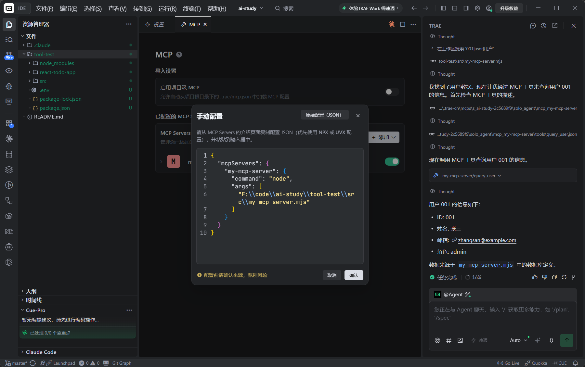
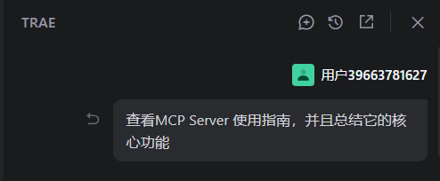
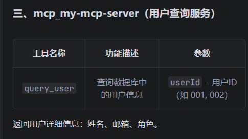
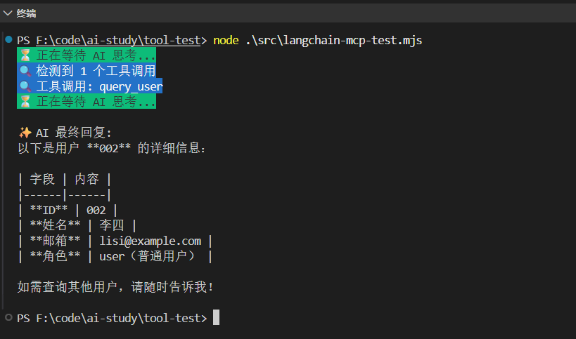

### 概念

大模型调用tool有个问题：

node 写的 ai agent 的代码，你的 tool 也得是 node 写

如果你之前有一些工具是 java、python、rust 写的呢

目前两个解决方案：




这里的 stdio 就是标准输入输出流，也就是键盘输入、控制台输出。当你进程跑一个子进程，就可以用这种方式通信



现在是解决了跨语言调用工具的问题

每个人都这样搞，它们提供的服务都不一样，我想接入别的 tool，就需要了解每个服务是怎么定义

如果哟普一个统一的通信协议，我们都按照这个格式来沟通，这样所有的跨进程工具调用就都可以接入了




这个协议就叫MCP

是给 Model 扩展 Context 上下文，让它能做的更多，知道的更多的 Protocal 协议

MCP 最大的特点就是可以**跨进程调用工具**

跨本地的进程调用，就是用 stdio

跨远程的进程调用，就是用 http

当然，在 langchain 里，它也是 tool ，只不过是 tool 的一种而已，就是一个包含了MCP client的tool

你在 tool 的函数里，调用下 MCP Client，访问下远程 Mcp Server，它本质上还是 tool，但是却集成了 MCP 工具

MCP 是由 AI 巨头 Anthropic 公司发起并开发，但是 2025 年 12 月交给了 Linux 基金会维护，现在是完全中立于任何一个模型的行业通用协议

安装mcp包：

```shell
pnpm install @modelcontextprotocol/sdk
```

写一个例子：

```js
import { McpServer } from "@modelcontextprotocol/sdk/server/mcp.js";
import { StdioServerTransport } from "@modelcontextprotocol/sdk/server/stdio.js";
import { z } from "zod";

// 数据库
const database = {
  users: {
    "001": {
      id: "001",
      name: "张三",
      email: "zhangsan@example.com",
      role: "admin",
    },
    "002": { id: "002", name: "李四", email: "lisi@example.com", role: "user" },
    "003": {
      id: "003",
      name: "王五",
      email: "wangwu@example.com",
      role: "user",
    },
  },
};

const server = new McpServer({
  name: "my-mcp-server",
  version: "1.0.0",
});

// 注册工具：查询用户信息
server.registerTool(
  "query_user",
  {
    description:
      "查询数据库中的用户信息。输入用户 ID，返回该用户的详细信息（姓名、邮箱、角色）。",
    inputSchema: {
      userId: z.string().describe("用户 ID，例如: 001, 002, 003"),
    },
  },
  async ({ userId }) => {
    const user = database.users[userId];

    if (!user) {
      return {
        content: [
          {
            type: "text",
            text: `用户 ID ${userId} 不存在。可用的 ID: 001, 002, 003`,
          },
        ],
      };
    }

    return {
      content: [
        {
          type: "text",
          text: `用户信息：\n- ID: ${user.id}\n- 姓名: ${user.name}\n- 邮箱: ${user.email}\n- 角色: ${user.role}`,
        },
      ],
    };
  },
);

/**
 * 注册一个 Resource（资源），让 MCP Client 能读取该资源的内容。
 *
 * 与 Tool（工具）不同，Resource 是静态的文档/数据，由 Client 主动读取，
 * 而非由 AI 按需调用。
 *
 * @param {string}          name        - 资源名称，用于标识该资源（必填）
 * @param {string}          uri         - 资源的 URI 地址，Client 通过此 URI 访问资源（必填）
 * @param {object}          metadata    - 资源元信息（必填）
 * @param {string}          [metadata.description] - 资源描述，帮助 AI 理解该资源用途
 * @param {string}          [metadata.mimeType]    - 资源 MIME 类型，如 "text/plain"、"application/json"
 * @param {() => Promise<{contents: Array<{uri: string, mimeType: string, text: string}>}>}
 *                          handler     - 异步回调函数，返回资源内容（必填）
 */
server.registerResource(
  "使用指南",
  "docs://guide",
  {
    description: "MCP Server 使用文档",
    mimeType: "text/plain",
  },
  async () => {
    return {
      contents: [
        {
          uri: "docs://guide",
          mimeType: "text/plain",
          text: `MCP Server 使用指南

功能：提供用户查询等工具。

使用：在 Cursor 等 MCP Client 中通过自然语言对话，Cursor 会自动调用相应工具。`,
        },
      ],
    };
  },
);

// 创建 stdio 传输层实例（基于标准输入/输出的传输层实例） —— MCP Server 通过标准输入/输出与 Client 通信
const transport = new StdioServerTransport();

// 将 Server 绑定到传输层上，开始监听并处理来自 MCP Client 的工具调用请求和资源读取请求
await server.connect(transport);
```

可以提供 stdio 的本地进程的调用方式，也可以提供 http 的远程调用方式

这里是 stdio 的传输方式（Transport）

其实就是 tool，加上了协议

### 标准输入输出（补充）

这是一个操作系统的 **进程间通信（IPC）** 基础概念。任何进程启动时，系统都会给它分配三个数据流：

**标准流（Standard Streams）**

| 流             | 名称     | 默认方向       | 类比                              |
| -------------- | -------- | -------------- | --------------------------------- |
| **stdin** (0)  | 标准输入 | **进**入进程   | 耳 朵 — 进程从这里「听」指令      |
| **stdout** (1) | 标准输出 | 从进程**出**来 | 嘴 巴 — 进程从这里「说」结果      |
| **stderr** (2) | 标准错误 | 从进程**出**来 | 备用嘴 — 进程从这里「说」错误信息 |

**MCP 场景下的具体流程**

```
Cursor (MCP Client)          my-mcp-server.mjs (MCP Server)
      │                              │
      │  写入你的进程的 stdin ──────→│  读取 stdin
      │  "帮我查用户 001"            │  (标准输入)
      │                              │
      │                              │  处理请求，查数据库
      │                              │
      │  ←────────── 写入 stdout     │
      │  "张三, zhangsan@..."        │  (标准输出)
      │  读取你的进程的 stdout       │
```

简单说就是：

- **`StdioServerTransport`** 让 MCP Server 成为一个**命令行进程**，通过「耳朵听指令 → 嘴巴答结果」的方式工作
- Cursor 等 MCP Client 在后台启动这个 `.mjs` 文件，往它的 stdin 写 JSON 格式的请求（"调用 query_user"），然后从它的 stdout 读 JSON 格式的响应
- 这就是为什么这个文件是 `.mjs` 且最后有 `server.connect(transport)` — 它跑成一个**常驻后台的 CLI 进程**，等待对话

这种模式的优点：**零网络开销，无需 HTTP 端口，随 Client 启动而启动，随 Client 关闭而关闭**，所以在本地开发场景是最主流的 MCP 部署方式。

### 在trae中使用mcp

比方说在trae配置刚才写好的mcp

然后查询，结果发现大模型就会去调用这个mcp了



**这就是 mcp 的好处，写好之后可以插拔到任何地方当 tool 用**

而我们注册的 Resource（资源）

不是用来作为 tool 触发的，而是可以引用用来写 prompt 之类的





因为有了 mcp，除了 tare，别的软件同样可以调用这个服务,比如cursor

### 在 langchain 中使用mcp

安装

```shell
npm install @langchain/mcp-adapters
```

```js
// ========================================
// LangChain MCP 集成测试 —— 通过 LLM 调用 MCP Server 工具
// ========================================
// 本脚本演示如何用 LangChain 的 MCP 适配器，
// 让兼容 OpenAI API 的 LLM 能调用 MCP Server 暴露的工具和数据。

import "dotenv/config"; // 加载 .env 文件到 process.env
import { MultiServerMCPClient } from "@langchain/mcp-adapters"; // MCP 多 Server 客户端
import { ChatOpenAI } from "@langchain/openai"; // OpenAI 兼容的 Chat 模型
import chalk from "chalk"; // 终端彩色输出
import {
  HumanMessage, // 用户消息
  SystemMessage, // 系统提示消息
  ToolMessage, // 工具执行结果消息
} from "@langchain/core/messages";

// ----------------------------------------
// 1. 初始化 LLM 模型（兼容 OpenAI API）
// ----------------------------------------
// 通过兼容 OpenAI 的 API 地址调用。
// OPENAI_API_KEY 和 OPENAI_BASE_URL 从 .env 文件中读取。
const model = new ChatOpenAI({
  modelName: "deepseek-v4-flash",
  apiKey: process.env.OPENAI_API_KEY,
  configuration: {
    baseURL: process.env.OPENAI_BASE_URL,
  },
});

// ----------------------------------------
// 2. 创建 MCP 客户端，连接到 MCP Server
// ----------------------------------------
// MultiServerMCPClient 启动一个子进程（stdio 协议），
// 自动与 MCP Server 建立通信，并获取其暴露的工具列表。
const mcpClient = new MultiServerMCPClient({
  mcpServers: {
    "my-mcp-server": {
      command: "node",
      args: ["src/my-mcp-server.mjs"],
    },
  },
});

// 获取 MCP Server 注册的所有工具（Tools），转换为 LangChain Tool 对象
const tools = await mcpClient.getTools();
// 将工具绑定到模型上 —— 模型在回答时可以自主选择调用这些工具
const modelWithTools = model.bindTools(tools);

// ----------------------------------------
// 3. 读取 MCP Server 的 Resources（资源/文档）
// ----------------------------------------
// 与 Tools 不同，Resources 是静态的文档数据（如使用指南），
// AI 可以将其作为 System Prompt 的一部分来理解上下文。
const res = await mcpClient.listResources();

// 将所有资源内容拼接到一个字符串中，后续作为 SystemMessage 注入
let resourceContent = "";
for (const [serverName, resources] of Object.entries(res)) {
  for (const resource of resources) {
    const content = await mcpClient.readResource(serverName, resource.uri);
    resourceContent += content[0].text;
  }
}

// ----------------------------------------
// 4. 核心：带工具调用的 AI Agent 循环
// ----------------------------------------
/**
 * 运行一个能自动调用工具的 AI Agent。
 *
 * 工作流程:
 *   1. 将 system prompt + 用户问题送入 LLM
 *   2. LLM 返回结果。如果结果中包含工具调用指令（tool_calls），
 *      则自动执行对应工具，把结果传回 LLM，进入下一轮思考；
 *      如果 LLM 直接返回了文本回复（没有工具调用），则结束循环。
 *   3. 最多迭代 maxIterations 次防止死循环。
 *
 * @param {string}  query         - 用户提问
 * @param {number}  maxIterations - 最大迭代轮数（默认 30）
 * @returns {Promise<string>}     - AI 的最终回复文本
 */
async function runAgentWithTools(query, maxIterations = 30) {
  // 初始化消息列表：系统提示（含 MCP Resource 内容）+ 用户提问
  const messages = [
    new SystemMessage(resourceContent),
    new HumanMessage(query),
  ];

  // 开始循环：AI 思考 → 调用工具 → 再思考 → 直到输出最终回复
  for (let i = 0; i < maxIterations; i++) {
    console.log(chalk.bgGreen(`⏳ 正在等待 AI 思考...`));
    const response = await modelWithTools.invoke(messages);
    messages.push(response);

    // 情况 A：LLM 没有调用任何工具 → 说明它已给出最终答案，直接返回
    if (!response.tool_calls || response.tool_calls.length === 0) {
      console.log(`\n✨ AI 最终回复:\n${response.content}\n`);
      return response.content;
    }

    // 情况 B：LLM 决定调用工具 → 打印日志，执行工具调用
    console.log(
      chalk.bgBlue(`🔍 检测到 ${response.tool_calls.length} 个工具调用`),
    );
    console.log(
      chalk.bgBlue(
        `🔍 工具调用: ${response.tool_calls.map((t) => t.name).join(", ")}`,
      ),
    );
    // 遍历所有要调用的工具，逐一执行
    for (const toolCall of response.tool_calls) {
      const foundTool = tools.find((t) => t.name === toolCall.name);
      if (foundTool) {
        // 执行工具（如 query_user），将结果包装成 ToolMessage 传回 LLM
        const toolResult = await foundTool.invoke(toolCall.args);
        messages.push(
          new ToolMessage({
            content: toolResult,
            tool_call_id: toolCall.id,
          }),
        );
      }
    }
    // 进入下一轮循环：LLM 带着工具执行结果继续思考
  }

  // 达到最大迭代次数仍未出结果，返回最后一条消息
  return messages[messages.length - 1].content;
}

// ----------------------------------------
// 5. 入口：运行 Agent
// ----------------------------------------
await runAgentWithTools("查一下用户 002 的信息");
// 也可以测试读取 MCP Resource（使用指南）：
// await runAgentWithTools("MCP Server 的使用指南是什么");

// 关闭 MCP 客户端连接，释放子进程资源
await mcpClient.close();
```

运行：



和之前的原理一样，只是多了一步

- 使用MultiServerMCPClient创建 MCP 客户端，连接到 MCP Server
- 获取 MCP Server 注册的所有工具（Tools），转换为 LangChain Tool 对象

其余步骤和之前相同

而其中的不同，Resources则放到 system message 里作为上下文

resource 可以用在 system message 里，也可以用在 human message 里，总之，是作为信息引用的

这样就完成了一个mcp server

并分别在 tare、langchain 里用了这个 mcp server

当不需要跨进程用的时候，还是之前那样写更好，还少了进程通信的成本

### 总结

#### 为什么需要 MCP

大模型调用 tool 有一个**语言绑定**的问题：用 Node.js 写的 AI Agent，它的 tool 也必须用 Node.js 写。如果已有的工具是用 Java、Python、Rust 写的，就没法直接用。

MCP（Model Context Protocol）就是为了解决这个问题——它提供了一套**统一的通信协议**，让任何语言编写的工具都能接入 AI Agent，实现**跨进程、跨语言的工具调用**。

#### 核心概念

| 概念 | 说明 |
| --- | --- |
| **MCP Server** | 提供工具和资源的服务端，可以用任何语言实现 |
| **MCP Client** | 连接 Server 并调用其工具的客户端（如 LangChain 的 `MultiServerMCPClient`） |
| **Transport** | 传输层协议：**stdio**（本地子进程通信）或 **HTTP**（远程服务通信） |
| **Tool** | 由 AI 按需调用的功能（查用户、写文件等） |
| **Resource** | 静态文档/数据，由 Client 主动读取，作为 AI 的上下文信息 |

#### MCP 的本质

MCP 本质上就是 **Tool + 协议**：

- 还是之前的 tool 定义（name、description、参数 schema）
- 但增加了标准的通信协议层，使得工具可以**跨进程调用**
- 本地场景用 **stdio** 传输（零网络开销，随 Client 启停）
- 远程场景用 **HTTP** 传输

最大的好处是**插拔性**：写好一个 MCP Server 后，可以接入到 Trae、Cursor、LangChain 等任何支持 MCP 的 Client 中使用，一处编写，多处复用。

#### MCP 与普通 tool 的选择

| 场景 | 推荐方式 | 原因 |
| --- | --- | --- |
| 工具和 Agent 同语言（如全 Node.js） | 普通 tool | 更简单，无进程通信开销 |
| 工具是其他语言编写 | MCP | 跨语言调用的唯一方案 |
| 工具需要被多个 IDE/Agent 复用 | MCP | 一次编写，到处插拔 |
| 需要读取静态文档作为上下文 | MCP Resource | Resource 机制天然适合提供文档信息 |