### 背景

大模型是无状态的，你这次调用和下次调用没区别，它并不知道之前你问了什么，回答了什么

之前我们在prompt中写好了一些信息，放入了 SystemMessage，告诉大模型它的角色、功能，然后放入了 HumanMessage，也就是用户问的问题

大模型返回了 AIMessage 和 tool_calls 信息

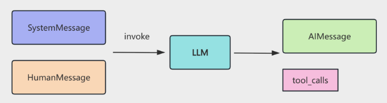

我们基于 tool_calls 去调用工具，然后把结果封装成 ToolMessage 也放入 messages 数组

这样 messages 数组里就有了 SystemMessage、HumanMessage、AIMessage、ToolMessage

循环调用大模型，这是第二步

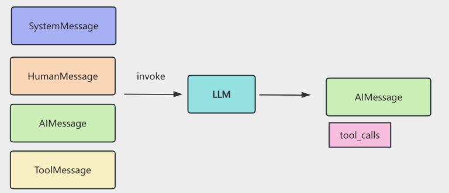

直到最后没有tool_callls，就返回AIMessage,得到最终回复

在这个过程中messages数据就相当于Memory

但是这种不停往messages数组push的机制并不合理

大模型上下文长度是有限的，无限push就会超出

主流的思路：截断、总结、检索

 在使用cluade code的时候当到某个阈值就会开启context compact，也就是总结

还有一个问题需要考虑，memory应该存储在哪里，之前的操作是在内存中存储，实际上还可以做持久化：

langchain中有ChatMessageHistory相关的类

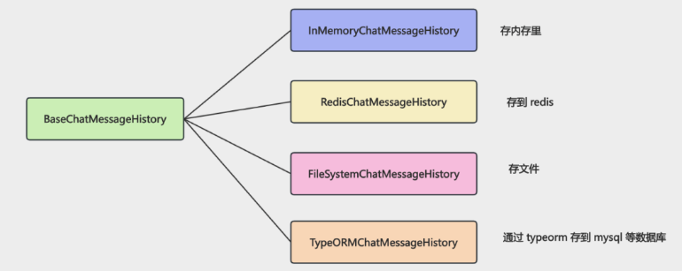

截断、总结、检索（向量数据库）完全可以自己实现：

- 截断就是根据总 token 数量来保留最近的 message  

- 总结就是调用大模型对之前的 message 生成一个摘要  

- 检索向量数据库就是之前的 RAG 流程，只不过用来对 message 做语义检索

### 代码实现

```js
import "dotenv/config";
import { ChatOpenAI } from "@langchain/openai";
import { InMemoryChatMessageHistory } from "@langchain/core/chat_history";
import { HumanMessage, SystemMessage } from "@langchain/core/messages";

const model = new ChatOpenAI({
  modelName: process.env.MODEL_NAME,
  apiKey: process.env.OPENAI_API_KEY,
  temperature: 0,
  configuration: {
    baseURL: process.env.OPENAI_BASE_URL,
  },
});

async function inMemoryDemo() {
  const history = new InMemoryChatMessageHistory();

  const systemMessage = new SystemMessage(
    "你是一个友好、幽默的做菜助手，喜欢分享美食和烹饪技巧。"
  );

  // 第一轮对话
  console.log("[第一轮对话]");
  const userMessage1 = new HumanMessage("你今天吃的什么？");
  await history.addMessage(userMessage1);

  const messages1 = [systemMessage, ...(await history.getMessages())];
  const response1 = await model.invoke(messages1);
  await history.addMessage(response1);

  console.log(`用户: ${userMessage1.content}`);
  console.log(`助手: ${response1.content}\n`);

  // 第二轮对话（基于历史记录）
  console.log("[第二轮对话 - 基于历史记录]");
  const userMessage2 = new HumanMessage("好吃吗？");
  await history.addMessage(userMessage2);

  const messages2 = [systemMessage, ...(await history.getMessages())];
  const response2 = await model.invoke(messages2);
  await history.addMessage(response2);

  console.log(`用户: ${userMessage2.content}`);
  console.log(`助手: ${response2.content}\n`);

  // 展示所有历史消息
  console.log("[历史消息记录]");
  const allMessages = await history.getMessages();
  console.log(`共保存了 ${allMessages.length} 条消息：`);
  allMessages.forEach((msg, index) => {
    const type = msg.type;
    const prefix = type === "human" ? "用户" : "助手";
    console.log(
      `  ${index + 1}. [${prefix}]: ${msg.content.substring(0, 50)}...`
    );
  });
}

inMemoryDemo().catch(console.error);
```

运行：

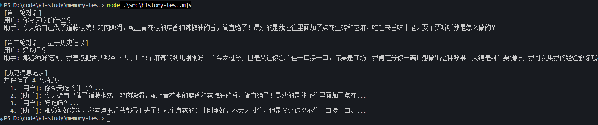

可以看到大模型记住了之前谈话的内容，之前是使用`messages`数组实现的，现在使用`InMemoryChatMessageHistory`

### 持久化记忆

在使用codex类似的客户端，可以随时回到历史对话继续对话，这就是持久化记忆，也叫长时记忆（LTM long-term memory）

尝试存文件实现长时记忆：

```js
import 'dotenv/config';
import { ChatOpenAI } from '@langchain/openai';
import { FileSystemChatMessageHistory } from "@langchain/community/stores/message/file_system";
import { HumanMessage, SystemMessage } from "@langchain/core/messages";
import path from "node:path";

const model = new ChatOpenAI({ 
  modelName: process.env.MODEL_NAME,
  apiKey: process.env.OPENAI_API_KEY,
  temperature: 0,
  configuration: {
      baseURL: process.env.OPENAI_BASE_URL,
  },
});

async function fileHistoryDemo() {
  // 指定存储文件的路径
  const filePath = path.join(process.cwd(), "chat_history.json");
  const sessionId = "user_session_001";

  // 系统提示词
  const systemMessage = new SystemMessage(
    "你是一个友好的做菜助手，喜欢分享美食和烹饪技巧。"
  );

  console.log("[第一轮对话]");
  const history = new FileSystemChatMessageHistory({
    filePath: filePath,
    sessionId: sessionId,
  });

  const userMessage1 = new HumanMessage(
    "红烧肉怎么做"
  );
  await history.addMessage(userMessage1);
  
  const messages1 = [systemMessage, ...(await history.getMessages())];
  const response1 = await model.invoke(messages1);
  await history.addMessage(response1);
  
  console.log(`用户: ${userMessage1.content}`);
  console.log(`助手: ${response1.content}`);
  console.log(`✓ 对话已保存到文件: ${filePath}\n`);

  console.log("[第二轮对话]");
  const userMessage2 = new HumanMessage(
    "好吃吗？"
  );
  await history.addMessage(userMessage2);
  
  const messages2 = [systemMessage, ...(await history.getMessages())];
  const response2 = await model.invoke(messages2);
  await history.addMessage(response2);
  
  console.log(`用户: ${userMessage2.content}`);
  console.log(`助手: ${response2.content}`);
  console.log(`✓ 对话已更新到文件\n`);
}

fileHistoryDemo().catch(console.error);
```

运行：

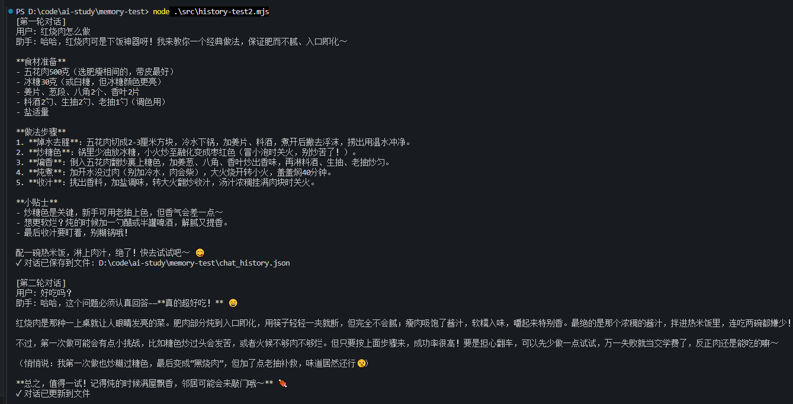

本地文件啊也正常写入了

再新建一个文件，使用本地文件来做历史记录

```js
import 'dotenv/config';
import { ChatOpenAI } from '@langchain/openai';
import { FileSystemChatMessageHistory } from "@langchain/community/stores/message/file_system";
import { HumanMessage, AIMessage, SystemMessage } from "@langchain/core/messages";
import path from "node:path";

const model = new ChatOpenAI({ 
  modelName: process.env.MODEL_NAME,
  apiKey: process.env.OPENAI_API_KEY,
  temperature: 0,
  configuration: {
      baseURL: process.env.OPENAI_BASE_URL,
  },
});

async function fileHistoryDemo() {
  // 指定存储文件的路径
  const filePath = path.join(process.cwd(), "chat_history.json");
  const sessionId = "user_session_001";

  // 系统提示词
  const systemMessage = new SystemMessage(
    "你是一个友好、幽默的做菜助手，喜欢分享美食和烹饪技巧。"
  );

  
  const restoredHistory = new FileSystemChatMessageHistory({
    filePath: filePath,
    sessionId: sessionId,
  });
  
  const restoredMessages = await restoredHistory.getMessages();
  console.log(`从文件恢复了 ${restoredMessages.length} 条历史消息：`);
  restoredMessages.forEach((msg, index) => {
    const type = msg.type;
    const prefix = type === 'human' ? '用户' : '助手';
    console.log(`  ${index + 1}. [${prefix}]: ${msg.content.substring(0, 50)}...`);
  });
  console.log();

  console.log("[第三轮对话]");
  const userMessage3 = new HumanMessage(
    "需要哪些食材？"
  );
  await restoredHistory.addMessage(userMessage3);
  
  const messages3 = [systemMessage, ...(await restoredHistory.getMessages())];
  const response3 = await model.invoke(messages3);
  await restoredHistory.addMessage(response3);
  
  console.log(`用户: ${userMessage3.content}`);
  console.log(`助手: ${response3.content}`);
  console.log(`✓ 对话已保存到文件\n`);
}

fileHistoryDemo().catch(console.error);
```

运行：

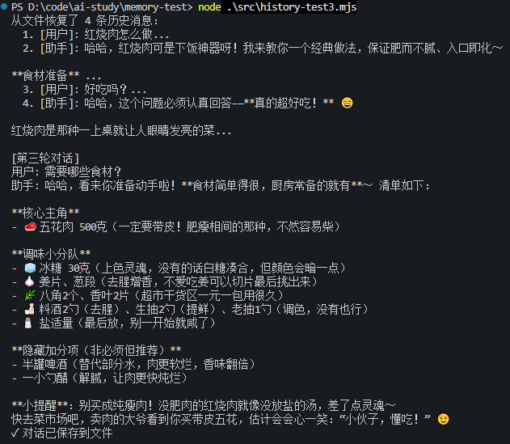

实际上这样就实现了本地文件记录历史记录  

ChatMessageHistory 的 api 只是用来存储 message，接下来实现那三种策略：

### 截断

```js
import { InMemoryChatMessageHistory } from "@langchain/core/chat_history";
import {
  HumanMessage,
  AIMessage,
  trimMessages,
} from "@langchain/core/messages";
import { countTokens as dsCountTokens } from "@deepseek-kit/tokenizer";

// ========== 1. 按消息数量截断 ==========
async function messageCountTruncation() {
  const history = new InMemoryChatMessageHistory();
  const maxMessages = 4;

  const messages = [
    { type: "human", content: "我叫张三" },
    { type: "ai", content: "你好张三，很高兴认识你！" },
    { type: "human", content: "我今年25岁" },
    { type: "ai", content: "25岁正是青春年华，有什么我可以帮助你的吗？" },
    { type: "human", content: "我喜欢编程" },
    { type: "ai", content: "编程很有趣！你主要用什么语言？" },
    { type: "human", content: "我住在北京" },
    { type: "ai", content: "北京是个很棒的城市！" },
    { type: "human", content: "我的职业是软件工程师" },
    { type: "ai", content: "软件工程师是个很有前景的职业！" },
  ];

  // 添加所有消息
  for (const msg of messages) {
    if (msg.type === "human") {
      await history.addMessage(new HumanMessage(msg.content));
    } else {
      await history.addMessage(new AIMessage(msg.content));
    }
  }

  let allMessages = await history.getMessages();

  // 按消息数量截断：保留最近 maxMessages 条消息
  const trimmedMessages = allMessages.slice(-maxMessages);

  console.log(`保留消息数量: ${trimmedMessages.length}`);
  console.log(
    "保留的消息:",
    trimmedMessages
      .map((m) => `${m.constructor.name}: ${m.content}`)
      .join("\n  ")
  );
}

// 计算消息数组的总 token 数量（使用 DeepSeek V4 tokenizer）
async function countTokens(messages) {
  let total = 0;
  for (const msg of messages) {
    const content =
      typeof msg.content === "string"
        ? msg.content
        : JSON.stringify(msg.content);
    total += await dsCountTokens(content);
  }
  return total;
}

// ========== 2. 按 token 数量截断（使用 DeepSeek V4 tokenizer 计数） ==========
async function tokenCountTruncation() {
  const history = new InMemoryChatMessageHistory();
  const maxTokens = 100; // 限制最多 100 个 token

  const messages = [
    { type: "human", content: "我叫李四" },
    { type: "ai", content: "你好李四，很高兴认识你！" },
    { type: "human", content: "我是一名设计师" },
    {
      type: "ai",
      content: "设计师是个很有创造力的职业！你主要做什么类型的设计？",
    },
    { type: "human", content: "我喜欢艺术和音乐" },
    { type: "ai", content: "艺术和音乐都是很好的爱好，它们能激发创作灵感。" },
    { type: "human", content: "我擅长 UI/UX 设计" },
    { type: "ai", content: "UI/UX 设计非常重要，好的用户体验能让产品更成功！" },
  ];

  // 添加所有消息
  for (const msg of messages) {
    if (msg.type === "human") {
      await history.addMessage(new HumanMessage(msg.content));
    } else {
      await history.addMessage(new AIMessage(msg.content));
    }
  }

  let allMessages = await history.getMessages();

  // 使用 trimMessages API：使用 DeepSeek tokenizer 计算 token 数量
  const trimmedMessages = await trimMessages(allMessages, {
    maxTokens: maxTokens,
    tokenCounter: async (msgs) => countTokens(msgs),
    strategy: "last", // 保留最近的消息
  });

  // 计算实际 token 数用于显示
  const totalTokens = await countTokens(trimmedMessages);

  const displayMessages = await Promise.all(
    trimmedMessages.map(async (m) => {
      const content =
        typeof m.content === "string" ? m.content : JSON.stringify(m.content);
      const tokens = await dsCountTokens(content);
      return `${m.constructor.name} (${tokens} tokens): ${content}`;
    })
  );

  console.log(`总 token 数: ${totalTokens}/${maxTokens}`);
  console.log(`保留消息数量: ${trimmedMessages.length}`);
  console.log(
    "保留的消息:",
    displayMessages.join("\n  ")
  );
}

async function runAll() {
  await messageCountTruncation();
  await tokenCountTruncation();
}

runAll().catch(console.error);
```

这里使用了@deepseek-kit/tokenizer的countTokens 来计算token，之前使用js-tiktoken(只支持gpt模型)，不同模型之间分词器不同，token计算方式不同

运行：

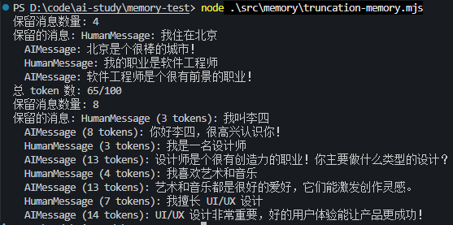

这里是两种计数逻辑

- 直接从`history.getMessages()`中获取全部记录，按消息数量截断：保留最近 maxMessages 条消息

- 按 token 数量截断（使用 DeepSeek V4 tokenizer 计数），使用`trimMessages API`

### 总结（压缩compact）

#### 消息条数触发

```js
import "dotenv/config";
import { ChatOpenAI } from "@langchain/openai";
import { InMemoryChatMessageHistory } from "@langchain/core/chat_history";
import {
  HumanMessage,
  SystemMessage,
  AIMessage,
  getBufferString,
} from "@langchain/core/messages";

const model = new ChatOpenAI({
  modelName: process.env.MODEL_NAME,
  apiKey: process.env.OPENAI_API_KEY,
  temperature: 0,
  configuration: {
    baseURL: process.env.OPENAI_BASE_URL,
  },
});

// ========== 总结策略演示 ==========
async function summarizationMemoryDemo() {
  const history = new InMemoryChatMessageHistory();
  const maxMessages = 6; // 超过 6 条消息时触发总结

  const messages = [
    { type: "human", content: "我想学做红烧肉，你能教我吗？" },
    {
      type: "ai",
      content:
        "当然可以！红烧肉是一道经典的中式菜肴。首先需要准备五花肉、冰糖、生抽、老抽、料酒等材料。",
    },
    { type: "human", content: "五花肉需要切多大块？" },
    {
      type: "ai",
      content:
        "建议切成3-4厘米见方的块，这样既容易入味，口感也更好。切好后可以用开水焯一下去除血沫。",
    },
    { type: "human", content: "炒糖色的时候有什么技巧吗？" },
    {
      type: "ai",
      content:
        "炒糖色是关键步骤。用小火慢慢炒，等冰糖完全融化变成焦糖色，冒小泡时就可以下肉了。注意不要炒过头，否则会发苦。",
    },
    { type: "human", content: "需要炖多长时间？" },
    {
      type: "ai",
      content:
        "一般需要炖40-60分钟，用小火慢炖，直到肉变得软糯入味。可以用筷子戳一下，能轻松戳透就说明好了。",
    },
    { type: "human", content: "最后收汁的时候要注意什么？" },
    {
      type: "ai",
      content:
        "收汁时要用大火，不断翻动，让汤汁均匀包裹在肉块上。看到汤汁变得浓稠，颜色红亮就可以出锅了。",
    },
  ];

  // 添加所有消息
  for (const msg of messages) {
    if (msg.type === "human") {
      await history.addMessage(new HumanMessage(msg.content));
    } else {
      await history.addMessage(new AIMessage(msg.content));
    }
  }

  //  allMessages 里的每条消息是一个消息类的实例
  //  new HumanMessage("你好") → 类名是 HumanMessage
  //  new AIMessage("你好") → 类名是 AIMessage
  //  m.constructor.name就是类名
  let allMessages = await history.getMessages();

  console.log(`原始消息数量: ${allMessages.length}`);
  console.log(
    "原始消息:",
    allMessages.map((m) => `${m.constructor.name}: ${m.content}`).join("\n  "),
  );

  // 如果消息过多，触发总结
  if (allMessages.length >= maxMessages) {
    const keepRecent = 2; // 保留最近 2 条消息

    // 分离要保留的消息和要总结的消息
    const recentMessages = allMessages.slice(-keepRecent);
    const messagesToSummarize = allMessages.slice(0, -keepRecent);

    console.log("\n💡 历史消息过多，开始总结...");
    console.log(`📝 将被总结的消息数量: ${messagesToSummarize.length}`);
    console.log(`📝 将被保留的消息数量: ${recentMessages.length}`);

    // 总结将被丢弃的旧消息
    const summary = await summarizeHistory(messagesToSummarize);

    // 清空历史消息，只保留最近的消息
    await history.clear();
    for (const msg of recentMessages) {
      await history.addMessage(msg);
    }

    console.log(`\n保留消息数量: ${recentMessages.length}`);
    console.log(
      "保留的消息:",
      recentMessages
        .map((m) => `${m.constructor.name}: ${m.content}`)
        .join("\n  "),
    );
    console.log(`\n总结内容（不包含保留的消息）: ${summary}`);
  } else {
    console.log("\n消息数量未超过阈值，无需总结");
  }
}

summarizationMemoryDemo().catch(console.error);

// 总结历史对话的函数，将消息列表格式化成可读的文本字符串，然后给大模型总结
async function summarizeHistory(messages) {
  if (messages.length === 0) return "";

  // 消息列表格式化成可读的文本字符串
  const conversationText = getBufferString(messages, {
    humanPrefix: "用户",
    aiPrefix: "助手",
  });

  const summaryPrompt = `请总结以下对话的核心内容，保留重要信息：

${conversationText}

总结：`;

  const summaryResponse = await model.invoke([
    new SystemMessage(summaryPrompt),
  ]);
  return summaryResponse.content;
}
```

有 10 条消息，我们只保留最近的 2 条，之前的用 LLM 做总结

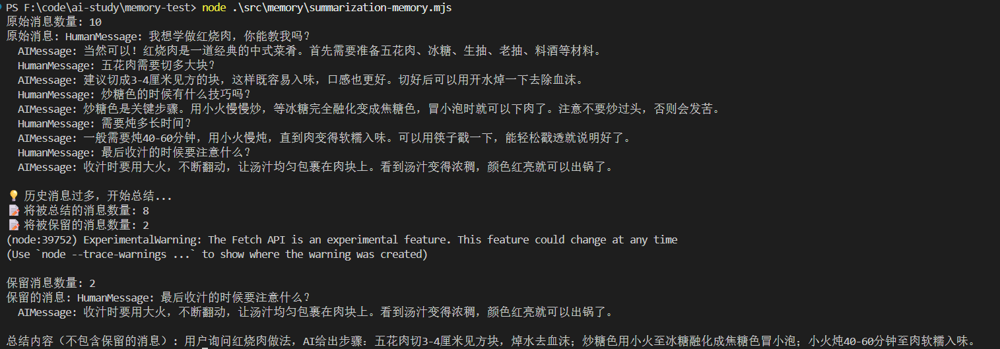

这里用到了 getBufferString 的 api，它可以给 HumanMessage、AIMessage 等加上不同的前缀来格式化

> getBufferString函数，它是 LangChain 的工具函数，把**消息列表格式化成可读的文本字符串**
>
> 假设你有一组消息：
>
> ```js
> [
>   new HumanMessage("今天天气怎么样？"),
>   new AIMessage("今天晴天，20度。"),
>   new HumanMessage("适合出门吗？"),
> ]
> ```
>
> `getBufferString(messages, { humanPrefix: "用户", aiPrefix: "助手" })` 会把它变成：
>
> ```
> 用户: 今天天气怎么样？
> 助手: 今天晴天，20度。
> 用户: 适合出门吗？
> ```

总结之后，上下文变少，自然就节省token

但是更常规的是使用token来触发总结（压缩），而不是消息条数

#### token消耗触发

```js
import "dotenv/config";
import { ChatOpenAI } from "@langchain/openai";
import { InMemoryChatMessageHistory } from "@langchain/core/chat_history";
import {
  HumanMessage,
  SystemMessage,
  AIMessage,
  getBufferString,
} from "@langchain/core/messages";
import { countTokens as dsCountTokens } from "@deepseek-kit/tokenizer";

const model = new ChatOpenAI({
  modelName: process.env.MODEL_NAME,
  apiKey: process.env.OPENAI_API_KEY,
  temperature: 0,
  configuration: {
    baseURL: process.env.OPENAI_BASE_URL,
  },
});

// 计算消息数组的总 token 数量（使用 DeepSeek V4 tokenizer）
async function countTokens(messages) {
  let total = 0;
  for (const msg of messages) {
    const content =
      typeof msg.content === "string"
        ? msg.content
        : JSON.stringify(msg.content);
    total += await dsCountTokens(content);
  }
  return total;
}

// ========== 总结策略演示（基于 token 计数） ==========
async function summarizationMemoryDemo() {
  const history = new InMemoryChatMessageHistory();
  const maxTokens = 200; // 超过 200 个 token 时触发总结
  const keepRecentTokens = 80; // 保留最近消息的 token 数量（约占总数的 40%）

  const messages = [
    { type: "human", content: "我想学做红烧肉，你能教我吗？" },
    {
      type: "ai",
      content:
        "当然可以！红烧肉是一道经典的中式菜肴。首先需要准备五花肉、冰糖、生抽、老抽、料酒等材料。",
    },
    { type: "human", content: "五花肉需要切多大块？" },
    {
      type: "ai",
      content:
        "建议切成3-4厘米见方的块，这样既容易入味，口感也更好。切好后可以用开水焯一下去除血沫。",
    },
    { type: "human", content: "炒糖色的时候有什么技巧吗？" },
    {
      type: "ai",
      content:
        "炒糖色是关键步骤。用小火慢慢炒，等冰糖完全融化变成焦糖色，冒小泡时就可以下肉了。注意不要炒过头，否则会发苦。",
    },
    { type: "human", content: "需要炖多长时间？" },
    {
      type: "ai",
      content:
        "一般需要炖40-60分钟，用小火慢炖，直到肉变得软糯入味。可以用筷子戳一下，能轻松戳透就说明好了。",
    },
    { type: "human", content: "最后收汁的时候要注意什么？" },
    {
      type: "ai",
      content:
        "收汁时要用大火，不断翻动，让汤汁均匀包裹在肉块上。看到汤汁变得浓稠，颜色红亮就可以出锅了。",
    },
  ];

  // 添加所有消息
  for (const msg of messages) {
    if (msg.type === "human") {
      await history.addMessage(new HumanMessage(msg.content));
    } else {
      await history.addMessage(new AIMessage(msg.content));
    }
  }

  let allMessages = await history.getMessages();

  const totalTokens = await countTokens(allMessages);

  // 如果 token 数超过阈值，触发总结
  if (totalTokens >= maxTokens) {
    // 从后往前累加消息，保留最近的消息直到达到 keepRecentTokens
    const recentMessages = [];
    let recentTokens = 0;

    for (let i = allMessages.length - 1; i >= 0; i--) {
      const msg = allMessages[i];
      const content =
        typeof msg.content === "string"
          ? msg.content
          : JSON.stringify(msg.content);
      const msgTokens = await dsCountTokens(content);

      if (recentTokens + msgTokens <= keepRecentTokens) {
        recentMessages.unshift(msg);
        recentTokens += msgTokens;
      } else {
        break;
      }
    }

    // 需要被总结的消息
    const messagesToSummarize = allMessages.slice(
      0,
      allMessages.length - recentMessages.length,
    );
    const summarizeTokens = await countTokens(messagesToSummarize);

    console.log("\n💡 Token 数量超过阈值，开始总结...");
    console.log(
      `📝 将被总结的消息数量: ${messagesToSummarize.length} (${summarizeTokens} tokens)`,
    );
    console.log(
      `📝 将被保留的消息数量: ${recentMessages.length} (${recentTokens} tokens)`,
    );

    // 总结将被丢弃的旧消息
    const summary = await summarizeHistory(messagesToSummarize);

    // 清空历史消息，只保留最近的消息
    await history.clear();
    for (const msg of recentMessages) {
      await history.addMessage(msg);
    }

    console.log(`\n保留消息数量: ${recentMessages.length}`);
    console.log(
      "保留的消息:",
      (await Promise.all(
        recentMessages.map(async (m) => {
          const content =
            typeof m.content === "string"
              ? m.content
              : JSON.stringify(m.content);
          const tokens = await dsCountTokens(content);
          return `${m.constructor.name} (${tokens} tokens): ${m.content}`;
        }),
      )).join("\n  "),
    );
    console.log(`\n总结内容（不包含保留的消息）: ${summary}`);
  } else {
    console.log(
      `\nToken 数量 (${totalTokens}) 未超过阈值 (${maxTokens})，无需总结`,
    );
  }
}

summarizationMemoryDemo().catch(console.error);

// 总结历史对话的函数
async function summarizeHistory(messages) {
  if (messages.length === 0) return "";

  const conversationText = getBufferString(messages, {
    humanPrefix: "用户",
    aiPrefix: "助手",
  });

  const summaryPrompt = `请总结以下对话的核心内容，保留重要信息：

${conversationText}

总结：`;

  const summaryResponse = await model.invoke([
    new SystemMessage(summaryPrompt),
  ]);
  return summaryResponse.content;
}
```

运行

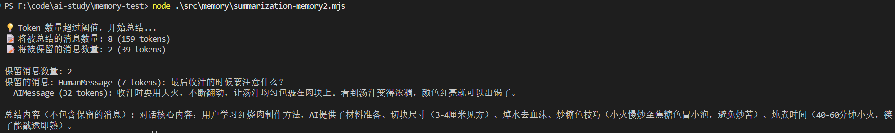

cursor和claude code就是这种策略

### 检索（向量数据库）

运行docker，把数据库启起来


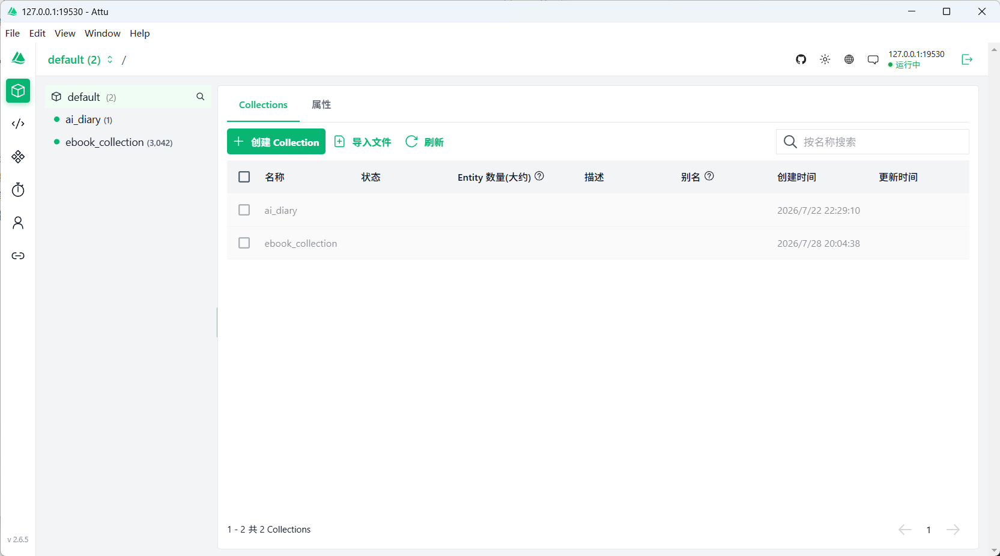

#### 插入数据

先来创建新集合，插入数据

```js
import "dotenv/config";
import {
  MilvusClient,
  DataType,
  MetricType,
  IndexType,
} from "@zilliz/milvus2-sdk-node";
import { OpenAIEmbeddings } from "@langchain/openai";

const COLLECTION_NAME = "conversations";
const VECTOR_DIM = 1024;

const embeddings = new OpenAIEmbeddings({
  apiKey: process.env.EMBEDDINGS_OPENAI_API_KEY,
  model: "text-embedding-v3",
  configuration: {
    baseURL:
      process.env.EMBEDDINGS_OPENAI_BASE_URL,
  },
  dimensions: VECTOR_DIM,
});

const client = new MilvusClient({
  address: "localhost:19530",
});

/**
 * 获取文本的向量嵌入
 */
async function getEmbedding(text) {
  const result = await embeddings.embedQuery(text);
  return result;
}

async function main() {
  try {
    console.log("连接到 Milvus...");
    await client.connectPromise;
    console.log("✓ 已连接\n");

    // 创建集合
    console.log("创建集合...");
    await client.createCollection({
      collection_name: COLLECTION_NAME,
      fields: [
        {
          name: "id",
          data_type: DataType.VarChar,
          max_length: 50,
          is_primary_key: true,
        },
        { name: "vector", data_type: DataType.FloatVector, dim: VECTOR_DIM },
        { name: "content", data_type: DataType.VarChar, max_length: 5000 },
        { name: "round", data_type: DataType.Int64 },
        { name: "timestamp", data_type: DataType.VarChar, max_length: 100 },
      ],
    });
    console.log("✓ 集合已创建");

    // 创建索引
    console.log("\n创建索引...");
    await client.createIndex({
      collection_name: COLLECTION_NAME,
      field_name: "vector",
      index_type: IndexType.IVF_FLAT,         // 索引类型：IVF_FLAT（倒排文件+暴力搜索，平衡速度与精度）
      metric_type: MetricType.COSINE,         // 相似度度量方式：余弦相似度（衡量向量方向一致性）
    });
    console.log("✓ 索引已创建");

    // 加载集合
    console.log("\n加载集合...");
    await client.loadCollection({ collection_name: COLLECTION_NAME });
    console.log("✓ 集合已加载");

    // 插入对话数据
    console.log("\n插入对话数据...");
    const conversations = [
      {
        id: "conv_001",
        content:
          "用户: 我叫赵六，是一名数据科学家\n助手: 很高兴认识你，赵六！数据科学是一个很有趣的领域。",
        round: 1,
        timestamp: new Date().toISOString(),
      },
      {
        id: "conv_002",
        content:
          "用户: 我最近在研究机器学习算法\n助手: 机器学习确实很有意思，你在研究哪些算法呢？",
        round: 2,
        timestamp: new Date().toISOString(),
      },
      {
        id: "conv_003",
        content:
          "用户: 我喜欢打篮球和看电影\n助手: 运动和文化娱乐都是很好的爱好！",
        round: 3,
        timestamp: new Date().toISOString(),
      },
      {
        id: "conv_004",
        content: "用户: 我周末经常去电影院\n助手: 看电影是很好的放松方式。",
        round: 4,
        timestamp: new Date().toISOString(),
      },
      {
        id: "conv_005",
        content:
          "用户: 我的职业是软件工程师\n助手: 软件工程师是个很有前景的职业！",
        round: 5,
        timestamp: new Date().toISOString(),
      },
    ];

    console.log("生成向量嵌入...");
    const conversationData = await Promise.all(
      conversations.map(async (conv) => ({
        ...conv,
        vector: await getEmbedding(conv.content),
      })),
    );

    const insertResult = await client.insert({
      collection_name: COLLECTION_NAME,
      data: conversationData,
    });
    console.log(`✓ 已插入 ${insertResult.insert_cnt} 条记录\n`);

    console.log("=".repeat(60));
    console.log("说明：已成功将对话数据插入到 Milvus 向量数据库");
    console.log("这些对话数据将用于后续的 RAG 检索");
    console.log("=".repeat(60) + "\n");
  } catch (error) {
    console.error("错误:", error.message);
  }
}

main();
```

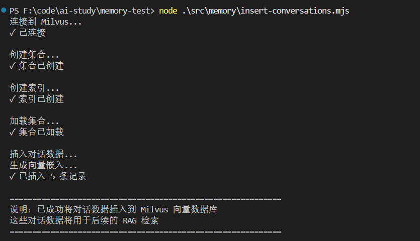

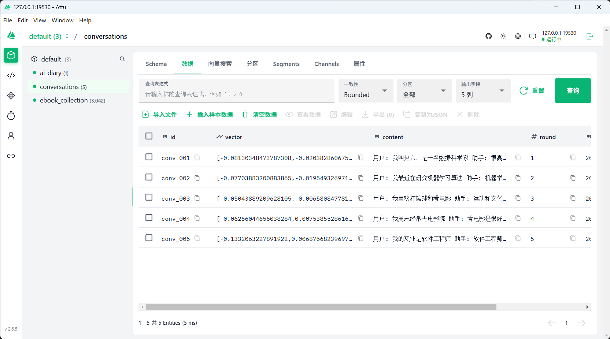

成功插入数据

#### RAG检索数据

接下来对话的时候，就可以用 RAG 来检索之前的对话内容了：

```js
import "dotenv/config";
import { ChatOpenAI, OpenAIEmbeddings } from "@langchain/openai";
import { InMemoryChatMessageHistory } from "@langchain/core/chat_history";
import { MilvusClient, MetricType } from "@zilliz/milvus2-sdk-node";
import { HumanMessage, SystemMessage } from "@langchain/core/messages";

const COLLECTION_NAME = "conversations";
const VECTOR_DIM = 1024;

// 初始化 OpenAI Chat 模型
const model = new ChatOpenAI({
  modelName: process.env.MODEL_NAME,
  apiKey: process.env.OPENAI_API_KEY,
  temperature: 0,
  configuration: {
    baseURL: process.env.OPENAI_BASE_URL,
  },
});

// 初始化 Embeddings 模型
const embeddings = new OpenAIEmbeddings({
  apiKey: process.env.EMBEDDINGS_OPENAI_API_KEY,
  model: "text-embedding-v3",
  configuration: {
    baseURL:
      process.env.EMBEDDINGS_OPENAI_BASE_URL,
  },
  dimensions: VECTOR_DIM,
});

// 初始化 Milvus 客户端
const client = new MilvusClient({
  address: "localhost:19530",
});

/**
 * 获取文本的向量嵌入
 */
async function getEmbedding(text) {
  const result = await embeddings.embedQuery(text);
  return result;
}

/**
 * 从 Milvus 中检索相关的历史对话
 */
async function retrieveRelevantConversations(query, k = 2) {
  try {
    // 生成查询的向量
    const queryVector = await getEmbedding(query);

    // 在 Milvus 中搜索相似的对话
    const searchResult = await client.search({
      collection_name: COLLECTION_NAME,
      vector: queryVector,
      limit: k,
      metric_type: MetricType.COSINE,
      output_fields: ["id", "content", "round", "timestamp"], // 搜索结果返回的字段：ID、文本内容、轮次、时间戳
    });

    return searchResult.results;
  } catch (error) {
    console.error("检索对话时出错:", error.message);
    return [];
  }
}

/**
 * 策略3: 检索（Retrieval）
 * 使用 Milvus 向量数据库存储历史对话，根据当前输入检索语义相关的历史
 * 实现 RAG（Retrieval-Augmented Generation）流程
 */

async function retrievalMemoryDemo() {
  try {
    console.log("连接到 Milvus...");
    await client.connectPromise;
    console.log("✓ 已连接\n");
  } catch (error) {
    console.error("❌ 无法连接到 Milvus:", error.message);
    console.log("请确保 Milvus 服务正在运行（localhost:19530）");
    return;
  }

  // 创建历史消息存储
  const history = new InMemoryChatMessageHistory();

  const conversations = [
    { input: "我之前提到的机器学习项目进展如何？" },
    { input: "我周末经常做什么？" },
    { input: "我的职业是什么？" },
  ];

  for (let i = 0; i < conversations.length; i++) {
    const { input } = conversations[i];
    const userMessage = new HumanMessage(input);

    console.log(`\n[第 ${i + 1} 轮对话]`);
    console.log(`用户: ${input}`);

    // 1. 检索相关的历史对话
    console.log("\n【检索相关历史对话】");
    const retrievedConversations = await retrieveRelevantConversations(
      input,
      2,
    );

    let relevantHistory = "";
    if (retrievedConversations.length > 0) {
      // 显示检索到的相关历史及相似度
      retrievedConversations.forEach((conv, idx) => {
        console.log(`\n[历史对话 ${idx + 1}] 相似度: ${conv.score.toFixed(4)}`);
        console.log(`轮次: ${conv.round}`);
        console.log(`内容: ${conv.content}`);
      });

      // 构建上下文
      relevantHistory = retrievedConversations
        .map((conv, idx) => {
          return `[历史对话 ${idx + 1}]
轮次: ${conv.round}
${conv.content}`;
        })
        .join("\n\n━━━━━\n\n");
    } else {
      console.log("未找到相关历史对话");
    }

    // 2. 构建 prompt（使用检索到的历史作为上下文）
    const contextMessages = relevantHistory
      ? [
          new HumanMessage(
            `相关历史对话：\n${relevantHistory}\n\n用户问题: ${input}`,
          ),
        ]
      : [userMessage];

    // 3. 调用模型生成回答
    console.log("\n【AI 回答】");
    const response = await model.invoke(contextMessages);

    // 保存当前对话到历史消息
    await history.addMessage(userMessage);
    await history.addMessage(response);

    // 4. 将对话保存到 Milvus 向量数据库
    const conversationText = `用户: ${input}\n助手: ${response.content}`;
    const convId = `conv_${Date.now()}_${i + 1}`;
    const convVector = await getEmbedding(conversationText);

    try {
      await client.insert({
        collection_name: COLLECTION_NAME,
        data: [
          {
            id: convId,
            vector: convVector,
            content: conversationText,
            round: i + 1,
            timestamp: new Date().toISOString(),
          },
        ],
      });
      console.log(`💾 已保存到 Milvus 向量数据库`);
    } catch (error) {
      console.warn("保存到向量数据库时出错:", error.message);
    }

    console.log(`助手: ${response.content}`);
  }
}

retrievalMemoryDemo().catch(console.error);
```


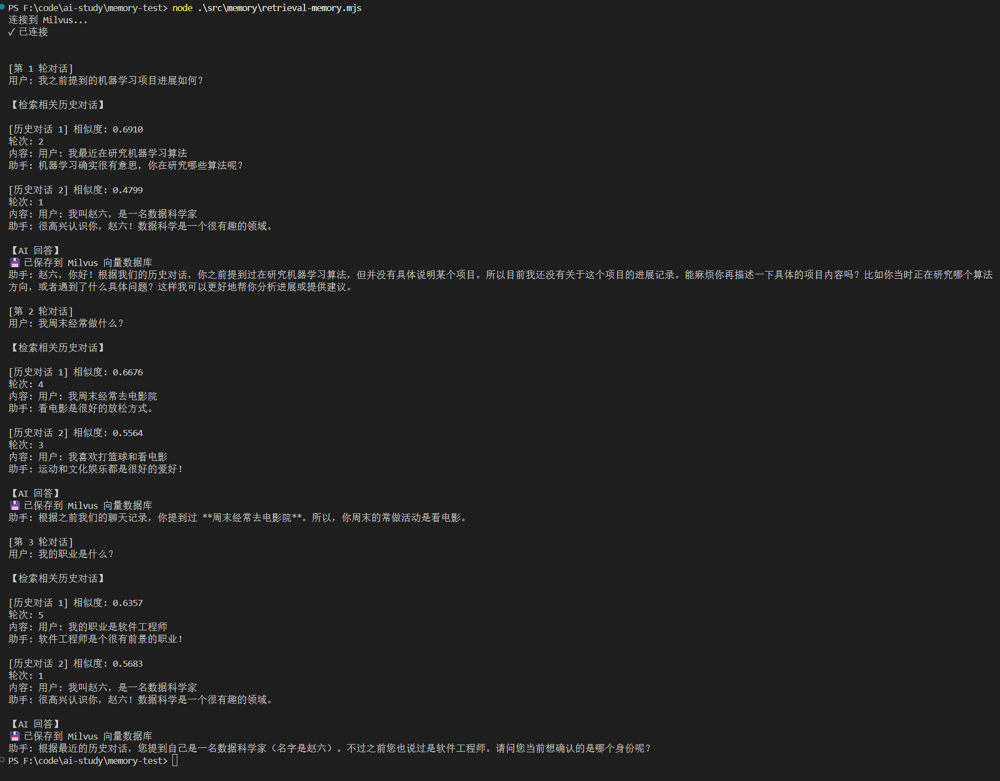

通过 rag 流程来检索之前的对话，来生成了回答

还把问的问题也存入向量量数据库

总结、检索，这俩策略经常同时用

比如开发一个聊天应用：  每聊 20 条就触发一次总结，生成摘要，存入 milvus 向量数据库

你问 ai 你们聊过什么的内容，这时候 RAG 就是从 milvus 的摘要集合里查找，生成回答

### 总结

大模型是无状态的，所以我们要做memory管理

langchain 封装了 ChatMessageHistory 的 api 用来存储 messages，可以存在内存、redis、数据库等

memory 有三种管理策略：截断、总结、检索

- 截断就是超出一定条数、一定 token 数量就去掉之前的 message  
- 总结（压缩compact）就是调用大模型生成对话摘要，这样就可以删掉原始 message 了  
- 检索是结合向量数据库来做语义检索，通过 RAG 来检索之前聊的内容
