之前使用 model.withStructuredOutput 来控制输出的结构，它底层会根据模型来决定用 tool 或者 output parser

但是在要实现流式返回，实现打字机效果时，就需要使用output parser了

一般在录入信息时，常见的做法是：

- 填表单
- excel文档导入

基本就是自己整理数据结构，然后用代码解析再存到数据库

这个过程有了AI,就相应地简化了，你只需要传一段自然语言文字，让AI分析并提取数据，按结构整理好，插入数据库

这就是结构化AI的输出，就会使用到withStructuredOutput 

### 安装mysql

在docker中搜索mysql镜像，点击run，会开始下载


填写参数运行

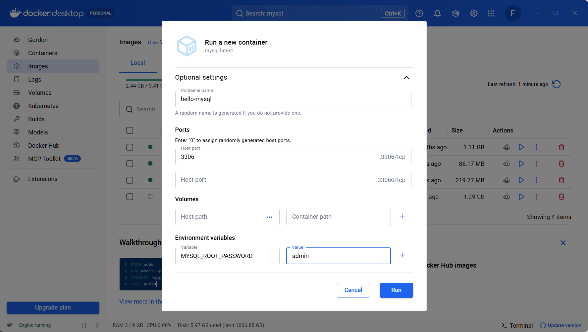


容器就跑起来了

然后去下载一个GUI工具连结它，这里用了官方的Mysql Workbench


### 创建数据库和表

```js
import mysql from "mysql2/promise";

async function main() {
  const connectionConfig = {
    host: "localhost",
    port: 3306,
    user: "root",
    password: "admin",
    multipleStatements: true,
  };

  const connection = await mysql.createConnection(connectionConfig);

  try {
    // 创建 database
    await connection.query(
      `CREATE DATABASE IF NOT EXISTS hello CHARACTER SET utf8mb4 COLLATE utf8mb4_unicode_ci;`,
    );
    await connection.query(`USE hello;`);

    // 创建好友表
    await connection.query(`
      CREATE TABLE IF NOT EXISTS friends (
        id INT AUTO_INCREMENT PRIMARY KEY,
        name VARCHAR(50) NOT NULL,
        gender VARCHAR(10),                -- 性别
        birth_date DATE,                   -- 出生日期
        company VARCHAR(100),              -- 公司
        title VARCHAR(100),                -- 职位
        phone VARCHAR(20),                 -- 当前手机号
        wechat VARCHAR(50)                 -- 微信号
      ) ENGINE=InnoDB DEFAULT CHARSET=utf8mb4;
    `);

    // 插入 demo 数据
    const insertSql = `
      INSERT INTO friends (
        name,
        gender,
        birth_date,
        company,
        title,
        phone,
        wechat
      ) VALUES (?, ?, ?, ?, ?, ?, ?);
    `;

    const values = [
      "王经理", // name
      "男", // gender
      "1990-01-01", // birth_date
      "字节跳动", // company
      "产品经理/产品总监", // title
      "18612345678", // phone
      "wangjingli2024", // wechat
    ];

    const [result] = await connection.execute(insertSql, values);
    console.log(
      "成功创建数据库和表，并插入 demo 数据，插入ID：",
      result.insertId,
    );
  } catch (err) {
    console.error("执行出错：", err);
  } finally {
    await connection.end();
  }
}

main().catch((err) => {
  console.error("脚本运行失败：", err);
});
```

跑一下，插入一条数据

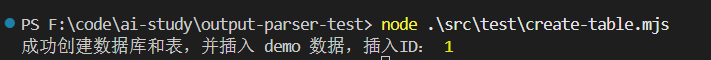

### AI智能录入

```js
import "dotenv/config";
import { ChatOpenAI } from "@langchain/openai";
import { z } from "zod";
import mysql from "mysql2/promise";

// 初始化模型
const model = new ChatOpenAI({
  modelName: process.env.MODEL_NAME,
  apiKey: process.env.OPENAI_API_KEY,
  temperature: 0,
  configuration: {
    baseURL: process.env.OPENAI_BASE_URL,
  },
});

// 定义单个好友信息的 zod schema，匹配 friends 表结构
const friendSchema = z.object({
  name: z.string().describe("姓名"),
  gender: z.string().describe("性别（男/女）"),
  birth_date: z
    .string()
    .describe("出生日期，格式：YYYY-MM-DD，如果无法确定具体日期，根据年龄估算"),
  company: z.string().nullable().describe("公司名称，如果没有则返回 null"),
  title: z.string().nullable().describe("职位/头衔，如果没有则返回 null"),
  phone: z.string().nullable().describe("手机号，如果没有则返回 null"),
  wechat: z.string().nullable().describe("微信号，如果没有则返回 null"),
});

// 定义批量好友信息的 schema（数组）
const friendsArraySchema = z.array(friendSchema).describe("好友信息数组");

// 使用 withStructuredOutput 方法
const structuredModel = model.withStructuredOutput(friendsArraySchema);

// 数据库连接配置
const connectionConfig = {
  host: "localhost",
  port: 3306,
  user: "root",
  password: "admin",
  multipleStatements: true,
};

async function extractAndInsert(text) {
  const connection = await mysql.createConnection(connectionConfig);

  try {
    // 切换到 hello 数据库
    await connection.query(`USE hello;`);

    // 使用 AI 提取结构化信息
    console.log("🤔 正在从文本中提取信息...\n");
    const prompt = `请从以下文本中提取所有好友信息，文本中可能包含一个或多个人的信息。请将每个人的信息分别提取出来，返回一个数组。

${text}

要求：
1. 如果文本中包含多个人，请为每个人创建一个对象
2. 每个对象包含以下字段：
   - 姓名：提取文本中的人名
   - 性别：提取性别信息（男/女）
   - 出生日期：如果能找到具体日期最好，否则根据年龄描述估算（格式：YYYY-MM-DD）
   - 公司：提取公司名称
   - 职位：提取职位/头衔信息
   - 手机号：提取手机号码
   - 微信号：提取微信号
3. 如果某个字段在文本中找不到，请返回 null
4. 返回格式必须是一个数组，即使只有一个人也要放在数组中`;

    const results = await structuredModel.invoke(prompt);

    console.log(`✅ 提取到 ${results.length} 条结构化信息:`);
    console.log(JSON.stringify(results, null, 2));
    console.log("");

    if (results.length === 0) {
      console.log("⚠️  没有提取到任何信息");
      return { count: 0, insertIds: [] };
    }

    // 批量插入数据库
    const insertSql = `
      INSERT INTO friends (
        name,
        gender,
        birth_date,
        company,
        title,
        phone,
        wechat
      ) VALUES ?;
    `;

    const values = results.map((result) => [
      result.name,
      result.gender,
      result.birth_date || null,
      result.company,
      result.title,
      result.phone,
      result.wechat,
    ]);

    const [insertResult] = await connection.query(insertSql, [values]);
    console.log(`✅ 成功批量插入 ${insertResult.affectedRows} 条数据`);
    console.log(
      `   插入的ID范围：${insertResult.insertId} - ${insertResult.insertId + insertResult.affectedRows - 1}`,
    );

    return {
      count: insertResult.affectedRows,
      insertIds: Array.from(
        { length: insertResult.affectedRows },
        (_, i) => insertResult.insertId + i,
      ),
    };
  } catch (err) {
    console.error("❌ 执行出错：", err);
    throw err;
  } finally {
    await connection.end();
  }
}

// 主函数
async function main() {
  // 示例文本（包含多个人的信息）
  const sampleText = `我最近认识了几个新朋友。第一个是张总，女的，看起来30出头，在腾讯做技术总监，手机13800138000，微信是zhangzong2024。第二个是李工，男，大概28岁，在阿里云做架构师，电话15900159000，微信号lee_arch。还有一个是陈经理，女，35岁左右，在美团做产品经理，手机号是18800188000，微信chenpm2024。`;

  console.log("📝 输入文本:");
  console.log(sampleText);
  console.log("");

  try {
    const result = await extractAndInsert(sampleText);
    console.log(`\n🎉 处理完成！成功插入 ${result.count} 条记录`);
    console.log(`   插入的ID：${result.insertIds.join(", ")}`);
  } catch (error) {
    console.error("❌ 处理失败：", error.message);
    process.exit(1);
  }
}

main();
```

这里我使用的是deepseek v4的模型，`getStructuredOutputMethod()` 对非 gpt-3/gpt-4 模型默认走 **`jsonSchema`** 方法， 即向 DeepSeek API 发送 `response_format: { type: "json_schema", json_schema: {...} }`。

DeepSeek API（`api.deepseek.com`）**不支持 `json_schema` 这个 response_format 类型**，所以返回 400。

改了几个地方：

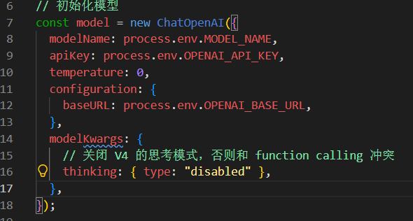

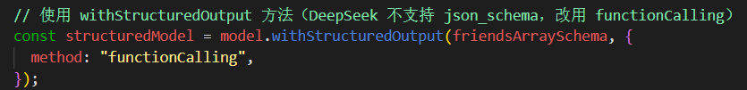

运行后发现继续报错：

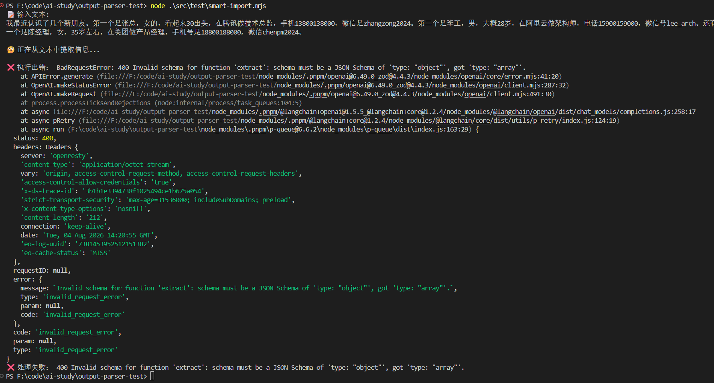

注意：

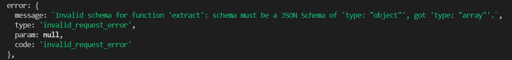

OpenAI 的函数调用规范（DeepSeek 是兼容实现）规定：**函数调用的 `arguments` 永远是 `{ ... }` 这种 JSON 对象**，因为调用一个函数就是把"参数名 → 参数值"传进去，不存在"一个函数就收一个数组"这种形态。所以 DeepSeek 直接拒绝：

```
schema must be a JSON Schema of 'type: "object"', got 'type: "a
```

> `functionCalling` 的做法是把你定义的结构转成一个**工具（function）**，发给模型。看一下 LangChain 源码的转换逻辑：
>
> ```js
> if (isInteropZodSchema(schema)) toolFunction = {
>   name: functionName,
>   description: ...,
>   parameters: asJsonSchema   // ← 直接把你的 zod schema 转成 JSON Schema 当参数
> };
> ```
>
> 也就是说，你的 `z.array(friendSchema)` 被原样转成了 `parameters: { type: "array", items: {...} }`。

修改代码：

```js
import "dotenv/config";
import { ChatOpenAI } from "@langchain/openai";
import { z } from "zod";
import mysql from "mysql2/promise";

// 初始化模型
const model = new ChatOpenAI({
  modelName: process.env.MODEL_NAME,
  apiKey: process.env.OPENAI_API_KEY,
  temperature: 0,
  configuration: {
    baseURL: process.env.OPENAI_BASE_URL,
  },
  modelKwargs: {
    // 关闭 V4 的思考模式，否则和 function calling 冲突
    thinking: { type: "disabled" },
  },
});

// 定义单个好友信息的 zod schema，匹配 friends 表结构
const friendSchema = z.object({
  name: z.string().describe("姓名"),
  gender: z.string().describe("性别（男/女）"),
  birth_date: z
    .string()
    .describe("出生日期，格式：YYYY-MM-DD，如果无法确定具体日期，根据年龄估算"),
  company: z.string().nullable().describe("公司名称，如果没有则返回 null"),
  title: z.string().nullable().describe("职位/头衔，如果没有则返回 null"),
  phone: z.string().nullable().describe("手机号，如果没有则返回 null"),
  wechat: z.string().nullable().describe("微信号，如果没有则返回 null"),
});

// 定义批量好友信息的 schema（函数调用要求顶层必须是 object，所以把数组包一层）
const friendsArraySchema = z.object({
  friends: z.array(friendSchema).describe("好友信息数组"),
});

// 使用 withStructuredOutput 方法（DeepSeek 不支持 json_schema，改用 functionCalling）
const structuredModel = model.withStructuredOutput(friendsArraySchema, {
  method: "functionCalling",
});

// 数据库连接配置
const connectionConfig = {
  host: "localhost",
  port: 3306,
  user: "root",
  password: "admin",
  multipleStatements: true,
};

async function extractAndInsert(text) {
  const connection = await mysql.createConnection(connectionConfig);

  try {
    // 切换到 hello 数据库
    await connection.query(`USE hello;`);

    // 使用 AI 提取结构化信息
    console.log("🤔 正在从文本中提取信息...\n");
    const prompt = `请从以下文本中提取所有好友信息，文本中可能包含一个或多个人的信息。请将每个人的信息分别提取出来，返回一个数组。

${text}

要求：
1. 如果文本中包含多个人，请为每个人创建一个对象
2. 每个对象包含以下字段：
   - 姓名：提取文本中的人名
   - 性别：提取性别信息（男/女）
   - 出生日期：如果能找到具体日期最好，否则根据年龄描述估算（格式：YYYY-MM-DD）
   - 公司：提取公司名称
   - 职位：提取职位/头衔信息
   - 手机号：提取手机号码
   - 微信号：提取微信号
3. 如果某个字段在文本中找不到，请返回 null
4. 返回格式必须是一个数组，即使只有一个人也要放在数组中`;

    const results = await structuredModel.invoke(prompt);

    console.log(`✅ 提取到 ${results.friends.length} 条结构化信息:`);
    console.log(JSON.stringify(results, null, 2));
    console.log("");

    if (results.friends.length === 0) {
      console.log("⚠️  没有提取到任何信息");
      return { count: 0, insertIds: [] };
    }

    // 批量插入数据库
    const insertSql = `
      INSERT INTO friends (
        name,
        gender,
        birth_date,
        company,
        title,
        phone,
        wechat
      ) VALUES ?;
    `;

    const values = results.friends.map((result) => [
      result.name,
      result.gender,
      result.birth_date || null,
      result.company,
      result.title,
      result.phone,
      result.wechat,
    ]);

    const [insertResult] = await connection.query(insertSql, [values]);
    console.log(`✅ 成功批量插入 ${insertResult.affectedRows} 条数据`);
    console.log(
      `   插入的ID范围：${insertResult.insertId} - ${insertResult.insertId + insertResult.affectedRows - 1}`,
    );

    return {
      count: insertResult.affectedRows,
      insertIds: Array.from(
        { length: insertResult.affectedRows },
        (_, i) => insertResult.insertId + i,
      ),
    };
  } catch (err) {
    console.error("❌ 执行出错：", err);
    throw err;
  } finally {
    await connection.end();
  }
}

// 主函数
async function main() {
  // 示例文本（包含多个人的信息）
  const sampleText = `我最近认识了几个新朋友。第一个是张总，女的，看起来30出头，在腾讯做技术总监，手机13800138000，微信是zhangzong2024。第二个是李工，男，大概28岁，在阿里云做架构师，电话15900159000，微信号lee_arch。还有一个是陈经理，女，35岁左右，在美团做产品经理，手机号是18800188000，微信chenpm2024。`;

  console.log("📝 输入文本:");
  console.log(sampleText);
  console.log("");

  try {
    const result = await extractAndInsert(sampleText);
    console.log(`\n🎉 处理完成！成功插入 ${result.count} 条记录`);
    console.log(`   插入的ID：${result.insertIds.join(", ")}`);
  } catch (error) {
    console.error("❌ 处理失败：", error.message);
    process.exitCode = 1;
  }
}

main();
```

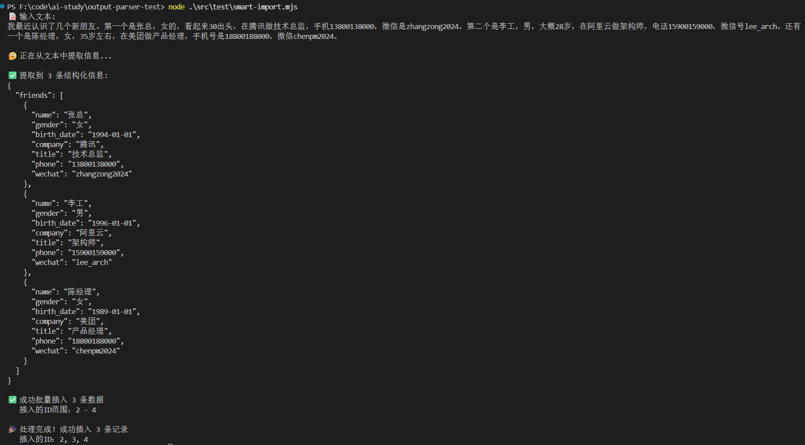


可以看到成功插入数据

流程如下：

- 给一段无规则文本，用大模型提取结构化的信息 
- 结构用 withStructuredOutput 指定，要求提取一个数组
- 数组里是好友对象的信息。  然后我们把数组里的结构化数据批量插入数据库表

### JSON Schema

withStructuredOutput 底层是 tool、output parser，其实还有一种特性 JSON Schema

同样的，这是OpenAI 的「原生 JSON Schema 结构化输出」模式

**OpenAI 官方系列**（这个参数本来就是 OpenAI 定义的「Structured Outputs」）：

- **GPT-5 系列**：GPT-5.5、GPT-5.4、GPT-5.4-mini/nano、GPT-5.2-Codex 等，全系列支持
- **GPT-4o 系列**：gpt-4o、gpt-4o-mini（2024-08-06 及之后的版本）
- **o 系列推理模型**：o1 / o3 / o4-mini 等
- 注意：`gpt-3.5-turbo`、老版 `gpt-4-0613` 不支持，只能用 `json_object` 或 function calling

第三方厂商里，**有没有按 OpenAI 兼容协议实现这个参数的**需要逐个验证——多数国内聚合/中转平台（像之前搜到的 [dmxapi.cn](https://errs.dmxapi.cn/detail.php?id=1222) 这类）会把各家模型包装成 OpenAI 格式，能不能用取决于平台是否实现了 `json_schema` 透传，不一定跟模型本身相关。

> DeepSeek 的 OpenAI 兼容接口**只支持 `json_object`（JSON 模式），不支持 `json_schema` 这种新的结构化输出格式**，所以服务器直接返回了 `400 This response_format type is unavailable now`（这种 response_format 类型目前不可用）。
>
> 注意：你的 `deepseek-v4-flash` 模型本身是能用的（没有报模型不存在），单纯是这个参数 DeepSeek 不认。
>
> 补充一个背景：`json_schema` 结构化输出是 OpenAI 后来推出的能力，DeepSeek 这类走「OpenAI 兼容协议」的厂商实现得慢，很多框架（LangChain 的 `withStructuredOutput` 默认就发 `json_schema`）踩的都是同一个坑。


这里我环境变量改为GPT模型

看下模型支持`json_schema` 参数时的用法：

```js
import "dotenv/config";
import { ChatOpenAI } from "@langchain/openai";
import chalk from "chalk";
import { z } from "zod";
import { zodToJsonSchema } from "zod-to-json-schema";
import { HumanMessage, SystemMessage } from "@langchain/core/messages";

const scientistSchema = z
  .object({
    name: z.string().describe("科学家的全名"),
    birth_year: z.number().describe("出生年份"),
    field: z.string().describe("主要研究领域"),
    achievements: z.array(z.string()).describe("主要成就列表"),
  })
  .strict();

// 将 Zod 转换为原生的 JSON Schema 格式
const nativeJsonSchema = zodToJsonSchema(scientistSchema);

const model = new ChatOpenAI({
  modelName: process.env.GPT_MODEL_NAME,
  temperature: 0,
  apiKey: process.env.GPT_OPENAI_API_KEY,
  streaming: true, // sssaiapi 代理要求 stream=true
  configuration: {
    baseURL: process.env.GPT_OPENAI_BASE_URL,
  },
  modelKwargs: {
    // 通过 modelKwargs 传入原生参数
    response_format: {
      type: "json_schema",
      json_schema: {
        name: "scientist_info",
        strict: true,
        schema: nativeJsonSchema, // 这里的 nativeJsonSchema 就是转换后的对象
      },
    },
  },
});

async function testNativeJsonSchema() {
  console.log(chalk.bgMagenta("🧪 测试原生 JSON Schema 模式...\n"));

  const res = await model.invoke([
    new SystemMessage("你是一个信息提取助手，请直接返回 JSON 数据。"),
    new HumanMessage("介绍一下杨振宁"),
  ]);

  console.log(chalk.green("\n✅ 收到响应 (纯净 JSON):"));
  console.log(res.content);

  const data = JSON.parse(res.content);
  console.log(chalk.cyan("\n📋 解析后的对象:"));
  console.log(data);
}

testNativeJsonSchema().catch(console.error);
```

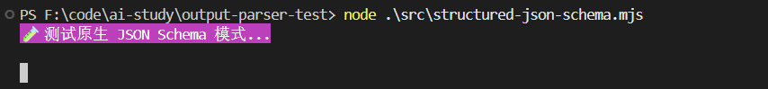

 json schema 就和 tool 的 args 一样，都是大模型层面支持的，会保证按照这个格式来返回，如果格式不对，会在模型层面重新生成正确的返回  

也就是说，withStructuredOutput 底层是 tool、json schema、output parser 这三者

### 流式输出实战

之前写tool时的流程：

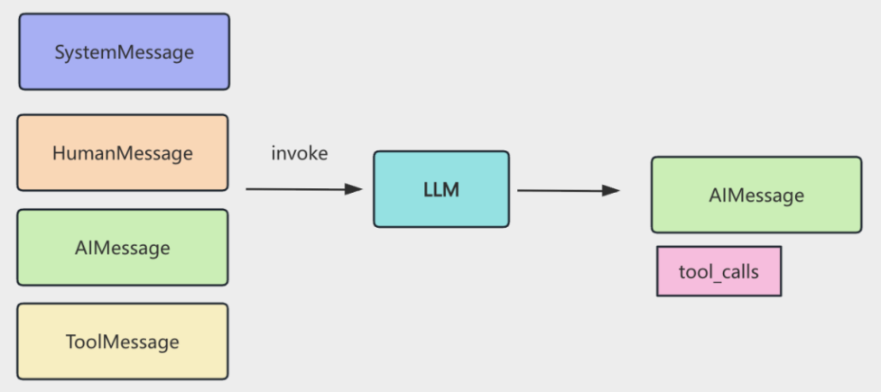

- 传入 SystemMessage 和 HumanMessage，调用大模型之后，返回 AIMessage
- AIMessage 也加入 memory
- 根据 AIMessage 中的 tool_calls 信息调用 tool，执行结果封装成 ToolMessage 放入 memory
- 直到不再返回带 tool_calls 信息的 AIMessage，就代表循环结束


#### 难点

要实现流式返回，这里有一个难点

返回的 AIMessage 是 chunk

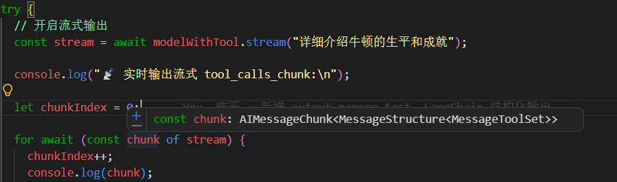

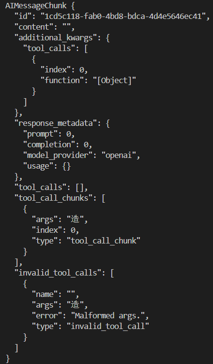

`chunk` 是 `@langchain/core` 的 **`AIMessageChunk`** 对象（消息块），不是普通的 `console.log` 能看到的全貌。在绑定了工具的流式场景下，每个 chunk 是一小片"增量"，多个 chunk 拼接起来才是完整的一次工具调用

一个 `AIMessageChunk` 大致长这样：

```json
AIMessageChunk {
  id, content, type: "ai",
  tool_call_chunks: [ { index, id, name, args } ],   // ← 流式工具调用的核心
  tool_calls: undefined,            // 流式过程中通常为空
  invalid_tool_calls: [],
  usage_metadata: { input_tokens, output_tokens, total_tokens },
  response_metadata, additional_kwargs, ...
}
```

具体每个字段：

| 字段                 | 含义                           | 流式中值                                                     |
| -------------------- | ------------------------------ | ------------------------------------------------------------ |
| `type`               | 固定为 `"ai"`                  | `"ai"`                                                       |
| `content`            | 文本内容                       | 工具调用流中多为 `""`（或说明性文本）                        |
| `tool_call_chunks`   | **工具调用的碎片数组**，是核心 | 数组，每个元素是一次并行工具调用的某一片段                   |
| `tool_calls`         | 完整解析后的工具调用           | 流式中间过程**通常为 `undefined`**，只有消息聚合完成后才有值 |
| `invalid_tool_calls` | 参数无法解析成 JSON 的调用     | 一般 `[]`                                                    |
| `usage_metadata`     | token 用量                     | 部分 chunk 有，含 `input_tokens` / `output_tokens` / `total_tokens` |

综上所述，我们需要把AIMessageChunk 拼接成完整的 AIMessage 才能放入 Memory 再次调用大模型

对比之前使用JsonOutputToolsParser 

```js
import "dotenv/config";
import { ChatOpenAI } from "@langchain/openai";
import { JsonOutputToolsParser } from "@langchain/core/output_parsers/openai_tools";
import { z } from "zod";

const model = new ChatOpenAI({
  modelName: process.env.MODEL_NAME,
  apiKey: process.env.OPENAI_API_KEY,
  temperature: 0,
  configuration: {
    baseURL: process.env.OPENAI_BASE_URL,
  },
});

// 定义结构化输出的 schema
const scientistSchema = z.object({
  name: z.string().describe("科学家的全名"),
  birth_year: z.number().describe("出生年份"),
  death_year: z.number().optional().describe("去世年份，如果还在世则不填"),
  nationality: z.string().describe("国籍"),
  fields: z.array(z.string()).describe("研究领域列表"),
  achievements: z.array(z.string()).describe("主要成就"),
  biography: z.string().describe("简短传记"),
});

// 绑定工具到模型
const modelWithTool = model.bindTools([
  {
    name: "extract_scientist_info",
    description: "提取和结构化科学家的详细信息",
    schema: scientistSchema,
  },
]);

// 1. 绑定工具并挂载解析器
const parser = new JsonOutputToolsParser();
const chain = modelWithTool.pipe(parser);

try {
  // 2. 开启流
  const stream = await chain.stream("详细介绍牛顿的生平和成就");

  let lastContent = ""; // 记录已打印的完整内容
  let finalResult = null; // 存储最终的完整结果

  console.log("📡 实时输出流式内容:\n");

  for await (const chunk of stream) {
    console.log(chunk);

    // if (chunk.length > 0) {
    //   const toolCall = chunk[0];

    //   // 获取当前工具调用的完整参数内容 toolCall.args 是目前为止累积解析出的部分对象
    //   const currentContent = JSON.stringify(toolCall.args || {}, null, 2);

    //   if (currentContent.length > lastContent.length) {
    //     const newText = currentContent.slice(lastContent.length);
    //     process.stdout.write(newText); // 实时输出到控制台
    //     lastContent = currentContent; // 更新已读进度
    //   }

    //   // console.log(toolCall.args);
    // }
  }

  console.log("\n\n✅ 流式输出完成");
} catch (error) {
  console.error("\n❌ 错误:", error.message);
  console.error(error);
}
```

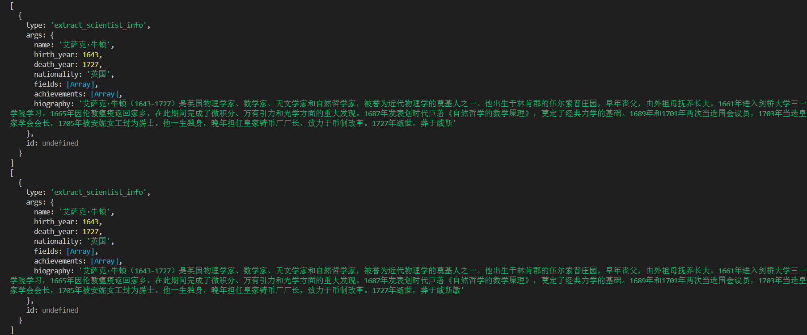

可以看到这里的args里面是完整的json

**也就是说流式的两个难点**：

- 返回的是 AIMessageChunk，需要 concat 拼接成完整的 AIMessage
- AIMessageChunk 里的是 tool_call_chunks，只包含部分参数，需要用 JsonOutputToolsParser 来解析成 json

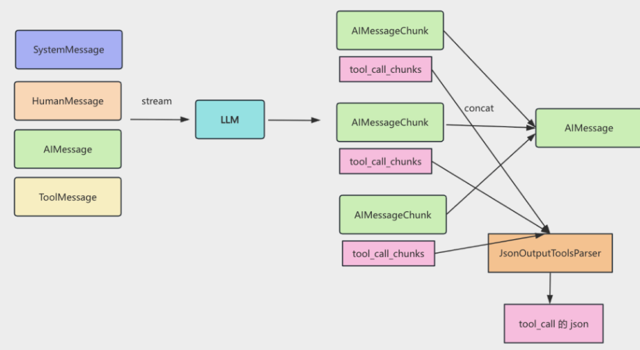

#### 实现Mini cusor

```js
import "dotenv/config";
import { ChatOpenAI } from "@langchain/openai";
import {
  HumanMessage,
  SystemMessage,
  ToolMessage,
} from "@langchain/core/messages";
import { InMemoryChatMessageHistory } from "@langchain/core/chat_history";
import { JsonOutputToolsParser } from "@langchain/core/output_parsers/openai_tools";
import {
  executeCommandTool,
  listDirectoryTool,
  readFileTool,
  writeFileTool,
} from "./all-tools.mjs";
import chalk from "chalk";

const model = new ChatOpenAI({
  modelName: process.env.MODEL_NAME,
  apiKey: process.env.OPENAI_API_KEY,
  temperature: 0,
  configuration: {
    baseURL: process.env.OPENAI_BASE_URL,
  },
});

const tools = [
  readFileTool,
  writeFileTool,
  executeCommandTool,
  listDirectoryTool,
];

// 绑定工具到模型
const modelWithTools = model.bindTools(tools);

// Agent 执行函数
async function runAgentWithTools(query, maxIterations = 30) {
  const history = new InMemoryChatMessageHistory();

  await history.addMessage(
    new SystemMessage(`你是一个项目管理助手，使用工具完成任务。

当前工作目录: ${process.cwd()}

工具：
1. read_file: 读取文件
2. write_file: 写入文件
3. execute_command: 执行命令（支持 workingDirectory 参数）
4. list_directory: 列出目录

重要规则 - execute_command：
- workingDirectory 参数会自动切换到指定目录
- 当使用 workingDirectory 时，绝对不要在 command 中使用 cd
- 错误示例: { command: "cd react-todo-app && pnpm install", workingDirectory: "react-todo-app" }
- 正确示例: { command: "pnpm install", workingDirectory: "react-todo-app" }

重要规则 - write_file：
- 当写入 React 组件文件（如 App.tsx）时，如果存在对应的 CSS 文件（如 App.css），在其他 import 语句后加上这个 css 的导入
`),
  );

  await history.addMessage(new HumanMessage(query));

  for (let i = 0; i < maxIterations; i++) {
    console.log(chalk.bgGreen(`⏳ 正在等待 AI 思考...`));

    // 获取当前消息历史
    const messages = await history.getMessages();

    const rawStream = await modelWithTools.stream(messages);

    // 准备一个空的容器来拼接完整的 AIMessage
    let fullAIMessage = null;

    // 准备一个 tool_call_chunks 的 JSON 增量解析器
    const toolParser = new JsonOutputToolsParser();

    // 记录每个工具调用已打印的长度（用 id 或 filePath 作为 key）
    const printedLengths = new Map();

    console.log(chalk.bgBlue(`\n🚀 Agent 开始思考并生成流...\n`));

    for await (const chunk of rawStream) {
      // 这里的 chunk 是 AIMessageChunk，把它拼接起来
      fullAIMessage = fullAIMessage ? fullAIMessage.concat(chunk) : chunk;

      let parsedTools = null;
      // 工具调用的参数是流式拼接的 JSON，前半段可能不完整，所以解析失败就 catch 掉继续等
      try {
        parsedTools = await toolParser.parseResult([
          { message: fullAIMessage },
        ]);
      } catch (e) {
        // 解析失败说明 JSON 还不完整，忽略错误继续累积
      }

      if (parsedTools && parsedTools.length > 0) {
        for (const toolCall of parsedTools) {
          if (toolCall.type === "write_file" && toolCall.args?.content) {
            const toolCallId =
              toolCall.id || toolCall.args.filePath || "default";
              // content 这个字符串会随着 chunk 到来逐渐变长（比如先来 "import"，再来 " import React"...）
            const currentContent = String(toolCall.args.content);
            const previousLength = printedLengths.get(toolCallId);

            if (previousLength === undefined) {
              printedLengths.set(toolCallId, 0);
              console.log(
                chalk.bgBlue(
                  `\n[工具调用] write_file("${toolCall.args.filePath}") - 开始写入（流式预览）\n`,
                ),
              );
            }

            if (currentContent.length > previousLength) {
              const newContent = currentContent.slice(previousLength);
              process.stdout.write(newContent);
              printedLengths.set(toolCallId, currentContent.length);
            }
          }
        }
      } else {
        // 当前还没有解析出工具调用时，如果有文本内容就直接输出
        if (chunk.content) {
          process.stdout.write(
            typeof chunk.content === "string"
              ? chunk.content
              : JSON.stringify(chunk.content),
          );
        }
      }
    }

    // 此时 fullAIMessage 已经完美还原，直接存入 history
    await history.addMessage(fullAIMessage);
    console.log(chalk.green("\n✅ 消息已完整存入历史"));

    // 检查是否有工具调用
    if (!fullAIMessage.tool_calls || fullAIMessage.tool_calls.length === 0) {
      console.log(`\n✨ AI 最终回复:\n${fullAIMessage.content}\n`);
      return fullAIMessage.content;
    }

    // 执行工具调用
    for (const toolCall of fullAIMessage.tool_calls) {
      const foundTool = tools.find((t) => t.name === toolCall.name);
      if (foundTool) {
        const toolResult = await foundTool.invoke(toolCall.args);
        await history.addMessage(
          new ToolMessage({
            content: toolResult,
            tool_call_id: toolCall.id,
          }),
        );
      }
    }
  }

  const finalMessages = await history.getMessages();
  return finalMessages[finalMessages.length - 1].content;
}

const case1 = `创建一个功能丰富的 React TodoList 应用：

1. 创建项目：echo -e "n\nn" | pnpm create vite react-todo-app --template react-ts
2. 修改 src/App.tsx，实现完整功能的 TodoList：
 - 添加、删除、编辑、标记完成
 - 分类筛选（全部/进行中/已完成）
 - 统计信息显示
 - localStorage 数据持久化
3. 添加复杂样式：
 - 渐变背景（蓝到紫）
 - 卡片阴影、圆角
 - 悬停效果
4. 添加动画：
 - 添加/删除时的过渡动画
 - 使用 CSS transitions
5. 列出目录确认

注意：使用 pnpm，功能要完整，样式要美观，要有动画效果

去掉 main.tsx 里的 index.css 导入

之后在 react-todo-app 项目中：
1. 使用 pnpm install 安装依赖
2. 使用 pnpm run dev 启动服务器
`;

try {
  await runAgentWithTools(case1);
} catch (error) {
  console.error(`\n❌ 错误: ${error.message}\n`);
}
```

解释下循环流程：

**1. 取历史、发起流式请求**（[mini-cursor.mjs:69-71](vscode-webview://00tirqpivijkeevccub8cm2nirsjp6cdf8qlm02k6qktt68nep7h/output-parser-test/src/test/mini-cursor.mjs#L69-L71)） 把当前完整消息历史发给绑定好工具的模型，拿到流式输出 `rawStream`。

**2. 逐 chunk 拼接 + 实时流式预览**（[mini-cursor.mjs:84-131](vscode-webview://00tirqpivijkeevccub8cm2nirsjp6cdf8qlm02k6qktt68nep7h/output-parser-test/src/test/mini-cursor.mjs#L84-L131)）

- `fullAIMessage = fullAIMessage.concat(chunk)` 把每个 chunk 拼成完整消息。
- 用 `JsonOutputToolsParser` 对**增量**的完整消息做 JSON 解析（工具调用的参数是流式拼接的 JSON，前半段可能不完整，所以解析失败就 `catch` 掉继续等）。
- **预览逻辑**：如果当前 chunk 解析出了 `write_file` 工具调用，就用 `printedLengths` 这个 Map 记录每个工具调用已打印的字符数，只把**新增的部分** `slice` 出来实时打印——这样能在完整 JSON 出来前就看到"文件正在被写什么内容"。
- 如果还没解析出工具调用（`parsedTools` 为空），就直接输出 `chunk.content` 的文本——也就是把 AI 的思考/中间话术实时显示出来。

**3. 存入历史**（[mini-cursor.mjs:133-135](vscode-webview://00tirqpivijkeevccub8cm2nirsjp6cdf8qlm02k6qktt68nep7h/output-parser-test/src/test/mini-cursor.mjs#L133-L135)） 此时 `fullAIMessage` 已完整还原（含完整的 `tool_calls`），存入 `history`。

**4. 判断是否结束**（[mini-cursor.mjs:138-141](vscode-webview://00tirqpivijkeevccub8cm2nirsjp6cdf8qlm02k6qktt68nep7h/output-parser-test/src/test/mini-cursor.mjs#L138-L141)） 如果这条 AI 消息里**没有工具调用**，说明 AI 已经给出最终答案，直接返回 `content` 结束整个循环。

**5. 执行工具并回填结果**（[mini-cursor.mjs:144-155](vscode-webview://00tirqpivijkeevccub8cm2nirsjp6cdf8qlm02k6qktt68nep7h/output-parser-test/src/test/mini-cursor.mjs#L144-L155)） 如果有工具调用，逐个找到对应工具（`read_file`/`write_file`/`execute_command`/`list_directory`）执行，把结果包成 `ToolMessage`（带 `tool_call_id`）加进历史，然后进入下一轮迭代让 AI 看到工具结果继续思考。

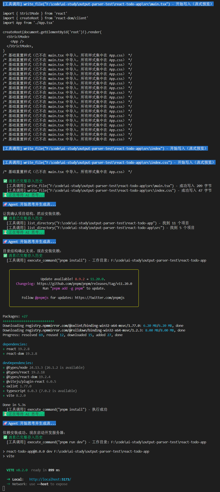

注意：

1.使用AIMessage.concat拼接 AIMessageChunk 成完整 AIMessage

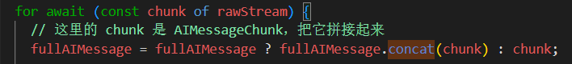

2. JsonOutputToolsParser 来解析 tool_call_chunks

### 总结

智能录入：这个是常见需求，调用大模型对一段文本做解析，返回结构化的数据，一般用 model.withStructuredOutput，之后存入数据库即可

流式版 mini cursor：这个主要是要流式打印 tool 的参数，需要做好 AIMessageChunk 的 concat，以及用 JsonOutputToolsParser 做 tool_call_chunks 的解析，之后增量打印

此外，我们还补充学习了 withStructuredOutput 底层的另一个 JSON Schema 机制（gpt），当然，平时做结构化直接用  withStructuredOutput 就行，底层会自动根据模型来选择 tool、json schema 或者 output parser

常见的输出控制需求就这两种：结构化输出、流式输出 + tool 参数解析

### 补充

#### deepseek v4 json结构化输出方案

##### 方案 A：Function Calling（最推荐，DeepSeek 原生支持）

靠工具调用机制约束输出，schema 由 API 强制，结果一定合法。

| 层次 | 写法                                                         | 对应你的脚本                                                 |
| ---- | ------------------------------------------------------------ | ------------------------------------------------------------ |
| 高层 | `model.withStructuredOutput(schema, { method: "functionCalling" })`，结果直接是对象 | [with-structured-output.mjs](vscode-webview://00tirqpivijkeevccub8cm2nirsjp6cdf8qlm02k6qktt68nep7h/output-parser-test/src/with-structured-output.mjs) |
| 低层 | `model.bindTools([{name, description, schema}])`，取 `response.tool_calls[0].args` | [tool-calls-args.mjs](vscode-webview://00tirqpivijkeevccub8cm2nirsjp6cdf8qlm02k6qktt68nep7h/output-parser-test/src/tool-calls-args.mjs) |
| 流式 | `structuredModel.stream()`                                   | [stream-with-structured-output.mjs](vscode-webview://00tirqpivijkeevccub8cm2nirsjp6cdf8qlm02k6qktt68nep7h/output-parser-test/src/stream-with-structured-output.mjs) |

⚠️ **关键前提**：V4 是推理模型，必须关掉思考模式，否则和 function calling 冲突。你已经踩过这个坑，注释写在 [with-structured-output.mjs:13](vscode-webview://00tirqpivijkeevccub8cm2nirsjp6cdf8qlm02k6qktt68nep7h/output-parser-test/src/with-structured-output.mjs#L13)：


```js
modelKwargs: { thinking: { type: "disabled" } }
```

##### 方案 B：JSON 模式（`json_object`，最简单）

把 `structured-json-schema.mjs` 里的 `response_format` 从 `json_schema` 改成 `json_object` 就能跑：


```js
response_format: { type: "json_object" }
```

- 要求 prompt 里必须出现 "json" 字样，且 `max_tokens` 要给够防止截断
- ✅ 优点：DeepSeek 原生支持，改动最小
- ❌ 缺点：只保证输出是合法 JSON，**不保证字段和类型**。需要在客户端 `JSON.parse` 后用 Zod `schema.parse()` 校验，失败就重试

##### 方案 C：提示词 + 客户端解析（零 API 特性依赖）

不依赖任何 `response_format` 参数，任何模型都能跑：

| 脚本                                                         | 做法                                                         |
| ------------------------------------------------------------ | ------------------------------------------------------------ |
| [structured-output-parser2.mjs](vscode-webview://00tirqpivijkeevccub8cm2nirsjp6cdf8qlm02k6qktt68nep7h/output-parser-test/src/structured-output-parser2.mjs) | `StructuredOutputParser.fromZodSchema()` 生成格式指令拼进 prompt，客户端 `JSON.parse` + Zod 校验 |
| [json-output-parser.mjs](vscode-webview://00tirqpivijkeevccub8cm2nirsjp6cdf8qlm02k6qktt68nep7h/output-parser-test/src/json-output-parser.mjs) | `JsonOutputParser` 只保证是合法 JSON                         |
| [normal.mjs](vscode-webview://00tirqpivijkeevccub8cm2nirsjp6cdf8qlm02k6qktt68nep7h/output-parser-test/src/normal.mjs) | 纯提示词 + 手写 `JSON.parse`                                 |

- ❌ 最不可靠，输出容易漂移（多写注释、字段名变形、markdown 包裹），**必须加重试兜底**

##### 兜底套路：校验失败 → 重试/修复

无论上面哪种方案，生产上建议加这层：`JSON.parse` 或 `schema.parse` 失败时，把**解析错误信息回喂给模型**让它修复重出，而不是直接放弃。

##### 结论

| 方案                        | 可靠性          | 改动成本       | 推荐度      |
| --------------------------- | --------------- | -------------- | ----------- |
| A. Function Calling         | ⭐⭐⭐（API 约束） | 中             | **首选**    |
| B. json_object + 客户端校验 | ⭐⭐              | 最低（改一行） | 简单场景    |
| C. 提示词 + 解析            | ⭐               | 中             | 兜底/跨模型 |