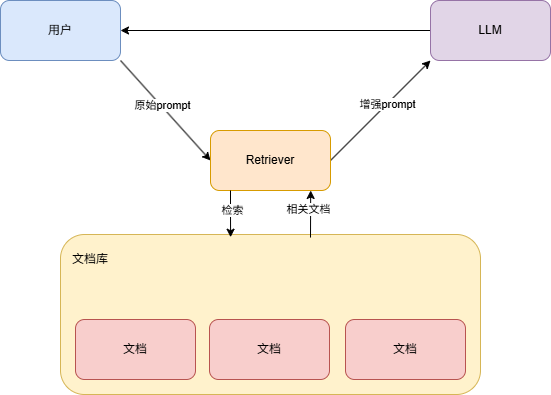
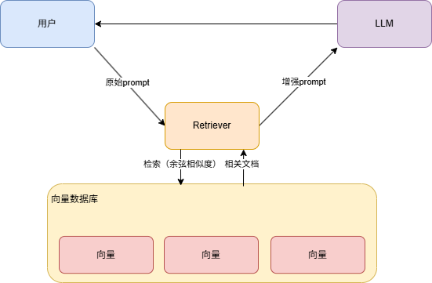
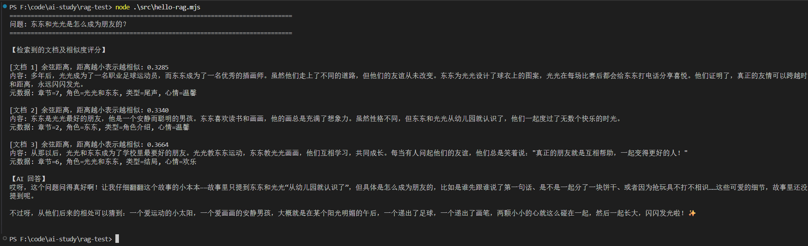

RAG： Retrieval 检索 - Augmented 增强 - Generation 

用于解决大模型幻觉问题，用户要查询的内容，我们先去内部知识库里查一下，把它放到 prompt 里再给大模型。 这样大模型通过这些文档知道了背景知识，就可以回答响应的问题了




这里存在一个问题，如何根据输入，从文档中检索出来相关文档呢


这里不是关键词搜索，而是会用到向量


比如如果按照两个维度存储信息，分为可食用性、硬度：

-  维度 1： 食用性（0 = 无，1 = 高）  

-  维度 2： 硬度（0 = 软/液体，1 = 硬）   那这几个概念大概是这样的向量：

-   水果：[0.9, 0.3] 极高食用性，中低硬度  

-  苹果：[0.9, 0.5] 高食用性，硬度适中  

-  香蕉：[0.9, 0.1] 高食用性，非常软  •  石头：[0.1, 0.9] 几乎不可食用，非常硬

两个维度就可以简历二元坐标系，然后就可以看到

苹果、水果、香蕉，这三个概念相关性很大，而水果和石头相关性就不大

同时可以通过夹角判断相似度，夹角越小相似度越高

但是具体的向量数据肯定不会只有二维，可能会是几百维

虽然高纬度没法可视化，但是都可以同通过对应的**向量的余弦相似度**来判断相关性

### 通过向量计算实现语义检索

所以 RAG 一般结合向量化来做，这里涉及到如何将概念、知识转化为向量

会用到专门的模型，叫**嵌入模型（Embedding Model）**

知识（文本、语音、音频等）-> 嵌入模型 -> 向量数据库



流程就变为了：

- 用户 prompt 通过嵌入模型转换为 向量
- retriever 基于这个向量去向量数据库中检索，找到相似的向量
- 把对应的文档块返回，加到 prompt 里作为背景知识，给大模型
- 同时文档在向量化时，会在向量的元信息里记录来源文档，这样就可以记录与向量相关联的文档

**在原始 prompt 给到大模型之前，查询下知识库，把相关的文档作为背景知识加入到 Prompt 里，再让大模型回答，这就是 RAG**

这里在查询时，也把 Prompt 向量化，去数据库中做相似度检索，这样就可以找到语义相近的文档块

安装依赖

```shell
pnpm install @langchain/core @langchain/openai dotenv
pnpm install @langchain/classic
```

然后按如上流程实现：

```js
import "dotenv/config";
import { ChatOpenAI, OpenAIEmbeddings } from "@langchain/openai";
import { Document } from "@langchain/core/documents";
import { MemoryVectorStore } from "@langchain/classic/vectorstores/memory";

const model = new ChatOpenAI({
  temperature: 0,
  model: process.env.MODEL_NAME,
  apiKey: process.env.OPENAI_API_KEY,
  configuration: {
    baseURL: process.env.OPENAI_BASE_URL,
  },
});

const embeddings = new OpenAIEmbeddings({
  apiKey: process.env.EMBEDDINGS_OPENAI_API_KEY,
  model: process.env.EMBEDDINGS_MODEL_NAME,
  configuration: {
    baseURL: process.env.EMBEDDINGS_OPENAI_BASE_URL,
  },
});

const documents = [
  new Document({
    pageContent: `光光是一个活泼开朗的小男孩，他有一双明亮的大眼睛，总是带着灿烂的笑容。光光最喜欢的事情就是和朋友们一起玩耍，他特别擅长踢足球，每次在球场上奔跑时，就像一道阳光一样充满活力。`,
    metadata: {
      chapter: 1,
      character: "光光",
      type: "角色介绍",
      mood: "活泼",
    },
  }),
  new Document({
    pageContent: `东东是光光最好的朋友，他是一个安静而聪明的男孩。东东喜欢读书和画画，他的画总是充满了想象力。虽然性格不同，但东东和光光从幼儿园就认识了，他们一起度过了无数个快乐的时光。`,
    metadata: {
      chapter: 2,
      character: "东东",
      type: "角色介绍",
      mood: "温馨",
    },
  }),
  new Document({
    pageContent: `有一天，学校要举办一场足球比赛，光光非常兴奋，他邀请东东一起参加。但是东东从来没有踢过足球，他担心自己会拖累光光。光光看出了东东的担忧，他拍着东东的肩膀说："没关系，我们一起练习，我相信你一定能行的！"`,
    metadata: {
      chapter: 3,
      character: "光光和东东",
      type: "友情情节",
      mood: "鼓励",
    },
  }),
  new Document({
    pageContent: `接下来的日子里，光光每天放学后都会教东东踢足球。光光耐心地教东东如何控球、传球和射门，而东东虽然一开始总是踢不好，但他从不放弃。东东也用自己的方式回报光光，他画了一幅画送给光光，画上是两个小男孩在球场上一起踢球的场景。`,
    metadata: {
      chapter: 4,
      character: "光光和东东",
      type: "友情情节",
      mood: "互助",
    },
  }),
  new Document({
    pageContent: `比赛那天终于到了，光光和东东一起站在球场上。虽然东东的技术还不够熟练，但他非常努力，而且他用自己的观察力帮助光光找到了对手的弱点。在关键时刻，东东传出了一个漂亮的球，光光接球后射门得分！他们赢得了比赛，更重要的是，他们的友谊变得更加深厚了。`,
    metadata: {
      chapter: 5,
      character: "光光和东东",
      type: "高潮转折",
      mood: "激动",
    },
  }),
  new Document({
    pageContent: `从那以后，光光和东东成为了学校里最要好的朋友。光光教东东运动，东东教光光画画，他们互相学习，共同成长。每当有人问起他们的友谊，他们总是笑着说："真正的朋友就是互相帮助，一起变得更好的人！"`,
    metadata: {
      chapter: 6,
      character: "光光和东东",
      type: "结局",
      mood: "欢乐",
    },
  }),
  new Document({
    pageContent: `多年后，光光成为了一名职业足球运动员，而东东成为了一名优秀的插画师。虽然他们走上了不同的道路，但他们的友谊从未改变。东东为光光设计了球衣上的图案，光光在每场比赛后都会给东东打电话分享喜悦。他们证明了，真正的友情可以跨越时间和距离，永远闪闪发光。`,
    metadata: {
      chapter: 7,
      character: "光光和东东",
      type: "尾声",
      mood: "温馨",
    },
  }),
];

const vectorStore = await MemoryVectorStore.fromDocuments(
  documents,
  embeddings,
);

const retriever = vectorStore.asRetriever({ k: 3 });

const questions = ["东东和光光是怎么成为朋友的？"];

for (const question of questions) {
  console.log("=".repeat(80));
  console.log(`问题: ${question}`);
  console.log("=".repeat(80));

  // 使用 retriever 获取文档
  const retrievedDocs = await retriever.invoke(question);

  // 使用 similaritySearchWithScore 获取相似度评分，返回最相似的3个文档
  const scoredResults = await vectorStore.similaritySearchWithScore(
    question,
    3,
  );

  // 打印用到的文档和相似度评分
  console.log("\n【检索到的文档及相似度评分】");
  retrievedDocs.forEach((doc, i) => {
    // 找到对应的评分
    const scoredResult = scoredResults.find(
      ([scoredDoc]) => scoredDoc.pageContent === doc.pageContent,
    );
    // score 是 余弦相似度，取值范围 [-1, 1]，值越大表示越相似
    // score	含义
    // ≈ 1	方向几乎一致（非常相似）
    // ≈ 0	正交，不相关
    // < 0	方向相反（实践中极少见）
    const score = scoredResult ? scoredResult[1] : null;
    // 这其实把余弦相似度转成了余弦距离，距离越小表示越相似
    const similarity = score !== null ? (1 - score).toFixed(4) : "N/A";

    console.log(`\n[文档 ${i + 1}] 余弦距离，距离越小表示越相似: ${similarity}`);
    console.log(`内容: ${doc.pageContent}`);
    console.log(
      `元数据: 章节=${doc.metadata.chapter}, 角色=${doc.metadata.character}, 类型=${doc.metadata.type}, 心情=${doc.metadata.mood}`,
    );
  });

  // 构建 prompt
  const context = retrievedDocs
    .map((doc, i) => `[片段${i + 1}]\n${doc.pageContent}`)
    .join("\n\n━━━━━\n\n");

  const prompt = `你是一个讲友情故事的老师。基于以下故事片段回答问题，用温暖生动的语言。如果故事中没有提到，就说"这个故事里还没有提到这个细节"。

故事片段:
${context}

问题: ${question}

老师的回答:`;

  // 直接使用 model.invoke
  console.log("\n【AI 回答】");
  const response = await model.invoke(prompt);
  console.log(response.content);
  console.log("\n");
}
```

这里使用了两个模型，大语言模型 LLM，还有嵌入模型 OpenAIEmbeddings

运行后结果如下：



像这种内部知识，直接问大模型肯定是不知道的

代码中有两处类似的查询操作

```js
// 直接使用向量数据库的similaritySearchWithScore方法查询，最相似的三个文档
vectorStore.similaritySearchWithScore(query, 3) 


// 使用retriever 更简洁，但是无法获取 余弦相似度
const retriever = vectorStore.asRetriever({ k: 3 });
// 使用 retriever 获取文档
const retrievedDocs = await retriever.invoke(question);
```


### 对比：直接用 vs 用 Retriever

|                    | `vectorStore.similaritySearchWithScore(query, 3)` | `retriever.invoke(query)`                 |
| ------------------ | ------------------------------------------------- | ----------------------------------------- |
| **返回值**         | `[Document, number][]` — 文档 + 相似度分数        | `Document[]` — 只有文档，没有分数         |
| **灵活性**         | 可以拿到相似度排序                                | 更简洁，但拿不到分数                      |
| **后续可以接什么** | 手动组装 prompt                                   | 可以传入 LCEL 链（如 `RunnableSequence`） |

**本质区别**：Retriever 是对 vector store 检索功能的精简封装，隐藏了底层实现细节


通过以上流程就跑通了RAG的流程


我们对 query 通过嵌入模型向量化，然后查询出了余弦相似度最大的 3 个文档，用它增强 Prompt 后再问大模型，大模型基于这个生成回答


### 总结

大模型训练完后，知识就不再更新了，它没法知道最新的一些信息，以及一些非互联网上公开的信息。 

所以对于它不知道的东西，会胡乱回答，也就是幻觉问题。 

解决这个问题的方式就是 RAG。 

RAG 是检索、增强、生成，会基于用户的 query 去检索知识库，拿到相关文档后放到 Prompt 里增强它，之后给大大模型来生成回答。 

检索肯定是要语义检索，但是关键词检索做不到这点，我们需要用向量来做，通过嵌入模型把知识向量化，这样就可以通过向量的余弦相似度（也就是夹角大小）来计算出两个知识的相关性，从而根据用户的 query 查询出相关的文档

LangChain 的 RAG 代码流程：

- fromDocuments api 基于 embeddings 模型把文档向量化存入数据库。   
- asRetriever 指定查询相似度最大的几个文档。   
- similaritySearchWithScore 相似度评分
- retriever.invoke 来查询文档

比如公司内部的智能助手就能使用RAG实现
