LangChain 很多 api 都实现了 Runnable 接口，比如 PromptTemplate、OutputParser、ChatOpenAI 等

安装依赖

```shell
pnpm install dotenv @langchain/core @langchain/openai zod
```

准备好.env文件

runnable-test\src\before.mjs

```js
import "dotenv/config";
import { StructuredOutputParser } from "@langchain/core/output_parsers";
import { PromptTemplate } from "@langchain/core/prompts";
import { ChatOpenAI } from "@langchain/openai";
import { z } from "zod";

const model = new ChatOpenAI({
  modelName: process.env.MODEL_NAME,
  apiKey: process.env.OPENAI_API_KEY,
  temperature: 0,
  configuration: {
    baseURL: process.env.OPENAI_BASE_URL,
  },
});

// 定义输出结构 schema
const schema = z.object({
  translation: z.string().describe("翻译后的英文文本"),
  keywords: z.array(z.string()).length(3).describe("3个关键词"),
});

const outputParser = StructuredOutputParser.fromZodSchema(schema);

const promptTemplate = PromptTemplate.fromTemplate(
  "将以下文本翻译成英文，然后总结为3个关键词。\n\n文本：{text}\n\n{format_instructions}",
);

const input = {
  text: "LangChain 是一个强大的 AI 应用开发框架",
  format_instructions: outputParser.getFormatInstructions(),
};

// 步骤 1: 格式化 prompt
const formattedPrompt = await promptTemplate.format(input);
// 步骤 2: 调用模型
const response = await model.invoke(formattedPrompt);
// 步骤 3: 解析输出
const result = await outputParser.invoke(response);
console.log("✅ 最终结果:");
console.log(result);
```

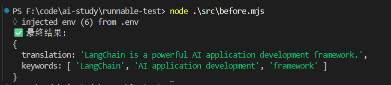

可以看到我们之前去写一个loop：

- 用 PromptTemplate 管理 prompt，调用 format 传入占位符的值。
- 调用 ChatOpenAI 的大模型，通过 invoke 方法
- 用 StructuredOutputParser 做结构化解析，调用 invoke

### RunnableSequence

现在有了Runnable：

```js
import 'dotenv/config';
import { StructuredOutputParser } from "@langchain/core/output_parsers";
import { PromptTemplate } from "@langchain/core/prompts";
import { ChatOpenAI } from "@langchain/openai";
import { RunnableSequence } from "@langchain/core/runnables";
import { z } from "zod";

const model = new ChatOpenAI({
    modelName: process.env.MODEL_NAME,
    apiKey: process.env.OPENAI_API_KEY,
    temperature: 0,
    configuration: {
        baseURL: process.env.OPENAI_BASE_URL,
    },
});

// 定义输出结构 schema
const schema = z.object({
    translation: z.string().describe("翻译后的英文文本"),
    keywords: z.array(z.string()).length(3).describe("3个关键词")
});

const outputParser = StructuredOutputParser.fromZodSchema(schema);

const promptTemplate = PromptTemplate.fromTemplate(
    '将以下文本翻译成英文，然后总结为3个关键词。\n\n文本：{text}\n\n{format_instructions}'
);

// const chain = promptTemplate
//     .pipe(model)
//     .pipe(outputParser);

const chain = RunnableSequence.from([
    promptTemplate,
    model,
    outputParser
]);

const input = { 
    text: 'LangChain 是一个强大的 AI 应用开发框架',
    format_instructions: outputParser.getFormatInstructions()
};

const result = await chain.invoke(input);

console.log('✅ 最终结果:');
console.log(result);
```

同样的结果，代码更加清晰简洁

用 RunnableSequence 声明这三个顺序执行，最后invoke参数就好了

还可以使用pipe
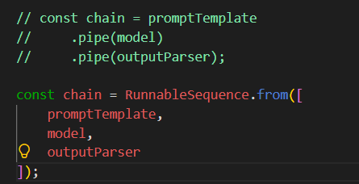

实现了 Runnable api 后，就可以声明式的组合执行的 chain，然后统一执行。

这种声明式的写法叫做 LCEL（Lang Chain Expression Language，LangChain 表达式语言）

LCEL 就是实现了 Runnbale 接口的一些 api 组合成 chain，然后统一执行。

Runnable 都有 invoke、stream、batch 方法

可以去看Runnable的接口定义

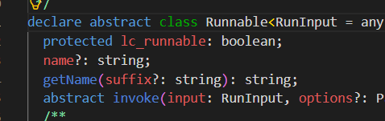

- 调用 invoke，就会依次调用这个链条上每个组件的 invoke
- batch 是批量，也就是并发进行多个单独的 invoke
- 调用 stream 就是调用这个链条上每个组件的 stream，不断返回数据

串联起来的 Runnable 的 chain 就自然可以支持同步调用、批量调用、流式返回

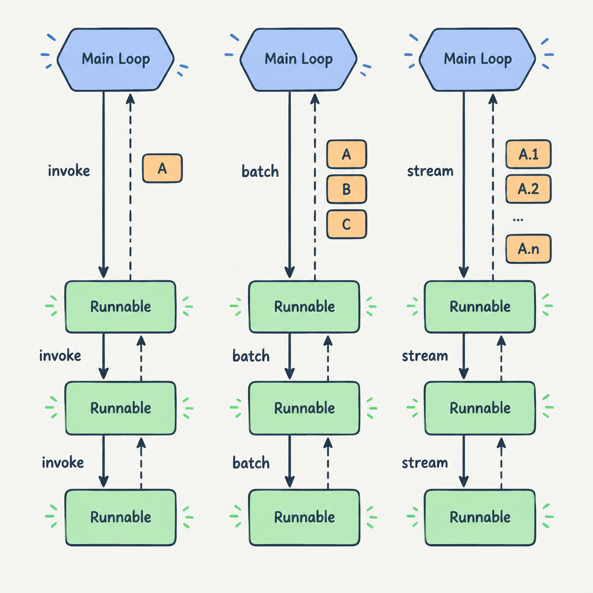


### RunnableLambda

前面用了 RunnableSequence，它是顺序执行，我们再来用一下其余的 Runnable api：

```js
// runnable-test\src\runnables\RunnableLambda.mjs
import 'dotenv/config';
import { RunnableLambda, RunnableSequence } from "@langchain/core/runnables";

const addOne = RunnableLambda.from((input) => {
    console.log(`输入: ${input}`);
    return input + 1;
});

const multiplyTwo = RunnableLambda.from((input) => {
    console.log(`输入: ${input}`);
    return input * 2;
});

const chain = RunnableSequence.from([
    addOne,
    multiplyTwo,
    addOne
]);

const result = await chain.invoke(5);
console.log(result);
```

我们把两个函数通过 RunnableLambda 封装成了 Runnable，对象然后通过 RunnableSequence 来顺序调用

就这样在chain里面调用普通函数

### RunnableMap

```js
// runnable-test\src\runnables\RunnableMap.mjs
import 'dotenv/config';
import { RunnableMap, RunnableLambda } from "@langchain/core/runnables";
import { PromptTemplate } from "@langchain/core/prompts";

const addOne = RunnableLambda.from((input) => input.num + 1);
const multiplyTwo = RunnableLambda.from((input) => input.num * 2);
const square = RunnableLambda.from((input) => input.num * input.num);

const greetTemplate = PromptTemplate.fromTemplate("你好，{name}！");
const weatherTemplate = PromptTemplate.fromTemplate("今天天气{weather}。");

// 创建 RunnableMap，并行执行多个 runnable
const runnableMap = RunnableMap.from({
    // 数学运算
    add: addOne,
    multiply: multiplyTwo,
    square: square,
    
    // prompt 格式化
    greeting: greetTemplate,
    weather: weatherTemplate,
});

// 测试输入
const input = {
    name: "神光",
    weather: "多云",
    num: 5,
};

// 执行 RunnableMap
const result = await runnableMap.invoke(input);
console.log(result);
```

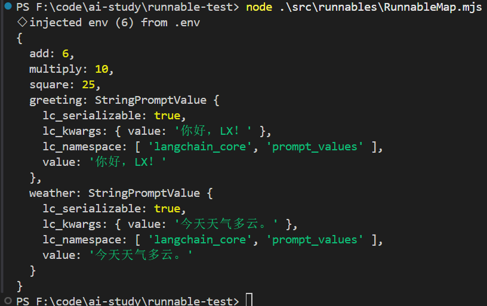

这里我们输入的 input 会并行经过 5 个 Runnable 处理，结果放到对象的对应属性上

### RunnableBranch

就是if else 逻辑

```js
import 'dotenv/config';
import { RunnableBranch, RunnableLambda } from "@langchain/core/runnables";

// 创建条件判断函数
const isPositive = RunnableLambda.from((input) => input > 0);
const isNegative = RunnableLambda.from((input) => input < 0);
const isEven = RunnableLambda.from((input) => input % 2 === 0);

// 创建分支处理函数
const handlePositive = RunnableLambda.from((input) => `正数: ${input} + 10 = ${input + 10}`);
const handleNegative = RunnableLambda.from((input) => `负数: ${input} - 10 = ${input - 10}`);
const handleEven = RunnableLambda.from((input) => `偶数: ${input} * 2 = ${input * 2}`);
const handleDefault = RunnableLambda.from((input) => `默认: ${input}`);

// 创建 RunnableBranch
const branch = RunnableBranch.from([
    [isPositive, handlePositive],
    [isNegative, handleNegative],
    [isEven, handleEven],
    handleDefault
]);

// 测试不同的输入
const testCases = [5, -3, 4, 0];

for (const testCase of testCases) {
    const result = await branch.invoke(testCase);
    console.log(`输入: ${testCase} => ${result}`);
}
```

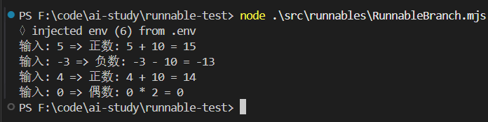

### RouterRunnable

```js
import 'dotenv/config';
import { RouterRunnable, RunnableLambda } from "@langchain/core/runnables";

// 创建两个简单的 RunnableLambda
const toUpperCase = RunnableLambda.from((text) => text.toUpperCase());
const reverseText = RunnableLambda.from((text) => text.split("").reverse().join(""));

// 创建 RouterRunnable，根据 key 选择要调用的 runnable
const router = new RouterRunnable({
  runnables: {
    toUpperCase,
    reverseText,
  },
});

// 测试：调用 reverseText
const result1 = await router.invoke({ key: "reverseText", input: "Hello World" });
console.log('reverseText 结果:', result1);

// 测试：调用 toUpperCase
const result2 = await router.invoke({ key: "toUpperCase", input: "Hello World" });
console.log('toUpperCase 结果:', result2);
```

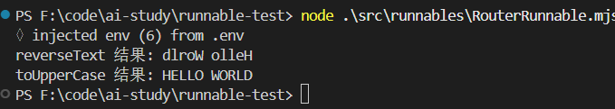

根据 key 匹配对应的 chain 来执行

### RunnablePassthrough

它是传入的最初的值

```js
import 'dotenv/config';
import { RunnablePassthrough, RunnableLambda, RunnableSequence, RunnableMap } from "@langchain/core/runnables";

// const chain = RunnableSequence.from([
//     RunnableLambda.from((input) => ({ concept: input })),
//     RunnableMap.from({
//         original: new RunnablePassthrough(),
//         processed: RunnableLambda.from((obj) => ({
//             concept: input,
//             upper: obj.concept.toUpperCase(),
//             length: obj.concept.length,
//         }))
//     })
// ]);
const chain = RunnableSequence.from([
    (input) => ({ concept: input }),
    RunnablePassthrough.assign({
        original: new RunnablePassthrough(),
        processed: (obj) => ({
            concept: input,
            upper: obj.concept.toUpperCase(),
            length: obj.concept.length,
        })
    })
]);

const input = "神说要有光";
const result = await chain.invoke(input);
console.log(result);
```

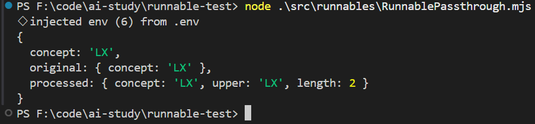

original 部分就是通过 RunnablePassthrough 拿到了原始值

这里使用的是简化后的代码

只保留函数、对象即可，LangChain 会把函数转为 RunnableLambda，把对象转为 RunnableMap

如果是想保留原始属性，只是扩展一些属性，用 RunnablePassthrough.assign

现在之前的属性也保留着，只是合并了新的属性，就像 Object.assign 一样

### RunnableEach

```js
import 'dotenv/config';
import { RunnableEach, RunnableLambda, RunnableSequence } from "@langchain/core/runnables";

const toUpperCase = RunnableLambda.from((input) => input.toUpperCase());
const addGreeting = RunnableLambda.from((input) => `你好，${input}！`);

const processItem = RunnableSequence.from([
  toUpperCase,
  addGreeting,
]);

// 使用 RunnableEach 对数组中的每个元素应用这个链
const chain = new RunnableEach({
  bound: processItem,
});

const input = ["alice", "bob", "carol"];
const result = await chain.invoke(input);

console.log('✅ RunnableEach - 数组元素处理:');
console.log('输入:', input);
console.log('输出:', result);
```

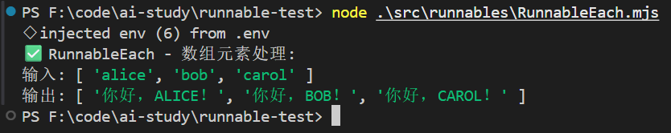

对输入的数组的每个元素应用这个 chain

### RunnablePick

```js
import 'dotenv/config';
import { RunnablePick, RunnableSequence } from "@langchain/core/runnables";

const inputData = {
  name: "神光",
  age: 30,
  city: "北京",
  country: "中国",
  email: "shenguang@example.com",
  phone: "+86-13800138000",
};

const chain = RunnableSequence.from([
  (input) => ({
    ...input,
    fullInfo: `${input.name}，${input.age}岁，来自${input.city}`,
  }),
  new RunnablePick(["name", "fullInfo"]),
]);

const result = await chain.invoke(inputData);
console.log(result);
```

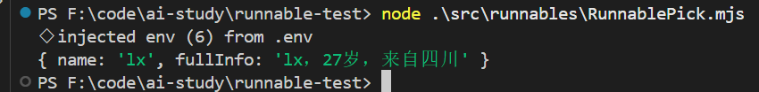

### RunnableWithMessageHistory

给 chain 加上 memory 的功能

```js
import 'dotenv/config';
import { RunnableWithMessageHistory } from "@langchain/core/runnables";
import { InMemoryChatMessageHistory } from "@langchain/core/chat_history";
import { ChatOpenAI } from "@langchain/openai";
import { ChatPromptTemplate, MessagesPlaceholder } from "@langchain/core/prompts";
import { StringOutputParser } from "@langchain/core/output_parsers";

const model = new ChatOpenAI({
  modelName: process.env.MODEL_NAME,
  apiKey: process.env.OPENAI_API_KEY,
  temperature: 0.3,
  configuration: {
    baseURL: process.env.OPENAI_BASE_URL,
  },
});

const prompt = ChatPromptTemplate.fromMessages([
  [
    "system",
    "你是一个简洁、有帮助的中文助手，会用 1-2 句话回答用户问题，重点给出明确、有用的信息。",
  ],
  new MessagesPlaceholder("history"),
  ["human", "{question}"],
]);

const simpleChain = prompt.pipe(model).pipe(new StringOutputParser());

const messageHistories = new Map();

const getMessageHistory = (sessionId) => {
  if (!messageHistories.has(sessionId)) {
    messageHistories.set(sessionId, new InMemoryChatMessageHistory());
  }
  return messageHistories.get(sessionId);
};

// 创建带消息历史的链
const chain = new RunnableWithMessageHistory({
  runnable: simpleChain,
  getMessageHistory: (sessionId) => getMessageHistory(sessionId),
  inputMessagesKey: "question",
  historyMessagesKey: "history",
});

// 测试：第一次对话
console.log('--- 第一次对话（提供信息） ---');
const result1 = await chain.invoke(
  {
    question: "我的名字是神光，我来自山东，我喜欢编程、写作、金铲铲。",
  },
  {
    configurable: {
      sessionId: "user-123",
    },
  }
);
console.log('问题: 我的名字是神光，我来自山东，我喜欢编程、写作、金铲铲。');
console.log('回答:', result1);
console.log();

// 测试：第二次对话
console.log('--- 第二次对话（询问之前的信息） ---');
const result2 = await chain.invoke(
  {
    question: "我刚才说我来自哪里？",
  },
  {
    configurable: {
      sessionId: "user-123",
    },
  }
);
console.log('问题: 我刚才说我来自哪里？');
console.log('回答:', result2);
console.log();

// 测试：第三次对话
console.log('--- 第三次对话（继续询问） ---');
const result3 = await chain.invoke(
  {
    question: "我的爱好是什么？",
  },
  {
    configurable: {
      sessionId: "user-123",
    },
  }
);
console.log('问题: 我的爱好是什么？');
console.log('回答:', result3);
console.log();
```

我们用 ChatPromptTemplate 创建 prompt，其中 history 对话历史用 MessagesPlaceholder 插入。

在 map 里管理每个 sessionId 对应的 ChatMessageHistory

然后创建 RunnableWithMessageHistory 的 chain，告诉它问题、回答都是从哪个字段取

就是一个带memory的chain

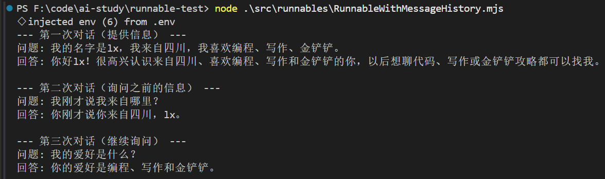

### 总结

LangChain 的很多组件都继承了 Runnable 抽象类，而且也提供了很多 Runnable 的 api基于 Runnable 的 api 可以很简洁的组装好一条 chain，不用再写很多逻辑这个叫做 LangChain 表达式语言（LCEL）

 Runnable 的 api：

- RunnableSequence：顺序执行
- RunnableLambda：把函数包装成 
- RunnableRunnableMap：并行执行多个 chain，结果放在对象属性上
- RunnableBranch：if else 逻辑
- RouterRunnable：switch case 逻辑，根据 key 决定执行哪个 
- chainRunnableEach：循环数组每个元素来调用 
- chainRunnablePassthrough：拿到原始输入
- RunnablePick：取输入对象的某些属性返回
- RunnableWithMessageHistory：给 chain 加上 memory
