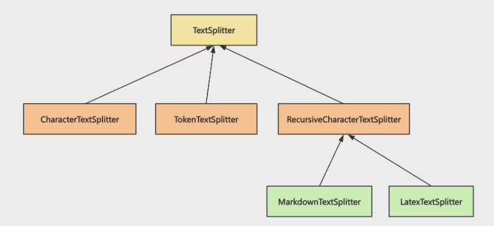
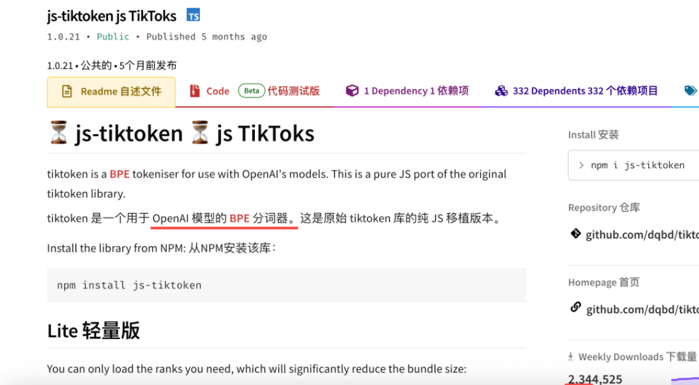
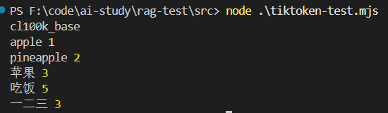
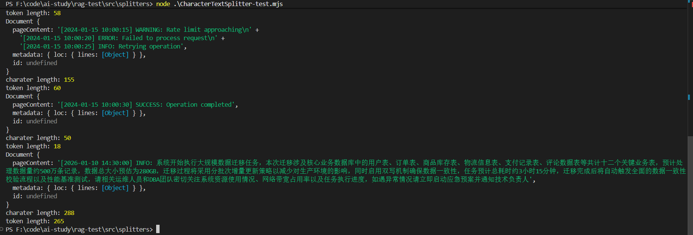
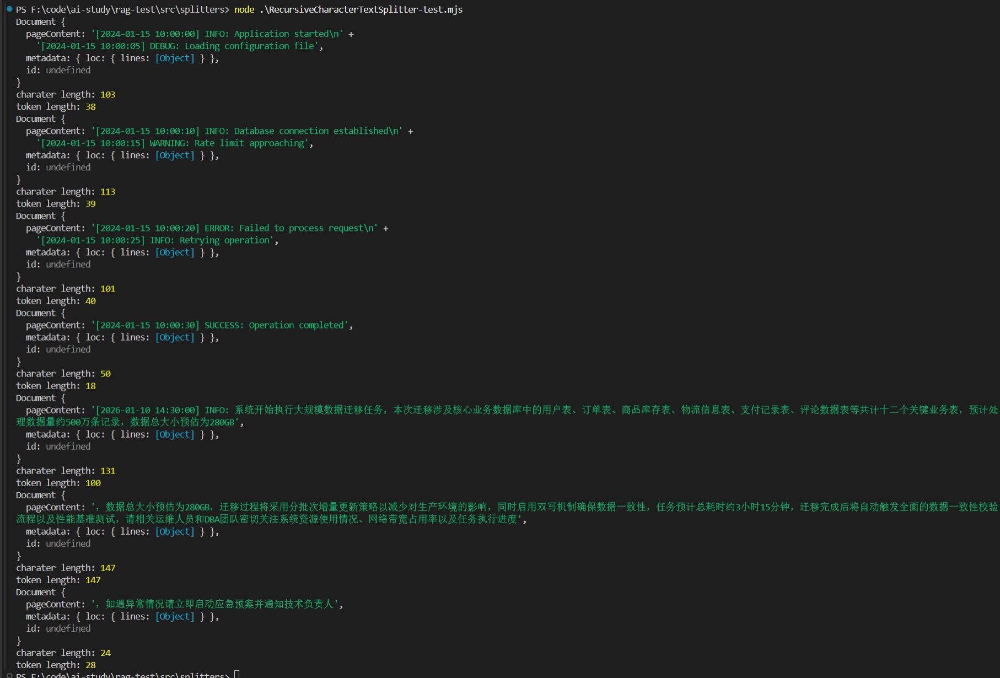
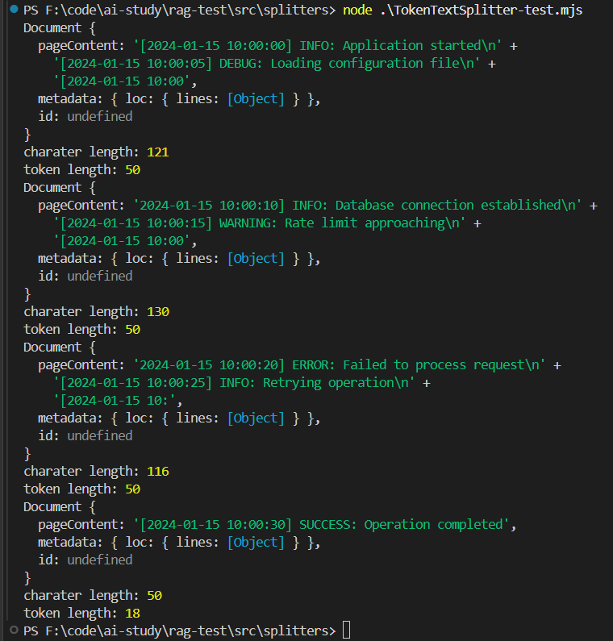
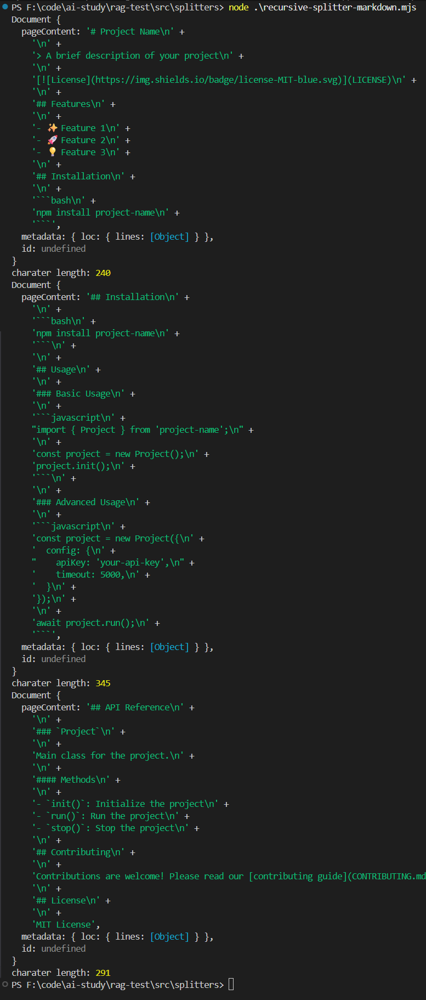
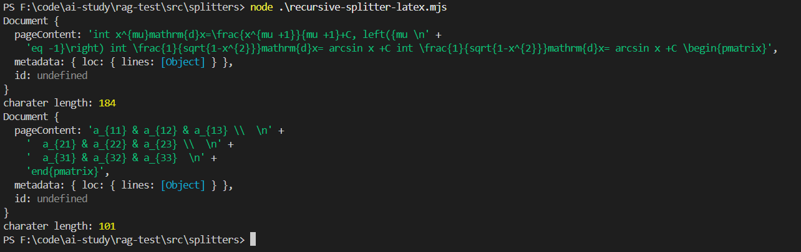
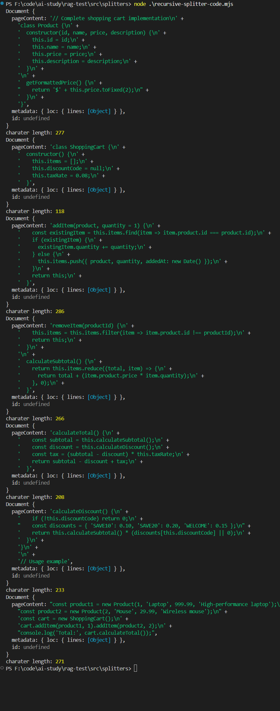

### 概述

来过一下 langChain 中封装好的 splitter


回顾之前的流程和用法：

```js
import { RecursiveCharacterTextSplitter } from "@langchain/textsplitters";

const textSplitter = new RecursiveCharacterTextSplitter({
  chunkSize: 500, // 每个分块的字符数
  chunkOverlap: 50, // 分块之间的重叠字符数
  separators: ["。", "！", "？"], // 分割符，优先使用段落分隔
});

const splitDocuments = await textSplitter.splitDocuments(documents);
```

我们用到了RecursiveCharacterTextSplitter：

- chunkSize： 用于规定每个chunk的大小，超出就下一个分块
- chunkOverlap ：分块之间的重叠字符数，只有文本超过 chunk size，文本被打断了才会加，不是所有的块都会有 overlap，**设置这个是为了保证语义连贯性**
- separators：" 。 ？ ！" 就是先尝试按照 。 分割，如果分割后大于 chunk 剩余空间再按照 ？ 分割，是一个递归过程

来看langchain中的其他splitter



所有的 Splitter 都继承自 TextSplitter，包括RecursiveCharacterTextSplitter 等

### js-tiktoken

这里提一下这个库，它时 OpenAI 模型的 BPE 分词器



```js
import { getEncoding, getEncodingNameForModel } from "js-tiktoken";

const modelName = "gpt-4";
const encodingName = getEncodingNameForModel(modelName);
console.log(encodingName);

const enc = getEncoding("cl100k_base");
console.log("apple", enc.encode("apple").length);
console.log("pineapple", enc.encode("pineapple").length);
console.log("苹果", enc.encode("苹果").length);
console.log("吃饭", enc.encode("吃饭").length);
console.log("一二三", enc.encode("一二三").length);
```

这里可以用这个"cl100k_base"编码去查询对应的token消耗

**很明显 token 的消耗和字符长度不是正相关的，而是却决于对应的分词器**




### CharacterTextSplitter

基础的字符分割器，与 RecursiveCharacterTextSplitter 不同，它只有一个固定的 separator

```js
import "dotenv/config";
import "cheerio";
import { CharacterTextSplitter } from "@langchain/textsplitters";
import { Document } from "@langchain/core/documents";
import { getEncoding } from "js-tiktoken";

const logDocument = new Document({
  pageContent: `[2024-01-15 10:00:00] INFO: Application started
[2024-01-15 10:00:05] DEBUG: Loading configuration file
[2024-01-15 10:00:10] INFO: Database connection established
[2024-01-15 10:00:15] WARNING: Rate limit approaching
[2024-01-15 10:00:20] ERROR: Failed to process request
[2024-01-15 10:00:25] INFO: Retrying operation
[2024-01-15 10:00:30] SUCCESS: Operation completed
[2026-01-10 14:30:00] INFO: 系统开始执行大规模数据迁移任务，本次迁移涉及核心业务数据库中的用户表、订单表、商品库存表、物流信息表、支付记录表、评论数据表等共计十二个关键业务表，预计处理数据量约500万条记录，数据总大小预估为280GB，迁移过程将采用分批次增量更新策略以减少对生产环境的影响，同时启用双写机制确保数据一致性，任务预计总耗时约3小时15分钟，迁移完成后将自动触发全面的数据一致性校验流程以及性能基准测试，请相关运维人员和DBA团队密切关注系统资源使用情况、网络带宽占用率以及任务执行进度，如遇异常情况请立即启动应急预案并通知技术负责人
`,
});

const logTextSplitter = new CharacterTextSplitter({
  separator: "\n",
  chunkSize: 200,
  chunkOverlap: 20,
});

const splitDocuments = await logTextSplitter.splitDocuments([logDocument]);

// console.log(splitDocuments);

const enc = getEncoding("cl100k_base");
splitDocuments.forEach((document) => {
  console.log(document);
  console.log("charater length:", document.pageContent.length);
  console.log("token length:", enc.encode(document.pageContent).length);
});
```



> 注意：CharacterTextSplitter 非常死板，你告诉它按照换行符分割，**它就会严格按照这个，就算超过了 chunk size 也不拆分**

所以一般还是用 RecursiveCharacterTextSplitter

### RecursiveCharacterTextSplitter

```js
import "dotenv/config";
import "cheerio";
import { RecursiveCharacterTextSplitter } from "@langchain/textsplitters";
import { Document } from "@langchain/core/documents";
import { getEncoding } from "js-tiktoken";

const logDocument = new Document({
  pageContent: `[2024-01-15 10:00:00] INFO: Application started
[2024-01-15 10:00:05] DEBUG: Loading configuration file
[2024-01-15 10:00:10] INFO: Database connection established
[2024-01-15 10:00:15] WARNING: Rate limit approaching
[2024-01-15 10:00:20] ERROR: Failed to process request
[2024-01-15 10:00:25] INFO: Retrying operation
[2024-01-15 10:00:30] SUCCESS: Operation completed
[2026-01-10 14:30:00] INFO: 系统开始执行大规模数据迁移任务，本次迁移涉及核心业务数据库中的用户表、订单表、商品库存表、物流信息表、支付记录表、评论数据表等共计十二个关键业务表，预计处理数据量约500万条记录，数据总大小预估为280GB，迁移过程将采用分批次增量更新策略以减少对生产环境的影响，同时启用双写机制确保数据一致性，任务预计总耗时约3小时15分钟，迁移完成后将自动触发全面的数据一致性校验流程以及性能基准测试，请相关运维人员和DBA团队密切关注系统资源使用情况、网络带宽占用率以及任务执行进度，如遇异常情况请立即启动应急预案并通知技术负责人
`,
});

const enc = getEncoding("cl100k_base");

const logTextSplitter = new RecursiveCharacterTextSplitter({
  chunkSize: 150,
  chunkOverlap: 20,
  separators: ["\n", "。", "，"],
  // lengthFunction: (text) => enc.encode(text).length,
});

const splitDocuments = await logTextSplitter.splitDocuments([logDocument]);

// console.log(splitDocuments);

splitDocuments.forEach((document) => {
  console.log(document);
  console.log("charater length:", document.pageContent.length);
  console.log("token length:", enc.encode(document.pageContent).length);
});
```



当 “\n” 分割后还是大，就会用 “。” 还是不行再尝试用 “，”

这种方式相比于CharacterTextSplitter就会灵活很多，所以一般是用这个

### TokenTextSplitter

按照 token 大小来分块，不是字符数，而是 token 数

对于需要精准控制 token 数量的场景，这时候就可以用 TokenTextSplitter

```js
import "dotenv/config";
import "cheerio";
import { TokenTextSplitter } from "@langchain/textsplitters";
import { Document } from "@langchain/core/documents";
import { getEncoding } from "js-tiktoken";

const logDocument = new Document({
  pageContent: `[2024-01-15 10:00:00] INFO: Application started
[2024-01-15 10:00:05] DEBUG: Loading configuration file
[2024-01-15 10:00:10] INFO: Database connection established
[2024-01-15 10:00:15] WARNING: Rate limit approaching
[2024-01-15 10:00:20] ERROR: Failed to process request
[2024-01-15 10:00:25] INFO: Retrying operation
[2024-01-15 10:00:30] SUCCESS: Operation completed`,
});

const logTextSplitter = new TokenTextSplitter({
  chunkSize: 50, // 每个块最多 50 个 Token
  chunkOverlap: 10, // 块之间重叠 10 个 Token
  encodingName: "cl100k_base", // OpenAI 使用的编码方式
});

const splitDocuments = await logTextSplitter.splitDocuments([logDocument]);

// console.log(splitDocuments);
 
const enc = getEncoding("cl100k_base");
splitDocuments.forEach((document) => {
  console.log(document);
  console.log("charater length:", document.pageContent.length);
  console.log("token length:", enc.encode(document.pageContent).length);
});
```



可以看到，它优先保证 token 正好是 50，为了这个不惜强行打断文本

不同编码方式对应不同模型：

- cl100k_base — GPT-4 / GPT-3.5-turbo / text-embedding-ada-002
- p50k_base — Codex 系列模型
- r50k_base — GPT-3 系列模型


### RecursiveCharacterTextSplitter 分割，设置token长度

RecursiveCharacterTextSplitter 分出的 chunk 可能大于 chunk size，也可以小，优先保证语义完整，是按照分割符来分割。

但是 TokenTextSplitter 不是，它会只会保证 token 数量这种不管不顾的分割显然不靠谱，不一定在什么地方就断开了。

还是 RecursiveCharacterTextSplitter 那种更科学

如果使用RecursiveCharacterTextSplitter 分割，设置token长度，就可以结合两者优点：

```js
const enc = getEncoding("cl100k_base");

const logTextSplitter = new RecursiveCharacterTextSplitter({
  chunkSize: 150,
  chunkOverlap: 20,
  separators: ["\n", "。", "，"],
  lengthFunction: (text) => enc.encode(text).length,
});
```

**其实就是使用lengthFunction自定义，然后使用编码计算token**

这样就不需要使用 TokenTextSplitter

### MarkdownTextSplitter

就是按照 #、##、### 等一级级标题来递归分割，所以是 RecursiveCharacterTextSplitter 的子类

```js
import "dotenv/config";
import "cheerio";
import { Document } from "@langchain/core/documents";
import { MarkdownTextSplitter } from "@langchain/textsplitters";

const readmeText = `# Project Name

> A brief description of your project

[](LICENSE)

## Features

- ✨ Feature 1
- 🚀 Feature 2
- 💡 Feature 3

## Installation

\`\`\`bash
npm install project-name
\`\`\`

## Usage

### Basic Usage

\`\`\`javascript
import { Project } from 'project-name';

const project = new Project();
project.init();
\`\`\`

### Advanced Usage

\`\`\`javascript
const project = new Project({
  config: {
    apiKey: 'your-api-key',
    timeout: 5000,
  }
});

await project.run();
\`\`\`

## API Reference

### \`Project\`

Main class for the project.

#### Methods

- \`init()\`: Initialize the project
- \`run()\`: Run the project
- \`stop()\`: Stop the project

## Contributing

Contributions are welcome! Please read our [contributing guide](CONTRIBUTING.md).

## License

MIT License`;

const readmeDoc = new Document({
  pageContent: readmeText,
});

const markdownTextSplitter = new MarkdownTextSplitter({
  chunkSize: 400,
  chunkOverlap: 80,
});

const splitDocuments = await markdownTextSplitter.splitDocuments([readmeDoc]);

// console.log(splitDocuments);

splitDocuments.forEach((document) => {
  console.log(document);
  console.log("charater length:", document.pageContent.length);
});
```



可以看到，都是从标题处断开的，也就是根据语法分割的

### LatexTextSplitter

用于处理 LaTeX 数学/学术文档，按 \section、\subsection 等章节命令递归分割，也是 RecursiveCharacterTextSplitter 的子类

```js
import "dotenv/config";
import "cheerio";
import { Document } from "@langchain/core/documents";
import { LatexTextSplitter } from "@langchain/textsplitters";

const latexText = `\int x^{\mu}\mathrm{d}x=\frac{x^{\mu +1}}{\mu +1}+C, \left({\mu \neq -1}\right) \int \frac{1}{\sqrt{1-x^{2}}}\mathrm{d}x= \arcsin x +C \int \frac{1}{\sqrt{1-x^{2}}}\mathrm{d}x= \arcsin x +C \begin{pmatrix}  
  a_{11} & a_{12} & a_{13} \\  
  a_{21} & a_{22} & a_{23} \\  
  a_{31} & a_{32} & a_{33}  
\end{pmatrix} `;

const latexDoc = new Document({
  pageContent: latexText,
});

const markdownTextSplitter = new LatexTextSplitter({
  chunkSize: 200,
  chunkOverlap: 40,
});

const splitDocuments = await markdownTextSplitter.splitDocuments([latexDoc]);

// console.log(splitDocuments);

splitDocuments.forEach((document) => {
  console.log(document);
  console.log("charater length:", document.pageContent.length);
});
```

 



当然RecursiveCharacterTextSplitter也可以实现一样的功能

```js
const separators = RecursiveCharacterTextSplitter.getSeparatorsForLanguage("latex");
const splitter = new RecursiveCharacterTextSplitter({
  chunkSize: 200,
  chunkOverlap: 40,
  separators,
});
```

### RecursiveCharacterTextSplitter.fromLanguage指定代码语法分割

用 RecursiveCharacterTextSplitter.fromLanguage 这个方法，指定语言，就会按照对应的语法来分割。

支持的语言有很多，包括： java、go、js、html、python、rust、swift、markdown 等

我们用最熟悉的 js 来测试下这个分割

```JS
import "dotenv/config";
import "cheerio";
import { Document } from "@langchain/core/documents";
import {
  LatexTextSplitter,
  RecursiveCharacterTextSplitter,
} from "@langchain/textsplitters";

const jsCode = `// Complete shopping cart implementation
class Product {
  constructor(id, name, price, description) {
    this.id = id;
    this.name = name;
    this.price = price;
    this.description = description;
  }

  getFormattedPrice() {
    return '$' + this.price.toFixed(2);
  }
}

class ShoppingCart {
  constructor() {
    this.items = [];
    this.discountCode = null;
    this.taxRate = 0.08;
  }

  addItem(product, quantity = 1) {
    const existingItem = this.items.find(item => item.product.id === product.id);
    if (existingItem) {
      existingItem.quantity += quantity;
    } else {
      this.items.push({ product, quantity, addedAt: new Date() });
    }
    return this;
  }

  removeItem(productId) {
    this.items = this.items.filter(item => item.product.id !== productId);
    return this;
  }

  calculateSubtotal() {
    return this.items.reduce((total, item) => {
      return total + (item.product.price * item.quantity);
    }, 0);
  }

  calculateTotal() {
    const subtotal = this.calculateSubtotal();
    const discount = this.calculateDiscount();
    const tax = (subtotal - discount) * this.taxRate;
    return subtotal - discount + tax;
  }

  calculateDiscount() {
    if (!this.discountCode) return 0;
    const discounts = { 'SAVE10': 0.10, 'SAVE20': 0.20, 'WELCOME': 0.15 };
    return this.calculateSubtotal() * (discounts[this.discountCode] || 0);
  }
}

// Usage example
const product1 = new Product(1, 'Laptop', 999.99, 'High-performance laptop');
const product2 = new Product(2, 'Mouse', 29.99, 'Wireless mouse');
const cart = new ShoppingCart();
cart.addItem(product1, 1).addItem(product2, 2);
console.log('Total:', cart.calculateTotal());`;

const jsCodeDoc = new Document({
  pageContent: jsCode,
});

const codeSplitter = RecursiveCharacterTextSplitter.fromLanguage("js", {
  chunkSize: 300,
  chunkOverlap: 60,
});

const splitDocuments = await codeSplitter.splitDocuments([jsCodeDoc]);

// console.log(splitDocuments);

splitDocuments.forEach((document) => {
  console.log(document);
  console.log("charater length:", document.pageContent.length);
});
```




### 总结

基本就用 RecursiveCharacterTextSplitter 就行

另外两个都有很明显的缺点：CharacterTextSplitter 功能 RecursiveCharacterTextSplitter 里都有

TokenTextSplitter 严格按照 token，会破坏文档语义，不如 RecursiveCharacterTextSplitter 重写 lengthFunction

另外两个则是 RecursiveCharacterTextSplitter 的子功能


