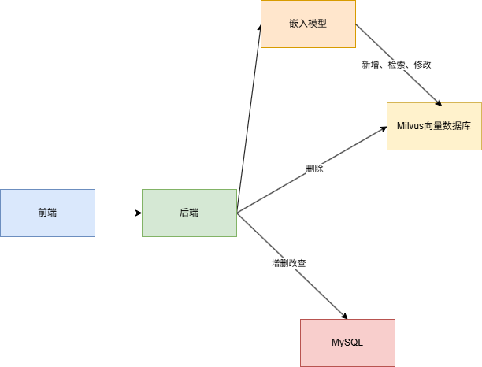

之前的向量数据数据库是放在内存中使用的

```js
import { MemoryVectorStore } from "@langchain/classic/vectorstores/memory";

const vectorStore = await MemoryVectorStore.fromDocuments(
  documents,
  embeddings,
);
```

而实际上 AI Agent 产品都会用 Milvus 这种向量数据库

web 应用会把数据存在 mysql 里，基于对数据的增删改查实现各种业务功能

根据 id 或者关键词去关联查询一系列表的数据

而 AI Agent 应用会把知识、记忆放在 Milvus 数据库中，基于对知识的检索、增删改实现各种功能

对比下：

- MySQL：只能用 id、关键词匹配

- Milvus：根据语义匹配的，你可以用自然语言来检索

所以一般会做 mysql 和 milvus 的双写，也就是同时对两个数据库做增删改，保持数据同步



删除直接根据 id，不需要嵌入模型


### docker

先去安装好docker，在docker中跑通基于 Mivlus 的 RAG 流程

windows安装使用docker desktop会遇到一些问题，参考：[WSL离线安装](https://lxysy.github.io/vuepress-notes/src/WSL%E7%A6%BB%E7%BA%BF%E5%AE%89%E8%A3%85%E6%8C%87%E5%8D%97.html#%E9%97%AE%E9%A2%98%E8%83%8C%E6%99%AF)

### milvus 安装

创建一个目录存放milvus 

从这里下载 milvus 的 docker compose 

配置文件：https://github.com/milvus-io/milvus/releases

把配置文件拿到刚才这个目录，跑一下 docker compose

```shell
docker compose -f ./milvus-standalone-docker-compose.yml up -d
```

跑起来后可在docker desktop中看到运行的镜像和容器

### 插入数据

```js
import "dotenv/config";
import { MilvusClient, DataType, MetricType, IndexType } from '@zilliz/milvus2-sdk-node';
import { OpenAIEmbeddings } from "@langchain/openai";

const COLLECTION_NAME = 'ai_diary';
const VECTOR_DIM = 1024;

const embeddings = new OpenAIEmbeddings({
  apiKey: process.env.OPENAI_API_KEY,
  model: process.env.EMBEDDINGS_MODEL_NAME,
  configuration: {
    baseURL: process.env.OPENAI_BASE_URL
  },
  dimensions: VECTOR_DIM
});

const client = new MilvusClient({
  address: 'localhost:19530'
});

async function getEmbedding(text) {
  const result = await embeddings.embedQuery(text);
  return result;
}

async function main() {
  try {
    console.log('Connecting to Milvus...');
    await client.connectPromise;
    console.log('✓ Connected\n');

    // 创建集合
    console.log('Creating collection...');
    await client.createCollection({
      collection_name: COLLECTION_NAME,
      fields: [
        { name: 'id', data_type: DataType.VarChar, max_length: 50, is_primary_key: true },
        { name: 'vector', data_type: DataType.FloatVector, dim: VECTOR_DIM },
        { name: 'content', data_type: DataType.VarChar, max_length: 5000 },
        { name: 'date', data_type: DataType.VarChar, max_length: 50 },
        { name: 'mood', data_type: DataType.VarChar, max_length: 50 },
        { name: 'tags', data_type: DataType.Array, element_type: DataType.VarChar, max_capacity: 10, max_length: 50 }
      ]
    });
    console.log('Collection created');

    // 创建索引
    console.log('\nCreating index...');
    await client.createIndex({
      collection_name: COLLECTION_NAME,
      field_name: 'vector',
      index_type: IndexType.IVF_FLAT,
      metric_type: MetricType.COSINE,
      params: { nlist: 1024 }
    });
    console.log('Index created');

    // 加载集合
    console.log('\nLoading collection...');
    await client.loadCollection({ collection_name: COLLECTION_NAME });
    console.log('Collection loaded');

    // 插入日记数据
    console.log('\nInserting diary entries...');
    const diaryContents = [
      {
        id: 'diary_001',
        content: '今天天气很好，去公园散步了，心情愉快。看到了很多花开了，春天真美好。',
        date: '2026-01-10',
        mood: 'happy',
        tags: ['生活', '散步']
      },
      {
        id: 'diary_002',
        content: '今天工作很忙，完成了一个重要的项目里程碑。团队合作很愉快，感觉很有成就感。',
        date: '2026-01-11',
        mood: 'excited',
        tags: ['工作', '成就']
      },
      {
        id: 'diary_003',
        content: '周末和朋友去爬山，天气很好，心情也很放松。享受大自然的感觉真好。',
        date: '2026-01-12',
        mood: 'relaxed',
        tags: ['户外', '朋友']
      },
      {
        id: 'diary_004',
        content: '今天学习了 Milvus 向量数据库，感觉很有意思。向量搜索技术真的很强大。',
        date: '2026-01-12',
        mood: 'curious',
        tags: ['学习', '技术']
      },
      {
        id: 'diary_005',
        content: '晚上做了一顿丰盛的晚餐，尝试了新菜谱。家人都说很好吃，很有成就感。',
        date: '2026-01-13',
        mood: 'proud',
        tags: ['美食', '家庭']
      }
    ];

    console.log('Generating embeddings...');
    const diaryData = await Promise.all(
      diaryContents.map(async (diary) => ({
        ...diary,
        vector: await getEmbedding(diary.content)
      }))
    );

    const insertResult = await client.insert({
      collection_name: COLLECTION_NAME,
      data: diaryData
    });
    console.log(`✓ Inserted ${insertResult.insert_cnt} records\n`);

  } catch (error) {
    console.error('Error:', error.message);
  }
}

main();
```
