之前的向量数据数据库是放在内存中使用的

```js
import { MemoryVectorStore } from "@langchain/classic/vectorstores/memory";

const vectorStore = await MemoryVectorStore.fromDocuments(
  documents,
  embeddings,
);
```

而实际上 AI Agent 产品都会用 Milvus 这种向量数据库

web 应用会把数据存在 mysql 里，基于对数据的增删改查实现各种业务功能

根据 id 或者关键词去关联查询一系列表的数据

而 AI Agent 应用会把知识、记忆放在 Milvus 数据库中，基于对知识的检索、增删改实现各种功能

对比下：

- MySQL：只能用 id、关键词匹配

- Milvus：根据语义匹配的，你可以用自然语言来检索

所以一般会做 mysql 和 milvus 的双写，也就是同时对两个数据库做增删改，保持数据同步


删除直接根据 id，不需要嵌入模型


### docker

先去安装好docker，在docker中跑通基于 Mivlus 的 RAG 流程

windows安装使用docker desktop会遇到一些问题，参考：[WSL离线安装](https://lxysy.github.io/vuepress-notes/src/WSL%E7%A6%BB%E7%BA%BF%E5%AE%89%E8%A3%85%E6%8C%87%E5%8D%97.html#%E9%97%AE%E9%A2%98%E8%83%8C%E6%99%AF)

### milvus 安装

创建一个目录存放milvus 

从这里下载 milvus 的 docker compose 

配置文件：https://github.com/milvus-io/milvus/releases

把配置文件拿到刚才这个目录，跑一下 docker compose

```shell
docker compose -f ./milvus-standalone-docker-compose.yml up -d
```

这里可能需要配置下配置 Docker 镜像加速器

 打开 Docker Desktop → Settings → Docker Engine，编辑 JSON，添加 registry-mirrors：

```json
{
    "registry-mirrors": [
      "https://docker.m.daocloud.io",
      "https://dockerproxy.com",
      "https://docker.nju.edu.cn",
      "https://docker.mirrors.ustc.edu.cn"
    ]
  }
```

然后点击 Apply & Restart，等 Docker 重启后再执行：
  `docker compose -f ./milvus-standalone-docker-compose.yml up -d`

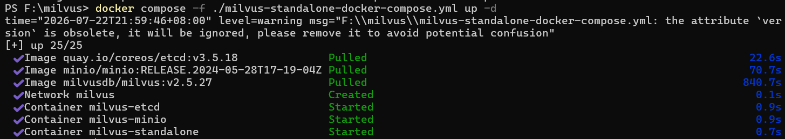

跑起来后可在docker desktop中看到运行的镜像和容器

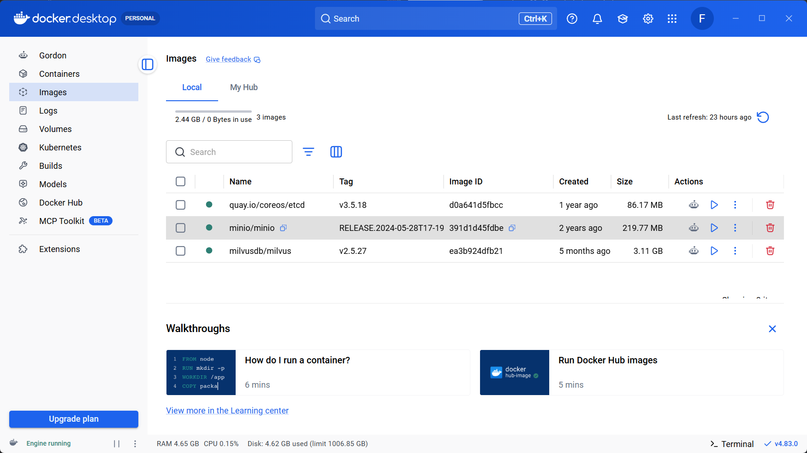

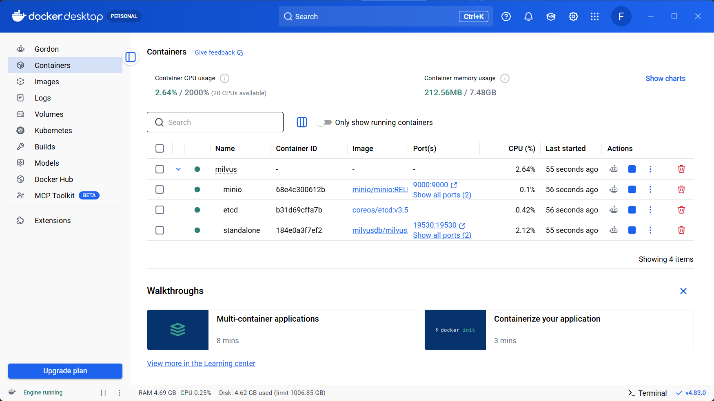

milvus 数据库是跑在 19530 这个端口

访问这个 url 可以做健康度检查：

http://localhost:9091/healthz


然后来使用milvus 做CRUD

### 数据库可视化工具Attu 安装

https://github.com/zilliztech/attu/releases

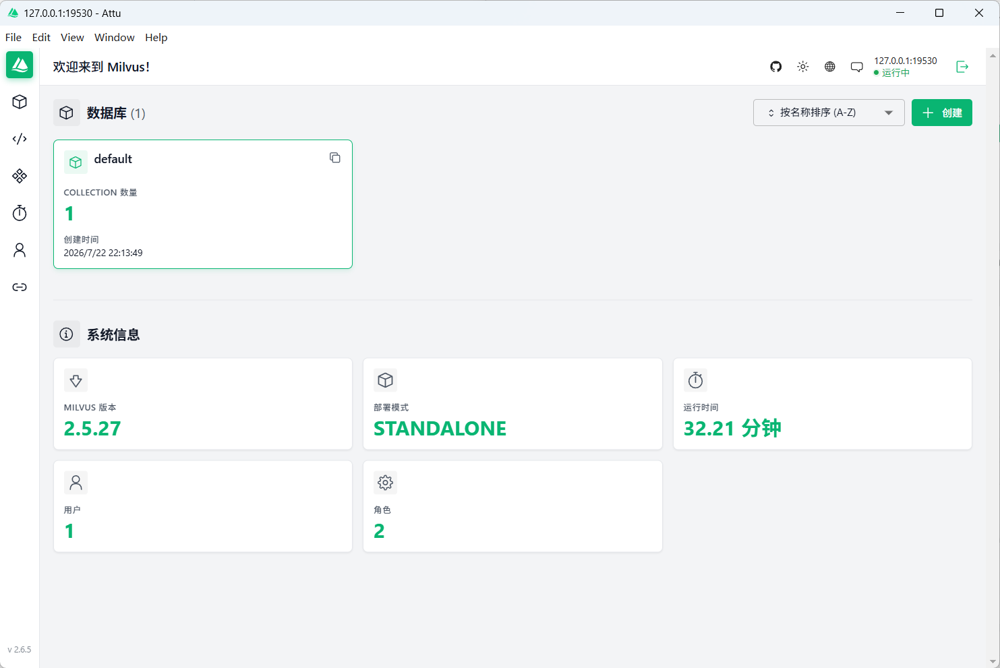

### 插入数据

```js
import "dotenv/config";
import { MilvusClient, DataType, MetricType, IndexType } from '@zilliz/milvus2-sdk-node';
import { OpenAIEmbeddings } from "@langchain/openai";

const COLLECTION_NAME = 'ai_diary';
const VECTOR_DIM = 1024;

const embeddings = new OpenAIEmbeddings({
  apiKey: process.env.EMBEDDINGS_OPENAI_API_KEY,
  model: process.env.EMBEDDINGS_MODEL_NAME,
  configuration: {
    baseURL: process.env.EMBEDDINGS_OPENAI_BASE_URL
  },
  dimensions: VECTOR_DIM
});

const client = new MilvusClient({
  address: 'localhost:19530'
});

async function getEmbedding(text) {
  const result = await embeddings.embedQuery(text);
  return result;
}

async function main() {
  try {
    console.log('Connecting to Milvus...');
    await client.connectPromise;
    console.log('✓ Connected\n');

    // 创建集合
    console.log('Creating collection...');
    await client.createCollection({
      collection_name: COLLECTION_NAME,
      fields: [
        { name: 'id', data_type: DataType.VarChar, max_length: 50, is_primary_key: true },
        { name: 'vector', data_type: DataType.FloatVector, dim: VECTOR_DIM },
        { name: 'content', data_type: DataType.VarChar, max_length: 5000 },
        { name: 'date', data_type: DataType.VarChar, max_length: 50 },
        { name: 'mood', data_type: DataType.VarChar, max_length: 50 },
        { name: 'tags', data_type: DataType.Array, element_type: DataType.VarChar, max_capacity: 10, max_length: 50 }
      ]
    });
    console.log('Collection created');

    // 创建索引
    console.log('\nCreating index...');
    await client.createIndex({
      collection_name: COLLECTION_NAME,
      field_name: 'vector',
      index_type: IndexType.IVF_FLAT,
      metric_type: MetricType.COSINE,
      params: { nlist: 1024 }
    });
    console.log('Index created');

    // 加载集合
    console.log('\nLoading collection...');
    await client.loadCollection({ collection_name: COLLECTION_NAME });
    console.log('Collection loaded');

    // 插入日记数据
    console.log('\nInserting diary entries...');
    const diaryContents = [
      {
        id: 'diary_001',
        content: '今天天气很好，去公园散步了，心情愉快。看到了很多花开了，春天真美好。',
        date: '2026-01-10',
        mood: 'happy',
        tags: ['生活', '散步']
      },
      {
        id: 'diary_002',
        content: '今天工作很忙，完成了一个重要的项目里程碑。团队合作很愉快，感觉很有成就感。',
        date: '2026-01-11',
        mood: 'excited',
        tags: ['工作', '成就']
      },
      {
        id: 'diary_003',
        content: '周末和朋友去爬山，天气很好，心情也很放松。享受大自然的感觉真好。',
        date: '2026-01-12',
        mood: 'relaxed',
        tags: ['户外', '朋友']
      },
      {
        id: 'diary_004',
        content: '今天学习了 Milvus 向量数据库，感觉很有意思。向量搜索技术真的很强大。',
        date: '2026-01-12',
        mood: 'curious',
        tags: ['学习', '技术']
      },
      {
        id: 'diary_005',
        content: '晚上做了一顿丰盛的晚餐，尝试了新菜谱。家人都说很好吃，很有成就感。',
        date: '2026-01-13',
        mood: 'proud',
        tags: ['美食', '家庭']
      }
    ];

    console.log('Generating embeddings...');
    const diaryData = await Promise.all(
      diaryContents.map(async (diary) => ({
        ...diary,
        vector: await getEmbedding(diary.content)
      }))
    );

    const insertResult = await client.insert({
      collection_name: COLLECTION_NAME,
      data: diaryData
    });
    console.log(`✓ Inserted ${insertResult.insert_cnt} records\n`);

  } catch (error) {
    console.error('Error:', error.message);
  }
}

main();
```

这里可以看到存储在Milvus中的结构

这就是schema

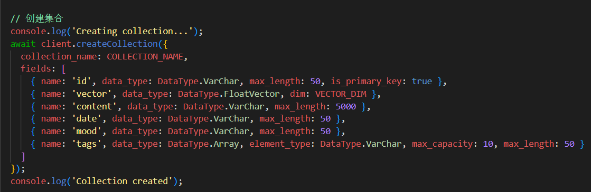

和 mysql 的表差不多，唯一的区别是 vector 这个字段，我们设置了 FloatVector 类型，也就是向量，指定维度是 1024 维

```js
const VECTOR_DIM = 1024;


const embeddings = new OpenAIEmbeddings({
  apiKey: process.env.EMBEDDINGS_OPENAI_API_KEY,
  model: process.env.EMBEDDINGS_MODEL_NAME,
  configuration: {
    baseURL: process.env.EMBEDDINGS_OPENAI_BASE_URL
  },
  dimensions: VECTOR_DIM
});

await client.createCollection({
      collection_name: COLLECTION_NAME,
      fields: [
        { name: 'id', data_type: DataType.VarChar, max_length: 50, is_primary_key: true },
        { name: 'vector', data_type: DataType.FloatVector, dim: VECTOR_DIM },
        { name: 'content', data_type: DataType.VarChar, max_length: 5000 },
        { name: 'date', data_type: DataType.VarChar, max_length: 50 },
        { name: 'mood', data_type: DataType.VarChar, max_length: 50 },
        { name: 'tags', data_type: DataType.Array, element_type: DataType.VarChar, max_capacity: 10, max_length: 50 }
      ]
    });
```

VECTOR_DIM 也就是告诉 AI 生成 1024 维的向量

告诉 Milvus 存储的向量是 1024 维的浮点数组。**这个维度必须和 embedding 模型输出的维度一致**，否则插入或搜索会报错

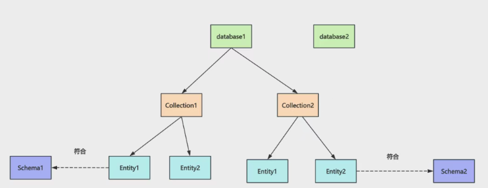

分为多个 database，每个 database 下有多个 collection  

每个 collection 下是符合 schema 的 entity，也就是数据

 所以我们插入数据，就定义一个 schema，然后插入 entity 就好了

 同时要建立一个向量字段的索引，用来快速查询

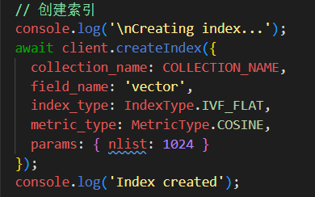

这个索引是 **向量索引**，专门加在 `vector` 字段上，目的是**加速相似性搜索**。

没有索引的话，搜索时要遍历集合里所有向量一一计算相似度（暴力搜索），数据量大时会非常慢。

参数拆解

| 参数          | 值         | 含义                               |
| ------------- | ---------- | ---------------------------------- |
| `index_type`  | `IVF_FLAT` | 索引算法 — **倒排文件 + 原始向量** |
| `metric_type` | `COSINE`   | 相似度度量方式 — **余弦相似度**    |
| `nlist`       | `1024`     | 聚类中心数量（IVF 的桶数）         |

这里用到了`MetricType.COSINE` 也就是之前提到过的**余弦相似度**作为距离度量

 运行代码：

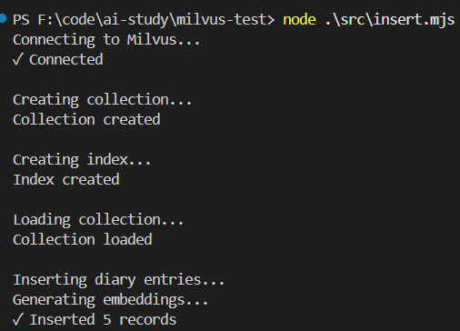

可以看到成功插入

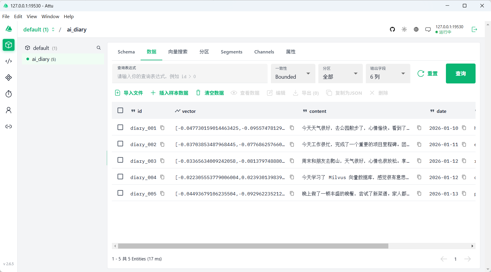

vector 是向量，用来做语义检索的

其他字段是元信息，会一并查出来返回

### 查询数据

```js
import "dotenv/config";
import { MilvusClient, MetricType } from '@zilliz/milvus2-sdk-node';
import { OpenAIEmbeddings } from "@langchain/openai";

const COLLECTION_NAME = 'ai_diary';
const VECTOR_DIM = 1024;

const embeddings = new OpenAIEmbeddings({
  apiKey: process.env.EMBEDDINGS_OPENAI_API_KEY,
  model: process.env.EMBEDDINGS_MODEL_NAME,
  configuration: {
    baseURL: process.env.EMBEDDINGS_OPENAI_BASE_URL
  },
  dimensions: VECTOR_DIM
});

const client = new MilvusClient({
  address: 'localhost:19530'
});

async function getEmbedding(text) {
  const result = await embeddings.embedQuery(text);
  return result;
}

async function main() {
  try {
    console.log('Connecting to Milvus...');
    await client.connectPromise;
    console.log('✓ Connected\n');

    // 向量搜索
    console.log('Searching for similar diary entries...');
    const query = '我学习或者做饭的日记';
    console.log(`Query: "${query}"\n`);

    const queryVector = await getEmbedding(query);
    const searchResult = await client.search({
      collection_name: COLLECTION_NAME,
      vector: queryVector,
      limit: 3,
      metric_type: MetricType.COSINE,
      output_fields: ['id', 'content', 'date', 'mood', 'tags']
    });

    console.log(`Found ${searchResult.results.length} results:\n`);
    searchResult.results.forEach((item, index) => {
      console.log(`${index + 1}. [Score: ${item.score.toFixed(4)}]`);
      console.log(`   ID: ${item.id}`);
      console.log(`   Date: ${item.date}`);
      console.log(`   Mood: ${item.mood}`);
      console.log(`   Tags: ${item.tags?.join(', ')}`);
      console.log(`   Content: ${item.content}\n`);
    });

  } catch (error) {
    console.error('Error:', error.message);
  }
}

main();
```

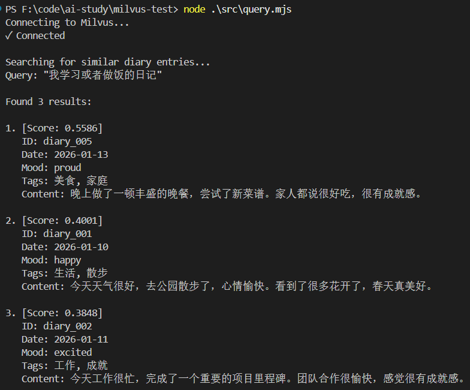

用 metric_type: MetricType.COSINE，所以 Score = 余弦相似度（Cosine Similarity），范围在 0~1 之间。

  它的含义是：查询文本和日记内容的向量在语义空间中的方向接近程度——**分数越高，模型认为语义越接近**

这里模型误判"公园散步"比"学习"更像"学习"， Score 的高低完全由 embedding 模型对中文语义的理解质量决定

可以换多种嵌入模型尝试（如 BAAI/bge-large-zh-v1.5 或 text-embedding-3-large）

### 结合RAGl流程

```js
import "dotenv/config";
import { MilvusClient, MetricType } from "@zilliz/milvus2-sdk-node";
import { ChatOpenAI, OpenAIEmbeddings } from "@langchain/openai";

const COLLECTION_NAME = "ai_diary";
const VECTOR_DIM = 1024;

// 初始化 OpenAI Chat 模型
const model = new ChatOpenAI({
  temperature: 0.7,
  model: process.env.MODEL_NAME,
  apiKey: process.env.OPENAI_API_KEY,
  configuration: {
    baseURL: process.env.OPENAI_BASE_URL,
  },
});

// 初始化 Embeddings 模型
const embeddings = new OpenAIEmbeddings({
  apiKey: process.env.EMBEDDINGS_OPENAI_API_KEY,
  model: process.env.EMBEDDINGS_MODEL_NAME,
  configuration: {
    baseURL: process.env.EMBEDDINGS_OPENAI_BASE_URL,
  },
  dimensions: VECTOR_DIM,
});

// 初始化 Milvus 客户端
const client = new MilvusClient({
  address: "localhost:19530",
});

/**
 * 获取文本的向量嵌入
 */
async function getEmbedding(text) {
  const result = await embeddings.embedQuery(text);
  return result;
}

/**
 * 从 Milvus 中检索相关的日记条目
 */
async function retrieveRelevantDiaries(question, k = 2) {
  try {
    // 生成问题的向量
    const queryVector = await getEmbedding(question);

    // 在 Milvus 中搜索相似的日记
    const searchResult = await client.search({
      collection_name: COLLECTION_NAME,
      vector: queryVector,
      limit: k,
      metric_type: MetricType.COSINE,
      output_fields: ["id", "content", "date", "mood", "tags"],
    });

    return searchResult.results;
  } catch (error) {
    console.error("检索日记时出错:", error.message);
    return [];
  }
}

/**
 * 使用 RAG 回答关于日记的问题
 */
async function answerDiaryQuestion(question, k = 2) {
  try {
    console.log("=".repeat(80));
    console.log(`问题: ${question}`);
    console.log("=".repeat(80));

    // 1. 检索相关日记
    console.log("\n【检索相关日记】");
    const retrievedDiaries = await retrieveRelevantDiaries(question, k);

    if (retrievedDiaries.length === 0) {
      console.log("未找到相关日记");
      return "抱歉，我没有找到相关的日记内容。";
    }

    // 2. 打印检索到的日记及相似度
    retrievedDiaries.forEach((diary, i) => {
      console.log(`\n[日记 ${i + 1}] 相似度: ${diary.score.toFixed(4)}`);
      console.log(`日期: ${diary.date}`);
      console.log(`心情: ${diary.mood}`);
      console.log(`标签: ${diary.tags?.join(", ")}`);
      console.log(`内容: ${diary.content}`);
    });

    // 3. 构建上下文
    const context = retrievedDiaries
      .map((diary, i) => {
        return `[日记 ${i + 1}]
日期: ${diary.date}
心情: ${diary.mood}
标签: ${diary.tags?.join(", ")}
内容: ${diary.content}`;
      })
      .join("\n\n━━━━━\n\n");

    // 4. 构建 prompt
    const prompt = `你是一个温暖贴心的 AI 日记助手。基于用户的日记内容回答问题，用亲切自然的语言。

请根据以下日记内容回答问题：
${context}

用户问题: ${question}

回答要求：
1. 如果日记中有相关信息，请结合日记内容给出详细、温暖的回答
2. 可以总结多篇日记的内容，找出共同点或趋势
3. 如果日记中没有相关信息，请温和地告知用户
4. 用第一人称"你"来称呼日记的作者
5. 回答要有同理心，让用户感到被理解和关心

AI 助手的回答:`;

    // 5. 调用 LLM 生成回答
    console.log("\n【AI 回答】");
    const response = await model.invoke(prompt);
    console.log(response.content);
    console.log("\n");

    return response.content;
  } catch (error) {
    console.error("回答问题时出错:", error.message);
    return "抱歉，处理您的问题时出现了错误。";
  }
}

async function main() {
  try {
    console.log("连接到 Milvus...");
    await client.connectPromise;
    console.log("✓ 已连接\n");

    await answerDiaryQuestion("我最近做了什么让我感到快乐的事情？", 2);
  } catch (error) {
    console.error("错误:", error.message);
  }
}

main();
```


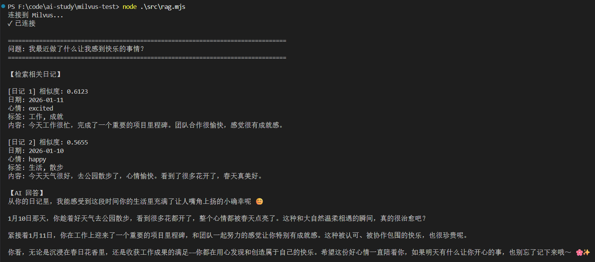

就是多了从milvus语义检索到相关知识

加到 prompt 里让大模型回答

AI Agent 里就是这样来做 RAG 的

### 更新数据

```js
import "dotenv/config";
import { MilvusClient } from '@zilliz/milvus2-sdk-node';
import { OpenAIEmbeddings } from "@langchain/openai";

const COLLECTION_NAME = 'ai_diary';
const VECTOR_DIM = 1024;

const embeddings = new OpenAIEmbeddings({
  apiKey: process.env.EMBEDDINGS_OPENAI_API_KEY,
  model: process.env.EMBEDDINGS_MODEL_NAME,
  configuration: {
    baseURL: process.env.EMBEDDINGS_OPENAI_BASE_URL
  },
  dimensions: VECTOR_DIM
});

const client = new MilvusClient({
  address: 'localhost:19530'
});

async function getEmbedding(text) {
  const result = await embeddings.embedQuery(text);
  return result;
}

async function main() {
  try {
    console.log('Connecting to Milvus...');
    await client.connectPromise;
    console.log('✓ Connected\n');

    // 更新数据（Milvus 通过 upsert 实现更新）
    console.log('Updating diary entry...');
    const updateId = 'diary_001';
    const updatedContent = {
      id: updateId,
      content: '今天下了一整天的雨，心情很糟糕。工作上遇到了很多困难，感觉压力很大。一个人在家，感觉特别孤独。',
      date: '2026-01-10',
      mood: 'sad',
      tags: ['生活', '散步', '朋友']
    };

    console.log('Generating new embedding...');
    const vector = await getEmbedding(updatedContent.content);
    const updateData = { ...updatedContent, vector };

    const result = await client.upsert({
      collection_name: COLLECTION_NAME,
      data: [updateData]
    });

    console.log(`✓ Updated diary entry: ${updateId}`);
    console.log(`  New content: ${updatedContent.content}`);
    console.log(`  New mood: ${updatedContent.mood}`);
    console.log(`  New tags: ${updatedContent.tags.join(', ')}\n`);

  } catch (error) {
    console.error('Error:', error.message);
  }
}

main();
```

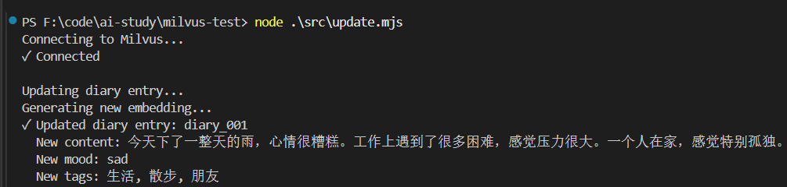

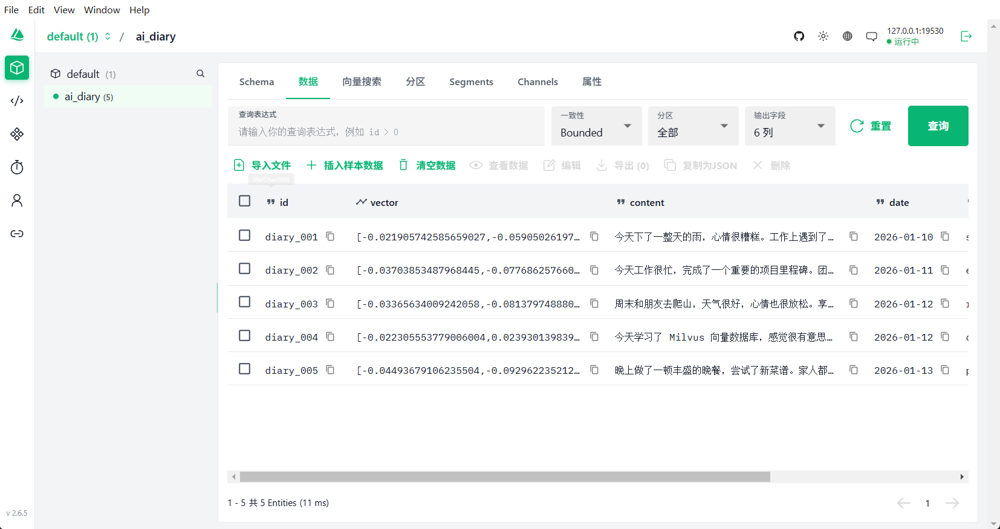

调用 upsert 方法，数据里带上 id 即可

### 删除数据

```js
import "dotenv/config";
import { MilvusClient } from "@zilliz/milvus2-sdk-node";

const COLLECTION_NAME = "ai_diary";

const client = new MilvusClient({
  address: "localhost:19530",
});

async function main() {
  try {
    console.log("Connecting to Milvus...");
    await client.connectPromise;
    console.log("✓ Connected\n");

    // 删除单条数据
    console.log("Deleting diary entry...");
    const deleteId = "diary_005";

    const result = await client.delete({
      collection_name: COLLECTION_NAME,
      filter: `id == "${deleteId}"`,
    });

    console.log(`✓ Deleted ${result.delete_cnt} record(s)`);
    console.log(`  ID: ${deleteId}\n`);

    // 批量删除
    console.log("Batch deleting diary entries...");
    const deleteIds = ["diary_002", "diary_003"];
    const idsStr = deleteIds.map((id) => `"${id}"`).join(", ");

    const batchResult = await client.delete({
      collection_name: COLLECTION_NAME,
      filter: `id in [${idsStr}]`,
    });

    console.log(`✓ Batch deleted ${batchResult.delete_cnt} record(s)`);
    console.log(`  IDs: ${deleteIds.join(", ")}\n`);

    // 条件删除
    console.log("Deleting by condition...");
    const conditionResult = await client.delete({
      collection_name: COLLECTION_NAME,
      filter: `mood == "sad"`,
    });

    console.log(
      `✓ Deleted ${conditionResult.delete_cnt} record(s) with mood="sad"\n`
    );
  } catch (error) {
    console.error("Error:", error.message);
  }
}

main();
```

这个不用向量化数据，也就不用嵌入模型

这里用了 filter  根据条件来删除，或者 id in [1,2,3] 这样来批量删除

我们这里删了一个 mood 为 sad 的，一个 id 为 2、3 的，一个 id 为 5 的

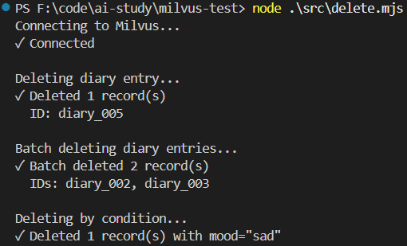

### 总结

MySQL 数据库只能根据 id、关键词去检索，涉及到语义检索的，我们都会存到 Milvus 里

docker compose 跑了 Milvus 数据库，然后在 attu （GUI 工具） 和 node 代码里连上，并做了增删改查

Milvus 分为 database、collection、entity 这三级，collection 要指定数据结构也就是 schema

vector 向量字段需要做索引，用来快速检索

MySQL 和 Milvus 分别用于不同的场景，一个是做精确查询，可以关联查出很多表的数据，一个是做语义检索，可以用自然语言来查询

 实际上一般会做双写，同时对两者做增删改查
