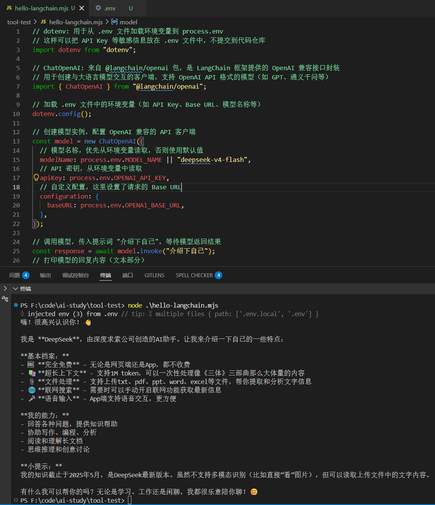
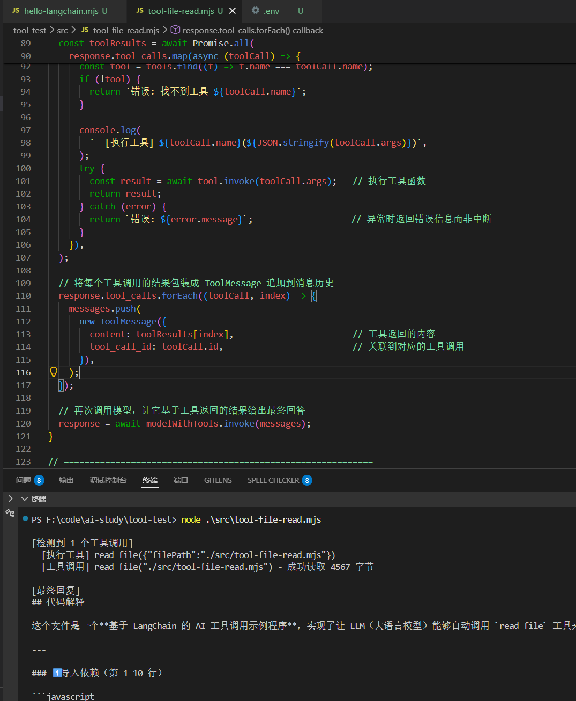
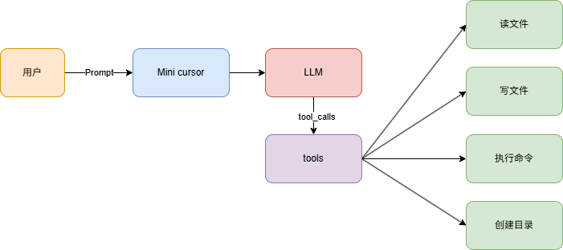
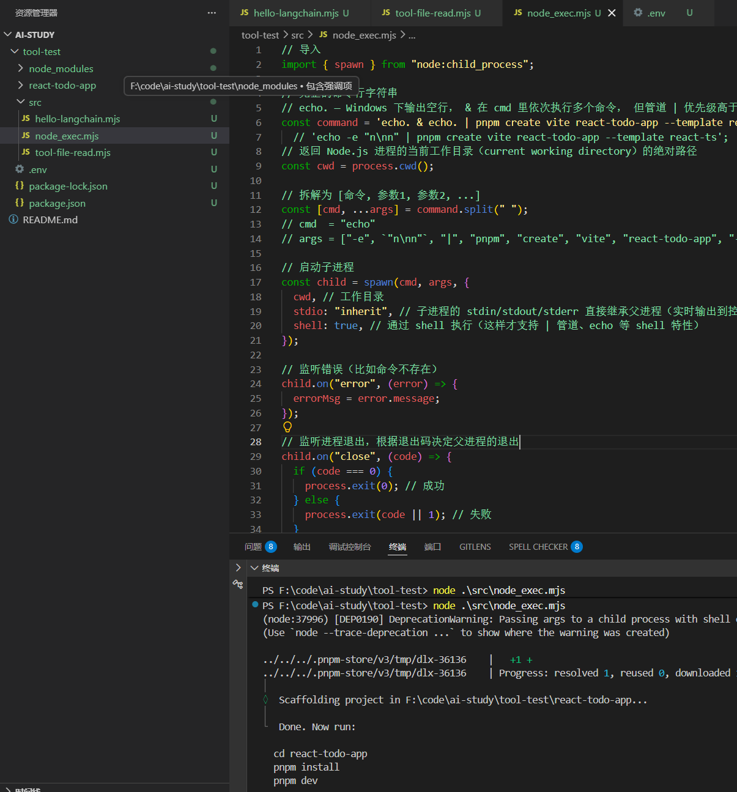
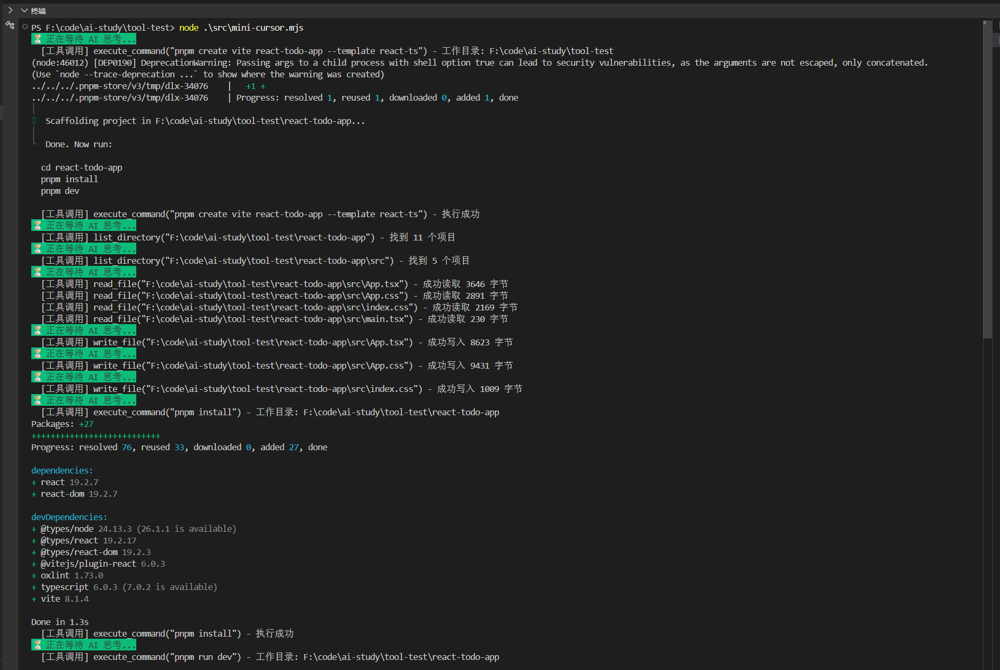
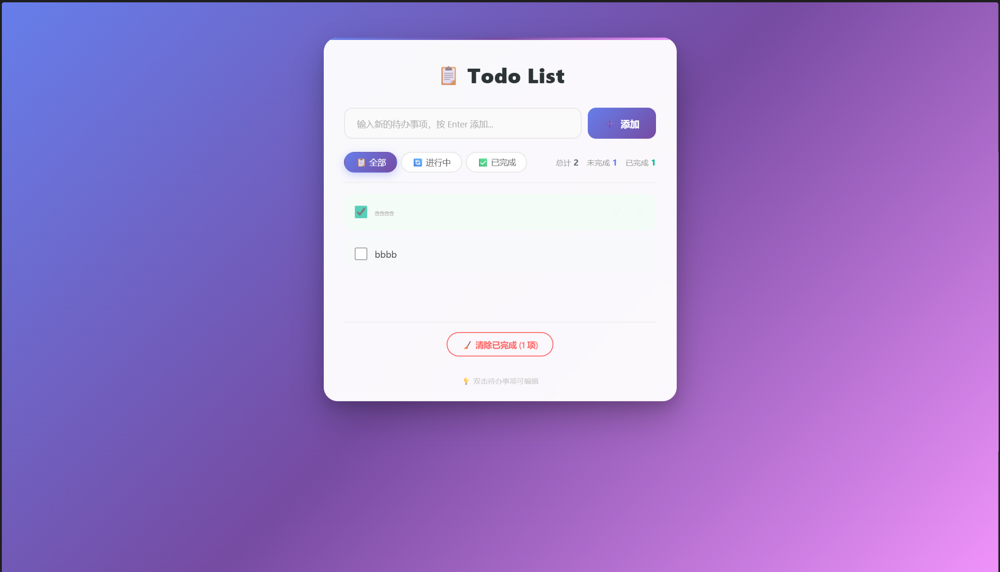

### langchain

LangChain是一个由大型语言模型 (LLM) 驱动的应用程序开发框架。

简单来说，大模型本身是不会调用工具的，那么类似cursor是如何写文件、读文件、新建项目

这里使用到了 @langchain/openai 包，是 LangChain 框架提供的 OpenAI 兼容接口封装:

```js
// dotenv: 用于从 .env 文件加载环境变量到 process.env
// 这样可以把 API Key 等敏感信息放在 .env 文件中，不提交到代码仓库
import dotenv from "dotenv";

// ChatOpenAI: 来自 @langchain/openai 包，是 LangChain 框架提供的 OpenAI 兼容接口封装
// 用于创建与大语言模型交互的客户端，支持 OpenAI API 格式的模型（如 GPT、通义千问等）
import { ChatOpenAI } from "@langchain/openai";

// 加载 .env 文件中的环境变量（如 API Key、Base URL、模型名称等）
dotenv.config();

// 创建模型实例，配置 OpenAI 兼容的 API 客户端
const model = new ChatOpenAI({
  // 模型名称，优先从环境变量读取，否则使用默认值
  modelName: process.env.MODEL_NAME || "deepseek-v4-flash",
  // API 密钥，从环境变量中读取
  apiKey: process.env.OPENAI_API_KEY,
  // 自定义配置，这里设置了请求的 Base URL
  configuration: {
    baseURL: process.env.OPENAI_BASE_URL,
  },
});

// 调用模型，传入提示词 "介绍下自己"，等待模型返回结果
const response = await model.invoke("介绍下自己");
// 打印模型的回复内容（文本部分）
console.log(response.content);
```



这样就实现了模型的调用

### 读取文件tool

来实现一个tool,让大模型去读文件

```js
// ============================================================
// 1. 导入依赖 —— 加载环境变量、LangChain 核心模块、文件系统和 Zod 校验
// ============================================================
import "dotenv/config";                               // 加载 .env 文件中的环境变量
import { ChatOpenAI } from "@langchain/openai";       // OpenAI 兼容的聊天模型接口
import { tool } from "@langchain/core/tools";         // 创建工具的高阶函数
import {
  HumanMessage,                                       // 用户消息
  SystemMessage,                                      // 系统提示消息
  ToolMessage,                                        // 工具返回结果消息
} from "@langchain/core/messages";
import fs from "node:fs/promises";                    // 异步文件系统 API
import { z } from "zod";                              // 参数校验库

// ============================================================
// 2. 初始化模型 —— 配置 LLM 客户端
// ============================================================
const model = new ChatOpenAI({
  modelName: process.env.MODEL_NAME || "deepseek-v4-flash",  // 模型名称
  apiKey: process.env.OPENAI_API_KEY,                       // API 密钥
  temperature: 0,                                            // 温度设为 0，保证输出确定性
  configuration: {
    baseURL: process.env.OPENAI_BASE_URL,                    // 兼容 OpenAI API 的自定义地址
  },
});

// ============================================================
// 3. 定义工具 —— read_file：让 LLM 能读取本地文件
// ============================================================
const readFileTool = tool(
  // 工具执行函数：接收文件路径，读取并返回文件内容
  async ({ filePath }) => {
    const content = await fs.readFile(filePath, "utf-8");   // 以 UTF-8 读取文件
    console.log(
      `  [工具调用] read_file("${filePath}") - 成功读取 ${content.length} 字节`,
    );
    return `文件内容:\n${content}`;
  },
  {
    name: "read_file",                                      // 工具名，模型通过它引用
    description:
      "用此工具来读取文件内容。当用户要求读取文件、查看代码、分析文件内容时，调用此工具。输入文件路径（可以是相对路径或绝对路径）。",
    schema: z.object({                                      // 参数校验规则
      filePath: z.string().describe("要读取的文件路径"),
    }),
  },
);

// ============================================================
// 4. 工具注册与消息准备
// ============================================================
const tools = [readFileTool];                              // 工具列表（可扩展）

// 将工具绑定到模型 —— 模型在回答中可以主动请求调用这些工具
const modelWithTools = model.bindTools(tools);

// 构建对话消息列表：
//   SystemMessage → 设定 AI 助手的行为和可用工具
//   HumanMessage  → 用户的提问
const messages = [
  new SystemMessage(`你是一个代码助手，可以使用工具读取文件并解释代码。

工作流程：
1. 用户要求读取文件时，立即调用 read_file 工具
2. 等待工具返回文件内容
3. 基于文件内容进行分析和解释

可用工具：
- read_file: 读取文件内容（使用此工具来获取文件内容）
`),
  new HumanMessage("请读取 ./src/tool-file-read.mjs 文件内容并解释代码"),
];

// ============================================================
// 5. 工具调用循环（ReAct 模式）
//    模型返回后，检查是否需要调用工具；如果是，执行工具并将结果喂回模型，
//    重复此过程直到模型直接回复最终内容。
// ============================================================
let response = await modelWithTools.invoke(messages);       // 首次调用模型
// console.log(response);

messages.push(response);                                    // 将模型响应加入历史

// 当模型返回 tool_calls 时，说明它想调用工具
while (response.tool_calls && response.tool_calls.length > 0) {
  console.log(`\n[检测到 ${response.tool_calls.length} 个工具调用]`);

  // 并行执行本次所有工具调用（Promise.all 并发）
  const toolResults = await Promise.all(
    response.tool_calls.map(async (toolCall) => {
      // 根据工具名找到对应工具实例
      const tool = tools.find((t) => t.name === toolCall.name);
      if (!tool) {
        return `错误: 找不到工具 ${toolCall.name}`;
      }

      console.log(
        `  [执行工具] ${toolCall.name}(${JSON.stringify(toolCall.args)})`,
      );
      try {
        const result = await tool.invoke(toolCall.args);   // 执行工具函数
        return result;
      } catch (error) {
        return `错误: ${error.message}`;                   // 异常时返回错误信息而非中断
      }
    }),
  );

  // 将每个工具调用的结果包装成 ToolMessage 追加到消息历史
  response.tool_calls.forEach((toolCall, index) => {
    messages.push(
      new ToolMessage({
        content: toolResults[index],                       // 工具返回的内容
        tool_call_id: toolCall.id,                         // 关联到对应的工具调用
      }),
    );
  });

  // 再次调用模型，让它基于工具返回的结果给出最终回答
  response = await modelWithTools.invoke(messages);
}

// ============================================================
// 6. 输出最终回复
// ============================================================
console.log("\n[最终回复]");
console.log(response.content);                            // 打印模型的最终回答
```



这里看到模型成功调用工具读取了文件

**工作流程**：
1. **首次调用**模型 → 模型判断需要调用 `read_file` 工具，返回 `tool_calls`
2. **进入循环** → 检测到 `tool_calls`
3. **并行执行工具** → 使用 `Promise.all` 并发执行所有工具调用
4. **记录结果** → 将每个工具的结果包装成 `ToolMessage` 加入消息历史
5. **再次调用模型** → 模型拿到工具返回的内容后，可以生成最终回答
6. **循环结束** → 当模型不再请求调用工具时，跳出循环

> **异常处理**：工具执行出错时，捕获异常并返回错误信息字符串，而不是直接抛出异常导致程序崩溃。

这里提一下定义工具的tool函数用法：

```js
tool(
  // 参数1：工具执行函数 (必需)
  async (input) => {
    // input 是经过 schema 校验后的对象
    // 返回值（字符串）作为工具结果回传给 LLM
    return "结果内容";
  },

  // 参数2：工具配置 (必需)
  {
    name: "工具名",        // 字符串，模型通过此名称引用
    description: "描述",   // 告诉 LLM 何时以及如何使用该工具
    schema: z.object({     // Zod 校验，定义工具参数结构
      filePath: z.string().describe("参数说明"),
    }),
  }
);
```

- **第一个参数是异步函数**，接收 Zod schema 校验后的参数对象
- **返回值必须是字符串**（或可序列化的内容），作为 LLM 的上下文
- **`description` 要写清楚**，LLM 靠它判断何时调用
- **`schema` 用 Zod 定义**，自动校验参数类型并提供错误提示
- 工具执行出错时第 103 行有 try/catch 容错，不中断流程

我们首次调用模型后的返回结果如下：

```json
AIMessage {
  "id": "8635abd6-76eb-4849-8046-91dd13f1814d",
  "content": "",
  "additional_kwargs": {
    "tool_calls": [
      {
        "index": 0,
        "id": "call_00_Chma9Xcwbf2zF88AEhUG2014",
        "type": "function",
        "function": "[Object]"
      }
    ],
    "reasoning_content": "用户要求读取文件并解释代码，我需要先调用 read_file 工具读取文件内容。"
  },
  "response_metadata": {
    "tokenUsage": {
      "promptTokens": 428,
      "completionTokens": 71,
      "totalTokens": 499
    },
    "finish_reason": "tool_calls",
    "model_provider": "openai",
    "model_name": "deepseek-v4-flash",
    "usage": {
      "prompt_tokens": 428,
      "completion_tokens": 71,
      "total_tokens": 499,
      "prompt_tokens_details": {
        "cached_tokens": 384
      },
      "completion_tokens_details": {
        "reasoning_tokens": 19
      },
      "prompt_cache_hit_tokens": 384,
      "prompt_cache_miss_tokens": 44
    },
    "system_fingerprint": "fp_8b330d02d0_prod0820_fp8_kvcache_20260402"
  },
  "tool_calls": [
    {
      "name": "read_file",
      "args": {
        "filePath": "./src/tool-file-read.mjs"
      },
      "type": "tool_call",
      "id": "call_00_Chma9Xcwbf2zF88AEhUG2014"
    }
  ],
  "invalid_tool_calls": [],
  "usage_metadata": {
    "output_tokens": 71,
    "input_tokens": 428,
    "total_tokens": 499,
    "input_token_details": {
      "cache_read": 384
    },
    "output_token_details": {
      "reasoning": 19
    }
  }
}
```

可以看到，ai返回的消息是AIMessage实例，实际上具体的消息有四种：

- HumanMessage     用户输入的信息
- SystemMessage     设置AI的信息，可以干什么，有什么能力，以及行为规范  
- AIMessage               AI回复的消息
- ToolMessage           调用工具的结果返回


### mini cursor

目标拓展之前的tool，实现执行命令、创建目录、读取文件、写文件等



#### 执行命令tool

关于在node中执行命令，参考child_process这个内置模块

补充下用法：

```js
import { spawn } from "node:child_process";

const child = spawn(command, args, options);
```

| 参数      | 说明                                         |
| --------- | -------------------------------------------- |
| `command` | 要执行的命令（如 `"pnpm"`、`"echo"`）        |
| `args`    | 命令参数数组（如 `["create", "vite", ...]`） |
| `options` | 配置对象（cwd、shell、stdio、env 等）        |

**返回值**是一个 `ChildProcess` 对象（也是一个 `EventEmitter`），你可以监听它的事件。

然后实现执行命令的tool：

```js
// 导入
import { spawn } from "node:child_process";

// 完整的命令行字符串
const command =
  'echo -e "n\nn" | pnpm create vite react-todo-app --template react-ts';

// 拆解为 [命令, 参数1, 参数2, ...]
const [cmd, ...args] = command.split(" ");
// cmd  = "echo"
// args = ["-e", `"n\nn"`, "|", "pnpm", "create", "vite", "react-todo-app", "--template", "react-ts"]

// 启动子进程
const child = spawn(cmd, args, {
  cwd, // 工作目录
  stdio: "inherit", // 子进程的 stdin/stdout/stderr 直接继承父进程（实时输出到控制台）
  shell: true, // 通过 shell 执行（这样才支持 | 管道、echo 等 shell 特性）
});

// 监听错误（比如命令不存在）
child.on("error", (error) => {
  errorMsg = error.message;
});

// 监听进程退出，根据退出码决定父进程的退出
child.on("close", (code) => {
  if (code === 0) {
    process.exit(0); // 成功
  } else {
    process.exit(code || 1); // 失败
  }
});
```

**关键点**

**1. `spawn` vs `exec` — 为什么这里用 spawn？**

|          | `spawn`                                  | `exec`                               |
| -------- | ---------------------------------------- | ------------------------------------ |
| 返回方式 | **流式**（stdout/stderr 是 Stream）      | **回调式**（一次性返回全部输出）     |
| 输出量   | 适合大量数据                             | 有最大缓冲区（默认 1MB，超了会报错） |
| 使用场景 | 长时间运行的进程、大量输出、需实时看日志 | 简短命令、需要一次性拿到全部输出结果 |

**你的用例很适合 spawn**：`pnpm create vite` 是一个交互式命令，需要实时看到进度输出，而不是等它跑完再一次性打印。

**2. `shell: true` 的作用**

没有 `shell: true`，`spawn("echo", ["-e", `"n\nn"`])` 会直接执行 `echo` 程序，**管道 `|` 是 shell 语法，不会被识别**。加上 `shell: true` 后，实际执行的是：


```
cmd /C echo -e "n\nn" | pnpm create vite react-todo-app --template react-ts
```

（Windows 下默认用 `cmd.exe`，Linux/macOS 用 `/bin/sh`）

**3. `stdio: "inherit"` 的作用**

子进程的 3 个标准流直接映射到父进程的控制台：

- 你在终端看到的 `pnpm create vite` 的输出**实时打印**出来
- 子进程也从同一个终端读取输入（所以交互式提示也能正常工作）

**4. 事件监听**

| 事件    | 触发时机                                                   |
| ------- | ---------------------------------------------------------- |
| `error` | 进程**启动失败**（比如命令不存在、权限不足）               |
| `close` | 进程**已退出**且所有 stdio 流已关闭，这时拿到退出码 `code` |

`code === 0` 表示成功，非零值表示失败（不同的数字对应不同的错误类型）。


由于以上第二点中提到，**在 Windows 的 cmd.exe 下**：

- **`echo` 不支持 `-e` 参数**——cmd 的 echo 就是 `echo`，它会原样输出 `-e`
- **`\n` 不会被解释为换行**——Windows cmd 里 `\n` 就是字面反斜杠 + n
- **管道 `|` 的行为可能也不一样**

所以在 Windows 上，实际执行的效果约等于：

```
cmd /C echo -e "n\nn" | pnpm create vite ...
```

这里实际是想通过管道模拟用户输入

windows下修改如下：

```js
// 导入
import { spawn } from "node:child_process";

// 完整的命令行字符串
// echo. — Windows 下输出空行， & 在 cmd 里依次执行多个命令， 但管道 | 优先级高于 &
const command = 'echo. & echo. | pnpm create vite react-todo-app --template react-ts'
  // 'echo -e "n\nn" | pnpm create vite react-todo-app --template react-ts';
// 返回 Node.js 进程的当前工作目录（current working directory）的绝对路径
const cwd = process.cwd();

// 拆解为 [命令, 参数1, 参数2, ...]
const [cmd, ...args] = command.split(" ");
// cmd  = "echo"
// args = ["-e", `"n\nn"`, "|", "pnpm", "create", "vite", "react-todo-app", "--template", "react-ts"]

// 启动子进程
const child = spawn(cmd, args, {
  cwd, // 工作目录
  stdio: "inherit", // 子进程的 stdin/stdout/stderr 直接继承父进程（实时输出到控制台）
  shell: true, // 通过 shell 执行（这样才支持 | 管道、echo 等 shell 特性）
});

// 监听错误（比如命令不存在）
child.on("error", (error) => {
  errorMsg = error.message;
});

// 监听进程退出，根据退出码决定父进程的退出
child.on("close", (code) => {
  if (code === 0) {
    process.exit(0); // 成功
  } else {
    process.exit(code || 1); // 失败
  }
});
```

| 写法             | Windows 上实际执行的           | 结果                    |
| ---------------- | ------------------------------ | ----------------------- |
| `echo -e "n\nn"` | 输出字面量 `-e "n\nn"`         | ❌ pnpm 收到垃圾         |
| `echo. & echo.`  | 两个空行，其中一个通过管道送出 | ✅ 一个 Enter 确认默认值 |

如果用 Unix/Linux 或 Git Bash 跑，原来的 `echo -e "n\nn"` 就没问题。但在 Windows cmd/PowerShell 下，就要用 `echo.` 这种 cmd 特有的语法。

最后运行，已经成功执行命令：



#### 封装所有tools

接下来封装所有的tools

```js
import { tool } from '@langchain/core/tools';
import fs from 'node:fs/promises';
import path from 'node:path';
import { spawn } from 'node:child_process';
import { z } from 'zod';

// 1. 读取文件工具
const readFileTool = tool(
  async ({ filePath }) => {
    try {
      const content = await fs.readFile(filePath, 'utf-8');
      console.log(`  [工具调用] read_file("${filePath}") - 成功读取 ${content.length} 字节`);
      return `文件内容:\n${content}`;
    } catch (error) {
      console.log(`  [工具调用] read_file("${filePath}") - 错误: ${error.message}`);
      return `读取文件失败: ${error.message}`;
    }
  },
  {
    name: 'read_file',
    description: '读取指定路径的文件内容',
    schema: z.object({
      filePath: z.string().describe('文件路径'),
    }),
  }
);

// 2. 写入文件工具
const writeFileTool = tool(
  async ({ filePath, content }) => {
    try {
      const dir = path.dirname(filePath);
      await fs.mkdir(dir, { recursive: true });
      await fs.writeFile(filePath, content, 'utf-8');
      console.log(`  [工具调用] write_file("${filePath}") - 成功写入 ${content.length} 字节`);
      return `文件写入成功: ${filePath}`;
    } catch (error) {
      console.log(`  [工具调用] write_file("${filePath}") - 错误: ${error.message}`);
      return `写入文件失败: ${error.message}`;
    }
  },
  {
    name: 'write_file',
    description: '向指定路径写入文件内容，自动创建目录',
    schema: z.object({
      filePath: z.string().describe('文件路径'),
      content: z.string().describe('要写入的文件内容'),
    }),
  }
);

// 3. 执行命令工具（带实时输出）
// echo 在 windows 可能不支持，可以设置 shell: 'powershell.exe'
const executeCommandTool = tool(
  async ({ command, workingDirectory }) => {
    const cwd = workingDirectory || process.cwd();
    console.log(`  [工具调用] execute_command("${command}")${workingDirectory ? ` - 工作目录: ${workingDirectory}` : ''}`);

    return new Promise((resolve, reject) => {
      // 解析命令和参数
      const [cmd, ...args] = command.split(' ');

      const child = spawn(cmd, args, {
        cwd,
        stdio: 'inherit', // 实时输出到控制台
        shell: 'powershell.exe',
      });

      let errorMsg = '';

      child.on('error', (error) => {
        errorMsg = error.message;
      });

      child.on('close', (code) => {
        if (code === 0) {
          console.log(`  [工具调用] execute_command("${command}") - 执行成功`);
          const cwdInfo = workingDirectory
            ? `\n\n重要提示：命令在目录 "${workingDirectory}" 中执行成功。如果需要在这个项目目录中继续执行命令，请使用 workingDirectory: "${workingDirectory}" 参数，不要使用 cd 命令。`
            : '';
          resolve(`命令执行成功: ${command}${cwdInfo}`);
        } else {
          console.log(`  [工具调用] execute_command("${command}") - 执行失败，退出码: ${code}`);
          resolve(`命令执行失败，退出码: ${code}${errorMsg ? '\n错误: ' + errorMsg : ''}`);
        }
      });
    });
  },
  {
    name: 'execute_command',
    description: '执行系统命令，支持指定工作目录，实时显示输出',
    schema: z.object({
      command: z.string().describe('要执行的命令'),
      workingDirectory: z.string().optional().describe('工作目录（推荐指定）'),
    }),
  }
);

// 4. 列出目录内容工具
const listDirectoryTool = tool(
  async ({ directoryPath }) => {
    try {
      const files = await fs.readdir(directoryPath);
      console.log(`  [工具调用] list_directory("${directoryPath}") - 找到 ${files.length} 个项目`);
      return `目录内容:\n${files.map(f => `- ${f}`).join('\n')}`;
    } catch (error) {
      console.log(`  [工具调用] list_directory("${directoryPath}") - 错误: ${error.message}`);
      return `列出目录失败: ${error.message}`;
    }
  },
  {
    name: 'list_directory',
    description: '列出指定目录下的所有文件和文件夹',
    schema: z.object({
      directoryPath: z.string().describe('目录路径'),
    }),
  }
);

export { readFileTool, writeFileTool, executeCommandTool, listDirectoryTool };
```

这个文件包含所有的tools：

- 读文件
- 写文件（包含创建目录）
- 读目录
- 执行命令

每个tool都是name、description以及基于zod申明的参数格式

#### 调用所有tools

```js
// 启动时自动读取 .env 文件的内容，注入到 process.env
import "dotenv/config";
import { ChatOpenAI } from "@langchain/openai";
import {
  HumanMessage,
  SystemMessage,
  ToolMessage,
} from "@langchain/core/messages";
import {
  executeCommandTool,
  listDirectoryTool,
  readFileTool,
  writeFileTool,
} from "./all-tools.mjs";
import chalk from "chalk";

const model = new ChatOpenAI({
  modelName: "deepseek-v4-flash",
  apiKey: process.env.OPENAI_API_KEY,
  temperature: 0,
  configuration: {
    baseURL: process.env.OPENAI_BASE_URL,
  },
});

const tools = [
  readFileTool,
  writeFileTool,
  executeCommandTool,
  listDirectoryTool,
];

// 绑定工具到模型
const modelWithTools = model.bindTools(tools);

// Agent 执行函数
async function runAgentWithTools(query, maxIterations = 30) {
  const messages = [
    new SystemMessage(`你是一个项目管理助手，使用工具完成任务。

当前工作目录: ${process.cwd()}

工具：
1. read_file: 读取文件
2. write_file: 写入文件
3. execute_command: 执行命令（支持 workingDirectory 参数）
4. list_directory: 列出目录

重要规则 - execute_command：
- workingDirectory 参数会自动切换到指定目录
- 当使用 workingDirectory 时，绝对不要在 command 中使用 cd
- 错误示例: { command: "cd react-todo-app && pnpm install", workingDirectory: "react-todo-app" }
这是错误的！因为 workingDirectory 已经在 react-todo-app 目录了，再 cd react-todo-app 会找不到目录
- 正确示例: { command: "pnpm install", workingDirectory: "react-todo-app" }
这样就对了！workingDirectory 已经切换到 react-todo-app，直接执行命令即可
- 新参数 input：传入 stdin 内容自动应答交互提示。示例: input: "\\n\\n"
- 或使用 CI=true 环境变量跳过交互: command: "CI=true pnpm create vite my-app --template react-ts"

重要规则 - write_file：
- 当写入 React 组件文件（如 App.tsx）时，如果存在对应的 CSS 文件（如 App.css），在其他 import 语句后加上这个 css 的导入
`),
    new HumanMessage(query),
  ];

  for (let i = 0; i < maxIterations; i++) {
    console.log(chalk.bgGreen(`⏳ 正在等待 AI 思考...`));
    const response = await modelWithTools.invoke(messages);
    messages.push(response);

    // 检查是否有工具调用
    if (!response.tool_calls || response.tool_calls.length === 0) {
      console.log(`\n✨ AI 最终回复:\n${response.content}\n`);
      return response.content;
    }

    // 执行工具调用
    for (const toolCall of response.tool_calls) {
      const foundTool = tools.find((t) => t.name === toolCall.name);
      if (foundTool) {
        const toolResult = await foundTool.invoke(toolCall.args);
        messages.push(
          new ToolMessage({
            content: toolResult,
            tool_call_id: toolCall.id,
          }),
        );
      }
    }
  }

  return messages[messages.length - 1].content;
}

const case1 = `创建一个功能丰富的 React TodoList 应用：

1. 创建项目：pnpm create vite react-todo-app --template react-ts --eslint --immediate
2. 修改 src/App.tsx，实现完整功能的 TodoList：
 - 添加、删除、编辑、标记完成
 - 分类筛选（全部/进行中/已完成）
 - 统计信息显示
 - localStorage 数据持久化
3. 添加复杂样式：
 - 渐变背景（蓝到紫）
 - 卡片阴影、圆角
 - 悬停效果
4. 添加动画：
 - 添加/删除时的过渡动画
 - 使用 CSS transitions
5. 列出目录确认

注意：使用 pnpm，功能要完整，样式要美观，要有动画效果

之后在 react-todo-app 项目中：
1. 使用 pnpm install 安装依赖
2. 使用 pnpm run dev 启动服务器
`;

try {
  await runAgentWithTools(case1);
} catch (error) {
  console.error(`\n❌ 错误: ${error.message}\n`);
}
```

整体流程：

```js
.env 文件
   ↓ dotenv/config 注入
process.env  ← API Key + Base URL
   ↓
ChatOpenAI 模型  ── 绑定工具 ──→ modelWithTools
                                     │
                                     ↓
                           runAgentWithTools(query)

```

核心循环就是一个ReAct模式的while循环

```js
  用户输入 query
        ↓
   模型收到 SystemMessage + query
        ↓
   模型返回 → 有 tool_calls? ──是──→ 执行对应工具 → 结果放回 messages → 下一轮
        ↓ 否                      ↑
   输出最终回复 ←─────────────── 最多 30 轮
```

运行代码后结果如下：



这里看到大模型成功调用了我们的工具，且启动运行了项目：



到这里为止就把所有的tool都用上了，读目录、写文件、读取文件、执行命令

### 总结

#### 调用 tools 的过程（运行时）

```
用户请求 → 模型判断 → 返回 tool_calls → 执行工具 → 结果放入消息历史 → 再次调用模型
                                                                       ↓
                                                                有 tool_calls? ──是──→ 继续执行工具
                                                                       ↓ 否
                                                                  输出最终回复
```

**关键要点：**
- 模型本身不会调用工具，它只负责**判断何时该调用哪个工具**，返回 `tool_calls` 指令
- 开发者负责实现**工具执行循环（ReAct 模式）**：检测 `tool_calls` → 执行对应工具 → 将结果包装为 `ToolMessage` 喂回模型 → 重复直到模型直接回答
- 四种消息类型各司其职：`SystemMessage` 设定行为、`HumanMessage` 传递用户输入、`AIMessage` 承载模型回复和工具调用指令、`ToolMessage` 回传工具执行结果

#### 封装 tool 的过程（定义时）

```js
tool(
  async ({ param1, param2 }) => {
    // 1. 执行具体操作（读文件、写文件、执行命令等）
    // 2. 返回值必须是字符串，作为 LLM 的上下文
    return "操作结果";
  },
  {
    name: "tool_name",        // 工具名称，模型通过它引用
    description: "工具描述",   // 描述越清晰，模型越能准确判断何时调用
    schema: z.object({        // Zod 校验，定义参数结构
      param1: z.string().describe("参数说明"),
    }),
  }
);
```

**关键要点：**
- `description` 是模型判断是否调用该工具的核心依据，务必写清楚使用场景和触发条件
- `schema` 使用 Zod 定义参数类型和描述，模型会根据 describe 内容生成参数值
- 工具函数内部要做好**异常处理**（try/catch），出错时返回错误信息字符串而非抛出异常，保证循环不中断

#### 设计要点总结

| 维度 | 要点 |
| --- | --- |
| **运行时循环** | while 循环检测 `tool_calls`，执行工具后将 `ToolMessage` 追加到消息历史再调模型，直到模型直接回复 |
| **并发执行** | 多个工具调用可用 `Promise.all` 并发执行，提高效率 |
| **错误隔离** | 单个工具执行失败不中断整体流程，返回错误信息让模型自行处理 |
| **工具定义** | 每个工具需包含 `name`（唯一标识）、`description`（触发条件）、`schema`（参数结构）三要素 |
| **系统提示词** | `SystemMessage` 中声明可用工具和规则（如 execute_command 避免嵌套 cd），能显著提升模型行为准确性 |
| **最大迭代** | 设置 `maxIterations` 防止无限循环，实际场景通常 10-30 轮足够 |
