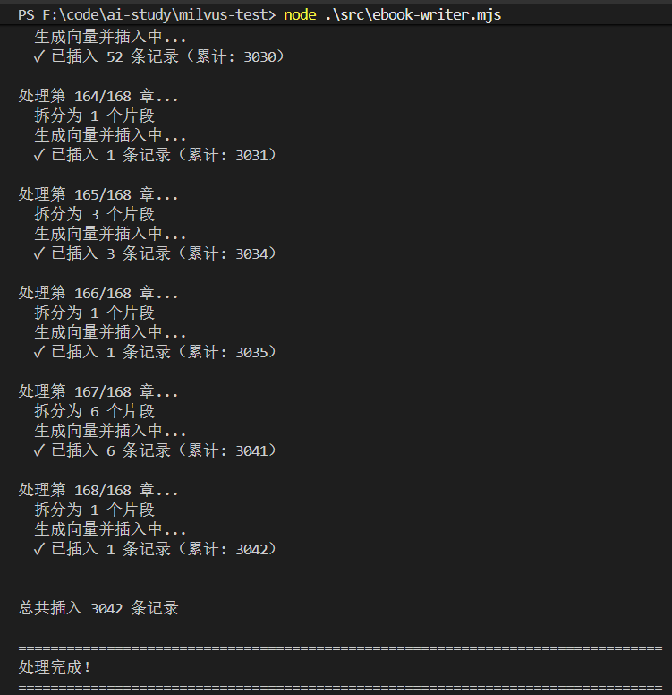
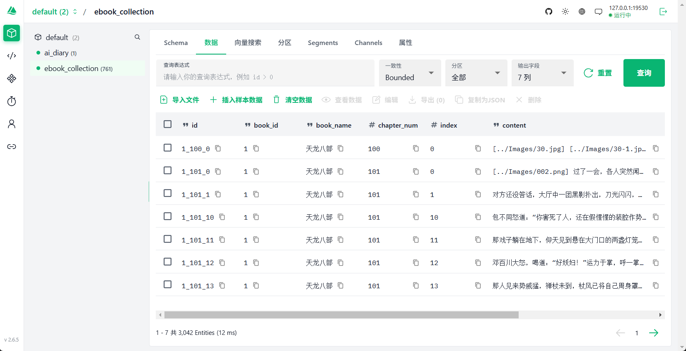
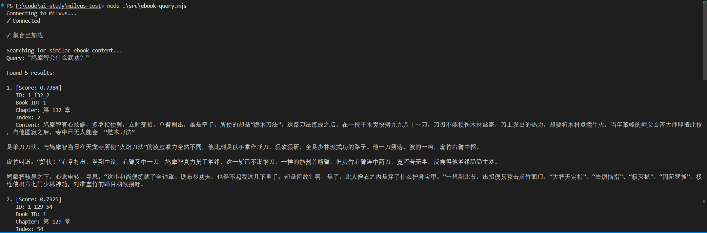
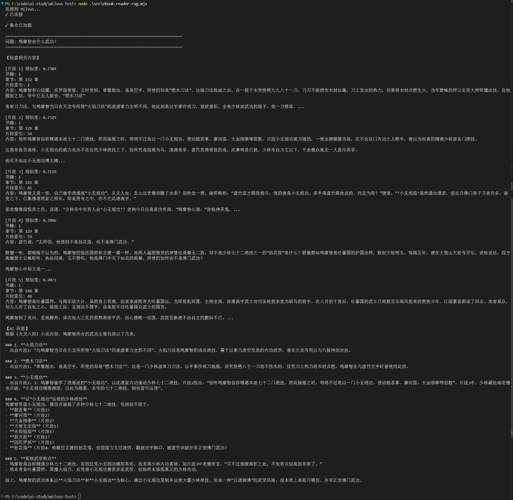

用 loader 从各种来源加载文档，用 splitter 分块，然后用嵌入模型向量化后存到向量数据库 Milvus

查询的时候，把 query 也用嵌入模型向量化，根据余弦相似度，匹配最相近的文档返回

来实现一个 .epub 格式的电子书的语义检索助手

对于书中你不知道关键词的查询方式,显然用mySQL就做不了

一般是使用RAG来做

### 写入数据

```js
import "dotenv/config";
import { parse, dirname, resolve } from 'path';
import { fileURLToPath } from 'url';
import { MilvusClient, DataType, MetricType, IndexType } from '@zilliz/milvus2-sdk-node';
import { OpenAIEmbeddings } from "@langchain/openai";
import { EPubLoader } from "@langchain/community/document_loaders/fs/epub";
import { RecursiveCharacterTextSplitter } from "@langchain/textsplitters";

// 取当前脚本所在目录
const __dirname = dirname(fileURLToPath(import.meta.url));

const COLLECTION_NAME = 'ebook_collection';
const VECTOR_DIM = 1024;
const CHUNK_SIZE = 500; // 拆分到 500 个字符
const EPUB_FILE = resolve(__dirname, '../天龙八部.epub');

// 从文件名提取书名（去掉扩展名）
const BOOK_NAME = parse(EPUB_FILE).name;

// 初始化 Embeddings 模型
const embeddings = new OpenAIEmbeddings({
  apiKey: process.env.EMBEDDINGS_OPENAI_API_KEY,
  model: process.env.EMBEDDINGS_MODEL_NAME,
  configuration: {
    baseURL: process.env.EMBEDDINGS_OPENAI_BASE_URL
  },
  dimensions: VECTOR_DIM
});

// 初始化 Milvus 客户端
const client = new MilvusClient({
  address: 'localhost:19530'
});

/**
 * 获取文本的向量嵌入
 */
async function getEmbedding(text) {
  // 文本转换成向量（embedding），以便存入 Milvus 做语义搜索
  const result = await embeddings.embedQuery(text);
  return result;
}

/**
 * 创建或获取集合
 */
async function ensureCollection(bookId) {
  try {
    // 检查集合是否存在
    const hasCollection = await client.hasCollection({
      collection_name: COLLECTION_NAME
    });

    if (!hasCollection.value) {
      console.log('创建集合...');
      await client.createCollection({
        collection_name: COLLECTION_NAME,
        fields: [
          { name: 'id', data_type: DataType.VarChar, max_length: 100, is_primary_key: true },
          { name: 'book_id', data_type: DataType.VarChar, max_length: 100 },
          { name: 'book_name', data_type: DataType.VarChar, max_length: 200 },
          { name: 'chapter_num', data_type: DataType.Int32 },
          { name: 'index', data_type: DataType.Int32 },
          { name: 'content', data_type: DataType.VarChar, max_length: 10000 },
          { name: 'vector', data_type: DataType.FloatVector, dim: VECTOR_DIM }
        ]
      });
      console.log('✓ 集合创建成功');

      // 创建索引
      console.log('创建索引...');
      await client.createIndex({
        collection_name: COLLECTION_NAME,
        field_name: 'vector',
        // 索引算法类型
        index_type: IndexType.IVF_FLAT,
        metric_type: MetricType.COSINE,
        params: { nlist: 1024 }
      });
      console.log('✓ 索引创建成功');
    } 
      
    // 确保集合已加载
    try {
      await client.loadCollection({ collection_name: COLLECTION_NAME });
      console.log('✓ 集合已加载');
    } catch (error) {
      console.log('✓ 集合已处于加载状态');
    }

  } catch (error) {
    console.error('创建集合时出错:', error.message);
    throw error;
  }
}

/**
 * 将文档块批量插入到 Milvus（流式处理）
 * 向量化和Milvus插入都是异步
 */
async function insertChunksBatch(chunks, bookId, chapterNum) {
  try {
    if (chunks.length === 0) {
      return 0;
    }

    // 为每个文档块生成向量并构建插入数据
    const insertData = await Promise.all(
      chunks.map(async (chunk, chunkIndex) => {
        const vector = await getEmbedding(chunk);
        // 手动生成 ID：book_id_chapterNum_index
        return {
          id: `${bookId}_${chapterNum}_${chunkIndex}`,
          book_id: bookId,
          book_name: BOOK_NAME,
          chapter_num: chapterNum,
          index: chunkIndex,
          content: chunk,
          vector: vector
        };
      })
    );

    // 批量插入到 Milvus
    const insertResult = await client.insert({
      collection_name: COLLECTION_NAME,
      data: insertData
    });

    // insert_cnt 是 Milvus 返回的插入计数，表示这次 insert 操作成功写入了多少条记录
    return Number(insertResult.insert_cnt) || 0;
  } catch (error) {
    console.error(`插入章节 ${chapterNum} 的数据时出错:`, error.message);
    console.error('错误详情:', error);
    throw error;
  }
}

/**
 * 加载 EPUB 文件并进行流式处理（边处理边插入）
 */
async function loadAndProcessEPubStreaming(bookId) {
  try {
    console.log(`\n开始加载 EPUB 文件: ${EPUB_FILE}`);
    
    // 使用 EPubLoader 加载文件，按章节拆分
    const loader = new EPubLoader(
      EPUB_FILE,
      {
        splitChapters: true,
      }
    );

    const documents = await loader.load();
    console.log(`✓ 加载完成，共 ${documents.length} 个章节\n`);

    // 创建文本拆分器，拆分到 500 个字符
    const textSplitter = new RecursiveCharacterTextSplitter({
      chunkSize: CHUNK_SIZE,
      chunkOverlap: 50, // 重叠 50 个字符，保持上下文连贯性
    });

    let totalInserted = 0;

    // 遍历每个章节，进行二次拆分并立即插入
    for (let chapterIndex = 0; chapterIndex < documents.length; chapterIndex++) {
      const chapter = documents[chapterIndex];
      const chapterContent = chapter.pageContent;
      
      console.log(`处理第 ${chapterIndex + 1}/${documents.length} 章...`);
      
      // 使用 splitter 进行二次拆分
      const chunks = await textSplitter.splitText(chapterContent);
      
      console.log(`  拆分为 ${chunks.length} 个片段`);
      
      if (chunks.length === 0) {
        console.log(`  跳过空章节\n`);
        continue;
      }

      console.log(`  生成向量并插入中...`);

      // 立即生成向量并插入该章节的所有片段
      const insertedCount = await insertChunksBatch(chunks, bookId, chapterIndex + 1);
      totalInserted += insertedCount;
      
      console.log(`  ✓ 已插入 ${insertedCount} 条记录（累计: ${totalInserted}）\n`);
    }

    console.log(`\n总共插入 ${totalInserted} 条记录\n`);
    return totalInserted;
  } catch (error) {
    console.error('加载 EPUB 文件时出错:', error.message);
    throw error;
  }
}

/**
 * 主函数
 */
async function main() {
  try {
    console.log('='.repeat(80));
    console.log('电子书处理程序');
    console.log('='.repeat(80));

    // 连接 Milvus
    console.log('\n连接 Milvus...');
    await client.connectPromise;
    console.log('✓ 已连接\n');

    // 设置 book_id（
    const bookId = 1;

    // 确保集合存在
    await ensureCollection(bookId);

    // 加载和处理 EPUB 文件（流式处理，边处理边插入）
    await loadAndProcessEPubStreaming(bookId);

    console.log('='.repeat(80));
    console.log('处理完成！');
    console.log('='.repeat(80));

  } catch (error) {
    console.error('\n错误:', error.message);
    console.error(error.stack);
    process.exit(1);
  }
}

main();
```

整体分为 3 步：  

- 连接 Milvus 

- 创建 ebook 的集合 

- 加载 epub 文件用 splitter 分块存入 Milvus

集合的schema: 包含 id、book_id、book_name、chapter_num（第几章）、index（第几个分块）、content（内容）、vector（向量）

book_id 这个是用来和 mysql 里 book 表关联的，这里暂时不用

最后要 loadCollection 把这个集合**加载到内存**才能做快速语义检索

> ### 为什么需要这一步？
>
> Milvus 的数据默认存在磁盘上，内存里没有。不加载的话，搜索/查询时无法访问数据。
>
> 执行 `loadCollection` 后：
>
> - Milvus 将 Collection 的**索引和数据读入内存**
> - 之后的所有搜索（`search`）和查询（`query`）请求才能正常执行
>
> ### 数据在哪里的三个阶段
>
> | 阶段                    | 数据状态                           | 能搜索吗？ |
> | ----------------------- | ---------------------------------- | ---------- |
> | 插入 (`insert`)         | 在内存缓冲区（mem buffer），未落盘 | ❌          |
> | 持久化 (`flush`)        | 写入磁盘                           | ❌          |
> | 加载 (`loadCollection`) | 从磁盘读到内存                     | ✅          |

然后是 loader 加载 epub 的文件，并 splitter 分块

这里使用了 EPubLoader

```js
// 使用 EPubLoader 加载文件，按章节拆分
    const loader = new EPubLoader(
      EPUB_FILE,
      {
        splitChapters: true,
      }
    );
```

虽然已经按照章节进行拆分, 但每一章内容还是太多了, 再用 RecursiveCharacterTextSplitter 对每章内容以每 500 个字符分下块

```js
// 创建文本拆分器，拆分到 500 个字符
    const textSplitter = new RecursiveCharacterTextSplitter({
      chunkSize: CHUNK_SIZE,
      chunkOverlap: 50, // 重叠 50 个字符，保持上下文连贯性
    });
```

安装依赖

```shell
pnpm install @langchain/community epub2 html-to-text @langchain/textsplitters
```

运行后，成功写入数据





### 查询数据

```js
import "dotenv/config";
import { parse, dirname, resolve } from 'path';
import { fileURLToPath } from 'url';
import { MilvusClient, DataType, MetricType, IndexType } from '@zilliz/milvus2-sdk-node';
import { OpenAIEmbeddings } from "@langchain/openai";
import { EPubLoader } from "@langchain/community/document_loaders/fs/epub";
import { RecursiveCharacterTextSplitter } from "@langchain/textsplitters";

// 取当前脚本所在目录
const __dirname = dirname(fileURLToPath(import.meta.url));

const COLLECTION_NAME = 'ebook_collection';
const VECTOR_DIM = 1024;
const CHUNK_SIZE = 500; // 拆分到 500 个字符
const EPUB_FILE = resolve(__dirname, '../天龙八部.epub');

// 从文件名提取书名（去掉扩展名）
const BOOK_NAME = parse(EPUB_FILE).name;

// 初始化 Embeddings 模型
const embeddings = new OpenAIEmbeddings({
  apiKey: process.env.EMBEDDINGS_OPENAI_API_KEY,
  model: process.env.EMBEDDINGS_MODEL_NAME,
  configuration: {
    baseURL: process.env.EMBEDDINGS_OPENAI_BASE_URL
  },
  dimensions: VECTOR_DIM
});

// 初始化 Milvus 客户端
const client = new MilvusClient({
  address: 'localhost:19530'
});

/**
 * 获取文本的向量嵌入
 */
async function getEmbedding(text) {
  // 文本转换成向量（embedding），以便存入 Milvus 做语义搜索
  const result = await embeddings.embedQuery(text);
  return result;
}

/**
 * 创建或获取集合
 */
async function ensureCollection(bookId) {
  try {
    // 检查集合是否存在
    const hasCollection = await client.hasCollection({
      collection_name: COLLECTION_NAME
    });

    if (!hasCollection.value) {
      console.log('创建集合...');
      await client.createCollection({
        collection_name: COLLECTION_NAME,
        fields: [
          { name: 'id', data_type: DataType.VarChar, max_length: 100, is_primary_key: true },
          { name: 'book_id', data_type: DataType.VarChar, max_length: 100 },
          { name: 'book_name', data_type: DataType.VarChar, max_length: 200 },
          { name: 'chapter_num', data_type: DataType.Int32 },
          { name: 'index', data_type: DataType.Int32 },
          { name: 'content', data_type: DataType.VarChar, max_length: 10000 },
          { name: 'vector', data_type: DataType.FloatVector, dim: VECTOR_DIM }
        ]
      });
      console.log('✓ 集合创建成功');

      // 创建索引
      console.log('创建索引...');
      await client.createIndex({
        collection_name: COLLECTION_NAME,
        field_name: 'vector',
        // 索引算法类型
        index_type: IndexType.IVF_FLAT,
        metric_type: MetricType.COSINE,
        params: { nlist: 1024 }
      });
      console.log('✓ 索引创建成功');
    } 

    // 确保集合已加载
    try {
      await client.loadCollection({ collection_name: COLLECTION_NAME });
      console.log('✓ 集合已加载');
    } catch (error) {
      console.log('✓ 集合已处于加载状态');
    }

  } catch (error) {
    console.error('创建集合时出错:', error.message);
    throw error;
  }
}

/**
 * 将文档块批量插入到 Milvus（流式处理）
 * 向量化和Milvus插入都是异步
 */
async function insertChunksBatch(chunks, bookId, chapterNum) {
  try {
    if (chunks.length === 0) {
      return 0;
    }

    // 为每个文档块生成向量并构建插入数据
    const insertData = await Promise.all(
      chunks.map(async (chunk, chunkIndex) => {
        const vector = await getEmbedding(chunk);
        // 手动生成 ID：book_id_chapterNum_index
        return {
          id: `${bookId}_${chapterNum}_${chunkIndex}`,
          book_id: bookId,
          book_name: BOOK_NAME,
          chapter_num: chapterNum,
          index: chunkIndex,
          content: chunk,
          vector: vector
        };
      })
    );

    // 批量插入到 Milvus
    const insertResult = await client.insert({
      collection_name: COLLECTION_NAME,
      data: insertData
    });

    // insert_cnt 是 Milvus 返回的插入计数，表示这次 insert 操作成功写入了多少条记录
    return Number(insertResult.insert_cnt) || 0;
  } catch (error) {
    console.error(`插入章节 ${chapterNum} 的数据时出错:`, error.message);
    console.error('错误详情:', error);
    throw error;
  }
}

/**
 * 加载 EPUB 文件并进行流式处理（边处理边插入）
 */
async function loadAndProcessEPubStreaming(bookId) {
  try {
    console.log(`\n开始加载 EPUB 文件: ${EPUB_FILE}`);

    // 使用 EPubLoader 加载文件，按章节拆分
    const loader = new EPubLoader(
      EPUB_FILE,
      {
        splitChapters: true,
      }
    );

    const documents = await loader.load();
    console.log(`✓ 加载完成，共 ${documents.length} 个章节\n`);

    // 创建文本拆分器，拆分到 500 个字符
    const textSplitter = new RecursiveCharacterTextSplitter({
      chunkSize: CHUNK_SIZE,
      chunkOverlap: 50, // 重叠 50 个字符，保持上下文连贯性
    });

    let totalInserted = 0;

    // 遍历每个章节，进行二次拆分并立即插入
    for (let chapterIndex = 0; chapterIndex < documents.length; chapterIndex++) {
      const chapter = documents[chapterIndex];
      const chapterContent = chapter.pageContent;

      console.log(`处理第 ${chapterIndex + 1}/${documents.length} 章...`);

      // 使用 splitter 进行二次拆分
      const chunks = await textSplitter.splitText(chapterContent);

      console.log(`  拆分为 ${chunks.length} 个片段`);

      if (chunks.length === 0) {
        console.log(`  跳过空章节\n`);
        continue;
      }

      console.log(`  生成向量并插入中...`);

      // 立即生成向量并插入该章节的所有片段
      const insertedCount = await insertChunksBatch(chunks, bookId, chapterIndex + 1);
      totalInserted += insertedCount;

      console.log(`  ✓ 已插入 ${insertedCount} 条记录（累计: ${totalInserted}）\n`);
    }

    console.log(`\n总共插入 ${totalInserted} 条记录\n`);
    return totalInserted;
  } catch (error) {
    console.error('加载 EPUB 文件时出错:', error.message);
    throw error;
  }
}

/**
 * 主函数
 */
async function main() {
  try {
    console.log('='.repeat(80));
    console.log('电子书处理程序');
    console.log('='.repeat(80));

    // 连接 Milvus
    console.log('\n连接 Milvus...');
    await client.connectPromise;
    console.log('✓ 已连接\n');

    // 设置 book_id（
    const bookId = 1;

    // 确保集合存在
    await ensureCollection(bookId);

    // 加载和处理 EPUB 文件（流式处理，边处理边插入）
    await loadAndProcessEPubStreaming(bookId);

    console.log('='.repeat(80));
    console.log('处理完成！');
    console.log('='.repeat(80));

  } catch (error) {
    console.error('\n错误:', error.message);
    console.error(error.stack);
    process.exit(1);
  }
}

main();
```

把 query 用嵌入模型向量化，然后用余弦相似度做下匹配

```js
// 向量搜索
console.log("Searching for similar ebook content...");
const query = "鸠摩智会什么武功？";
console.log(`Query: "${query}"\n`);

const queryVector = await getEmbedding(query);
const searchResult = await client.search({
  collection_name: COLLECTION_NAME,
  vector: queryVector,
  limit: 5,
  metric_type: MetricType.COSINE,
  output_fields: ["id", "book_id", "chapter_num", "index", "content"],
});
```

运行：



可以看到，根据语义匹配出了一些相关文档

当然，给一堆文档还不够，你得让大模型去理解文档，生成最终的回答

### 完整RAG流程

```js
import "dotenv/config";
import { MilvusClient, MetricType } from "@zilliz/milvus2-sdk-node";
import { ChatOpenAI, OpenAIEmbeddings } from "@langchain/openai";

const COLLECTION_NAME = "ebook_collection";
const VECTOR_DIM = 1024;

// 初始化 OpenAI Chat 模型
const model = new ChatOpenAI({
  temperature: 0.7,
  model: process.env.MODEL_NAME,
  apiKey: process.env.OPENAI_API_KEY,
  configuration: {
    baseURL: process.env.OPENAI_BASE_URL,
  },
});

// 初始化 Embeddings 模型
const embeddings = new OpenAIEmbeddings({
  apiKey: process.env.OPENAI_API_KEY,
  model: process.env.EMBEDDINGS_MODEL_NAME,
  configuration: {
    baseURL: process.env.OPENAI_BASE_URL,
  },
  dimensions: VECTOR_DIM,
});

// 初始化 Milvus 客户端
const client = new MilvusClient({
  address: "localhost:19530",
});

/**
 * 获取文本的向量嵌入
 */
async function getEmbedding(text) {
  const result = await embeddings.embedQuery(text);
  return result;
}

/**
 * 从 Milvus 中检索相关的电子书内容
 */
async function retrieveRelevantContent(question, k = 3) {
  try {
    // 生成问题的向量
    const queryVector = await getEmbedding(question);

    // 在 Milvus 中搜索相似的内容
    const searchResult = await client.search({
      collection_name: COLLECTION_NAME,
      vector: queryVector,
      limit: k,
      metric_type: MetricType.COSINE,
      output_fields: ["id", "book_id", "chapter_num", "index", "content"],
    });

    return searchResult.results;
  } catch (error) {
    console.error("检索内容时出错:", error.message);
    return [];
  }
}

/**
 * 使用 RAG 回答关于《天龙八部》的问题
 */
async function answerEbookQuestion(question, k = 3) {
  try {
    console.log("=".repeat(80));
    console.log(`问题: ${question}`);
    console.log("=".repeat(80));

    // 1. 检索相关内容
    console.log("\n【检索相关内容】");
    const retrievedContent = await retrieveRelevantContent(question, k);

    if (retrievedContent.length === 0) {
      console.log("未找到相关内容");
      return "抱歉，我没有找到相关的《天龙八部》内容。";
    }

    // 2. 打印检索到的内容及相似度
    retrievedContent.forEach((item, i) => {
      console.log(`\n[片段 ${i + 1}] 相似度: ${item.score.toFixed(4)}`);
      console.log(`书籍: ${item.book_id}`);
      console.log(`章节: 第 ${item.chapter_num} 章`);
      console.log(`片段索引: ${item.index}`);
      console.log(
        `内容: ${item.content.substring(0, 200)}${item.content.length > 200 ? "..." : ""}`,
      );
    });

    // 3. 构建上下文
    const context = retrievedContent
      .map((item, i) => {
        return `[片段 ${i + 1}]
章节: 第 ${item.chapter_num} 章
内容: ${item.content}`;
      })
      .join("\n\n━━━━━\n\n");

    // 4. 构建 prompt
    const prompt = `你是一个专业的《天龙八部》小说助手。基于小说内容回答问题，用准确、详细的语言。

请根据以下《天龙八部》小说片段内容回答问题：
${context}

用户问题: ${question}

回答要求：
1. 如果片段中有相关信息，请结合小说内容给出详细、准确的回答
2. 可以综合多个片段的内容，提供完整的答案
3. 如果片段中没有相关信息，请如实告知用户
4. 回答要准确，符合小说的情节和人物设定
5. 可以引用原文内容来支持你的回答

AI 助手的回答:`;

    // 5. 调用 LLM 生成回答
    console.log("\n【AI 回答】");
    const response = await model.invoke(prompt);
    console.log(response.content);
    console.log("\n");

    return response.content;
  } catch (error) {
    console.error("回答问题时出错:", error.message);
    return "抱歉，处理您的问题时出现了错误。";
  }
}

async function main() {
  try {
    console.log("连接到 Milvus...");
    await client.connectPromise;
    console.log("✓ 已连接\n");

    // 确保集合已加载
    try {
      await client.loadCollection({ collection_name: COLLECTION_NAME });
      console.log("✓ 集合已加载\n");
    } catch (error) {
      // 如果已经加载，会报错，忽略即可
      if (!error.message.includes("already loaded")) {
        throw error;
      }
      console.log("✓ 集合已处于加载状态\n");
    }

    // 问一个关于《天龙八部》的问题
    await answerEbookQuestion("鸠摩智会什么武功？", 5);
  } catch (error) {
    console.error("错误:", error.message);
  }
}

main();
```

根据 query 查询出文档后，放到 prompt 里

```js
/**
 * 使用 RAG 回答关于《天龙八部》的问题
 */
async function answerEbookQuestion(question, k = 3) {
  try {
    console.log("=".repeat(80));
    console.log(`问题: ${question}`);
    console.log("=".repeat(80));

    // 1. 检索相关内容
    console.log("\n【检索相关内容】");
    const retrievedContent = await retrieveRelevantContent(question, k);

    if (retrievedContent.length === 0) {
      console.log("未找到相关内容");
      return "抱歉，我没有找到相关的《天龙八部》内容。";
    }

    // 2. 打印检索到的内容及相似度
    retrievedContent.forEach((item, i) => {
      console.log(`\n[片段 ${i + 1}] 相似度: ${item.score.toFixed(4)}`);
      console.log(`书籍: ${item.book_id}`);
      console.log(`章节: 第 ${item.chapter_num} 章`);
      console.log(`片段索引: ${item.index}`);
      console.log(
        `内容: ${item.content.substring(0, 200)}${item.content.length > 200 ? "..." : ""}`,
      );
    });

    // 3. 构建上下文
    const context = retrievedContent
      .map((item, i) => {
        return `[片段 ${i + 1}]
章节: 第 ${item.chapter_num} 章
内容: ${item.content}`;
      })
      .join("\n\n━━━━━\n\n");

    // 4. 构建 prompt
    const prompt = `你是一个专业的《天龙八部》小说助手。基于小说内容回答问题，用准确、详细的语言。

请根据以下《天龙八部》小说片段内容回答问题：
${context}

用户问题: ${question}

回答要求：
1. 如果片段中有相关信息，请结合小说内容给出详细、准确的回答
2. 可以综合多个片段的内容，提供完整的答案
3. 如果片段中没有相关信息，请如实告知用户
4. 回答要准确，符合小说的情节和人物设定
5. 可以引用原文内容来支持你的回答

AI 助手的回答:`;

    // 5. 调用 LLM 生成回答
    console.log("\n【AI 回答】");
    const response = await model.invoke(prompt);
    console.log(response.content);
    console.log("\n");

    return response.content;
  } catch (error) {
    console.error("回答问题时出错:", error.message);
    return "抱歉，处理您的问题时出现了错误。";
  }
}
```

运行结果：



电子书语义检索助手就完成了，可以把电子书换成公司内部的文档，实现文档检索，流程一样

### 总结

把 loader、splitter、Milvus 向量数据库串了起来，做了一个电子书语义检索助手的小实战

企业级的RAG也是这个流程，只不过 Milvus 存的内容不同

而且语义检索出 Milvus 相关记录后，返回了 book_id，这个是对应 MySQL 里 book 表的 id

之后就可以顺带着关联查出 book 表和相关表的数据

也就是MySQL 和 Milvus 的联动

### 补充 - 索引

这是在 Milvus 中为 `vector` 字段创建的**向量索引**（Vector Index），用于加速向量相似度搜索。

**各参数含义**

| 参数          | 值         | 含义                         |
| ------------- | ---------- | ---------------------------- |
| `field_name`  | `'vector'` | 为哪个字段建索引             |
| `index_type`  | `IVF_FLAT` | 索引算法类型                 |
| `metric_type` | `COSINE`   | 相似度度量方式（余弦相似度） |
| `nlist`       | `1024`     | 聚类中心数量                 |

**为什么需要索引？**

想象一个 100 万条数据的电子书向量库。不做索引的话，每次搜索都要把查询向量和**所有** 100 万条数据逐一计算距离——这叫**暴力搜索（FLAT）**，精确但极慢。

建了索引后，Milvus 会：

1. **训练阶段**：用 k-means 将所有向量聚成 1024 个簇（`nlist=1024`）
2. **搜索阶段**：查询向量只需要和最近的几个簇中心比，再在命中的簇内精确搜索

搜索量从 100 万 → 可能只需比对几千条，**速度提升数百倍**。

**IVF_FLAT 的取舍**

- **IVF**（Inverted File）：倒排索引，先粗筛再精排
- **FLAT**：命中簇后对簇内向量做精确距离计算（不压缩）

这是最基础的加速索引，精度高但内存占用也大。如果数据量更大，可以换成 `IVF_SQ8`（压缩）或 `HNSW`（图索引，更快但内存更大）。

**一句话总结**

> **索引 = 空间换时间**。提前将数据按相似度"分桶"，搜索时只查最近的几个桶，避免全量扫描。
