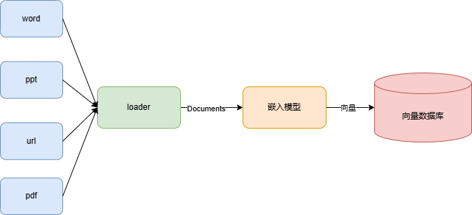
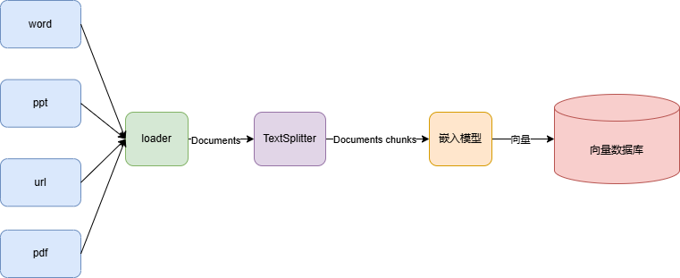
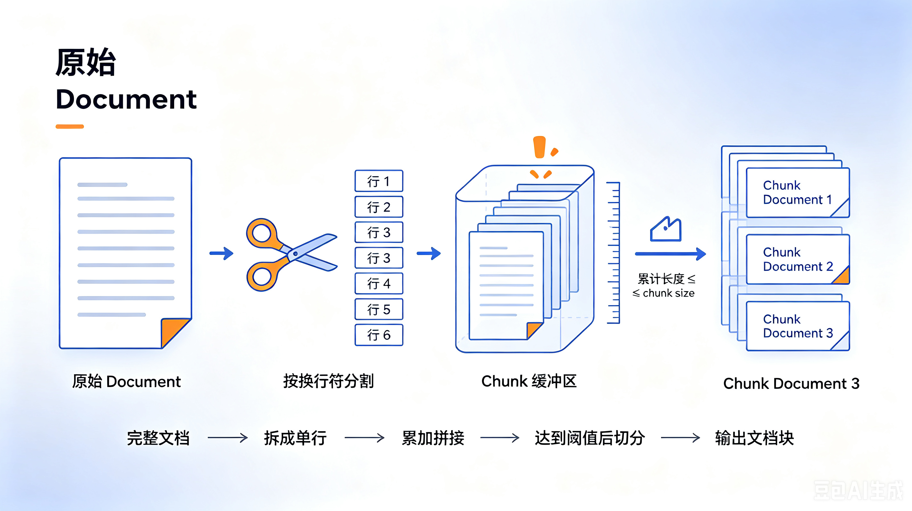
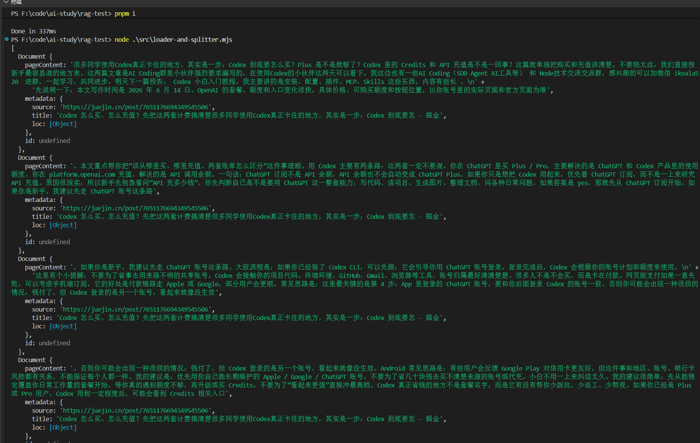
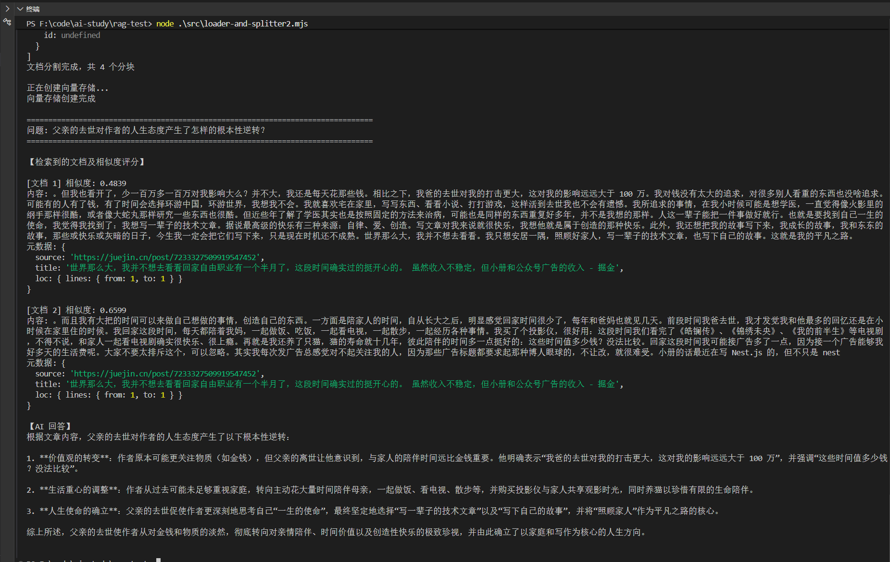

## 概述

Loader（文档加载器）和 Splitter（文本分割器）是构建 RAG 知识库的两个基础组件。Loader 负责将各种来源的数据统一转换为 Document 对象，Splitter 负责将过大的文档切分为适合向量检索的 Chunk。本文介绍两者的基本概念、用法，以及处理 PDF、Word、Excel、TXT 等常见文件格式的 Loader 选型与实践案例。

## 什么是 Loader

之前对于知识的处理是直接创建的 Document 对象，然后用嵌入模型存入了向量数据库

但是实际上的知识来源有很多，这时候就需要用各种 loader 来转换



这里参考  [langchain 的 loader](https://docs.langchain.com/oss/python/integrations/document_loaders#common-file-types)

## 什么是 Splitter

对于一些大文件，比如一个 pdf 就是一本书的大小

这种很明显不能直接把转化后的 Document 向量化，需要先拆分文档

也就是需要 Splitter

> Splitter是用于将长文档分割成合适大小文本块的工具，在知识库构建中解决大文件向量化效率低的问题。它通过递归式分隔符（如段落、换行、空格）将文档切分为语义独立的Chunk，每个Chunk包含500-1000字符并保留重叠区域以保持上下文连贯。 
>
> LangChain推荐使用RecursiveCharacterTextSplitter，它会优先按段落拆分，若超过设定长度（如800字符）再逐级缩小粒度，避免硬切分导致的语义破碎。常见配置中，技术文档建议800字符/100重叠，FAQ可缩短至300字符



但并不是每一行一个 Document，而是要设置一个 chunk size，按照换行符分割好的内容加入到这个 Chunk，当达到 chunk size 后，再继续生成下个 Chunk。

这个 Chunk 也是 Document 对象，只是文档内容是分割好的一个个大小合适的块



## Loader + Splitter 基础示例

```js
// loader-and-splitter.mjs
import "dotenv/config";
import "cheerio";
import { CheerioWebBaseLoader } from "@langchain/community/document_loaders/web/cheerio";
import { RecursiveCharacterTextSplitter } from "@langchain/textsplitters";

const cheerioLoader = new CheerioWebBaseLoader(
  "https://juejin.cn/post/7651176694349545506",
  {
    selector: '.main-area p'
  }
);

const documents = await cheerioLoader.load();

const textSplitter = new RecursiveCharacterTextSplitter({
    chunkSize: 400,  // 每个分块的字符数
    chunkOverlap: 50,  // 分块之间的重叠字符数
    separators: ["。","！","？"],  // 分割符，优先使用段落分隔
});

const splitDocuments = await textSplitter.splitDocuments(documents);

// console.log(documents);
console.log(splitDocuments);
```

运行下：



可以看到，文档被分成了 4 个小的文档。 

每个文档是都是 400 字符左右，前后重复了 50 个字符。 

这样分割好的文档用来做 RAG 性能显然会更好，不需要加载整个大文档。

## 完整 RAG 流程示例

将文档分割的逻辑放到完整的RAG流程当中去：

```js
import "dotenv/config";
// import "cheerio";
import { ChatOpenAI, OpenAIEmbeddings } from "@langchain/openai";
import { RecursiveCharacterTextSplitter } from "@langchain/textsplitters";
import { MemoryVectorStore } from "@langchain/classic/vectorstores/memory";
import { CheerioWebBaseLoader } from "@langchain/community/document_loaders/web/cheerio";

// 这个 import "cheerio" 的作用不是代码层面的，而是 ESM 的依赖声明。
// 在 ESM（.mjs 文件）中，Node.js 需要在静态分析阶段就确定所有依赖包的存在性。
// CheerioWebBaseLoader 虽然是 @langchain/community 提供的，但 cheerio 是 @langchain/community 的 peer 依赖（对等依赖），
// 不会自动安装到你的 node_modules 里。所以如果没有任何 import 声明 cheerio，Node 在 ESM 解析阶段就会报错找不到这个包。

// @langchain/openai	ChatOpenAI 模型、OpenAIEmbeddings 嵌入
// @langchain/classic	MemoryVectorStore 向量存储
// @langchain/community	CheerioWebBaseLoader 网页加载器
// @langchain/textsplitters	RecursiveCharacterTextSplitter 文本分割

const model = new ChatOpenAI({
  temperature: 0,
  model: process.env.MODEL_NAME,
  apiKey: process.env.OPENAI_API_KEY,
  configuration: {
    baseURL: process.env.OPENAI_BASE_URL,
  },
});

const embeddings = new OpenAIEmbeddings({
  apiKey: process.env.EMBEDDINGS_OPENAI_API_KEY,
  model: process.env.EMBEDDINGS_MODEL_NAME,
  configuration: {
    baseURL: process.env.EMBEDDINGS_OPENAI_BASE_URL,
  },
});

const cheerioLoader = new CheerioWebBaseLoader(
  "https://juejin.cn/post/7233327509919547452",
  {
    selector: ".main-area p",
  },
);

const documents = await cheerioLoader.load();

console.assert(documents.length === 1);
console.log(`Total characters: ${documents[0].pageContent.length}`);

const textSplitter = new RecursiveCharacterTextSplitter({
  chunkSize: 500, // 每个分块的字符数
  chunkOverlap: 50, // 分块之间的重叠字符数
  separators: ["。", "！", "？"], // 分割符，优先使用段落分隔
});

const splitDocuments = await textSplitter.splitDocuments(documents);

console.log(splitDocuments);

console.log(`文档分割完成，共 ${splitDocuments.length} 个分块\n`);

console.log("正在创建向量存储...");
const vectorStore = await MemoryVectorStore.fromDocuments(
  splitDocuments,
  embeddings,
);
console.log("向量存储创建完成\n");

const retriever = vectorStore.asRetriever({ k: 2 });

const questions = ["父亲的去世对作者的人生态度产生了怎样的根本性逆转？"];

// RAG 流程：对每个问题进行检索和回答
for (const question of questions) {
  console.log("=".repeat(80));
  console.log(`问题: ${question}`);
  console.log("=".repeat(80));

  // 使用 similaritySearchWithScore 获取文档和相似度评分（一次调用即可）
  const scoredResults = await vectorStore.similaritySearchWithScore(
    question,
    2,
  );

  // 从 scoredResults 中提取文档和评分
  const retrievedDocs = scoredResults.map(([doc]) => doc);

  // 打印检索到的文档和相似度评分
  console.log("\n【检索到的文档及相似度评分】");
  scoredResults.forEach(([doc, score], i) => {
    const similarity = (1 - score).toFixed(4);

    console.log(`\n[文档 ${i + 1}] 相似度: ${similarity}`);
    console.log(`内容: ${doc.pageContent}`);
    if (doc.metadata && Object.keys(doc.metadata).length > 0) {
      console.log(`元数据:`, doc.metadata);
    }
  });

  // 构建 prompt
  const context = retrievedDocs
    .map((doc, i) => `[片段${i + 1}]\n${doc.pageContent}`)
    .join("\n\n━━━━━\n\n");

  const prompt = `你是一个文章辅助阅读助手，根据文章内容来解答：

文章内容：
${context}

问题: ${question}

你的回答:`;

  console.log("\n【AI 回答】");
  const response = await model.invoke(prompt);
  console.log(response.content);
  console.log("\n");
}
```



## 常见文件格式的 Loader

日常构建知识库时，最常见的数据来源是本地文件：PDF 文档、Word 报告、Excel 表格、TXT 文本等。LangChain 为每种格式都提供了专用的 Loader，下面逐一介绍。

### PDF 文件

PDF 是最常见的企业文档格式。在 Node.js 环境下，LangChain 提供了 `PDFLoader`，底层基于 `pdf-parse` 库。

```js
// pdf-loader.mjs
import { PDFLoader } from "@langchain/community/document_loaders/fs/pdf";

const loader = new PDFLoader("./docs/年度报告.pdf");

const docs = await loader.load();
console.log(`PDF 解析完成，共 ${docs.length} 页`);

// 查看第一页内容
console.log(docs[0].pageContent.slice(0, 200));
```

PDF 的每一页会被解析为一个独立的 Document，`metadata` 中包含 `{ pdf: { info: {...} }, page: 1 }` 等信息。

> **注意：** PDF 解析质量取决于原始文档。扫描版 PDF（图片型）需要先用 OCR 工具提取文字，`PDFLoader` 无法直接处理。

### Word 文件

对于 `.docx` 格式的 Word 文档，使用 `DocxLoader`，底层基于 `mammoth` 库将 docx 转为文本。

```js
// docx-loader.mjs
import { DocxLoader } from "@langchain/community/document_loaders/fs/docx";

const loader = new DocxLoader("./docs/项目方案.docx");

const docs = await loader.load();
console.log(`Word 解析完成，文档内容长度: ${docs[0].pageContent.length} 字符`);
```

> **注意：** `DocxLoader` 仅支持 `.docx`（Office 2007+），不支持旧版 `.doc` 格式。如需处理 `.doc`，可先用 Word 或 LibreOffice 另存为 `.docx`。

### Excel 文件

Excel 表格文件使用 `CSVLoader`（也支持 `.csv`）或 `UnstructuredExcelLoader`。在 Node.js 环境下推荐用 CSV 作为中间格式（Excel → 另存为 CSV → 加载）：

```js
// csv-loader.mjs
import { CSVLoader } from "@langchain/community/document_loaders/fs/csv";

const loader = new CSVLoader("./docs/用户数据.csv", {
  column: "备注",  // 指定要加载的列（可选，不指定则加载所有列）
});

const docs = await loader.load();
console.log(`CSV 解析完成，共 ${docs.length} 行数据`);

// CSV 的每一行成为一个独立的 Document
// metadata 中包含 { source, line: 1 } 等信息
```

如果指定了 `column`，只会加载该列的内容作为 `pageContent`；不指定则将所有列拼接为一行文本。

> **注意：** 如需直接处理 `.xlsx`，可使用 `UnstructuredLoader` 或先在 Python 侧用 `UnstructuredExcelLoader` 处理。Node.js 端的原生 Excel 解析器尚不成熟。

### TXT 文件

纯文本文件使用 `TextLoader`，最简单直接：

```js
// txt-loader.mjs
import { TextLoader } from "@langchain/community/document_loaders/fs/text";

const loader = new TextLoader("./docs/会议纪要.txt");

const docs = await loader.load();
console.log(`TXT 加载完成，内容长度: ${docs[0].pageContent.length} 字符`);
```

### 综合示例：多格式文件批量加载

实际项目中通常需要处理一个混合格式的文档目录，可以这样写一个通用的加载函数：

```js
// batch-loader.mjs
import "dotenv/config";
import { PDFLoader } from "@langchain/community/document_loaders/fs/pdf";
import { DocxLoader } from "@langchain/community/document_loaders/fs/docx";
import { CSVLoader } from "@langchain/community/document_loaders/fs/csv";
import { TextLoader } from "@langchain/community/document_loaders/fs/text";
import { RecursiveCharacterTextSplitter } from "@langchain/textsplitters";
import path from "path";

// 根据文件扩展名选择对应的 Loader
function getLoader(filePath) {
  const ext = path.extname(filePath).toLowerCase();
  switch (ext) {
    case ".pdf":
      return new PDFLoader(filePath);
    case ".docx":
      return new DocxLoader(filePath);
    case ".csv":
      return new CSVLoader(filePath);
    case ".txt":
    case ".md":
      return new TextLoader(filePath);
    default:
      throw new Error(`不支持的文件格式: ${ext}`);
  }
}

// 批量加载文档目录中的所有文件
async function loadAllDocuments(filePaths) {
  const allDocs = [];

  for (const filePath of filePaths) {
    console.log(`正在加载: ${filePath}`);
    const loader = getLoader(filePath);
    const docs = await loader.load();
    console.log(`  → 解析出 ${docs.length} 个 Document`);
    allDocs.push(...docs);
  }

  return allDocs;
}

// 使用示例
const files = [
  "./docs/年度报告.pdf",
  "./docs/项目方案.docx",
  "./docs/用户数据.csv",
  "./docs/会议纪要.txt",
];

const documents = await loadAllDocuments(files);
console.log(`\n总共加载 ${documents.length} 个 Document`);

// 统一用 Splitter 分割
const textSplitter = new RecursiveCharacterTextSplitter({
  chunkSize: 500,
  chunkOverlap: 50,
  separators: ["\n\n", "\n", "。", "！", "？", " ", ""],
});

const splitDocs = await textSplitter.splitDocuments(documents);
console.log(`分割后共 ${splitDocs.length} 个 Chunk`);
```

### Loader 选型速查表

| 文件格式       | Loader                 | npm 包                               | 说明                      |
| -------------- | ---------------------- | ------------------------------------ | ------------------------- |
| PDF            | `PDFLoader`            | `@langchain/community` + `pdf-parse` | 每页一个 Document         |
| Word (.docx)   | `DocxLoader`           | `@langchain/community` + `mammoth`   | 整个文档一个 Document     |
| Excel / CSV    | `CSVLoader`            | `@langchain/community`               | 每行一个 Document         |
| TXT / Markdown | `TextLoader`           | `@langchain/community`               | 整个文件一个 Document     |
| 网页           | `CheerioWebBaseLoader` | `@langchain/community` + `cheerio`   | CSS 选择器指定区域        |
| JSON           | `JSONLoader`           | `@langchain/community`               | JSON Pointer 指定提取路径 |

## 总结

本文系统地梳理了知识库构建中的两个核心环节：**Loader**（文档加载）和 **Splitter**（文本分割）。

**Loader** 解决的是"数据从哪来"的问题。现实中的知识分散在不同载体上——网页、PDF、Word、Excel、TXT、JSON……Loader 的作用就是将这些异构数据统一转换为 LangChain 的 `Document` 对象，屏蔽底层格式差异。选型上：

- 爬取网页内容用 `CheerioWebBaseLoader`，配合 CSS 选择器精确提取目标区域
- 处理本地文档优先用对应的专用 Loader：`PDFLoader`、`DocxLoader`、`CSVLoader`、`TextLoader`
- 可以通过扩展名判断来自动路由到对应的 Loader，实现批量混合格式加载

**Splitter** 解决的是"文档太大怎么办"的问题。直接将一整本书或长篇报告作为单个 Document 送入向量数据库，检索精度和效率都会急剧下降。`RecursiveCharacterTextSplitter` 通过递归式分隔符策略（段落 → 换行 → 句号 → 空格），将长文档切分为合适大小的 Chunk，同时保留重叠区域来维持上下文连贯性。关键参数：

- **chunkSize**：每个 Chunk 的目标字符数，技术文档建议 500-800，FAQ 可更短
- **chunkOverlap**：Chunk 之间的重叠字符数，建议 50-100，保证关键信息不因切分丢失
- **separators**：分隔符优先级数组，按从大到小的语义粒度排列

完整的 RAG 知识库构建流程可以概括为：**多源文件 → Loader 加载 → Splitter 分割 → Embeddings 向量化 → VectorStore 存储 → Retriever 检索 → LLM 生成回答**。其中的 Loader 和 Splitter 是数据预处理的基石——**Loader 决定了你能吃进什么类型的数据，Splitter 决定了你检索时能捞出多精准的片段**。两者配置得当，后续的向量检索和生成回答才能有好的效果。