之前写prompt都是在字符串中拼接

那这些零散的prompt如何管理呢

通过 Prompt Template 的 api 来动态的管理

### Prompt Template

```js
import "dotenv/config";
import { ChatOpenAI } from "@langchain/openai";
import { PromptTemplate } from "@langchain/core/prompts";

// 初始化模型
const model = new ChatOpenAI({
  modelName: process.env.MODEL_NAME,
  apiKey: process.env.OPENAI_API_KEY,
  temperature: 0,
  configuration: {
    baseURL: process.env.OPENAI_BASE_URL,
  },
});

const naiveTemplate = PromptTemplate.fromTemplate(`
你是一名严谨但不失人情味的工程团队负责人，需要根据本周数据写一份周报。

公司名称：{company_name}
部门名称：{team_name}
直接汇报对象：{manager_name}
本周时间范围：{week_range}

本周团队核心目标：
{team_goal}

本周开发数据（Git 提交 / Jira 任务）：
{dev_activities}

请根据以上信息生成一份【Markdown 周报】，要求：
- 有简短的整体 summary（两三句话）
- 有按模块/项目拆分的小结
- 用一个 Markdown 表格列出关键指标（字段示例：模块 / 亮点 / 风险 / 下周计划）
- 语气专业但有一点人情味，适合作为给老板和团队抄送的周报。
`);

const prompt = await naiveTemplate.format({
  company_name: "星航科技",
  team_name: "数据智能平台组",
  manager_name: "刘总",
  week_range: "2025-03-10 ~ 2025-03-16",
  team_goal: "完成用户画像服务的灰度上线，并验证核心指标是否达标。",
  dev_activities:
    "- 阿兵：完成用户画像服务的 Canary 发布与回滚脚本优化，提交 27 次，相关任务：DATA-321 / DATA-335\n" +
    "- 小李：接入埋点数据，打通埋点 → Kafka → DWD → 画像服务的全链路，提交 22 次\n" +
    "- 小赵：完善画像服务的告警与Dashboard，新增 8 个告警规则，提交 15 次\n" +
    "- 小周：配合产品输出 A/B 实验报表，支持 3 条对外汇报用数据",
});

console.log('格式化后的提示词:');
console.log(prompt);

const prompt2 = await naiveTemplate.format({
  company_name: "极光云科技",
  team_name: "订单结算后端组",
  manager_name: "陈总",
  week_range: "2025-04-07 ~ 2025-04-13",
  team_goal: "本周以稳定性为主，集中清理历史技术债和高频告警。",
  dev_activities:
    "- 老王：修复高优先级线上 Bug 7 个（包含两起支付超时问题），提交 19 次，关联工单：PAY-1024 / PAY-1056\n" +
    "- 小何：重构结算批任务调度逻辑，将执行时间从 35min 优化到 18min，提交 24 次\n" +
    "- 小陈：梳理告警策略，合并冗余告警 12 条，新增 SLO 监控 3 项，提交 16 次\n" +
    "- 实习生小刘：补齐历史接口的缺失单测，用例覆盖 12 个核心方法，整体覆盖率从 52% 提升到 61%",
});
console.log("格式化后的提示词:");
console.log(prompt2);

const stream = await model.stream(prompt2);
console.log("\nAI 回答:");
for await (const chunk of stream) {
  process.stdout.write(chunk.content);
}
```

可以看到，先使用PromptTemplate.fromTemplate去定义有个模板，里面包含一些占位符（company_name等）

使用的时候使用format方法传入数据，然后就能生成好给大模型的prompt

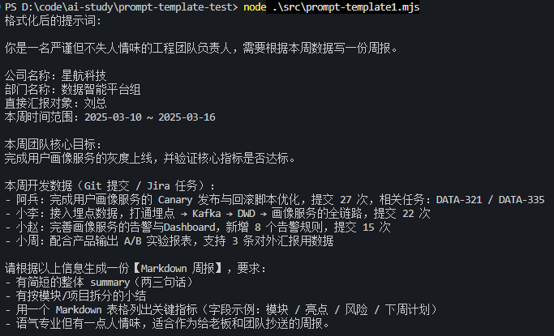

有了这个prompt模板

就可以切换不同的数据，保证生成可用prompt

```js
const prompt2 = await naiveTemplate.format({
  company_name: "极光云科技",
  team_name: "订单结算后端组",
  manager_name: "陈总",
  week_range: "2025-04-07 ~ 2025-04-13",
  team_goal: "本周以稳定性为主，集中清理历史技术债和高频告警。",
  dev_activities:
    "- 老王：修复高优先级线上 Bug 7 个（包含两起支付超时问题），提交 19 次，关联工单：PAY-1024 / PAY-1056\n" +
    "- 小何：重构结算批任务调度逻辑，将执行时间从 35min 优化到 18min，提交 24 次\n" +
    "- 小陈：梳理告警策略，合并冗余告警 12 条，新增 SLO 监控 3 项，提交 16 次\n" +
    "- 实习生小刘：补齐历史接口的缺失单测，用例覆盖 12 个核心方法，整体覆盖率从 52% 提升到 61%",
});
console.log("格式化后的提示词:");
console.log(prompt2);

const stream = await model.stream(prompt2);
console.log("\nAI 回答:");
for await (const chunk of stream) {
  process.stdout.write(chunk.content);
}
```

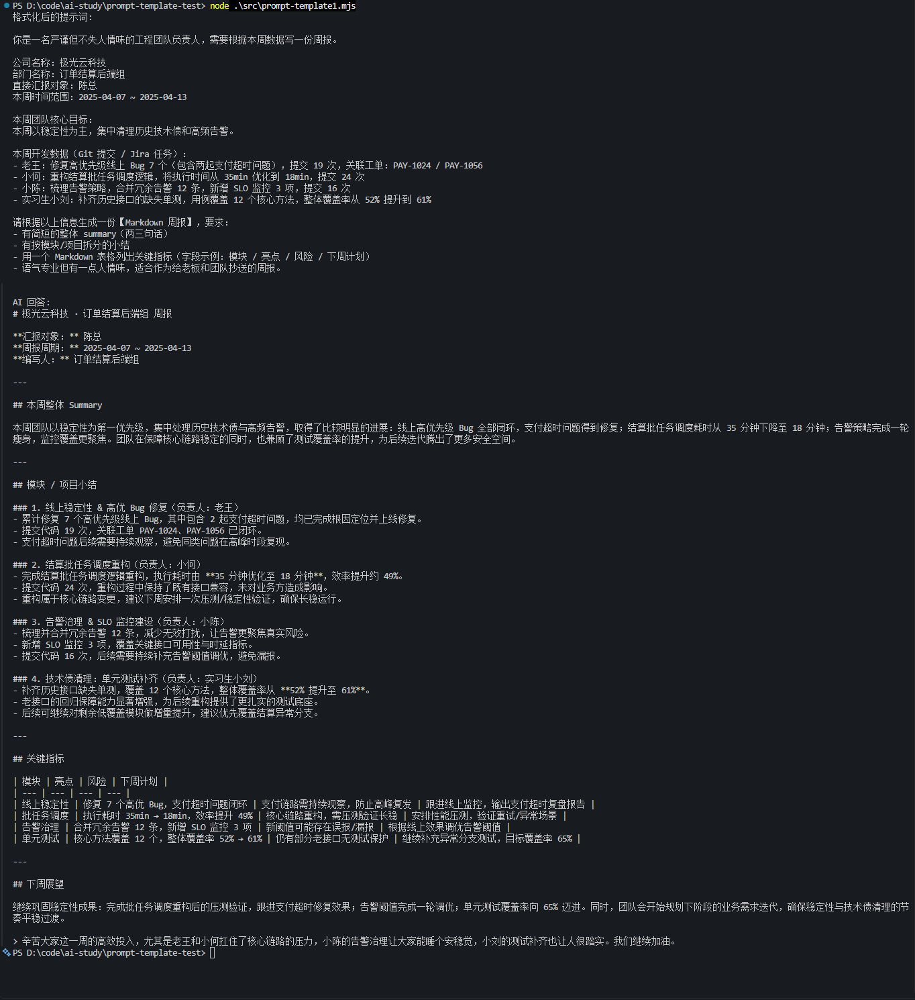

现在都是一整个的 prompt，实际上可能需要按照角色、背景、任务、格式等来拆分管理 prompt，这样用的时候再组合

### PipelinePromptTemplate

```js
import "dotenv/config";
import { ChatOpenAI } from "@langchain/openai";
import {
  PipelinePromptTemplate,
  PromptTemplate,
} from "@langchain/core/prompts";

// 初始化模型
const model = new ChatOpenAI({
  modelName: process.env.MODEL_NAME,
  apiKey: process.env.OPENAI_API_KEY,
  temperature: 0,
  configuration: {
    baseURL: process.env.OPENAI_BASE_URL,
  },
});

// A. 人设模块（导出以便在其他场景复用）
export const personaPrompt = PromptTemplate.fromTemplate(
  `你是一名资深工程团队负责人，写作风格：{tone}。
你擅长把枯燥的技术细节写得既专业又有温度。\n`
);

// B. 背景模块（导出以便在其他场景复用）
export const contextPrompt = PromptTemplate.fromTemplate(
  `公司：{company_name}
部门：{team_name}
直接汇报对象：{manager_name}
本周时间范围：{week_range}
本周部门核心目标：{team_goal}\n`
);

// C. 任务模块
const taskPrompt = PromptTemplate.fromTemplate(
  `以下是本周团队的开发活动（Git / Jira 汇总）：
{dev_activities}

请你从这些原始数据中提炼出：
1. 本周整体成就亮点
2. 潜在风险和技术债
3. 下周重点计划建议\n`
);

// D. 格式模块
const formatPrompt = PromptTemplate.fromTemplate(
  `请用 Markdown 输出周报，结构包含：
1. 本周概览（2-3 句话的 Summary）
2. 详细拆分（按模块或项目分段）
3. 关键指标表格，表头为：模块 | 亮点 | 风险 | 下周计划

注意：
- 尽量引用一些具体数据（如提交次数、完成的任务编号）
- 语气专业，但可以偶尔带一点轻松的口吻，符合 {company_values}。
`
);

// E. 最终组合 Prompt（把上面几个模块拼在一起）
const finalWeeklyPrompt = PromptTemplate.fromTemplate(
  `{persona_block}
{context_block}
{task_block}
{format_block}

现在请生成本周的最终周报：`
);

export const pipelinePrompt = new PipelinePromptTemplate({
  pipelinePrompts: [
    { name: "persona_block", prompt: personaPrompt },
    { name: "context_block", prompt: contextPrompt },
    { name: "task_block", prompt: taskPrompt },
    { name: "format_block", prompt: formatPrompt },
  ],
  finalPrompt: finalWeeklyPrompt,
});

const pipelineFormatted = await pipelinePrompt.format({
  tone: "专业、清晰、略带幽默",
  company_name: "星航科技",
  team_name: "AI 平台组",
  manager_name: "王总",
  week_range: "2025-02-03 ~ 2025-02-09",
  team_goal: "完成智能周报 Agent 的 MVP 版本，并打通 Git / Jira 数据源。",
  dev_activities:
    "- Git: 58 次提交，3 个主要分支合并\n" +
    "- Jira: 完成 12 个 Story，关闭 7 个 Bug\n" +
    "- 关键任务：完成智能周报 Pipeline 设计、实现 Prompt 拆分、接入 ExampleSelector",
  company_values: "「极致、开放、靠谱」的价值观",
});

// console.log('PipelinePromptTemplate 组合后的 Prompt：');
// console.log(pipelineFormatted);
```

我们创建 PipelinePromptTemplate

指定了一个 finalPrompt 最终的 prompt，以及它组合的所有 pipelinePrompts

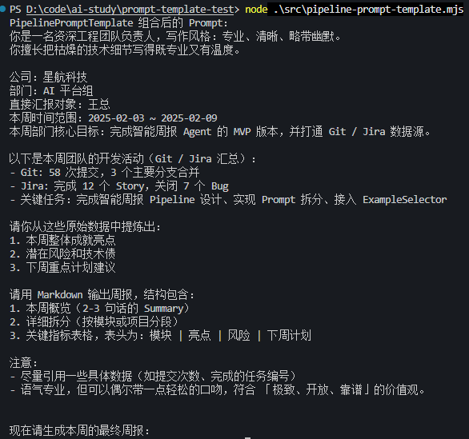

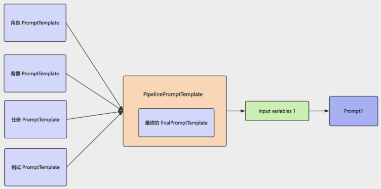

这就相当于将prompt分块管理

还可以导出这些prompt，用于创建另一个prompt

### PromptTemplate复用

```js
import {
  PromptTemplate,
  PipelinePromptTemplate,
} from "@langchain/core/prompts";
import { personaPrompt, contextPrompt } from "./pipeline-prompt-template.mjs";

// 示例：复用「人设 + 背景」模块，用于一个“季度 OKR 回顾邮件”场景

// 1. 本场景自己的任务说明模块
const okrReviewTaskPrompt = PromptTemplate.fromTemplate(`
以下是本季度与你所在团队相关的关键事实与数据（OKR 进展、重要事件等）：
{okr_facts}

请你基于这些信息，整理一份发给 {manager_name} 的【季度 OKR 回顾邮件】，重点包含：
1. 本季度整体达成情况（相对 OKR 的完成度）
2. 关键成果与亮点
3. 暴露出的主要问题 / 风险
4. 下季度的改进方向与优先级建议
`);

// 2. 本场景自己的格式要求模块
const okrReviewFormatPrompt = PromptTemplate.fromTemplate(
  `请用 Markdown 写这封邮件，结构建议为：
1. 邮件开头（1-2 句话的问候 + 本邮件目的）
2. 本季度整体概览
3. 逐条 OKR 的回顾（可分小节）
4. 主要问题 / 风险
5. 下季度计划与请求支持

语气保持专业、克制但真诚，既让老板看到成绩，也能感受到你在主动暴露问题、寻求改进。`
);

// 3. 用 PipelinePromptTemplate 组合成最终 Prompt
const okrReviewPipeline = new PipelinePromptTemplate({
  pipelinePrompts: [
    { name: "persona_block", prompt: personaPrompt }, // 复用人设
    { name: "context_block", prompt: contextPrompt }, // 复用背景
    { name: "task_block", prompt: okrReviewTaskPrompt },
    { name: "format_block", prompt: okrReviewFormatPrompt },
  ],
  finalPrompt: PromptTemplate.fromTemplate(
    `{persona_block}
{context_block}
{task_block}
{format_block}

现在请生成本次的【季度 OKR 回顾邮件】：`
  ),
});

// 4. 示例：构造一个季度 OKR 回顾场景的 Prompt
const promptForReview = await okrReviewPipeline.format({
  tone: "专业、真诚、偏书面表达",
  company_name: "星航科技",
  team_name: "AI 平台组",
  manager_name: "王总",
  week_range: "2025 Q1",
  team_goal: "支撑公司核心 AI 能力建设，完成三大基础平台的落地与稳定运行。",
  okr_facts:
    "- O1：完成在线特征平台的 V1 上线，覆盖 3 条核心业务链路；\n" +
    "- O2：训练并上线新一代推荐模型，首页 CTR 提升 6.3%；\n" +
    "- O3：推动 GPU 资源利用率优化项目，整体利用率从 42% 提升到 67%；\n" +
    "- 重要事件：一次线上 P1 事故，一次跨部门联合专项；\n" +
    "- 团队：新增 2 位同学，整体人效相比去年同期提升约 18%。",
});

console.log("季度 OKR 回顾邮件 Prompt：\n");
console.log(promptForReview);
```

创建季度总结的 prompt，前面的角色 + 背景部分 prompt 直接复用周报的

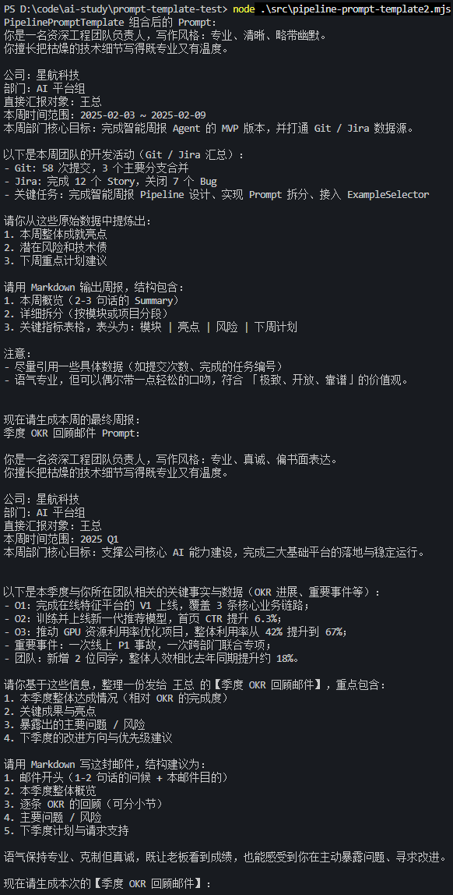

### PipelinePrompt.partial

可以用 partial 来预填入一些变量，生成新的 PromptTemplate

`pipelinePrompt.partial()` 的作用：**预填变量，生成一个"半成品"模板**

```js
import { pipelinePrompt } from "./pipeline-prompt-template.mjs";

const pipelineWithPartial = await pipelinePrompt.partial({
  company_name: "星航科技",
  company_values: "「极致、开放、靠谱」的价值观",
  tone: "偏正式但不僵硬",
});

const partialFormatted = await pipelineWithPartial.format({
  team_name: "AI 平台组",
  manager_name: "刘东",
  week_range: "2025-02-10 ~ 2025-02-16",
  team_goal: "上线周报 Agent 到内部试用环境，并收集反馈。",
  dev_activities:
    "- 小明：完成 Git/Jira 集成封装\n" +
    "- 小红：实现 Prompt 配置化加载\n" +
    "- 小强：接入权限系统，支持按部门过滤数据",
});

const partialFormatted2 = await pipelineWithPartial.format({
  team_name: "AI 工程效率组",
  manager_name: "王强",
  week_range: "2025-02-17 ~ 2025-02-23",
  team_goal: "打通 CI/CD 可观测链路，并推动落地到核心服务。",
  dev_activities:
    "- 阿俊：完成流水线执行数据的链路追踪接入\n" +
    "- 小白：梳理核心服务发布流程，补齐变更记录\n" +
    "- 小七：研发发布回滚一键脚本 PoC 版本",
});

console.log(partialFormatted);
console.log("\n================ 分割线：第二份周报模板 ================\n");
console.log(partialFormatted2);
```

调用 `.partial({ company_name, company_values, tone })` 后，这三项被**固化**进去，返回一个新的 `PromptTemplate`，它只需要剩余变量：

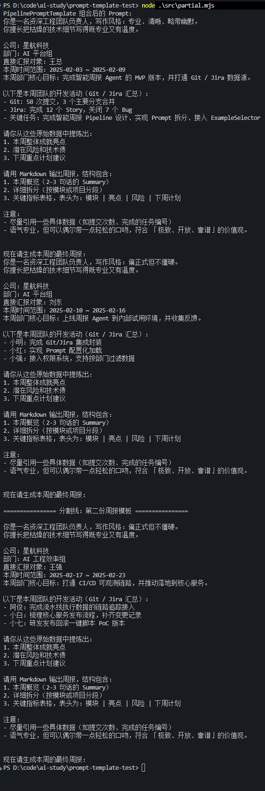

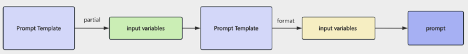

### ChatPromptTemplate

PromptTemplate 产出的就是一个字符串，实际上我们更多是用 SystemMesage、HumanMessage、AIMessage、ToolMessage 的 messages 数组来调大模型

```js
import "dotenv/config";
import { ChatOpenAI } from "@langchain/openai";
import {
  PipelinePromptTemplate,
  PromptTemplate,
  ChatPromptTemplate,
} from "@langchain/core/prompts";
import { personaPrompt, contextPrompt } from "./pipeline-prompt-template.mjs";

// 初始化 Chat 模型
const model = new ChatOpenAI({
  modelName: process.env.MODEL_NAME,
  apiKey: process.env.OPENAI_API_KEY,
  temperature: 0,
  configuration: {
    baseURL: process.env.OPENAI_BASE_URL,
  },
});

// A. 本场景自己的任务说明模块
const weeklyTaskPrompt = PromptTemplate.fromTemplate(
  `以下是本周与你所在团队相关的关键事实与数据（Git / Jira / 运维等）：
{dev_activities}

请你基于这些信息，帮我生成一份【技术周报】，重点包含：
1. 本周整体达成情况
2. 关键成果与亮点
3. 主要问题 / 风险
4. 下周的改进方向与优先级建议
`
);

// B. 本场景自己的格式要求模块
const weeklyFormatPrompt = PromptTemplate.fromTemplate(
  `请用 Markdown 写这份周报，结构建议为：
1. 本周概览（2-3 句话）
2. 详细拆分（按项目或模块分段）
3. 关键指标表格（字段示例：模块 / 亮点 / 风险 / 下周计划）

语气要求：{tone}，既专业清晰，又适合发给老板并抄送团队。`
);

// C. 最终的 ChatPromptTemplate：接收由 Pipeline 拼好的几块内容
const finalChatPrompt = ChatPromptTemplate.fromMessages([
  [
    "system",
    `你是一名资深工程团队负责人，擅长把复杂的技术细节总结成结构化、易读的周报。

下面是一些已经预先整理好的信息块，请你综合理解后，再根据用户补充的信息生成周报。`,
  ],
  [
    "human",
    `人设与写作风格：
{persona_block}

团队与本周背景：
{context_block}

任务与输入数据：
{task_block}

输出格式要求：
{format_block}

现在请基于以上信息，直接输出最终的周报内容。`,
  ],
]);

const weeklyChatPipelinePrompt = new PipelinePromptTemplate({
  pipelinePrompts: [
    { name: "persona_block", prompt: personaPrompt }, // 复用人设
    { name: "context_block", prompt: contextPrompt }, // 复用背景
    { name: "task_block", prompt: weeklyTaskPrompt }, // 本文件自己的任务模块
    { name: "format_block", prompt: weeklyFormatPrompt }, // 本文件自己的格式模块
  ],
  // 注意：这里的 finalPrompt 是 ChatPromptTemplate，而不是普通 PromptTemplate
  finalPrompt: finalChatPrompt,
});

// E. 示例：构造一份消息数组并喂给 Chat 模型
const promptValue = await weeklyChatPipelinePrompt.formatPromptValue({
  tone: "专业、清晰、略带鼓励",
  company_name: "星航科技",
  team_name: "AI 平台组",
  manager_name: "王总",
  week_range: "2025-05-12 ~ 2025-05-18",
  team_goal: "完成周报自动生成能力的灰度验证，并收集团队反馈。",
  dev_activities:
    "- Git：本周合并 4 个主要特性分支，包含 Prompt 配置化和日志观测优化\n" +
    "- Jira：关闭 9 个 Story / 5 个 Bug，新增 2 个 TechDebt 任务\n" +
    "- 运维：本周线上 P1 事故 0 起，P2 1 起（由配置变更引起，已完成复盘）\n" +
    "- 其他：完成与数据平台、运维平台两次联合评审会议",
});

console.log("Pipeline + ChatPromptTemplate 生成的消息:");
console.log(promptValue.toChatMessages());

// const aiResponse = await model.invoke(messages);

// console.log('\nAI 生成的周报内容:');
// console.log(aiResponse.content);

```

```js
ChatPromptTemplate.fromMessages([...])          // 1. 定义带变量的消息模板
        │
        ▼
  chatPrompt.formatMessages({ ... })            // 2. 填充具体值
        │
        ▼
  [SystemMessage, HumanMessage]                 // 3. 得到消息对象数组
        │
        ▼
  model.invoke(chatMessages)                    // 4. 传给模型生成回复
```

#### **说明**

1. `ChatPromptTemplate.fromMessages(messages)`

**作用**：静态工厂方法，根据消息数组创建一个 `ChatPromptTemplate` 实例。

**签名**：

```js
ChatPromptTemplate.fromMessages(messages: Array<BaseMessagePromptTemplate | [role, template]>)
```

**参数 `messages`** 的每一项支持两种写法：

| 写法             | 示例                                              | 说明                                                                            |
| ---------------- | ------------------------------------------------- | ------------------------------------------------------------------------------- |
| **元组简写**     | `['system', '你是{role}']`                        | 第一个元素是角色名（`system`/`human`/`ai`），第二个是模板字符串。适合简单场景。 |
| **消息模板对象** | `SystemMessagePromptTemplate.fromTemplate('...')` | 显式创建特定角色的消息模板，语义更清晰，适合复杂场景。                          |

**当前代码**（chat-prompt-template.mjs:15）使用的是元组简写方式：

```js
const chatPrompt = ChatPromptTemplate.fromMessages([
  ['system', `你是一名资深工程团队负责人...写作风格要求：{tone}。...`],
  ['human',  `本周信息如下：...公司名称：{company_name}...`],
]);
```

这会生成一个包含两条消息的聊天模板——一条 `system`（设定 AI 角色和风格），一条 `human`（携带具体数据）。

---

2. `chatPrompt.formatMessages(variables)`

**作用**：将模板中的占位变量 `{variable_name}` 替换为实际值，返回一个 **消息对象数组**，可以直接传给模型调用。

**签名**：

```js
chatPrompt.formatMessages(variables: Record<string, any>): Promise<Message[]>
```

**返回值**：`Promise<Message[]>`——每条消息是一个 LangChain `Message` 对象（如 `SystemMessage`、`HumanMessage`），其中的 `{变量}` 已被替换。

**当前代码**（chat-prompt-template.mjs:47）：

```js
const chatMessages = await chatPrompt.formatMessages({
  tone: '专业、清晰、略带鼓励',
  company_name: '星航科技',
  team_name: '智能应用平台组',
  // ... 其他变量
});
```

执行后 `chatMessages` 的结构类似：

```js
[
  SystemMessage { content: "你是一名资深工程团队负责人...写作风格要求：专业、清晰、略带鼓励。..." },
  HumanMessage  { content: "本周信息如下：...公司名称：星航科技..." }
]
```

这个数组随后直接传给 `model.invoke(chatMessages)` 即可调用大模型。

这里复用了之前的两个 PromptTemplate，然后创建了两个新的 PromptTemplate

最终的 finalPrompt 是 ChatPromptTemplate

然后用 formatPromptValue 这个方法拿到填入变量后的 messages 数组：

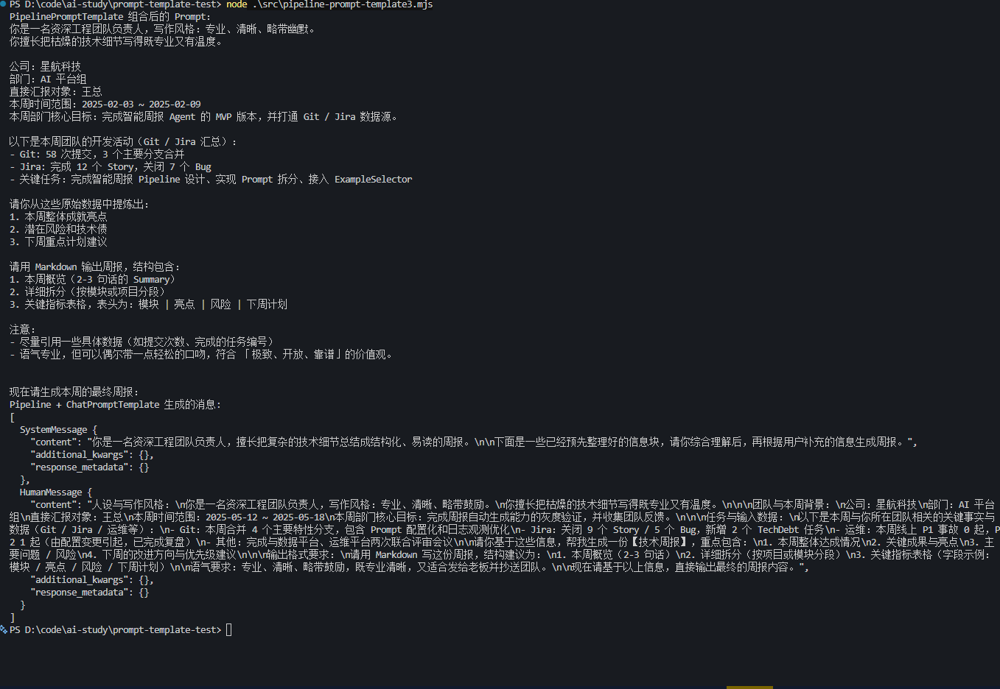

#### 第二种写法：

```js
import "dotenv/config";
import { ChatOpenAI } from "@langchain/openai";
import {
  ChatPromptTemplate,
  SystemMessagePromptTemplate,
  HumanMessagePromptTemplate,
  AIMessagePromptTemplate,
} from "@langchain/core/prompts";

const model = new ChatOpenAI({
  modelName: process.env.MODEL_NAME,
  apiKey: process.env.OPENAI_API_KEY,
  temperature: 0,
  configuration: {
    baseURL: process.env.OPENAI_BASE_URL,
  },
});

const systemTemplate = SystemMessagePromptTemplate.fromTemplate(
  `你是一名资深工程团队负责人，擅长用结构化、易读的方式写技术周报。
写作风格要求：{tone}。

请根据后续用户提供的信息，帮他生成一份适合给老板和团队同时抄送的周报草稿。`
);

const humanTemplate = HumanMessagePromptTemplate.fromTemplate(
  `本周信息如下：

公司名称：{company_name}
团队名称：{team_name}
直接汇报对象：{manager_name}
本周时间范围：{week_range}

本周团队核心目标：
{team_goal}

本周开发数据（Git 提交 / Jira 任务等）：
{dev_activities}

请据此输出一份 Markdown 周报，结构建议包含：
1. 本周概览（2-3 句话）
2. 详细拆分（按项目或模块分段）
3. 关键指标表格（字段示例：模块 / 亮点 / 风险 / 下周计划）

语气专业但有人情味。`
);

const composedTemplate = ChatPromptTemplate.fromMessages([
  systemTemplate,
  humanTemplate,
]);

const chatMessages = await composedTemplate.formatMessages({
  tone: "专业、清晰、略带鼓励",
  company_name: "星航科技",
  team_name: "智能应用平台组",
  manager_name: "王总",
  week_range: "2025-05-05 ~ 2025-05-11",
  team_goal: "完成内部 AI 助手灰度上线，并确保核心链路稳定。",
  dev_activities:
    "- 小李：完成 AI 助手工单流转能力，对接客服系统，提交 25 次\n" +
    "- 小张：接入日志检索和知识库查询，提交 19 次\n" +
    "- 小王：完善监控、告警与埋点，新增 10 条核心告警规则\n" +
    "- 实习生小陈：补充使用文档和 FAQ，支持 3 个内部试点团队",
});

console.log(
  "使用 SystemMessagePromptTemplate / HumanMessagePromptTemplate 生成的消息:"
);
console.log(chatMessages);

// const response = await model.invoke(chatMessages);

// console.log('\nAI 生成的周报草稿:');
// console.log(response.content);
```

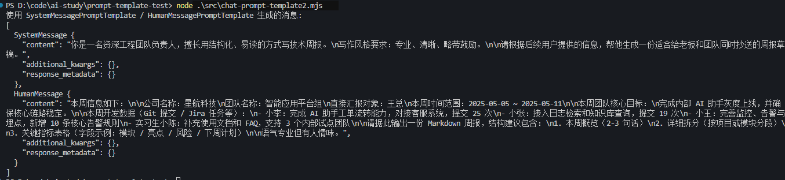

不是传入二维数组了，而是分别用 SystemMessagePromptTemplate、HumanMessagePromptTemplate 等创建具体的 PromptTemplate


然后组合到 fromMessages 的参数数组里


### MessagesPlaceholder

如果想要插入一段聊天记录，就要用到 MessagesPlaceholder

```js
import "dotenv/config";
import { ChatOpenAI } from "@langchain/openai";
import {
  ChatPromptTemplate,
  MessagesPlaceholder,
} from "@langchain/core/prompts";

// 演示：在 ChatPromptTemplate 中通过 MessagesPlaceholder 注入「对话历史」

// 1. 初始化 Chat 模型
const model = new ChatOpenAI({
  modelName: process.env.MODEL_NAME,
  apiKey: process.env.OPENAI_API_KEY,
  temperature: 0,
  configuration: {
    baseURL: process.env.OPENAI_BASE_URL,
  },
});

// 2. 定义一个包含 MessagesPlaceholder 的 ChatPromptTemplate
const chatPromptWithHistory = ChatPromptTemplate.fromMessages([
  [
    "system",
    `你是一名资深工程效率顾问，善于在多轮对话的上下文中给出具体、可执行的建议。`,
  ],
  // 这里用 MessagesPlaceholder 来承载「之前的多轮对话」
  new MessagesPlaceholder("history"),
  [
    "human",
    `这是用户本轮的新问题：{current_input}

请结合上面的历史对话，一并给出你的建议。`,
  ],
]);

// 3. 构造一个模拟的历史对话 + 当前输入
const historyMessages = [
  {
    role: "human",
    content: "我们团队最近在做一个内部的周报自动生成工具。",
  },
  {
    role: "ai",
    content:
      "听起来不错，可以先把数据源（Git / Jira / 运维）梳理清楚，再考虑 Prompt 模块化设计。",
  },
  {
    role: "human",
    content: "我们已经把 Prompt 拆成了「人设」「背景」「任务」「格式」四块。",
  },
  {
    role: "ai",
    content:
      "很好，接下来可以考虑把这些模块做成可复用的 PipelinePromptTemplate，方便在不同场景复用。",
  },
];

const formattedMessages = await chatPromptWithHistory.formatPromptValue({
  history: historyMessages,
  current_input: "现在我们想再优化一下多人协同编辑周报的流程，有什么建议？",
});

console.log("包含历史对话的消息数组：");
console.log(formattedMessages.toChatMessages());

// const aiReply = await model.invoke(formattedMessages);

// console.log('\nAI 回复内容：');
// console.log(aiReply.content);

```

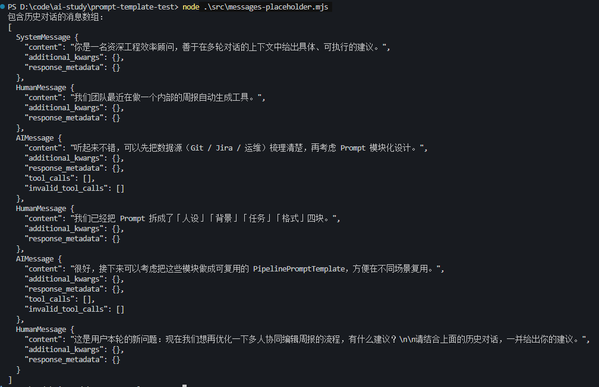

这里用 MessagesPlaceholder 来插入一段对话历史


### FewShotPromptTemplate（少样本提示模板）

大模型写提示词时有个常见技巧叫 **Few-shot（少样本学习）**：不直接让模型干一件事，而是**先给它几条「输入 → 期望输出」的示例**，让它模仿示例的风格和结构。比如这个文件里，你想让模型写周报，就先喂它两条写好的周报示例，模型就会照着示例的语气和结构来写

```js
import "dotenv/config";
import { ChatOpenAI } from "@langchain/openai";
import { FewShotPromptTemplate, PromptTemplate } from "@langchain/core/prompts";

// 1. 初始化 Chat 模型
const model = new ChatOpenAI({
  modelName: process.env.MODEL_NAME,
  apiKey: process.env.OPENAI_API_KEY,
  temperature: 0,
  configuration: {
    baseURL: process.env.OPENAI_BASE_URL,
  },
});

// 2. 定义 few-shot 示例模板（单条示例长什么样）
const examplePrompt = PromptTemplate.fromTemplate(
  `用户输入：{user_requirement}
期望周报结构：{expected_style}
模型示例输出片段：
{report_snippet}
---`
);

// 3. 准备几条示例数据（few-shot examples）
const examples = [
  {
    user_requirement:
      "重点突出稳定性治理，本周主要在修 Bug 和清理技术债，适合发给偏关注风险的老板。",
    expected_style: "语气稳健、偏保守，多强调风险识别和已做的兜底动作。",
    report_snippet:
      `- 支付链路本周共处理线上 P1 Bug 2 个、P2 Bug 3 个，全部在 SLA 内完成修复；\n` +
      `- 针对历史高频超时问题，完成 3 个核心接口的超时阈值和重试策略优化；\n` +
      `- 清理 12 条重复/噪音告警，减少值班同学 30% 的告警打扰。`,
  },
  {
    user_requirement:
      "偏向对外展示成果，希望多写一些亮点，适合发给更大范围的跨部门同学。",
    expected_style: "语气积极、突出成果，对技术细节做适度抽象。",
    report_snippet:
      `- 新上线「订单实时看板」，业务侧可以实时查看核心转化漏斗；\n` +
      `- 首次打通埋点 → 数据仓库 → 实时服务链路，为后续精细化运营提供基础能力；\n` +
      `- 和产品、运营一起完成 2 场内部分享，会后收到 15 条正向反馈。`,
  },
];

// 4. 把示例封装成 FewShotPromptTemplate
const fewShotPrompt = new FewShotPromptTemplate({
  examples,
  examplePrompt,
  prefix: `下面是几条已经写好的【周报示例】，你可以从中学习语气、结构和信息组织方式：\n`,
  suffix:
    `\n基于上面的示例风格，请帮我写一份新的周报。` +
    `\n如果用户有额外要求，请在满足要求的前提下，尽量保持示例中的结构和条理性。`,
  inputVariables: [],
});

const fewShotBlock = await fewShotPrompt.format({});
console.log(fewShotBlock);
```

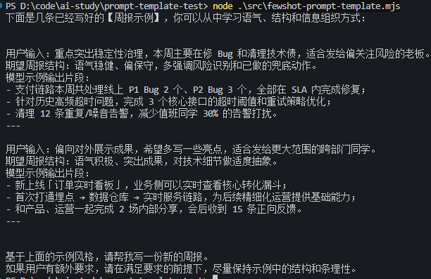

先用 PromptTemplate 创建了示例的 prompt 模版

然后创建了 2 个示例，加上前缀、后缀

FewShotPromptTemplate 可以结合其他 PromptTemplate 一起用，通过 PipelinePromptTemplate 组合到一块

总结：**FewShotPromptTemplate 就是把「多条示例 + 前缀说明 + 最终指令」自动拼装成完整提示词的工具**，避免了手动用字符串拼接示例的麻烦

### ExampleSelector