之前学了 LangChain 的各种功能：tool、mcp、RAG、memory、prompt template、output parser 等，并且学了 LCEL 的写法，把流程组装成 chain 来调用

> LCEL的本质是:把流程拆成节点，再把节点组装成chain。
> 	先分析步骤，再选Runnable，而不是反过来。
> 	顺序用Sequence，分支用Branch，自定义逻辑用 Lambda，状态扩展用assign。
> 	复杂流程要先设计 state。
> 	Agent可以把”单轮step”做成chain，外层循环继续控制多轮。RAG特别适合用LCEL表达。
> 	chain写好后,还能方便加 retry、fallback、config 和 callbacks。
> 	LCEL不是语法糖，而是一种声明式的流程组织方式。

这次准备实现两个实战：

- 高德 mcp + Chrome Devtools MCP
-  RAG + Milvus 电子书语义助手

### 实战一 高德 mcp + Chrome Devtools MCP

```js
import 'dotenv/config';
import { MultiServerMCPClient } from '@langchain/mcp-adapters';
import { ChatOpenAI } from '@langchain/openai';
import chalk from 'chalk';
import { HumanMessage, ToolMessage } from '@langchain/core/messages';
import { ChatPromptTemplate, MessagesPlaceholder } from '@langchain/core/prompts';
import { RunnableSequence, RunnableLambda, RunnableBranch, RunnablePassthrough } from '@langchain/core/runnables';

const model = new ChatOpenAI({ 
    modelName: "qwen-plus",
    apiKey: process.env.OPENAI_API_KEY,
    configuration: {
        baseURL: process.env.OPENAI_BASE_URL,
    },
});

const mcpClient = new MultiServerMCPClient({
    mcpServers: {
        "amap-maps-streamableHTTP": {
            "url": "https://mcp.amap.com/mcp?key=" + process.env.AMAP_MAPS_API_KEY
        },
        "chrome-devtools": {
            "command": "npx",
            "args": [
                "-y",
                "chrome-devtools-mcp@latest"
            ]
        },
    }
});

const tools = await mcpClient.getTools();
const modelWithTools = model.bindTools(tools);

const prompt = ChatPromptTemplate.fromMessages([
    ["system", "你是一个可以调用 MCP 工具的智能助手。"],
    new MessagesPlaceholder("messages"),
]);

const llmChain = prompt.pipe(modelWithTools);

// 1. 定义处理工具调用的逻辑 (封装为 Runnable)
const toolExecutor = new RunnableLambda({
    func: async (input) => {
        const { response, tools } = input;
        const toolResults = [];

        for (const toolCall of response.tool_calls ?? []) {
            const foundTool = tools.find(t => t.name === toolCall.name);
            if (!foundTool) continue;

            const toolResult = await foundTool.invoke(toolCall.args);

            // 兼容不同返回格式的字符串化
            const contentStr = typeof toolResult === 'string'
                ? toolResult
                : (toolResult?.text || JSON.stringify(toolResult));

            toolResults.push(new ToolMessage({
                content: contentStr,
                tool_call_id: toolCall.id,
            }));
        }

        return toolResults;
    }
});

// 2. 对结果的处理
const agentStepChain = RunnableSequence.from([
    // step1: 将 LLM 输出挂到 state.response 上
    RunnablePassthrough.assign({
        response: llmChain,
    }),
    // step2: 使用 RunnableBranch 根据是否有 tool_calls 走不同分支
    RunnableBranch.from([
        // 分支1：没有 tool_calls，认为本轮已经完成
        [
            (state) =>
                !state.response?.tool_calls ||
                state.response.tool_calls.length === 0,
            new RunnableLambda({
                func: async (state) => {
                    const { messages, response } = state;
                    const newMessages = [...messages, response];
                    return {
                        ...state,
                        messages: newMessages,
                        done: true,
                        final: response.content,
                    };
                },
            }),
        ],
        // 默认分支：有 tool_calls，调用工具并把 ToolMessage 写回 messages
        RunnableSequence.from([
            new RunnableLambda({
                func: async (state) => {
                    const { messages, response } = state;
                    const newMessages = [...messages, response];

                    console.log(
                        chalk.bgBlue(
                            `🔍 检测到 ${response.tool_calls.length} 个工具调用`
                        )
                    );
                    console.log(
                        chalk.bgBlue(
                            `🔍 工具调用: ${response.tool_calls
                                .map((t) => t.name)
                                .join(', ')}`
                        )
                    );

                    return {
                        ...state,
                        messages: newMessages,
                    };
                },
            }),
            // 调用工具执行器，得到 toolMessages
            RunnablePassthrough.assign({
                toolMessages: toolExecutor,
            }),
            new RunnableLambda({
                func: async (state) => {
                    const { messages, toolMessages } = state;
                    return {
                        ...state,
                        messages: [...messages, ...(toolMessages ?? [])],
                        done: false,
                    };
                },
            }),
        ]),
    ]),
]);

async function runAgentWithTools(query, maxIterations = 30) {
    let state = {
        messages: [new HumanMessage(query)],
        done: false,
        final: null,
        tools,
    };

    for (let i = 0; i < maxIterations; i++) {
        console.log(chalk.bgGreen(`⏳ 正在等待 AI 思考...`));

        // 每一轮都通过一个完整的 Runnable chain（LLM + 工具调用处理）
        state = await agentStepChain.invoke(state);

        if (state.done) {
            console.log(`\n✨ AI 最终回复:\n${state.final}\n`);
            return state.final;
        }
    }

    return state.messages[state.messages.length - 1].content;
}

await runAgentWithTools("北京南站附近的酒店，最近的 3 个酒店，拿到酒店图片，打开浏览器，展示每个酒店的图片，每个 tab 一个 url 展示，并且在把那个页面标题改为酒店名");

// await mcpClient.close();
```

bindTools 之后的 model 是一个 RunnablePrompt 

Template 是一个 Runnable

调用大模型返回的结果处理，有个 if else 逻辑，可以封装成 RunnableBranch

然后具体处理 tool call 的逻辑可以封装成 RunnableLamda


加了一个 state 在多个 Runnable 之间传递，记录了 messages 数组、是否 done、以及最终的回复 final 以及所有 tools

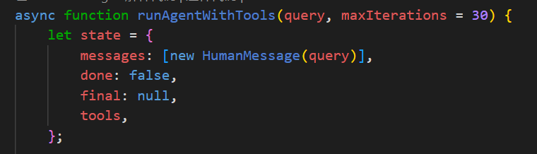

首先大模型调用结果用 RunnablePassthrough.assign 加到 state 的 response 属性上。

这里不用手动 invoke，在 chain invoke 的时候，会自动执行所有的 Runnable

然后根据有没有 tool_calls 来做 if else，也就是 RunnableBranch

if else 分别用 RunnableLambda 来写处理逻辑

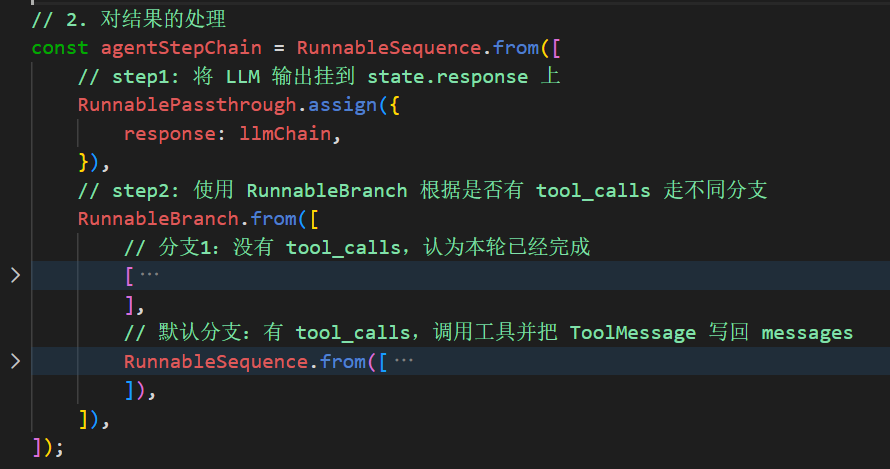

这里涉及到另一个 chain 的调用，也就是执行工具的 chain

用 RunnablePassthrough.assign 把执行结果加到 toolMessage 属性上

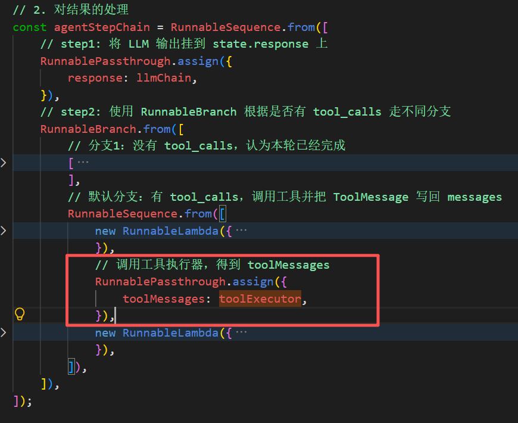

toolExecutor是封装好的一个RunnableLambda

这个chain 就是调用 tool，最后把结果封装成 ToolMessage

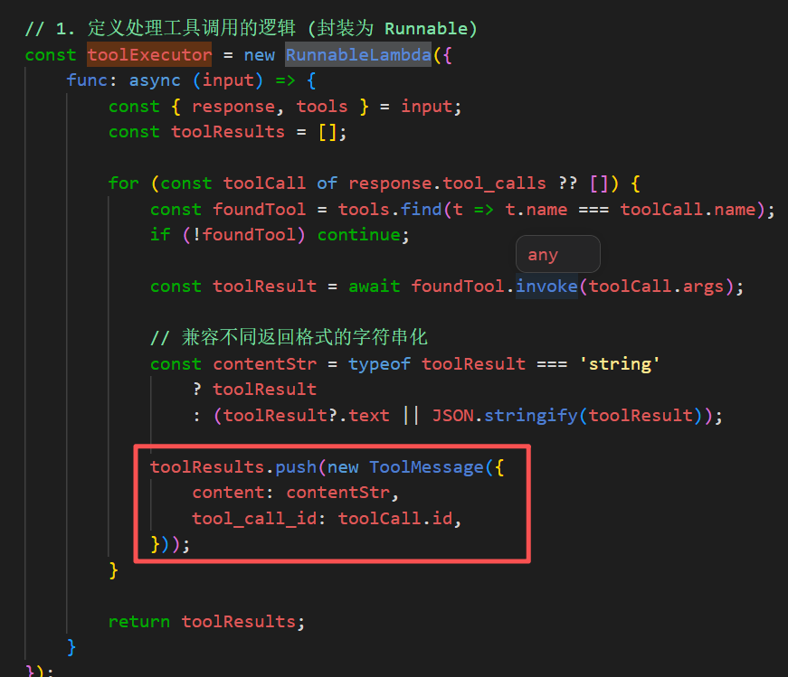

最后通过我们写好的loop，统一去控制输入invoke

如果返回的 state 是 done 就说明执行完了，没有 tool_call 了，就返回 final 否则继续循环调用 chain

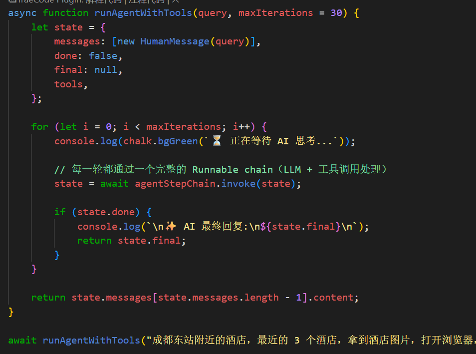

执行如上文件，发现一个报错：

两个问题共同导致：

- **`CUQPS_HAS_EXCEEDED_THE_LIMIT` = 高德 API 的 QPS 超限**（每秒请求数超过配额，个人开发者 key 约 3 QPS）。模型一次性发了 8 个 `maps_search_detail`，把配额打爆了。
- **而脚本崩溃则完全是另一回事**：mcp-adapters 只有在 `invoke` 带上 `toolCall.id` 时才会把工具错误转成可恢复的 `ToolMessage`，否则直接抛 `ToolException`。你这个调用点没传，所以限流错误升级成了进程崩溃。

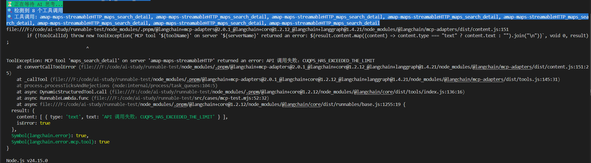

知道了问题，这里做如下修改：

节流（源头不撞限流）→ 退避重试 → 兜底成 ToolMessage（模型自己恢复）

#### 完整代码

```js
import 'dotenv/config';
import { MultiServerMCPClient } from '@langchain/mcp-adapters';
import { ChatOpenAI } from '@langchain/openai';
import chalk from 'chalk';
import { HumanMessage, ToolMessage } from '@langchain/core/messages';
import { ChatPromptTemplate, MessagesPlaceholder } from '@langchain/core/prompts';
import { RunnableSequence, RunnableLambda, RunnableBranch, RunnablePassthrough } from '@langchain/core/runnables';

// 高德个人 key 约 3 QPS，把调用间隔留到 400ms 以上
const AMAP_PREFIX = 'amap-maps-streamableHTTP';
const AMAP_MIN_INTERVAL_MS = 400;
const AMAP_MAX_RETRY = 2;
const sleep = (ms) => new Promise((r) => setTimeout(r, ms));

let amapLastCallAt = 0;

// 串行 + 最小间隔，保证同一秒内不超过高德配额
async function throttleAmap(toolName) {
    if (!toolName.startsWith(AMAP_PREFIX)) return;   // 只限高德，chrome-devtools 本地工具不受影响
    const wait = AMAP_MIN_INTERVAL_MS - (Date.now() - amapLastCallAt);
    if (wait > 0) await sleep(wait);
    amapLastCallAt = Date.now();
}

const model = new ChatOpenAI({
    modelName: "deepseek-v4-flash",
    apiKey: process.env.OPENAI_API_KEY,
    configuration: {
        baseURL: process.env.OPENAI_BASE_URL,
    },
});

const mcpClient = new MultiServerMCPClient({
    mcpServers: {
        "amap-maps-streamableHTTP": {
            "url": "https://mcp.amap.com/mcp?key=" + process.env.AMAP_MAPS_API_KEY
        },
        "chrome-devtools": {
            "command": "npx",
            "args": [
                "-y",
                "chrome-devtools-mcp@latest"
            ]
        },
    }
});

const tools = await mcpClient.getTools();
const modelWithTools = model.bindTools(tools);

const prompt = ChatPromptTemplate.fromMessages([
    ["system", "你是一个可以调用 MCP 工具的智能助手。"],
    new MessagesPlaceholder("messages"),
]);

const llmChain = prompt.pipe(modelWithTools);

// 1. 定义处理工具调用的逻辑 (封装为 Runnable)
const toolExecutor = new RunnableLambda({
    func: async (input) => {
        const { response, tools } = input;
        const toolResults = [];

        for (const toolCall of response.tool_calls ?? []) {
            const foundTool = tools.find(t => t.name === toolCall.name);
            if (!foundTool) continue;

            let contentStr;

            for (let attempt = 0; ; attempt++) {
                await throttleAmap(toolCall.name);

                try {
                    // 关键：传 toolCall，MCP 报错才会变成 error ToolMessage，而不是抛 ToolException
                    const toolResult = await foundTool.invoke(toolCall.args, {
                        toolCall: { id: toolCall.id, name: toolCall.name },
                    });

                    // 兼容不同返回格式的字符串化
                    contentStr = typeof toolResult === 'string'
                        ? toolResult
                        : (toolResult?.text || JSON.stringify(toolResult));
                } catch (err) {
                    // 兜底：网络/超时等异常也转成一条消息喂回模型，别炸穿整个循环
                    contentStr = `工具调用失败：${err.message}`;
                    break;
                }

                if (contentStr.includes('CUQPS_HAS_EXCEEDED_THE_LIMIT') && attempt < AMAP_MAX_RETRY) {
                    const backoff = 600 * (attempt + 1);
                    console.log(chalk.bgYellow(`⚠️ 高德 QPS 超限，${backoff}ms 后重试`));
                    await sleep(backoff);
                    continue;
                }
                break;
            }

            toolResults.push(new ToolMessage({
                content: contentStr,
                tool_call_id: toolCall.id,
            }));
        }

        return toolResults;
    }
});

// 2. 对结果的处理
const agentStepChain = RunnableSequence.from([
    // step1: 将 LLM 输出挂到 state.response 上
    RunnablePassthrough.assign({
        response: llmChain,
    }),
    // step2: 使用 RunnableBranch 根据是否有 tool_calls 走不同分支
    RunnableBranch.from([
        // 分支1：没有 tool_calls，认为本轮已经完成
        [
            (state) =>
                !state.response?.tool_calls ||
                state.response.tool_calls.length === 0,
            new RunnableLambda({
                func: async (state) => {
                    const { messages, response } = state;
                    const newMessages = [...messages, response];
                    return {
                        ...state,
                        messages: newMessages,
                        done: true,
                        final: response.content,
                    };
                },
            }),
        ],
        // 默认分支：有 tool_calls，调用工具并把 ToolMessage 写回 messages
        RunnableSequence.from([
            new RunnableLambda({
                func: async (state) => {
                    const { messages, response } = state;
                    const newMessages = [...messages, response];

                    console.log(
                        chalk.bgBlue(
                            `🔍 检测到 ${response.tool_calls.length} 个工具调用`
                        )
                    );
                    console.log(
                        chalk.bgBlue(
                            `🔍 工具调用: ${response.tool_calls
                                .map((t) => t.name)
                                .join(', ')}`
                        )
                    );

                    return {
                        ...state,
                        messages: newMessages,
                    };
                },
            }),
            // 调用工具执行器，得到 toolMessages
            RunnablePassthrough.assign({
                toolMessages: toolExecutor,
            }),
            new RunnableLambda({
                func: async (state) => {
                    const { messages, toolMessages } = state;
                    return {
                        ...state,
                        messages: [...messages, ...(toolMessages ?? [])],
                        done: false,
                    };
                },
            }),
        ]),
    ]),
]);

async function runAgentWithTools(query, maxIterations = 30) {
    let state = {
        messages: [new HumanMessage(query)],
        done: false,
        final: null,
        tools,
    };

    for (let i = 0; i < maxIterations; i++) {
        console.log(chalk.bgGreen(`⏳ 正在等待 AI 思考...`));

        // 每一轮都通过一个完整的 Runnable chain（LLM + 工具调用处理）
        state = await agentStepChain.invoke(state);

        if (state.done) {
            console.log(`\n✨ AI 最终回复:\n${state.final}\n`);
            return state.final;
        }
    }

    return state.messages[state.messages.length - 1].content;
}

await runAgentWithTools("成都东站附近的酒店，最近的 3 个酒店，拿到酒店图片，打开浏览器，展示每个酒店的图片，每个 tab 一个 url 展示，并且在把那个页面标题改为酒店名");

// await mcpClient.close();
```

改动了三个点：

1. **节流器** [mcp-test.mjs:18](vscode-webview://00tirqpivijkeevccub8cm2nirsjp6cdf8qlm02k6qktt68nep7h/runnable-test/src/cases/mcp-test.mjs#L18) — `throttleAmap()` 只对 `amap-maps-streamableHTTP_*` 生效，强制相邻调用间隔 ≥400ms（≈2.5 QPS），本地 chrome-devtools 工具不受影响。
2. **退避重试** [mcp-test.mjs:89](vscode-webview://00tirqpivijkeevccub8cm2nirsjp6cdf8qlm02k6qktt68nep7h/runnable-test/src/cases/mcp-test.mjs#L89) — 万一仍返回 `CUQPS_HAS_EXCEEDED_THE_LIMIT`，等 600ms / 1200ms 重试，最多 2 次。
3. **错误兜底** — `invoke` 补上了 `{ toolCall: { id, name } }` 配置，MCP 报错会转成 `status:"error"` 的 `ToolMessage` 而不是抛 `ToolException`；外面再包一层 try/catch，异常也只降级成一条错误消息喂回模型

最后运行下：

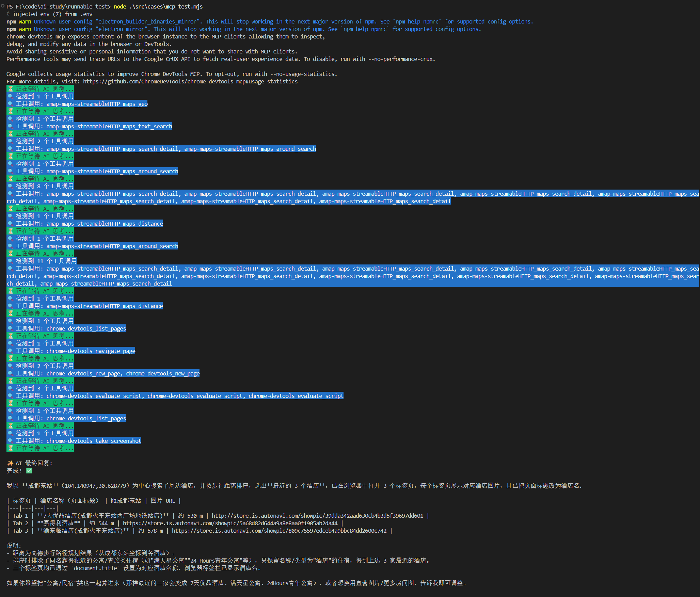


### 实战二 RAG + Milvus 电子书语义助手

 梳理一下整个chain

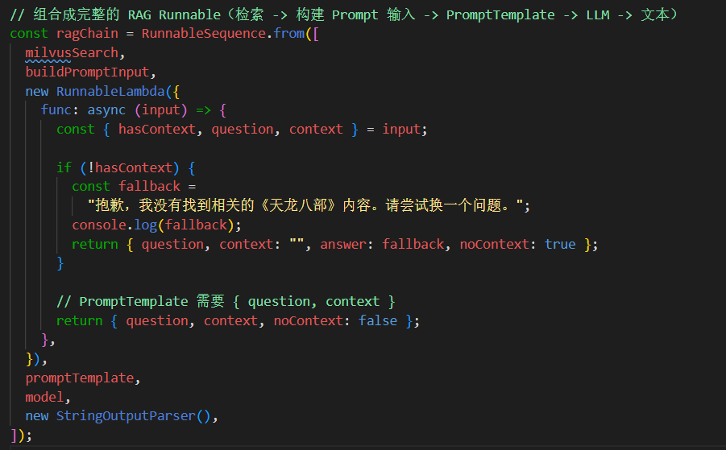

检索 Milvus -> 构建带有文档片段的 prompt  -> 调用大模型 -> 打印结果

准备好环境，之前处理过，将小说转向量，存入向量数据库

#### 完整代码

```js
import "dotenv/config";
import { ChatOpenAI, OpenAIEmbeddings } from "@langchain/openai";
import { RunnableSequence, RunnableLambda } from "@langchain/core/runnables";
import { MilvusClient, MetricType } from "@zilliz/milvus2-sdk-node";
import { PromptTemplate } from "@langchain/core/prompts";
import { StringOutputParser } from "@langchain/core/output_parsers";

const COLLECTION_NAME = "ebook_collection";
const VECTOR_DIM = 1024;

// 初始化 OpenAI Chat 模型
const model = new ChatOpenAI({
  temperature: 0.7,
  modelName: process.env.MODEL_NAME,
  apiKey: process.env.OPENAI_API_KEY,
  configuration: {
    baseURL: process.env.OPENAI_BASE_URL,
  },
});

// 初始化 Embeddings 模型
const embeddings = new OpenAIEmbeddings({
  apiKey: process.env.OPENAI_API_KEY,
  model: process.env.EMBEDDINGS_MODEL_NAME,
  configuration: {
    baseURL: process.env.OPENAI_BASE_URL,
  },
  dimensions: VECTOR_DIM,
});

// 初始化原生 Milvus 客户端
const milvusClient = new MilvusClient({
  address: "localhost:19530",
});

// 从 Milvus 中检索内容的 Runnable
const milvusSearch = new RunnableLambda({
  func: async (input) => {
    const { question, k = 5 } = input;

    try {
      // 1. 生成问题向量
      const queryVector = await embeddings.embedQuery(question);

      // 2. 调用 Milvus 搜索
      const searchResult = await milvusClient.search({
        collection_name: COLLECTION_NAME,
        vector: queryVector,
        limit: k,
        metric_type: MetricType.COSINE,
        output_fields: ["id", "book_id", "chapter_num", "index", "content"],
      });

      const results = searchResult.results ?? [];
      const retrievedContent = results.map((item, idx) => ({
        id: item.id,
        book_id: item.book_id,
        chapter_num: item.chapter_num,
        index: item.index ?? idx,
        content: item.content,
        score: item.score,
      }));

      return { question, retrievedContent };
    } catch (error) {
      console.error("检索内容时出错:", error.message);
      return { question, retrievedContent: [] };
    }
  },
});

// PromptTemplate：负责把 context / question 拼成最终 prompt
const promptTemplate = PromptTemplate.fromTemplate(
  `你是一个专业的《天龙八部》小说助手。基于小说内容回答问题，用准确、详细的语言。

请根据以下《天龙八部》小说片段内容回答问题：
{context}

用户问题: {question}

回答要求：
1. 如果片段中有相关信息，请结合小说内容给出详细、准确的回答
2. 可以综合多个片段的内容，提供完整的答案
3. 如果片段中没有相关信息，请如实告知用户
4. 回答要准确，符合小说的情节和人物设定
5. 可以引用原文内容来支持你的回答

AI 助手的回答:`
);

// 构建 context + 日志打印的 Runnable
const buildPromptInput = new RunnableLambda({
  func: async (input) => {
    const { question, retrievedContent } = input;

    if (!retrievedContent.length) {
      return {
        hasContext: false,
        question,
        context: "",
        retrievedContent,
      };
    }

    // 打印检索结果
    console.log("=".repeat(80));
    console.log(`问题: ${question}`);
    console.log("=".repeat(80));
    console.log("\n【检索相关内容】");

    retrievedContent.forEach((item, i) => {
      console.log(`\n[片段 ${i + 1}] 相似度: ${item.score ?? "N/A"}`);
      console.log(`书籍: ${item.book_id}`);
      console.log(`章节: 第 ${item.chapter_num} 章`);
      console.log(`片段索引: ${item.index}`);
      const content = item.content ?? "";
      console.log(
        `内容: ${content.substring(0, 200)}${
          content.length > 200 ? "..." : ""
        }`
      );
    });

    const context = retrievedContent
      .map((item, i) => {
        return `[片段 ${i + 1}]
章节: 第 ${item.chapter_num} 章
内容: ${item.content}`;
      })
      .join("\n\n━━━━━\n\n");

    return {
      hasContext: true,
      question,
      context,
      retrievedContent,
    };
  },
});

// 组合成完整的 RAG Runnable（检索 -> 构建 Prompt 输入 -> PromptTemplate -> LLM -> 文本）
const ragChain = RunnableSequence.from([
  milvusSearch,
  buildPromptInput,
  new RunnableLambda({
    func: async (input) => {
      const { hasContext, question, context } = input;

      if (!hasContext) {
        const fallback =
          "抱歉，我没有找到相关的《天龙八部》内容。请尝试换一个问题。";
        console.log(fallback);
        return { question, context: "", answer: fallback, noContext: true };
      }

      // PromptTemplate 需要 { question, context }
      return { question, context, noContext: false };
    },
  }),
  promptTemplate,
  model,
  new StringOutputParser(),
]);


async function initMilvusCollection() {
  console.log("连接到 Milvus...");
  await milvusClient.connectPromise;
  console.log("✓ 已连接\n");

  try {
    await milvusClient.loadCollection({ collection_name: COLLECTION_NAME });
    console.log("✓ 集合已加载\n");
  } catch (error) {
    if (!error.message.includes("already loaded")) {
      throw error;
    }
    console.log("✓ 集合已处于加载状态\n");
  }
}

async function main() {
  try {
    await initMilvusCollection();

    const input = {
      question: "鸠摩智会什么武功？",
      k: 5,
    };

    console.log("=".repeat(80));
    console.log(`问题: ${input.question}`);
    console.log("=".repeat(80));
    console.log("\n【AI 流式回答】\n");

    const stream = await ragChain.stream(input);

    for await (const chunk of stream) {
      process.stdout.write(chunk);
    }

    console.log("\n");
  } catch (error) {
    console.error("错误:", error.message);
  }
}

await main();
```

最后用 StringOutputParser 把大模型返回结果变为字符串，然后用 stream 流式打印

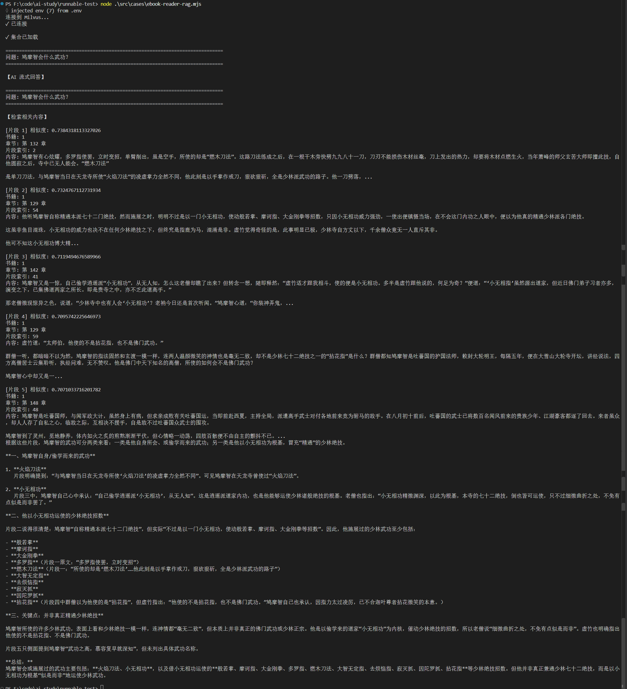

通过这两个案例，就可以了解到 Runnable 的方式来写逻辑：

- 分析整个流程，拆成原子步骤
- 根据步骤之间的关系选择组件（线性、分支、并行、自定义逻辑等）
- 统一调用（invoke、stream、batch）


用 chain 的方式来写有很多好处，可以在每个节点上加一些逻辑，比如重试、传入配置、回调等

### 重试withRetry

```js
import "dotenv/config";
import { RunnableLambda } from "@langchain/core/runnables";

let attempt = 0;

// 一个会随机失败的 Runnable，用来演示 withRetry
const unstableRunnable = RunnableLambda.from(async (input) => {
  attempt += 1;
  console.log(`第 ${attempt} 次尝试，输入: ${input}`);

  // 模拟 70% 概率失败的情况
  if (Math.random() < 0.7) {
    console.log("本次尝试失败，抛出错误。");
    throw new Error("模拟的随机错误");
  }

  console.log("本次尝试成功。");
  return `成功处理: ${input}`;
});

// 使用 withRetry 为 runnable 加上重试逻辑
const runnableWithRetry = unstableRunnable.withRetry({
  // 总共最多 5 次尝试
  stopAfterAttempt: 5
});

try {
  const result = await runnableWithRetry.invoke("演示 withRetry");
  console.log("✅ 最终结果:", result);
} catch (err) {
  console.error("❌ 重试多次后仍然失败:", err?.message ?? err);
}
```


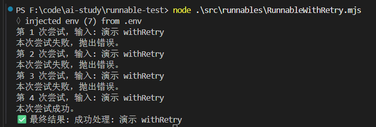

### 节点回调callbacks

```js
import "dotenv/config";
import { RunnableLambda, RunnableSequence } from "@langchain/core/runnables";

// 文本处理链：清洗 → 分词 → 统计
const clean = RunnableLambda.from((text) => {
  return text.trim().replace(/\s+/g, " ");
});

const tokenize = RunnableLambda.from((text) => {
  return text.split(" ");
});

const count = RunnableLambda.from((tokens) => {
  return { tokens, wordCount: tokens.length };
});

const chain = RunnableSequence.from([clean, tokenize, count]);

// 用 callbacks 观测每一步的输出
const callback = {
  handleChainStart(chain) {
    const step = chain?.id?.[chain.id.length - 1] ?? "unknown";
    console.log(`[START] ${step}`);
  },
  handleChainEnd(output) {
    console.log(`[END]   output=${JSON.stringify(output)}\n`);
  },
  handleChainError(err) {
    console.log(`[ERROR] ${err.message}\n`);
  },
};

const result = await chain.invoke("  hello   world   from   langchain  ", {
  callbacks: [callback],
});

console.log("结果:", result);
```

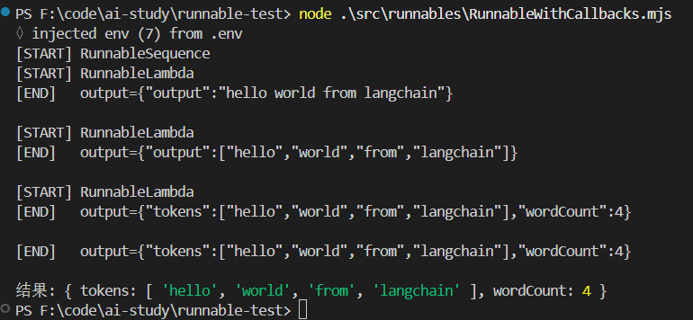

### 回退withFallbacks

```js
import "dotenv/config";
import { RunnableLambda } from "@langchain/core/runnables";

// 模拟三个"翻译服务"，优先级从高到低

const premiumTranslator = RunnableLambda.from(async (text) => {
  console.log("[Premium] 尝试翻译...");
  // 模拟高级服务不可用
  throw new Error("Premium 服务超时");
});

const standardTranslator = RunnableLambda.from(async (text) => {
  console.log("[Standard] 尝试翻译...");
  // 模拟标准服务也挂了
  return "xxx";
  // throw new Error("Standard 服务限流");
});

const localTranslator = RunnableLambda.from(async (text) => {
  console.log("[Local] 使用本地词典翻译...");
  const dict = { hello: "你好", world: "世界", goodbye: "再见" };
  const words = text.toLowerCase().split(" ");
  return words.map((w) => dict[w] ?? w).join("");
});

// withFallbacks：依次尝试 premium → standard → local
const translator = premiumTranslator.withFallbacks({
  fallbacks: [standardTranslator, localTranslator],
});

const result = await translator.invoke("hello world");
console.log("翻译结果:", result);
```

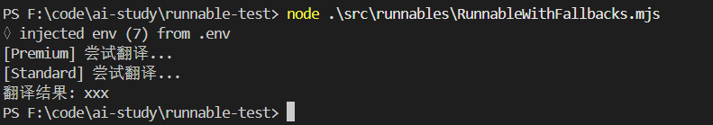

通过 withFallbacks 传入几种备选方案

当前面的报错时，会尝试后面的方案

### 配置

```JS
import "dotenv/config";
import { RunnableLambda, RunnableSequence } from "@langchain/core/runnables";

// 模拟一个简单的"用户数据库"
const mockUsers = new Map([
  [
    "user-123",
    {
      id: "user-123",
      name: "lx",
      email: "lx@example.com",
    },
  ],
]);

// 节点1：根据 config.configurable.userId 查用户
const fetchUserFromConfig = RunnableLambda.from(async (input, config) => {
  const userId = config?.configurable?.userId;

  console.log("【节点1】收到了通知内容:", input);
  console.log("【节点1】从 config 里拿到 userId:", userId);

  const user = userId ? mockUsers.get(userId) : null;

  if (!user) {
    throw new Error("未找到用户，无法发送通知");
  }

  return {
    user,
    notification: input,
  };
});

// 节点2：根据 config.configurable.role 做权限判断
const checkPermissionByRole = RunnableLambda.from(async (state, config) => {
  const role = config?.configurable?.role ?? "普通用户";

  console.log("【节点2】当前角色:", role);

  const canSend =
    role === "管理员" ||
    role === "运营" ||
    role === "系统";

  if (!canSend) {
    throw new Error(`角色「${role}」无权限发送系统通知`);
  }

  return {
    ...state,
    role,
  };
});

// 节点3：根据 locale 生成最终通知文案
const formatNotificationByLocale = RunnableLambda.from(async (state, config) => {
  const locale = config?.configurable?.locale ?? "zh-CN";

  console.log("【节点3】locale:", locale);

  let content;
  if (locale === "en-US") {
    content = `Dear ${state.user.name},\n\n${state.notification}\n\n(from role: ${state.role})`;
  } else {
    content = `亲爱的 ${state.user.name}，\n\n${state.notification}\n\n（发送人角色：${state.role}）`;
  }

  return {
    ...state,
    locale,
    finalContent: content,
  };
});

// 把三个节点串起来
const chain = RunnableSequence.from([
  fetchUserFromConfig,
  checkPermissionByRole,
  formatNotificationByLocale,
]);

// 使用 withConfig 为整个 chain 绑定统一的配置
const chainWithConfig = chain.withConfig({
  tags: ["demo", "withConfig", "notification"],
  metadata: {
    demoName: "RunnableWithConfig",
  },
  configurable: {
    userId: "user-123",
    role: "管理员",
    locale: "zh-CN",
  },
});

// 再创建一个不同配置的 chainWithConfig2，使用英文 locale
const chainWithConfig2 = chain.withConfig({
  tags: ["demo", "withConfig", "notification-en"],
  metadata: {
    demoName: "RunnableWithConfig2",
  },
  configurable: {
    userId: "user-123",
    role: "运营",
    locale: "en-US",
  },
});

// 输入为"要发送的通知文案"
const result = await chainWithConfig.invoke("你有一条新的系统通知，请及时查看。");
console.log("✅ 最终通知内容:\n", result.finalContent);

console.log("\n--- chainWithConfig2 ---\n");

const result2 = await chainWithConfig2.invoke("System maintenance scheduled tonight.");
console.log("✅ 最终通知内容:\n", result2.finalContent);
```

我们用 withConfig 给 chain 传入配置，它会在每个 Runable 节点的第二个参数拿到

我们在第一个节点根据配置拿用户信息，第二个节点根据配置做权限判断，第三个节点根据配置返回不同语言的内容

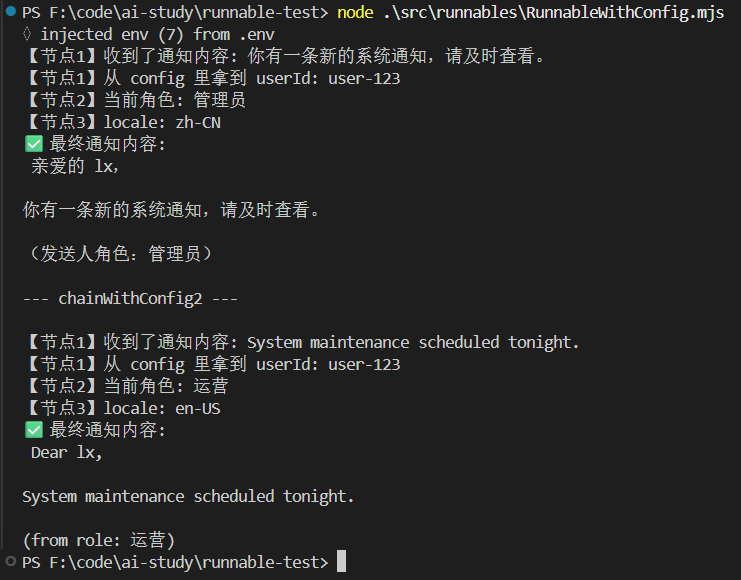

### 总结

用 Runnable 的流程是这样的：

- 分析流程，拆分原子步骤
- 根据步骤之间的关系，选择对应 Runable api
- 统一调用（invoke、stream、batch）

并且写好这个 chain 之后，可以灵活的加一些逻辑：

- withConfig 加入一些配置
- chain 的节点可以通过第二个参数拿到
- withRetry 加上重试逻辑
- withFallback 加上备选方案
- callbacks 可以加一些回调函数，比如打印节点的输出

都是声明式写法