### 背景

在多数情况下，我们希望大模型按照我们要求的格式返回，之前都是自然语言形式

这就会用到 output parser 的 api 了

思路：在prompt中提示大模型需要什么格式， output parser 相当于做了封装

```js
import "dotenv/config";
import { ChatOpenAI } from "@langchain/openai";

// 初始化模型
const model = new ChatOpenAI({
  modelName: process.env.MODEL_NAME,
  apiKey: process.env.OPENAI_API_KEY,
  temperature: 0,
  configuration: {
    baseURL: process.env.OPENAI_BASE_URL,
  },
});

// 简单的问题，要求 JSON 格式返回
const question =
  "请介绍一下爱因斯坦的信息。请以 JSON 格式返回，包含以下字段：name（姓名）、birth_year（出生年份）、nationality（国籍）、major_achievements（主要成就，数组）、famous_theory（著名理论）。";

try {
  console.log("🤔 正在调用大模型...\n");

  const response = await model.invoke(question);

  console.log("✅ 收到响应:\n");
  console.log(response.content);

  // 解析 JSON
  const jsonResult = JSON.parse(response.content);
  console.log("\n📋 解析后的 JSON 对象:");
  console.log(jsonResult);
} catch (error) {
  console.error("❌ 错误:", error.message);
}
```

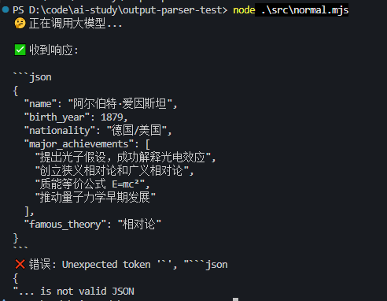

尝试让大模型以json模式返回数据，可以看到直接解析返回的content会失败

因为存在了一些markdown语法

### OutputParser

```js
import 'dotenv/config';
import { ChatOpenAI } from '@langchain/openai';
import { JsonOutputParser } from '@langchain/core/output_parsers';

// 初始化模型
const model = new ChatOpenAI({
    modelName: process.env.MODEL_NAME,
    apiKey: process.env.OPENAI_API_KEY,
    temperature: 0,
    configuration: {
        baseURL: process.env.OPENAI_BASE_URL,
    },
});

const parser = new JsonOutputParser();

// parser.getFormatInstructions() 是 LangChain JsonOutputParser 的方法，它会在 prompt 末尾追加一段格式指令，告诉 LLM 必须输出合法的 JSON
const question = `请介绍一下爱因斯坦的信息。请以 JSON 格式返回，包含以下字段：name（姓名）、birth_year（出生年份）、nationality（国籍）、major_achievements（主要成就，数组）、famous_theory（著名理论）。

${parser.getFormatInstructions()}`;

console.log('question:',question)
try {
    console.log("🤔 正在调用大模型（使用 JsonOutputParser）...\n");

    const response = await model.invoke(question);

    console.log("📤 模型原始响应:\n");
    console.log(response.content);

    const result = await parser.parse(response.content);

    console.log("✅ JsonOutputParser 自动解析的结果:\n");
    console.log(result);
    console.log(`姓名: ${result.name}`);
    console.log(`出生年份: ${result.birth_year}`);
    console.log(`国籍: ${result.nationality}`);
    console.log(`著名理论: ${result.famous_theory}`);
    console.log(`主要成就:`, result.major_achievements);

} catch (error) {
    console.error("❌ 错误:", error.message);
}
```

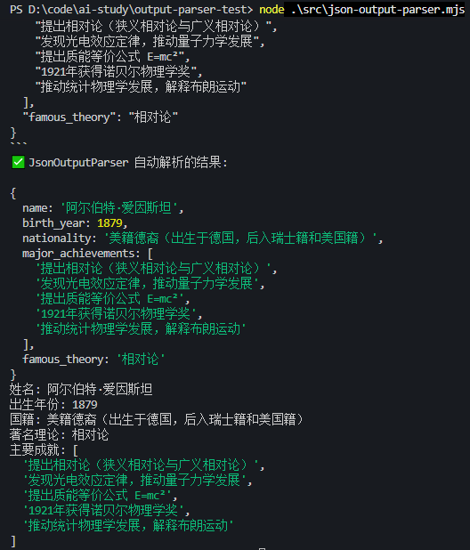

在 prompt 里放一段格式的提示词  - parser.getFormatInstructions()

然后对返回的结果按照格式来 parse - parser.parse(response.content)

这里的getFormatInstructions 似乎没有内容

JsonOutputParser 比较简单，不需要提示词

### StructuredOutputParser

换一个output parser

```js
import 'dotenv/config';
import { ChatOpenAI } from '@langchain/openai';
import { StructuredOutputParser } from '@langchain/core/output_parsers';

// 初始化模型
const model = new ChatOpenAI({
    modelName: process.env.MODEL_NAME,
    apiKey: process.env.OPENAI_API_KEY,
    temperature: 0,
    configuration: {
        baseURL: process.env.OPENAI_BASE_URL,
    },
});

// 定义输出结构
const parser = StructuredOutputParser.fromNamesAndDescriptions({
    name: "姓名",
    birth_year: "出生年份",
    nationality: "国籍",
    major_achievements: "主要成就，用逗号分隔的字符串",
    famous_theory: "著名理论"
});

const question = `请介绍一下爱因斯坦的信息。

${parser.getFormatInstructions()}`;

console.log('question:', question)

try {
    console.log("🤔 正在调用大模型（使用 StructuredOutputParser）...\n");

    const response = await model.invoke(question);

    console.log("📤 模型原始响应:\n");
    console.log(response.content);

    const result = await parser.parse(response.content);

    console.log("\n✅ StructuredOutputParser 自动解析的结果:\n");
    console.log(result);
    console.log(`姓名: ${result.name}`);
    console.log(`出生年份: ${result.birth_year}`);
    console.log(`国籍: ${result.nationality}`);
    console.log(`著名理论: ${result.famous_theory}`);
    console.log(`主要成就: ${result.major_achievements}`);

} catch (error) {
    console.error("❌ 错误:", error.message);
}
```

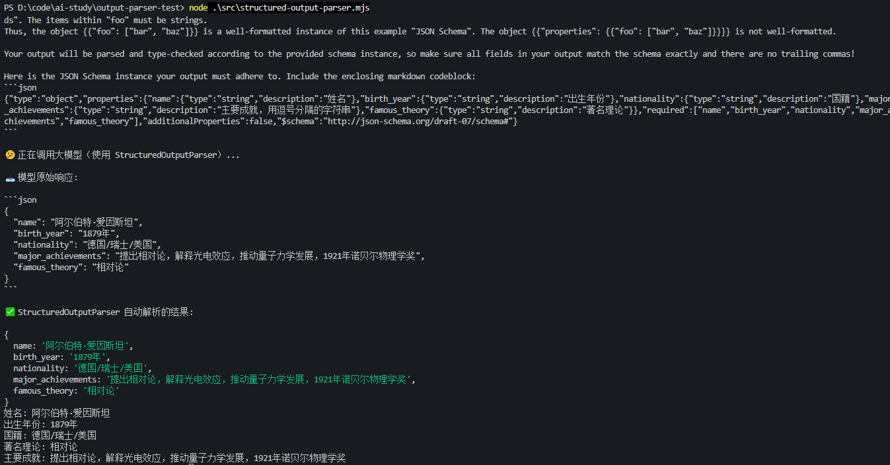

StructuredOutputParser，它可以指定具体的 json 结构  

我们用 fromNamesAndDescriptions 指定了字段和描述

而且`parser.getFormatInstructions()`在prompt中增加了关于解析json的大段描述

实际上这就是output parser 的原理

### StructuredOutputParser + zod 描述参数格式

就像之前写tool，用zod去描述参数格式：

```js
import { z } from 'zod';

// 1. 读取文件工具
const readFileTool = tool(
  async ({ filePath }) => {
    try {
      const content = await fs.readFile(filePath, 'utf-8');
      console.log(`  [工具调用] read_file("${filePath}") - 成功读取 ${content.length} 字节`);
      return `文件内容:\n${content}`;
    } catch (error) {
      console.log(`  [工具调用] read_file("${filePath}") - 错误: ${error.message}`);
      return `读取文件失败: ${error.message}`;
    }
  },
  {
    name: 'read_file',
    description: '读取指定路径的文件内容',
    schema: z.object({
      filePath: z.string().describe('文件路径'),
    }),
  }
);
```

配合zod定义数据结构

```js
import "dotenv/config";
import { ChatOpenAI } from "@langchain/openai";
import { StructuredOutputParser } from "@langchain/core/output_parsers";
import { z } from "zod";

// 初始化模型
const model = new ChatOpenAI({
  modelName: process.env.MODEL_NAME,
  apiKey: process.env.OPENAI_API_KEY,
  temperature: 0,
  configuration: {
    baseURL: process.env.OPENAI_BASE_URL,
  },
});

// 使用 zod 定义复杂的输出结构
const scientistSchema = z.object({
  name: z.string().describe("科学家的全名"),
  birth_year: z.number().describe("出生年份"),
  death_year: z.number().optional().describe("去世年份，如果还在世则不填"),
  nationality: z.string().describe("国籍"),
  fields: z.array(z.string()).describe("研究领域列表"),
  awards: z
    .array(
      z.object({
        name: z.string().describe("奖项名称"),
        year: z.number().describe("获奖年份"),
        reason: z.string().optional().describe("获奖原因"),
      })
    )
    .describe("获得的重要奖项列表"),
  major_achievements: z.array(z.string()).describe("主要成就列表"),
  famous_theories: z
    .array(
      z.object({
        name: z.string().describe("理论名称"),
        year: z.number().optional().describe("提出年份"),
        description: z.string().describe("理论简要描述"),
      })
    )
    .describe("著名理论列表"),
  education: z
    .object({
      university: z.string().describe("主要毕业院校"),
      degree: z.string().describe("学位"),
      graduation_year: z.number().optional().describe("毕业年份"),
    })
    .optional()
    .describe("教育背景"),
  biography: z.string().describe("简短传记，100字以内"),
});

// 从 zod schema 创建 parser
const parser = StructuredOutputParser.fromZodSchema(scientistSchema);

const question = `请介绍一下居里夫人（Marie Curie）的详细信息，包括她的教育背景、研究领域、获得的奖项、主要成就和著名理论。

${parser.getFormatInstructions()}`;

console.log("📋 生成的提示词:\n");
console.log(question);

try {
  console.log("🤔 正在调用大模型（使用 Zod Schema）...\n");

  const response = await model.invoke(question);

  console.log("📤 模型原始响应:\n");
  console.log(response.content);

  const result = await parser.parse(response.content);

  console.log("✅ StructuredOutputParser 自动解析并验证的结果:\n");
  console.log(JSON.stringify(result, null, 2));

  console.log("📊 格式化展示:\n");
  console.log(`👤 姓名: ${result.name}`);
  console.log(`📅 出生年份: ${result.birth_year}`);
  if (result.death_year) {
    console.log(`⚰️  去世年份: ${result.death_year}`);
  }
  console.log(`🌍 国籍: ${result.nationality}`);
  console.log(`🔬 研究领域: ${result.fields.join(", ")}`);

  console.log(`\n🎓 教育背景:`);
  if (result.education) {
    console.log(`   院校: ${result.education.university}`);
    console.log(`   学位: ${result.education.degree}`);
    if (result.education.graduation_year) {
      console.log(`   毕业年份: ${result.education.graduation_year}`);
    }
  }

  console.log(`\n🏆 获得的奖项 (${result.awards.length}个):`);
  result.awards.forEach((award, index) => {
    console.log(`   ${index + 1}. ${award.name} (${award.year})`);
    if (award.reason) {
      console.log(`      原因: ${award.reason}`);
    }
  });

  console.log(`\n💡 著名理论 (${result.famous_theories.length}个):`);
  result.famous_theories.forEach((theory, index) => {
    console.log(
      `   ${index + 1}. ${theory.name}${theory.year ? ` (${theory.year})` : ""}`
    );
    console.log(`      ${theory.description}`);
  });

  console.log(`\n🌟 主要成就 (${result.major_achievements.length}个):`);
  result.major_achievements.forEach((achievement, index) => {
    console.log(`   ${index + 1}. ${achievement}`);
  });

  console.log(`\n📖 传记:`);
  console.log(`   ${result.biography}`);
} catch (error) {
  console.error("❌ 错误:", error.message);
  if (error.name === "ZodError") {
    console.error("验证错误详情:", error.errors);
  }
}
```

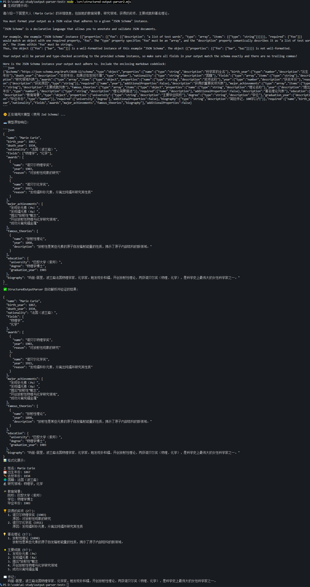

用 zod 描述了一个复杂的对象结构，然后用 StructuredOutputParser 生成提示词，以及 parse

可以看到，StructuredOutputParser 根据格式生成了一大段提示词，并且解析也是正确的

### tool指定参数对象格式

tool 可以指定参数的对象格式，也可以直接用 tool 来获取结构化的结果

通过model.bindTools中的schema指定参数格式

```js
import 'dotenv/config';
import { ChatOpenAI } from '@langchain/openai';
import { z } from 'zod';

const model = new ChatOpenAI({
    modelName: process.env.MODEL_NAME,
    apiKey: process.env.OPENAI_API_KEY,
    temperature: 0,
    configuration: {
        baseURL: process.env.OPENAI_BASE_URL,
    },
});

// 定义结构化输出的 schema
const scientistSchema = z.object({
    name: z.string().describe("科学家的全名"),
    birth_year: z.number().describe("出生年份"),
    nationality: z.string().describe("国籍"),
    fields: z.array(z.string()).describe("研究领域列表"),
});

const modelWithTool = model.bindTools([
    {
        name: "extract_scientist_info",
        description: "提取和结构化科学家的详细信息",
        schema: scientistSchema
    }
]);

// 调用模型
const response = await modelWithTool.invoke("介绍一下爱因斯坦");

console.log('response.tool_calls:',response.tool_calls)
// 获取结构化结果
const result = response.tool_calls[0].args;

console.log("结构化结果:", JSON.stringify(result, null, 2));
console.log(`\n姓名: ${result.name}`);
console.log(`出生年份: ${result.birth_year}`);
console.log(`国籍: ${result.nationality}`);
console.log(`研究领域: ${result.fields.join(', ')}`);
```

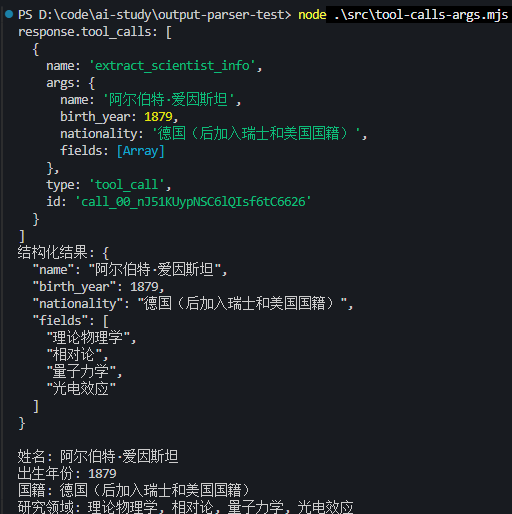

这种方式比 output parser 更好

因为模型训练的时候就保证了生成 tool calls 的参数一定是符合格式要求的，如果不符合，会重新生成

如果只是要求结构化返回数据，用 tool 就行了

### withStructuredOutput

现在获取结构化数据一般会用 withStructuredOutput 这个 api

它会判断模型是否支持 tool calls，支持的话就用 tool 的方式获取结构化数据，否则用 output parser 的方式，不用我们自己去处理

如果是gpt

```js
import "dotenv/config";
import { ChatOpenAI } from "@langchain/openai";
import { z } from "zod";

const model = new ChatOpenAI({
  modelName: process.env.MODEL_NAME,
  apiKey: process.env.OPENAI_API_KEY,
  temperature: 0,
  configuration: {
    baseURL: process.env.OPENAI_BASE_URL,
  },
});


// 定义结构化输出的 schema
const scientistSchema = z.object({
  name: z.string().describe("科学家的全名"),
  birth_year: z.number().describe("出生年份"),
  nationality: z.string().describe("国籍"),
  fields: z.array(z.string()).describe("研究领域列表"),
});

// 使用 withStructuredOutput 方法
const structuredModel = model.withStructuredOutput(scientistSchema);
```

但是我目前使用的是deepseek

**DeepSeek 不支持 OpenAI 原生的 `response_format: { type: "json_schema" }`**

deepseek v4的思考模式和function calling 冲突，所以姚关闭思考模式

```js
import "dotenv/config";
import { ChatOpenAI } from "@langchain/openai";
import { z } from "zod";

const model = new ChatOpenAI({
  modelName: process.env.MODEL_NAME,
  apiKey: process.env.OPENAI_API_KEY,
  temperature: 0,
  configuration: {
    baseURL: process.env.OPENAI_BASE_URL,
  },
  modelKwargs: {
    // 关闭 V4 的思考模式，否则和 function calling 冲突
    thinking: { type: "disabled" }, 
  },
});

// 定义结构化输出的 schema
const scientistSchema = z.object({
  name: z.string().describe("科学家的全名"),
  birth_year: z.number().describe("出生年份"),
  nationality: z.string().describe("国籍"),
  fields: z.array(z.string()).describe("研究领域列表"),
});

// 使用 withStructuredOutput 方法
const structuredModel = model.withStructuredOutput(scientistSchema, {
  method: "functionCalling",
});

// 调用模型
const result = await structuredModel.invoke("介绍一下爱因斯坦");

console.log("结构化结果:", JSON.stringify(result, null, 2));
console.log(`\n姓名: ${result.name}`);
console.log(`出生年份: ${result.birth_year}`);
console.log(`国籍: ${result.nationality}`);
console.log(`研究领域: ${result.fields.join(", ")}`);
```

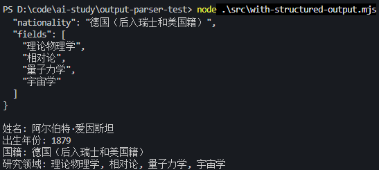

### 流式

但是并不是说 output parser 一般用不到

如果流式打印返回数据的场景，还是需要 output parser 的

而且还有一些非 json 格式的，比如 XML、YAML 等格式的内容，也要用 output parser

```js
import "dotenv/config";
import { ChatOpenAI } from "@langchain/openai";

const model = new ChatOpenAI({
  modelName: process.env.MODEL_NAME,
  apiKey: process.env.OPENAI_API_KEY,
  temperature: 0,
  configuration: {
    baseURL: process.env.OPENAI_BASE_URL,
  },
});

const prompt = `详细介绍莫扎特的信息。`;

console.log("🌊 普通流式输出演示（无结构化）\n");

try {
  const stream = await model.stream(prompt);

  let fullContent = "";
  let chunkCount = 0;

  console.log("📡 接收流式数据:\n");
  // for await...of — 异步迭代（流式数据）
  for await (const chunk of stream) {
    chunkCount++;
    const content = chunk.content;
    fullContent += content;

    process.stdout.write(content); // 实时显示流式文本
  }

  console.log(`\n\n✅ 共接收 ${chunkCount} 个数据块\n`);
  console.log(`📝 完整内容长度: ${fullContent.length} 字符`);
} catch (error) {
  console.error("\n❌ 错误:", error.message);
}
```

 invoke 换成 stream 方法了

用 for await 打印异步返回的 chunk

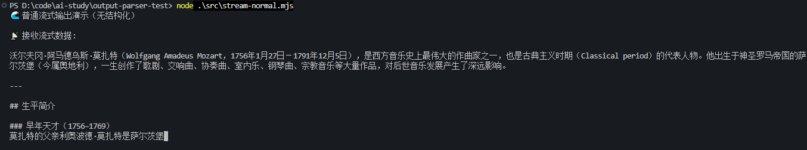

### 流式+withStructuredOutput（不是流式返回）

用 withStructuredOutput 做一下流式的结构化输出

```js
import "dotenv/config";
import { ChatOpenAI } from "@langchain/openai";
import { z } from "zod";

const model = new ChatOpenAI({
  modelName: process.env.MODEL_NAME,
  apiKey: process.env.OPENAI_API_KEY,
  temperature: 0,
  configuration: {
    baseURL: process.env.OPENAI_BASE_URL,
  },
  modelKwargs: {
    // 关闭 V4 的思考模式，否则和 function calling 冲突
    thinking: { type: "disabled" },
  },
});

// 使用 zod 定义结构化输出格式
const schema = z.object({
  name: z.string().describe("姓名"),
  birth_year: z.number().describe("出生年份"),
  death_year: z.number().describe("去世年份"),
  nationality: z.string().describe("国籍"),
  occupation: z.string().describe("职业"),
  famous_works: z.array(z.string()).describe("著名作品列表"),
  biography: z.string().describe("简短传记"),
});

const structuredModel = model.withStructuredOutput(schema, {
  method: "functionCalling",
});

const prompt = `详细介绍莫扎特的信息。`;

console.log("🌊 流式结构化输出演示（withStructuredOutput）\n");

try {
  const stream = await structuredModel.stream(prompt);

  let chunkCount = 0;
  let result = null;

  console.log("📡 接收流式数据:\n");

  for await (const chunk of stream) {
    chunkCount++;
    result = chunk;

    console.log(`[Chunk ${chunkCount}]`);
    console.log(JSON.stringify(chunk, null, 2));
  }

  console.log(`\n✅ 共接收 ${chunkCount} 个数据块\n`);

  if (result) {
    console.log("📊 最终结构化结果:\n");
    console.log(JSON.stringify(result, null, 2));

    console.log("\n📝 格式化输出:");
    console.log(`姓名: ${result.name}`);
    console.log(`出生年份: ${result.birth_year}`);
    console.log(`去世年份: ${result.death_year}`);
    console.log(`国籍: ${result.nationality}`);
    console.log(`职业: ${result.occupation}`);
    console.log(`著名作品: ${result.famous_works.join(", ")}`);
    console.log(`传记: ${result.biography}`);
  }
} catch (error) {
  console.error("\n❌ 错误:", error.message);
}
```

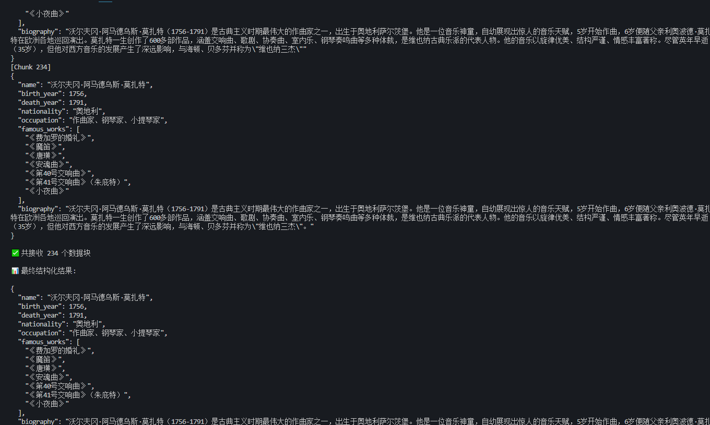

虽然我们是用的 stream 的流式方式打印

但是用了 withStructuredOutput 之后，它会在 json 生成完通过校验后再返回（底层是 tool calls）

这样就不是流式返回了

LangChain 的 `withStructuredOutput` 包装 —— 缓冲累积

`@langchain/core` 中的 `withStructuredOutput` 在流式模式下做了以下事情：

1. **接收 OpenAI 的流式 chunk**，每个 chunk 里是部分 JSON 字符串
2. **累积拼接**这些 JSON 片段到内部 buffer 中
3. **尝试解析**：每当有新片段到达，尝试 `JSON.parse(buffer)`，但**部分 JSON 必然解析失败**（比如 `{"name": "Wolfgang` 不是合法 JSON）
4. **只有流结束（stream done）时**，才拿到完整的 JSON 字符串，这时 `JSON.parse` 成功
5. **zod 校验**：将解析出的对象传入 zod schema 进行验证
6. **只有校验通过**，才通过 async iterable 对外 emit 结果

这就是为什么你的 `for await (const chunk of stream)` 循环里基本上收到的是**一个（或极少数）完整的最终结果**，而不是增量片段。

> `withStructuredOutput` + `method: "functionCalling"` 在底层确实通过 tool calls 生成 JSON，而 LangChain 会在 JSON 完整生成并通过 zod 校验之后才返回结果，所以看起来不是"逐字流式"的。

### 流式+StructuredOutputParser

```js
import "dotenv/config";
import { ChatOpenAI } from "@langchain/openai";
import { StructuredOutputParser } from "@langchain/core/output_parsers";
import { z } from "zod";

const model = new ChatOpenAI({
  modelName: process.env.MODEL_NAME,
  apiKey: process.env.OPENAI_API_KEY,
  temperature: 0,
  configuration: {
    baseURL: process.env.OPENAI_BASE_URL,
  },
});

// 使用 zod 定义结构化输出格式
const schema = z.object({
  name: z.string().describe("姓名"),
  birth_year: z.number().describe("出生年份"),
  death_year: z.number().describe("去世年份"),
  nationality: z.string().describe("国籍"),
  occupation: z.string().describe("职业"),
  famous_works: z.array(z.string()).describe("著名作品列表"),
  biography: z.string().describe("简短传记"),
});

const parser = StructuredOutputParser.fromZodSchema(schema);

const prompt = `详细介绍莫扎特的信息。\n\n${parser.getFormatInstructions()}`;

console.log("🌊 流式结构化输出演示\n");

try {
  const stream = await model.stream(prompt);

  let fullContent = "";
  let chunkCount = 0;

  console.log("📡 接收流式数据:\n");

  for await (const chunk of stream) {
    chunkCount++;
    const content = chunk.content;
    fullContent += content;

    process.stdout.write(content); // 实时显示流式文本
  }

  console.log(`\n\n✅ 共接收 ${chunkCount} 个数据块\n`);

  // 解析完整内容为结构化数据
  const result = await parser.parse(fullContent);

  console.log("📊 解析后的结构化结果:\n");
  console.log(JSON.stringify(result, null, 2));

  console.log("\n📝 格式化输出:");
  console.log(`姓名: ${result.name}`);
  console.log(`出生年份: ${result.birth_year}`);
  console.log(`去世年份: ${result.death_year}`);
  console.log(`国籍: ${result.nationality}`);
  console.log(`职业: ${result.occupation}`);
  console.log(`著名作品: ${result.famous_works.join(", ")}`);
  console.log(`传记: ${result.biography}`);
} catch (error) {
  console.error("\n❌ 错误:", error.message);
}
```

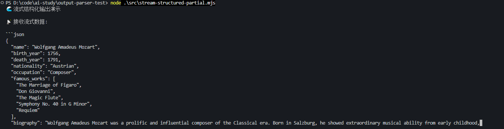

可以看到，现在是边生成边打印，最后再 parse

流式的情况下，用 output parser 还是更适合

### 直接暴露 OpenAI 原始 chunk

但是如果想要使用tool_calls来做结构化输出，而且还想要流式打印

```js
import "dotenv/config";
import { ChatOpenAI } from "@langchain/openai";
import { z } from "zod";

const model = new ChatOpenAI({
  modelName: process.env.MODEL_NAME,
  apiKey: process.env.OPENAI_API_KEY,
  temperature: 0,
  configuration: {
    baseURL: process.env.OPENAI_BASE_URL,
  },
});

// 定义结构化输出的 schema
const scientistSchema = z.object({
  name: z.string().describe("科学家的全名"),
  birth_year: z.number().describe("出生年份"),
  death_year: z.number().optional().describe("去世年份，如果还在世则不填"),
  nationality: z.string().describe("国籍"),
  fields: z.array(z.string()).describe("研究领域列表"),
  achievements: z.array(z.string()).describe("主要成就"),
  biography: z.string().describe("简短传记"),
});

// 绑定工具到模型
const modelWithTool = model.bindTools([
  {
    name: "extract_scientist_info",
    description: "提取和结构化科学家的详细信息",
    schema: scientistSchema,
  },
]);

console.log("🌊 流式 Tool Calls 演示 - 直接打印原始 tool_calls_chunk\n");

try {
  // 开启流式输出
  const stream = await modelWithTool.stream("详细介绍牛顿的生平和成就");

  console.log("📡 实时输出流式 tool_calls_chunk:\n");

  let chunkIndex = 0;

  for await (const chunk of stream) {
    chunkIndex++;
    // console.log(chunk);
    // 直接打印每个 chunk 的 tool_calls 信息
    if (chunk.tool_call_chunks && chunk.tool_call_chunks.length > 0) {
      process.stdout.write(chunk.tool_call_chunks[0].args || "");
    }
  }

  console.log("\n\n✅ 流式输出完成");
} catch (error) {
  console.error("\n❌ 错误:", error.message);
  console.error(error);
}
```

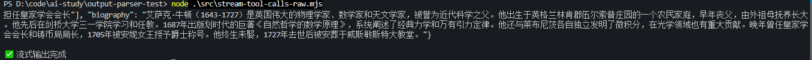

这里打印下 每个chunk，可以看到tool_call_chunk里的chunk.tool_call_chunks[0].args

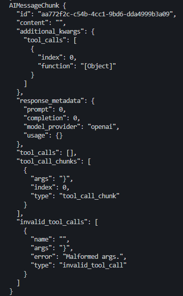

每个chunk返回值可能如下：

```shell
Chunk 1:  '{"name":"'
Chunk 2:  '艾萨克'
Chunk 3:  '·牛顿","'
Chunk 4:  'birth_year":'
Chunk 5:  '1643,'
Chunk 6:  '"death_year":'
Chunk 7:  '1727,'
...
Chunk N:  '家"}'
```

**代价**：

`bindTools()` 给你原始数据，但**不做 zod 校验、不做 JSON 解析、不保证最终数据合法**。你需要自己：

1. 拼接所有 `args` 片段得到完整 JSON 字符串
2. 手动 `JSON.parse()`
3. 手动 `scientistSchema.parse()` 校验

而 `withStructuredOutput` 帮你自动完成了以上三步，代价就是失去了逐 token 的流式感。**这是一个"实时性 vs 可靠性"的经典权衡。**

### JsonOutputToolsParser

它的作用就是解析 tool_call_chunks 中的内容，拼接成符合 json 格式规范的对象，就算 chunk 还没传输完的时候，也能拿到 json 对象

```js
import "dotenv/config";
import { ChatOpenAI } from "@langchain/openai";
import { JsonOutputToolsParser } from "@langchain/core/output_parsers/openai_tools";
import { z } from "zod";

const model = new ChatOpenAI({
  modelName: process.env.MODEL_NAME,
  apiKey: process.env.OPENAI_API_KEY,
  temperature: 0,
  configuration: {
    baseURL: process.env.OPENAI_BASE_URL,
  },
});

// 定义结构化输出的 schema
const scientistSchema = z.object({
  name: z.string().describe("科学家的全名"),
  birth_year: z.number().describe("出生年份"),
  death_year: z.number().optional().describe("去世年份，如果还在世则不填"),
  nationality: z.string().describe("国籍"),
  fields: z.array(z.string()).describe("研究领域列表"),
  achievements: z.array(z.string()).describe("主要成就"),
  biography: z.string().describe("简短传记"),
});

// 绑定工具到模型
const modelWithTool = model.bindTools([
  {
    name: "extract_scientist_info",
    description: "提取和结构化科学家的详细信息",
    schema: scientistSchema,
  },
]);

// 1. 绑定工具并挂载解析器
const parser = new JsonOutputToolsParser();
const chain = modelWithTool.pipe(parser);

try {
  // 2. 开启流
  const stream = await chain.stream("详细介绍牛顿的生平和成就");

  let lastContent = ""; // 记录已打印的完整内容
  let finalResult = null; // 存储最终的完整结果

  console.log("📡 实时输出流式内容:\n");

  for await (const chunk of stream) {
    // console.log(chunk);

    if (chunk.length > 0) {
      const toolCall = chunk[0];

      // 获取当前工具调用的完整参数内容 toolCall.args 是目前为止累积解析出的部分对象
      const currentContent = JSON.stringify(toolCall.args || {}, null, 2);

      if (currentContent.length > lastContent.length) {
        const newText = currentContent.slice(lastContent.length);
        process.stdout.write(newText); // 实时输出到控制台
        lastContent = currentContent; // 更新已读进度
      }

      console.log(toolCall.args);
    }
  }

  console.log("\n\n✅ 流式输出完成");
} catch (error) {
  console.error("\n❌ 错误:", error.message);
  console.error(error);
}
```

**toolCall.args 是目前为止累积解析出的部分对象**

每个chunk的结构如下：

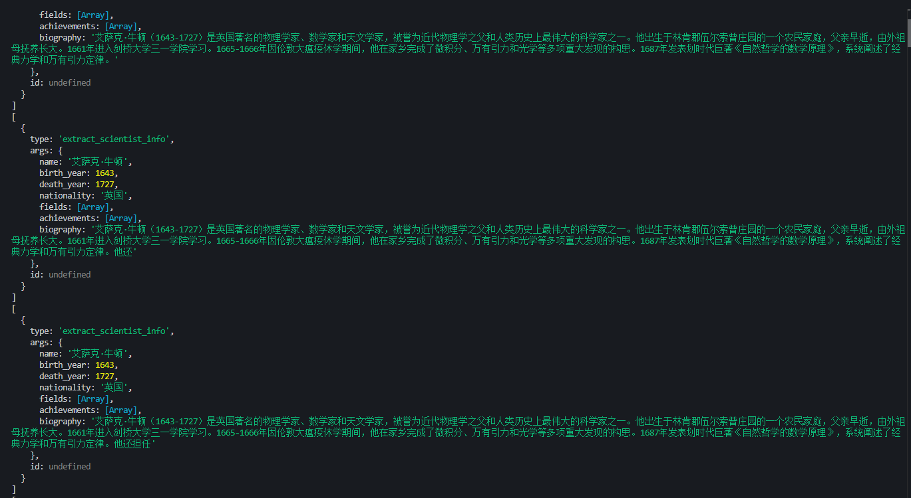

可以看到，就算是流式返回的 tool_call_chunks 还不完整，也会拼成正确格式的 tool_calls

这样就可以实时调用工具，传入部分参数了

withStructuredOutput 不适合的场景有两个：

- 流式打印内容，这种还是需要 Output Parser

- XML、YAML 等非 json 格式，也需要 Output Parser

### XML output parser

```js
import "dotenv/config";
import { ChatOpenAI } from "@langchain/openai";
import { XMLOutputParser } from "@langchain/core/output_parsers";

// 初始化模型
const model = new ChatOpenAI({
  modelName: process.env.MODEL_NAME,
  apiKey: process.env.OPENAI_API_KEY,
  temperature: 0,
  configuration: {
    baseURL: process.env.OPENAI_BASE_URL,
  },
});

const parser = new XMLOutputParser();

const question = `请提取以下文本中的人物信息：阿尔伯特·爱因斯坦出生于 1879 年，是一位伟大的物理学家。

${parser.getFormatInstructions()}`;

console.log("question:", question);

try {
  console.log("🤔 正在调用大模型（使用 XMLOutputParser）...\n");

  const response = await model.invoke(question);

  console.log("📤 模型原始响应:\n");
  console.log(response.content);

  const result = await parser.parse(response.content);

  console.log("\n✅ XMLOutputParser 自动解析的结果:\n");
  console.log(result);
} catch (error) {
  console.error("❌ 错误:", error.message);
}
```

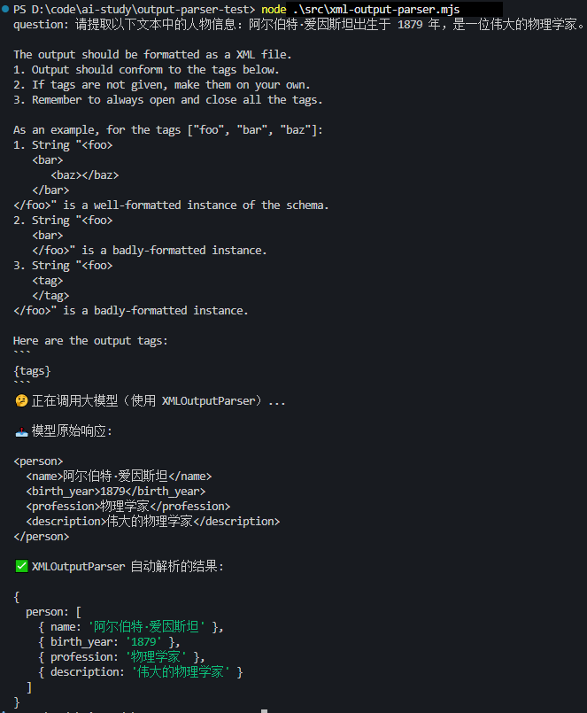

可以看到在提示词中有一些getFormatInstructions生成的格式信息

这种也用不了 withStructuredOutput（也就是 tool call）来做结构化，还是得用 output parser

### 总结

output parser 的原理就是在 prompt 中加入格式信息，让 LLM 按指定格式输出，然后对结果进行 parse。

本文涉及了四种结构化输出的方案，它们各有适用场景：

#### JsonOutputParser

- **定位**：最基础的 JSON 输出解析器，不需要手动写格式提示词
- **原理**：`getFormatInstructions()` 自动在 prompt 末尾追加一段格式指令，告诉 LLM 输出合法 JSON
- **适用场景**：简单的 JSON 输出需求，不关心具体字段结构，不需要 zod 校验；快速原型/测试
- **局限**：只是告诉模型"返回 JSON"，不做 schema 校验，模型可能返回缺少字段或字段类型不对的 JSON

#### StructuredOutputParser

- **定位**：可以指定具体 JSON 结构，支持两种方式定义结构：
  - `fromNamesAndDescriptions`：用 key + 描述的方式，适合简单扁平结构
  - `fromZodSchema`：配合 zod 定义复杂嵌套结构，自动生成提示词 + 解析 + 校验
- **原理**：根据结构定义生成详细的格式指令注入 prompt，返回后自动 parse 并用 zod 校验
- **适用场景**：需要精确控制输出字段和类型、不需要流式返回、需要 zod 做解析时校验的场景
- **局限**：仅靠 prompt 约束，无法保证 100% 格式正确；不支持流式（需完整字符串才能 parse）

#### XMLOutputParser

- **定位**：让 LLM 输出 XML 格式并解析
- **原理**：通过 prompt 指令让模型输出 XML 标签包裹的内容，parser 解析 XML 结构
- **适用场景**：模型**不支持 tool calls / function calling**（如部分本地开源模型），但又需要结构化输出的场景；文档标记类任务（如问答对提取、实体标注等）
- **局限**：XML 比 JSON 冗余，token 消耗更大；XML 格式解析复杂，容易因标签不闭合等问题出错

#### withStructuredOutput

- **定位**：目前**推荐的首选方式**，获取结构化数据最方便
- **原理**：自动判断模型是否支持 tool calls（function calling）：
  - 支持 → 用 tool calls 方式，模型训练时就保证了 tool call 参数格式正确
  - 不支持 → 降级回 output parser 方式
- **适用场景**：大多数需要结构化输出的场景，配合 zod schema 使用，开发体验最好
- **不适合的场景**：
  1. 需要**逐 token 流式返回**的场景——`withStructuredOutput` + `method: "functionCalling"` 会在 JSON 完整生成并通过 zod 校验后才返回，看起来不是逐字流式，而是一次性返回完整结果
  2. 需要输出 **XML 等非 JSON 格式**的场景——tool calls 底层只产 JSON

#### 选型建议

| 需求                                | 推荐方案                                            |
| ----------------------------------- | --------------------------------------------------- |
| 日常结构化输出，模型支持 tool calls | `withStructuredOutput` + zod                        |
| 需要逐 token 流式体验               | 直接用 OpenAI 原始 chunk                            |
| 模型不支持 tool calls（本地模型等） | `StructuredOutputParser` + zod 或 `XMLOutputParser` |
| 只需简单 JSON，无严格结构要求       | `JsonOutputParser`                                  |
| 需要输出 XML 格式                   | `XMLOutputParser`                                   |
