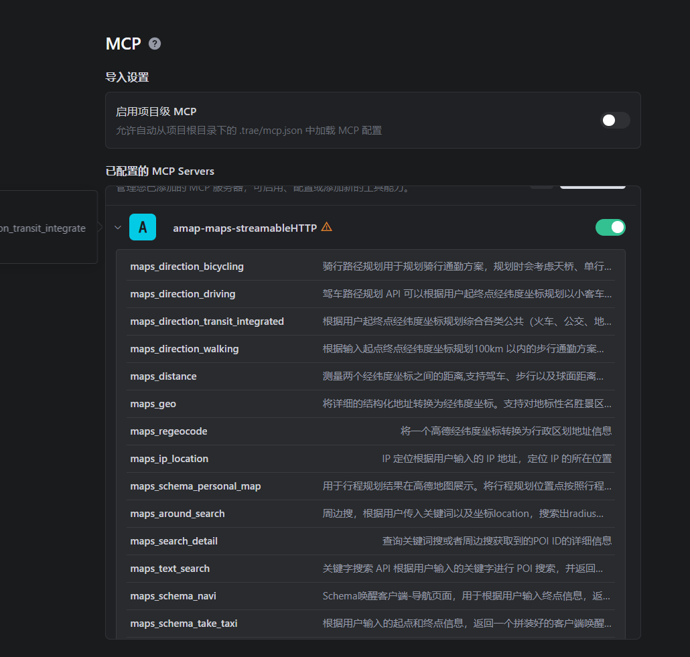
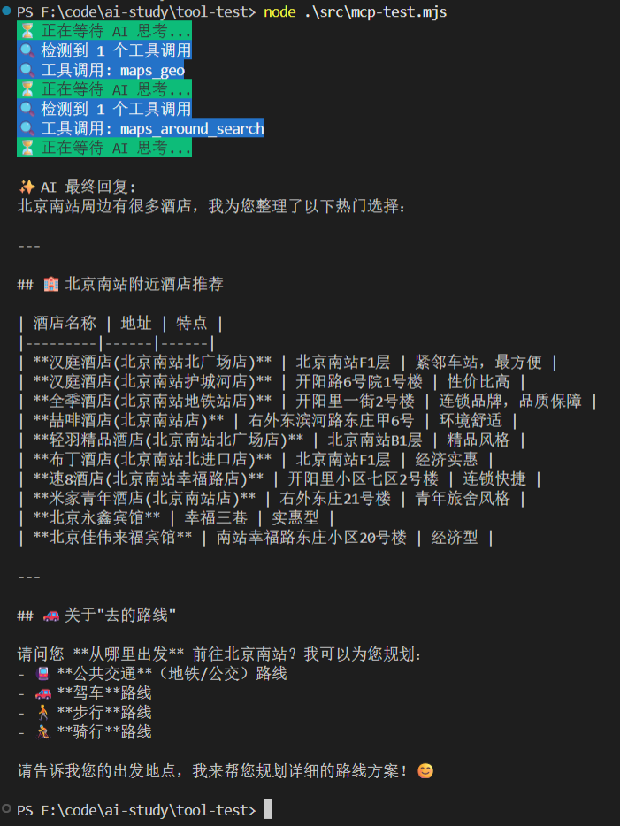
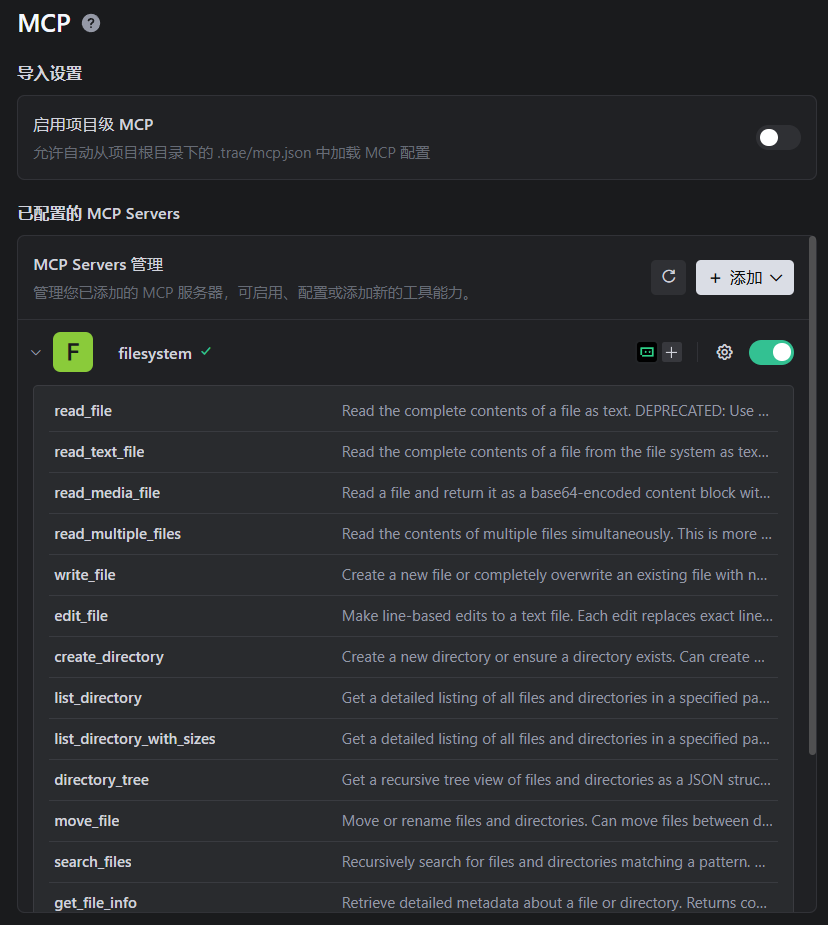
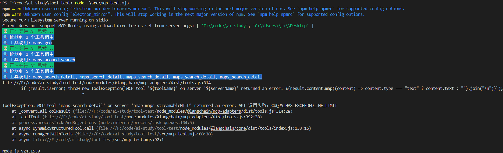
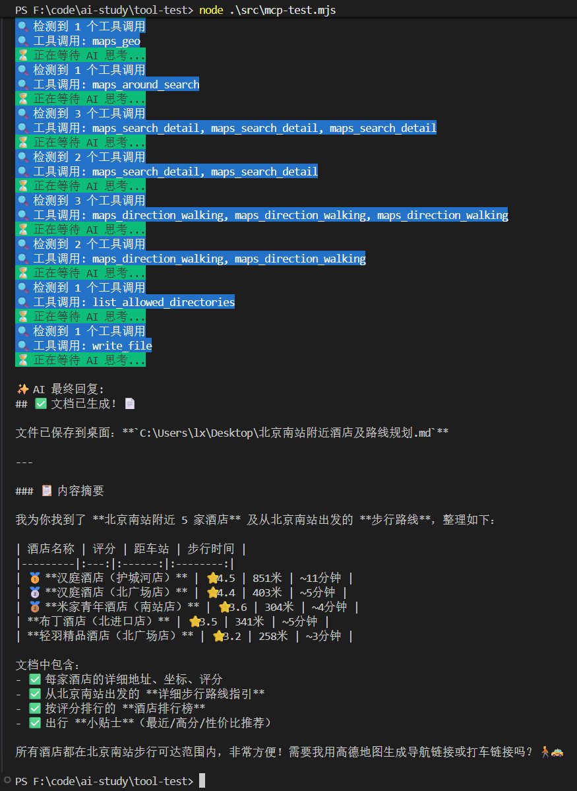
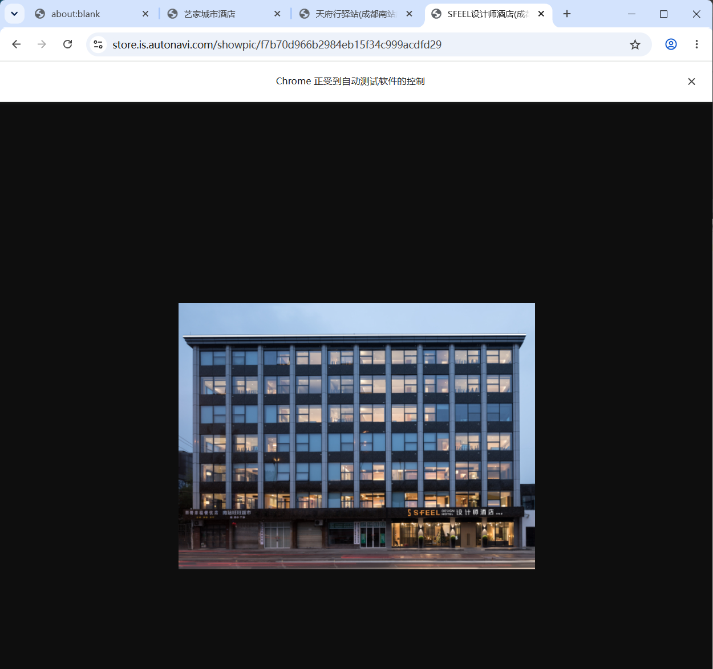

尝试使用MCP Server：

- 高德 MCP：可以做位置查询、路线规划等 
- Chrome DevTools MCP：控制浏览器，打开关闭页面、点击元素、截图等  
- FileSystem MCP：读写文件、创建目录等

### 高德MCP

在高德开放平台注册并创建应用，申请api key，可参考官方文档：[快速接入-MCP Server|高德地图API](https://lbs.amap.com/api/mcp-server/gettingstarted)



在 trae 中配置好 mcp，可以看到可以调用的工具 tool

这就是http的接入方式

当然也支持stdio方式接入：

```json
{
  "mcpServers": {
    "amap-maps": {
      "command": "npx",
      "args": ["-y", "@amap/amap-maps-mcp-server"],
      "env": {
        "AMAP_MAPS_API_KEY": "您在高德官网上申请的key"
      }
    }
  }
}
```

就是用 npx 跑一个 npm 包，会创建一个支持 stdio 连接的进程，然后连上其中的 mcp server 就好了

这个 mcp server 里肯定封装了和高德服务端的通信，本质上是一样的

接下来在langchain中使用这个mcp：

```js
import "dotenv/config";
import { MultiServerMCPClient } from "@langchain/mcp-adapters";
import { ChatOpenAI } from "@langchain/openai";
import chalk from "chalk";
import {
  HumanMessage,
  SystemMessage,
  ToolMessage,
} from "@langchain/core/messages";

const model = new ChatOpenAI({
  modelName: "deepseek-v4-flash",
  apiKey: process.env.OPENAI_API_KEY,
  configuration: {
    baseURL: process.env.OPENAI_BASE_URL,
  },
});

const mcpClient = new MultiServerMCPClient({
  mcpServers: {
    "my-mcp-server": {
      command: "node",
      args: ["src/my-mcp-server.mjs"],
    },
    "amap-maps-streamableHTTP": {
      url: "https://mcp.amap.com/mcp?key=" + process.env.AMAP_MAPS_API_KEY,
    },
  },
});

const tools = await mcpClient.getTools();
const modelWithTools = model.bindTools(tools);

async function runAgentWithTools(query, maxIterations = 30) {
  const messages = [new HumanMessage(query)];

  for (let i = 0; i < maxIterations; i++) {
    console.log(chalk.bgGreen(`⏳ 正在等待 AI 思考...`));
    const response = await modelWithTools.invoke(messages);
    messages.push(response);

    // 检查是否有工具调用
    if (!response.tool_calls || response.tool_calls.length === 0) {
      console.log(`\n✨ AI 最终回复:\n${response.content}\n`);
      return response.content;
    }

    console.log(
      chalk.bgBlue(`🔍 检测到 ${response.tool_calls.length} 个工具调用`),
    );
    console.log(
      chalk.bgBlue(
        `🔍 工具调用: ${response.tool_calls.map((t) => t.name).join(", ")}`,
      ),
    );
    // 执行工具调用
    for (const toolCall of response.tool_calls) {
      const foundTool = tools.find((t) => t.name === toolCall.name);
      if (foundTool) {
        const toolResult = await foundTool.invoke(toolCall.args);

        messages.push(
          new ToolMessage({
            content: toolResult,
            tool_call_id: toolCall.id,
          }),
        );
      }
    }
  }

  return messages[messages.length - 1].content;
}

await runAgentWithTools("北京南站附近的酒店，以及去的路线");

await mcpClient.close();
```

和之前一样，只是添加了一个环境变量用于控制高德的key

用 @langchain/mcp-adapters -> 拿到其中的 tools 绑定给 model -> 然后调用 model，如果有 tool_calls 就调用下，把工具调用结果封装为 ToolMessage 传给大模型继续处理

运行之后结果如下：



可以看到成功，就是成功复用了别人的tool

然后关于文件读写、创建目录这种，也不用自己写 tool，可以用现成 mcp [@modelcontextprotocol/server-filesystem - npm](https://www.npmjs.com/package/@modelcontextprotocol/server-filesystem)：

```json
{
  "mcpServers": {
    "filesystem": {
      "command": "npx",
      "args": [
        "-y",
        "@modelcontextprotocol/server-filesystem",
        ...(process.env.ALLOWED_PATHS.split(',') || '')
      ]
    }
  }
}
```

这里我们也配置好可访问的目录，也写入环境变量，用逗号分隔

然后再trae中配置这个mcp，这里配置的时候直接写路径



### 读写文件MCP

就可以看到有读写文件，目录创建，移动文件等tool

```js
import "dotenv/config";
import { MultiServerMCPClient } from "@langchain/mcp-adapters";
import { ChatOpenAI } from "@langchain/openai";
import chalk from "chalk";
import {
  HumanMessage,
  SystemMessage,
  ToolMessage,
} from "@langchain/core/messages";

const model = new ChatOpenAI({
  modelName: "deepseek-v4-flash",
  apiKey: process.env.OPENAI_API_KEY,
  configuration: {
    baseURL: process.env.OPENAI_BASE_URL,
  },
});

const mcpClient = new MultiServerMCPClient({
  mcpServers: {
    "my-mcp-server": {
      command: "node",
      args: ["src/my-mcp-server.mjs"],
    },
    "amap-maps-streamableHTTP": {
      url: "https://mcp.amap.com/mcp?key=" + process.env.AMAP_MAPS_API_KEY,
    },
    filesystem: {
      command: "npx",
      args: [
        "-y",
        "@modelcontextprotocol/server-filesystem",
        ...(process.env.ALLOWED_PATHS.split(",") || ""),
      ],
    },
  },
});

const tools = await mcpClient.getTools();
const modelWithTools = model.bindTools(tools);

async function runAgentWithTools(query, maxIterations = 30) {
  const messages = [new HumanMessage(query)];

  for (let i = 0; i < maxIterations; i++) {
    console.log(chalk.bgGreen(`⏳ 正在等待 AI 思考...`));
    const response = await modelWithTools.invoke(messages);
    messages.push(response);

    // 检查是否有工具调用
    if (!response.tool_calls || response.tool_calls.length === 0) {
      console.log(`\n✨ AI 最终回复:\n${response.content}\n`);
      return response.content;
    }

    console.log(
      chalk.bgBlue(`🔍 检测到 ${response.tool_calls.length} 个工具调用`),
    );
    console.log(
      chalk.bgBlue(
        `🔍 工具调用: ${response.tool_calls.map((t) => t.name).join(", ")}`,
      ),
    );
    // 执行工具调用
    for (const toolCall of response.tool_calls) {
      const foundTool = tools.find((t) => t.name === toolCall.name);
      if (foundTool) {
        const toolResult = await foundTool.invoke(toolCall.args);

        // 确保 content 是字符串类型
        let contentStr;
        if (typeof toolResult === "string") {
          contentStr = toolResult;
        } else if (toolResult && toolResult.text) {
          // 如果返回对象有 text 字段，优先使用
          contentStr = toolResult.text;
        }

        messages.push(
          new ToolMessage({
            content: contentStr,
            tool_call_id: toolCall.id,
          }),
        );
      }
    }
  }

  return messages[messages.length - 1].content;
}

await runAgentWithTools(
  "北京南站附近的5个酒店，以及去的路线，路线规划生成文档保存到 桌面 的一个 md 文件",
);

await mcpClient.close();
```

注意：一般我们写 tool 都是直接返回字符串，但是 FileSystem MCP 封装的这些 tool 返回的是对象，有 text 属性，所以要处理下

除此之外，运行代码后会遇到高德api报错：



CUQPS_HAS_EXCEEDED_THE_LIMIT这个错误是高德地区的api请求 qps限制是个人版3 qps/s

修改下提示词

```js
await runAgentWithTools(
  `- 每一轮对话中，最多只能同时发起 3 个 maps_ 工具调用；   
  - 如果需要查询超过 3 个地点，必须分批执行：每批最多 3 个，等上一批全部返回结果后，再发起下一批；   
  - 严禁在同一轮中一次性发起超过 3 个 maps_ 工具调用
  北京南站附近的5个酒店，以及去的路线，路线规划生成文档保存到 桌面 的一个 md 文件`,
);
```

成功调用



### 浏览器MCP

```json
{
  "mcpServers": {
    "chrome-devtools": {
      "command": "npx",
      "args": ["-y", "chrome-devtools-mcp@latest"]
    }
  }
}
```

在langchain中调用下并修改提示词

```js
import "dotenv/config";
import { MultiServerMCPClient } from "@langchain/mcp-adapters";
import { ChatOpenAI } from "@langchain/openai";
import chalk from "chalk";
import {
  HumanMessage,
  SystemMessage,
  ToolMessage,
} from "@langchain/core/messages";

const model = new ChatOpenAI({
  modelName: "deepseek-v4-flash",
  apiKey: process.env.OPENAI_API_KEY,
  configuration: {
    baseURL: process.env.OPENAI_BASE_URL,
  },
});

const mcpClient = new MultiServerMCPClient({
  mcpServers: {
    "my-mcp-server": {
      command: "node",
      args: ["src/my-mcp-server.mjs"],
    },
    "amap-maps-streamableHTTP": {
      url: "https://mcp.amap.com/mcp?key=" + process.env.AMAP_MAPS_API_KEY,
    },
    filesystem: {
      command: "npx",
      args: [
        "-y",
        "@modelcontextprotocol/server-filesystem",
        ...(process.env.ALLOWED_PATHS.split(",") || ""),
      ],
    },
    "chrome-devtools": {
      command: "npx",
      args: ["-y", "chrome-devtools-mcp@latest"],
    },
  },
});

const tools = await mcpClient.getTools();
const modelWithTools = model.bindTools(tools);

async function runAgentWithTools(query, maxIterations = 30) {
  const messages = [new HumanMessage(query)];

  for (let i = 0; i < maxIterations; i++) {
    console.log(chalk.bgGreen(`⏳ 正在等待 AI 思考...`));
    const response = await modelWithTools.invoke(messages);
    messages.push(response);

    // 检查是否有工具调用
    if (!response.tool_calls || response.tool_calls.length === 0) {
      console.log(`\n✨ AI 最终回复:\n${response.content}\n`);
      return response.content;
    }

    console.log(
      chalk.bgBlue(`🔍 检测到 ${response.tool_calls.length} 个工具调用`),
    );
    console.log(
      chalk.bgBlue(
        `🔍 工具调用: ${response.tool_calls.map((t) => t.name).join(", ")}`,
      ),
    );
    // 执行工具调用
    for (const toolCall of response.tool_calls) {
      const foundTool = tools.find((t) => t.name === toolCall.name);
      if (foundTool) {
        const toolResult = await foundTool.invoke(toolCall.args);

        // 确保 content 是字符串类型
        let contentStr;
        if (typeof toolResult === "string") {
          contentStr = toolResult;
        } else if (toolResult && toolResult.text) {
          // 如果返回对象有 text 字段，优先使用
          contentStr = toolResult.text;
        }

        messages.push(
          new ToolMessage({
            content: contentStr,
            tool_call_id: toolCall.id,
          }),
        );
      }
    }
  }

  return messages[messages.length - 1].content;
}

await runAgentWithTools(
  `- 每一轮对话中，最多只能同时发起 3 个 maps_ 工具调用；   
  - 如果需要查询超过 3 个地点，必须分批执行：每批最多 3 个，等上一批全部返回结果后，再发起下一批；   
  - 严禁在同一轮中一次性发起超过 3 个 maps_ 工具调用
  成都南站附近的酒店，最近的 3 个酒店，拿到酒店图片，打开浏览器，展示每个酒店的图片，每个 tab 一个 url 展示，并且在把那个页面标题改为酒店名`,
);

await mcpClient.close();
```

这里在执行会遇到一个报错：

```shell
ToolException: MCP tool 'take_screenshot' on server 'chrome-devtools' 
returned an error: Error: No snapshot found for page 2. Use take_snapshot to capture one.
```

**含义**：`chrome-devtools-mcp` 的 `take_screenshot` 工具依赖一个前提条件——必须先调用 `take_snapshot` 捕获页面快照，然后才能调用 `take_screenshot` 来截图。

AI 的执行流程中，`new_page` → `evaluate_script` 之后，**跳过了 `take_snapshot`，直接调用 `take_screenshot`**，所以服务端报 "No snapshot found for page 2"。

解决办法就是确保 prompt 中要求 AI **先 `take_snapshot`，再 `take_screenshot`**。

```js
await runAgentWithTools(
  `- 每一轮对话中，最多只能同时发起 3 个 maps_ 工具调用；   
  - 如果需要查询超过 3 个地点，必须分批执行：每批最多 3 个，等上一批全部返回结果后，再发起下一批；   
  - 严禁在同一轮中一次性发起超过 3 个 maps_ 工具调用
  - 调用 take_screenshot 之前，必须先调用 take_snapshot
  成都南站附近的酒店，最近的 3 个酒店，拿到酒店图片，打开浏览器，展示每个酒店的图片，每个 tab 一个 url 展示，并且在把那个页面标题改为酒店名`,
);

// await mcpClient.close();
```

最后运行代码

