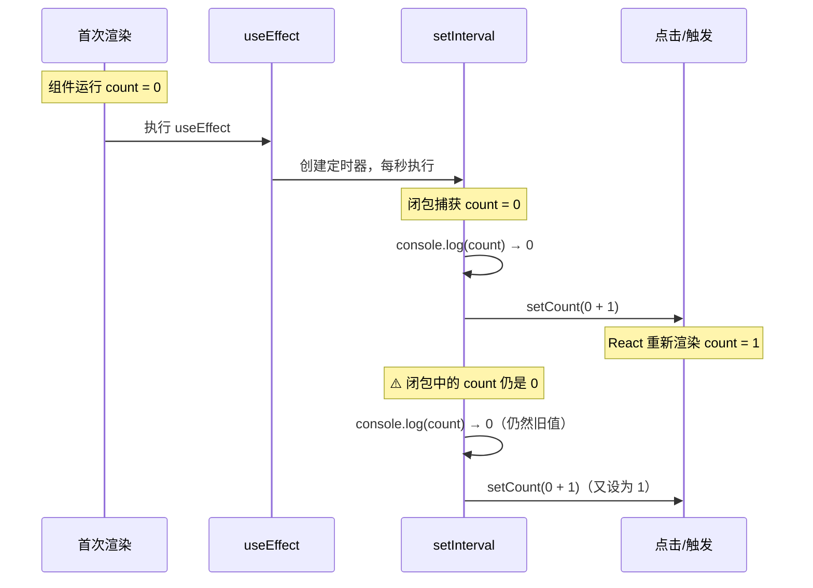
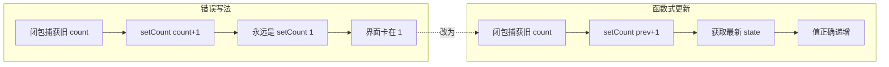

## Hook的闭包陷阱原因和解决方案

```jsx
import { useEffect, useState } from 'react';

function App() {

    const [count,setCount] = useState(0);

    useEffect(() => {
        setInterval(() => {
            console.log(count);
            setCount(count + 1);
        }, 1000);
    }, []);

    return <div>{count}</div>
}

export default App;
```

### 问题原因 — 闭包捕获了过时的值



如上组件，`setInterval` 的回调**闭包捕获了第一次渲染时的 `count`（值为 0）**。由于 `useEffect` 的依赖数组为 `[]`，它只在挂载时运行一次，此后每次定时器触发时读取的 `count` 始终是 0，所以 `setCount(count + 1)` 永远在设置 `0 + 1 = 1`。

- **界面显示**一直是 `1`
- **控制台**一直打印 `0`

### 解决方案 — 函数式更新



将 `setCount(count + 1)` 改为 `setCount(prev => prev + 1)`，这样即使闭包中的 `count` 是旧的，React 也会把**最新的 state 值**作为 `prev` 传入，确保每次递增的是最新值。

