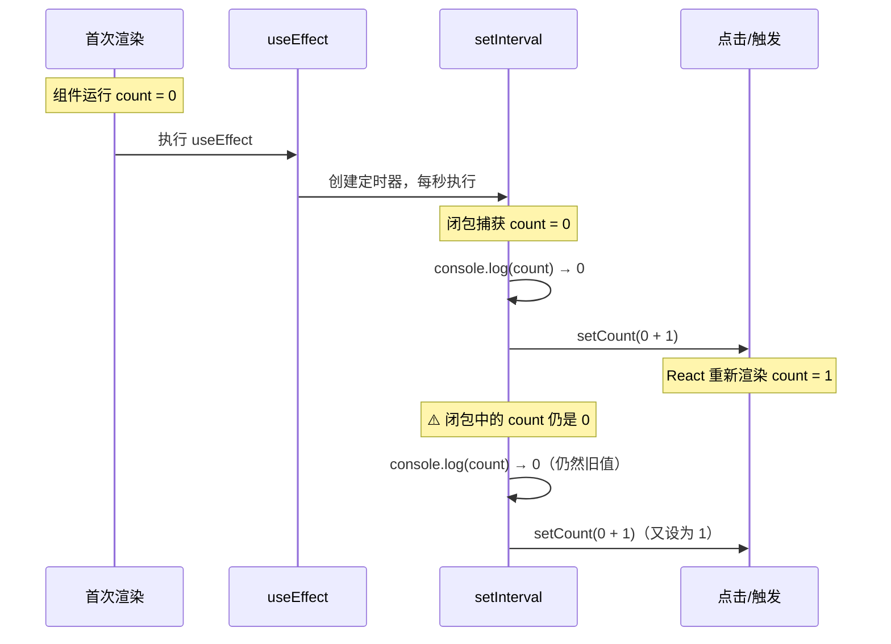
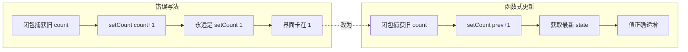

## Hook的闭包陷阱原因和解决方案

```jsx
import { useEffect, useState } from 'react';

function App() {

    const [count,setCount] = useState(0);

    useEffect(() => {
        setInterval(() => {
            console.log(count);
            setCount(count + 1);
        }, 1000);
    }, []);

    return <div>{count}</div>
}

export default App;
```

### 问题原因 — 闭包捕获了过时的值



如上组件，`setInterval` 的回调**闭包捕获了第一次渲染时的 `count`（值为 0）**。由于 `useEffect` 的依赖数组为 `[]`，它只在挂载时运行一次，此后每次定时器触发时读取的 `count` 始终是 0，所以 `setCount(count + 1)` 永远在设置 `0 + 1 = 1`。

- **界面显示**一直是 `1`
- **控制台**一直打印 `0`

### 解决方案 — 函数式更新



将 `setCount(count + 1)` 改为 `setCount(prev => prev + 1)`，这样即使闭包中的 `count` 是旧的，React 也会把**最新的 state 值**作为 `prev` 传入，确保每次递增的是最新值。


### 解决方案 — useReducer

因为它是 dispatch 一个 action，不直接引用 state，所以也不会形成闭包：

```jsx
import { Reducer, useEffect, useReducer } from "react";

interface Action {
    type: 'add' | 'minus',
    num: number
}

function reducer(state: number, action: Action) {

    switch(action.type) {
        case 'add':
            return state + action.num
        case 'minus': 
            return state - action.num
    }
    return state;
}

function App() {
    const [count, dispatch] = useReducer<Reducer<number, Action>>(reducer, 0);

    useEffect(() => {
        console.log(count);

        setInterval(() => {
            dispatch({ type: 'add', num: 1 })
        }, 1000);
    }, []);

    return <div>{count}</div>;
}

export default App;
```

思路和 setState 传入函数一样，所以算是一种解法

### 解决方案 — useEffect的依赖数组

有的时候，是必须要用到 state 的，也就是肯定会形成闭包

可以使用useEffect 的依赖数组

当依赖变动的时候，会重新执行 effect

```jsx
import { useEffect, useState } from 'react';

function App() {

    const [count,setCount] = useState(0);

    useEffect(() => {
        console.log(count);

        const timer = setInterval(() => {
            setCount(count + 1);
        }, 1000);

        return () => {
            clearInterval(timer);
        }
    }, [count]);

    return <div>{count}</div>
}

export default App;
```

依赖数组加上了 count，这样 count 变化的时候重新执行 effect，那执行的函数引用的就是最新的 count 值

这种解法是能解决闭包陷阱的，但在这里并不合适，因为 effect 里跑的是定时器，每次都重新跑定时器，那定时器就不是每 1s 执行一次了

### 解决方案 — useRef

```jsx
import { useEffect, useState, useRef, useLayoutEffect } from 'react';

function App() {
    const [count, setCount] = useState(0);

    const updateCount = () => {
        setCount(count + 1);
    };
    const ref = useRef(updateCount);

    ref.current = updateCount;

    useEffect(() => {
        const timer = setInterval(() => ref.current(), 1000);

        return () => {
            clearInterval(timer);
        }
    }, []);

    return <div>{count}</div>;
}

export default App;
```

通过 useRef 创建 ref 对象，保存执行的函数，每次渲染更新 ref.current 的值为最新函数

这样，定时器执行的函数里就始终引用的是最新的 count

useEffect 只跑一次，保证 setIntervel 不会重置，是每秒执行一次

执行的函数是从 ref.current 取的，这个函数每次渲染都会更新，引用着最新的 count

**ref.current 的值改了不会触发重新渲染**

它就很适合这种保存渲染过程中的一些数据的场景

定时器的这种处理是常见场景，我们可以把它封装一下：

```jsx
import { useEffect, useState, useRef, useLayoutEffect } from "react";

function useInterval(fn: Function, delay?: number | null) {
  const callbackFn = useRef(fn);

  useLayoutEffect(() => {
    callbackFn.current = fn;
  });

  useEffect(() => {
    const timer = setInterval(() => callbackFn.current(), delay || 0);

    return () => clearInterval(timer);
  }, [delay]);
}

function App() {
  const [count, setCount] = useState(0);

  const updateCount = () => {
    setCount(count + 1);
  };

  useInterval(updateCount, 1000);

  return <div>{count}</div>;
}

export default App;
```

 useLayoutEffect 里更新 ref.current 的值，它是在 dom 操作完之后同步执行的，比 useEffect 更早

通过 useEffect 来跑定时器，依赖数组为 [delay]，确保定时器只跑一次，但是 delay 变化的话会重新跑。

在 useEffect 里返回 clean 函数在组件销毁的时候自动调用来清理定时器

这种就叫做自定义 hook，它就是普通的函数封装，没啥区别

这样，组件里就可以直接用 useInterval 这个自定义 hook，不用每次都 useRef + useEffect 了

直接在渲染过程中改 ref.current 也是可以的，只是react官方不建议，ahooks 里就是直接在渲染过程中

上面的 useInterval 没有返回 clean 函数，调用者不能停止定时器，所以我们再加一个 ref 来保存 clean 函数，然后返回：

```jsx
function useInterval(fn: Function, time: number) {
    const ref = useRef(fn);

    ref.current = fn;

    let cleanUpFnRef = useRef<Function>();
    
    const clean = useCallback(() =>{
        cleanUpFnRef.current?.();
    }, []);

    useEffect(() => {
        const timer = setInterval(() => ref.current(), time);

        cleanUpFnRef.current = ()=> {
            clearInterval(timer);
        }

        return clean;
    }, []);

    return clean;
}
```

> 注意：这里使用useCallback 包裹返回的函数，是因为这个返回的函数可能作为参数传入别的组件，这样用 useCallback 包裹就可以避免该参数的变化，配合 memo 可以起到减少没必要的渲染的效果

