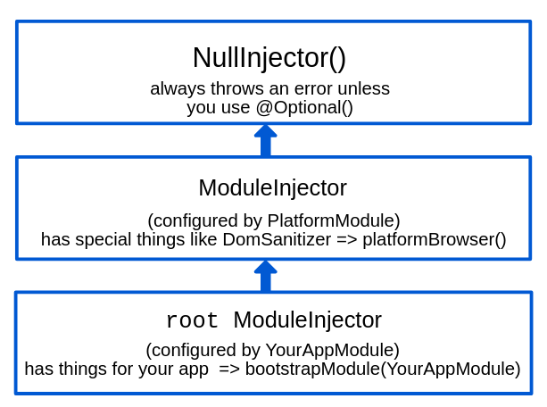
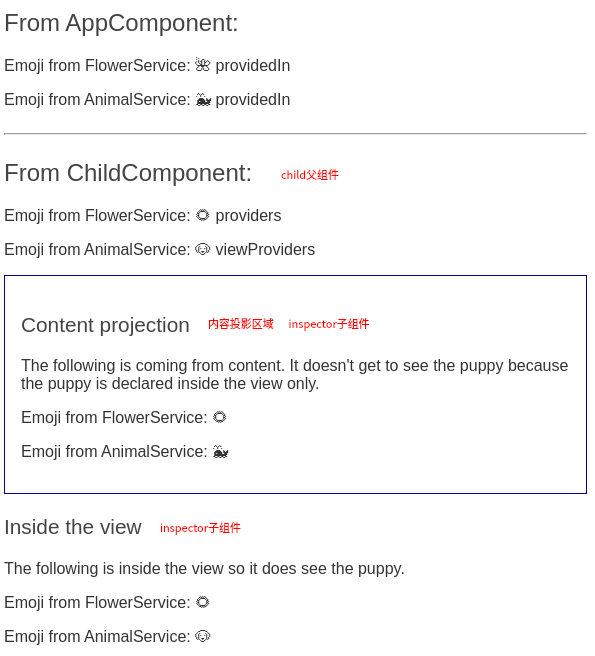

# 基本概念

## 模块

	Angular 应用是模块化的，它拥有自己的模块化系统，称作 `NgModule`。它可以包含一些组件、服务提供者或其它代码文件，其作用域由包含它们的 `NgModule` 定义。

### @NgModule 元数据

`NgModule` 是一个带有 `@NgModule()` 装饰器的类。`@NgModule()` 装饰器是一个函数，它接受一个元数据对象，该对象的属性用来描述这个模块。

| 属性         |                                                              |
| ------------ | ------------------------------------------------------------ |
| declarations | 那些属于本 NgModule 的[组件](https://angular.cn/guide/architecture-components)、*指令*、*管道*。 |
| exports      | 那些能在其它模块的*组件模板*中使用的可声明对象的子集。       |
| imports      | 那些导出了*本*模块中的组件模板所需的类的其它模块。           |
| providers    | 本模块向全局服务中贡献的那些[服务](https://angular.cn/guide/architecture-services)的创建器。这些服务能被本应用中的任何部分使用。（你也可以在组件级别指定服务提供者。） |
| bootstrap    | 应用的主视图，称为*根组件*。它是应用中所有其它视图的宿主。只有*根模块*才应该设置这个 `bootstrap` 属性 |

模块会其中的组件提供了一个编译上下文环境，属于这个 `NgModule` 的组件会共享同一个编译上下文环境。

一个视图层次结构中可以混合使用由不同 `NgModule` 中的组件定义的视图

### NgModule 和 JavaScript 的模块

两种模块系统不同但**互补**，可同时使用

### Angular 自带的库

Angular 会作为一组 JavaScript 模块进行加载，使用import导入，每个 Angular 库的名称都带有 `@angular` 前缀。

```js
// 导入装饰器
import { Component } from '@angular/core';
// 导入angular模块
import { BrowserModule } from '@angular/platform-browser';
// 使用导入的模块 把它加入 @NgModule 元数据的 imports 中
@NgModule({
  imports: [BrowserModule]
})

```

1. 创建组件class(@Component)
2. 在某个模块中注册组件class（declarations:[]）
3. 使用已经注册过的组件

## 组件

理想情况下，组件的工作只管用户体验，而不用顾及其它。它应该提供用于数据绑定的属性和方法，以便作为视图（由模板渲染）和应用逻辑（通常包含一些*模型*的概念）的中介者。

### 创建组件

到应用目录，执行

```js
// 其中 <component-name> 是新组件的名字
ng generate component <component-name> 
```


### 组件的元数据

> 装饰器是一个对类进行处理的函数,装饰器本质就是编译时执行的函数

使用`@Component` 装饰器指出紧随其后的那个类是个组件类。

组件的元数据告诉 Angular 到哪里获取它需要的主要构造块，以创建和展示这个组件及其视图，将**模板**和**组件**关联起来描述**视图**

```js
// HeroListComponent是一个普通的类 直到给它加上了 @Component 装饰器，它才变成了组件
@Component({
    //一个 CSS 选择器 对应的标签
  selector:    'app-hero-list',
    
    //组件的 HTML 模板文件相对于这个组件文件的地址
  templateUrl: './hero-list.component.html',
    //或直接使用template属性定义模板
  // template:``
    
    //引入外部的样式文件或直接使用styles属性
    //styles 属性接受一个包含 CSS 规则的字符串数组
   styleUrls: ['./component-overview.component.css']
    //styles: ['h1 { font-weight: normal; }']
    
    // 当前组件所需的服务提供者的一个数组
  providers:  [ HeroService ]
})
export class HeroListComponent implements OnInit {
  /* . . . */
}
```

### 组件生命周期

| 钩子方法                  |                                         |
| :------------------------ | --------------------------------------- |
| `ngOnChanges()`           | 组件绑定的属性值发生变化                |
| `ngOnInit()`              | 组件初始化完毕（等同于vue.js的mounted） |
| `ngDoCheck()`             | 组件检查到系统对自己的影响              |
| `ngAfterContentInit()`    | 组件内容（插槽）初始化完成              |
| `ngAfterContentChecked()` | 组件内容（插槽）发生变化需要检查        |
| `ngAfterViewInit()`       | 组件视图（模板）初始化完成              |
| `ngAfterViewChecked()`    | 组件视图（模板）发生变化需要检查        |
| `ngOnDestroy()`           | 组件即将被从DOM树上销毁，资源释放       |

- `ngOnChanges()`

  所绑定的一个或多个**输入属性**（@Input）的值发生变化时都会调用

  ```js
  // 输入属性name的值发生了改变.就会触发ngOnChanges()生命周期钩子.这个生命周期钩子被调用时会传入一个SimpleChanges对象,包含上一值、当前值、是否第一次改变
  @Input()
  public name: string;
  
  ngOnChanges(changes: SimpleChanges): void {
    console.log(changes); // name:SimpleChange {previousValue: "a", currentValue: "ab", firstChange: false}
  }
  ```

  > 注：当输入属性为引用类型时，当改变引用类型中的属性时，不会触发`ngOnChanges()`生命周期钩子.只有当你将你引用类型数据的指针指向另一块内存地址的时候才会触发`ngOnChanges()`生命周期钩子.

- `ngOnInit()`

  - **只调用一次**
  - 在Angular第一次显示数据绑定和设置指令/组件的输入属性之后，初始化指令/组件(等同于mounted)

- `ngDoCheck()`

  组件检查到了系统对自己的影响

  `ngDoCheck()`是Angular中的**变更检测机制**.它由`zone.js`来实现的.其行为是只要你的Angular中的某个组件发生**异步事件**.就会检查整个组件树,以保证组件属性的变化或页面的变化是同步的.所以`ngDoCheck()`的触发相当频繁的.并且是无法预料的

- `ngAfterContentInit()`

  组件内容（插槽）初始化完成

  - 第一次ngDoCheck()之后调用，**只调用一次**。

  - 当把内容投影进组件之后调用

    ```html
    // 父组件
    <app-child>
      <p>我是父组件向子组件的投影内容</>
    </app-child>
    
    
    // 子组件 ChildComponent
    <div>
      //接受父组件的投影内容
      <ng-content></ng-content>
    </div>
    ```

    

- `ngAfterContentChecked()`

  组件内容（插槽）发生变化需要检查

  - 每次完成**被投影组件内容**的变更检测之后调用

  - `ngAfterContentInit()`在每次`ngDoCheck()`之后调用

    当父组件向子组件的投影内容发生改变时会调用。它与`ngDoCheck()`类似.当投影内容发生改变时,就会执行变更检查机制.同时调用`ngAfterContentChecked()`生命周期钩子。

    > **注意:**当父组件和子组件都有投影内容时,会先执行父组件的生命周期钩子

- `ngAfterViewInit()`

  组件视图初始化完成

  - 初始化完组件视图及其子视图之后调用

  - 第一次`ngAfterContentChecked()`之后调用，**只调用一次**

    当其组件本身和所有的子组件渲染完成,已经呈现在页面上时,调用`ngAfterViewInit()`生命周期钩子.

- `ngAfterViewChecked()`

  组件视图发生变化需要检查

  - 每次做完组件视图和子视图的变更检测之后调用

  - ngAfterViewInit()和每次ngAfterContentChecked()之后调用。

    当组件及其子组件的视图发生改变时,执行完变更检查机制后调用.当父组件和子组件都发生视图变化时,会先执行子组件的生命周期钩子.

    > **注意:** 这里所说的视图发生改变不一定是真正页面上的变化.只是Angular种所认为的视图变化.因为Angular本身并不能察觉到页面上显示的视图.所以在Angular认为,只要你在后台定义的**属性**发生了改变,就是视图有了变化.从而就会调用`ngAfterViewChecked()`生命周期钩子.

- `ngOnDestroy()`

  - 当Angular每次销毁指令/组件之前调用并清扫。 在这儿反订阅可观察对象和分离事件处理器，以防内存泄漏。
  - 在Angular销毁指令/组件之前调用,**只调用一次**

### 视图封装

`Component` 的装饰器提供了 [`encapsulation`](https://angular.cn/api/core/Component#encapsulation) 选项，可用来控制如何基于**每个组件**应用视图封装。

- `ViewEncapsulation.Emulated`：使用垫片（shimmed) CSS 来模拟原生行为(默认)。组件的样式会添加到文档的 `<head>` 中，选择器只会影响它们各自组件模板中的元素。
- `ViewEncapsulation.None` ：使用不带任何封装的全局 CSS。组件的样式会添加到文档的 `<head>` 中，响文档中的任何匹配元素。
- `ViewEncapsulation.ShadowDom`：使用 Shadow DOM v1，封装样式。会影响全局样式

```js
@Component({
    encapsulation: ViewEncapsulation.None,
})
```

如果该策略设置为 `ViewEncapsulation.Emulated`，并且该组件没有指定 `styles` 或 `styleUrls`，就会自动切换到 `ViewEncapsulation.None`。

### 组件之间的交互

#### 输入性属性绑定

父->子  

```html
<!-- 父组件模板 输入型属性 -->
<app-hero-child
      *ngFor="let hero of heroes"
      [hero]="hero"
      [master]="master">
</app-hero-child>
```

```js
// 子组件 @Input
export class HeroChildComponent {
  @Input() hero!: Hero;
  @Input('master') masterName = '';
}
```

@[Input](https://angular.cn/api/core/Input)([`bindingPropertyName?`](https://angular.cn/api/core/Input#bindingPropertyName))可为子组件属性名指定别名

#### setter截听输入属性变化

在`@input`后使用setter,拦截父组件中值的变化

```js
export class NameChildComponent {
  @Input()
  get name(): string { return this._name; }
  set name(name: string) {
    this._name = (name && name.trim()) || '<no name set>';
  }
  private _name = '';
}
```

####  `ngOnChanges()` 截听输入属性变化

> 当需要监视多个、交互式输入属性的时候，本方法比用属性的 setter 更合适。

```js
export class VersionChildComponent implements OnChanges {
  @Input() major = 0;
  @Input() minor = 0;
  changeLog: string[] = [];
    
  ngOnChanges(changes: SimpleChanges){
      const log: string[] = [];
      for (const propName in changes) {
          ...
      }
  }
   
}
```

#### 父组件监听子组件的事件

子组件暴露一个 `EventEmitter` 属性，使用`@Output`装饰器

```js
// 子组件
@Component({
  selector: 'app-voter',
  template: `
    ...
    <button type="button" (click)="vote(false)" [disabled]="didVote">Disagree</button>
  `
})

export class VoterComponent {
  @Input()  name = '';
  @Output() voted = new EventEmitter<boolean>();
  didVote = false;

  vote(agreed: boolean) {
    this.voted.emit(agreed);
    this.didVote = true;
  }
}

// 父组件
@Component({
  selector: 'app-vote-taker',
  template: `
    ...
    <app-voter
      *ngFor="let voter of voters"
      [name]="voter"
      (voted)="onVoted($event)">
    </app-voter>
  `
})
export class VoteTakerComponent {
  ...
  onVoted(agreed: boolean) {
    ...
  }
}
```

#### 父组件访问子组件方法、属性

**本地变量**(不建议使用)

在**父组件模板**里，新建一个本地变量来代表子组件，然后利用这个变量来读取子组件的属性和调用子组件的方法(*父组件本身的代码对子组件没有访问权*)

```js
// 父组件  在子组件模板上使用 #变量名 ，之后在模板中通过该变量访问子组件属性和方法
import { Component } from '@angular/core';
import { CountdownTimerComponent } from './countdown-timer.component';

@Component({
  selector: 'app-countdown-parent-lv',
  template: `
    <h3>Countdown to Liftoff (via local variable)</h3>
    <button type="button" (click)="timer.start()">Start</button>
    <button type="button" (click)="timer.stop()">Stop</button>
    <div class="seconds">{{timer.seconds}}</div>
    <app-countdown-timer #timer></app-countdown-timer>
  `,
  styleUrls: ['../assets/demo.css']
})
export class CountdownLocalVarParentComponent { }
```

**父级调用`@ViewChild()`**

子组件作为 *ViewChild*(视图查询)，**注入**到父组件里面

> 由*本地变量*切换到 *ViewChild* 技术的唯一目的就是做示范

导入`@ViewChild`属性装饰器，[AfterViewInit](https://angular.cn/api/core/AfterViewInit)生命周期钩子

使用`@ViewChild`注入到父组件的私有属性中

被注入的子组件只有在 Angular 显示了父组件视图之后才能访问，先让父组件显示，若子组件需要更改父组件数据

```js
import { AfterViewInit, ViewChild } from '@angular/core';
import { CountdownTimerComponent } from './countdown-timer.component';

@Component({
  selector: 'app-countdown-parent-vc',
  template: `
    <h3>Countdown to Liftoff (via ViewChild)</h3>
    <button type="button" (click)="start()">Start</button>
    <button type="button" (click)="stop()">Stop</button>
    <div class="seconds">{{ seconds() }}</div>
    <app-countdown-timer></app-countdown-timer>
  `,
  styleUrls: ['../assets/demo.css']
})
export class CountdownViewChildParentComponent implements AfterViewInit {
    @ViewChild(CountdownTimerComponent)
    private timerComponent!: CountdownTimerComponent;

  	seconds() { return 0; }

	ngAfterViewInit() {
        setTimeout(() => this.seconds = () => this.timerComponent.seconds, 0);
        // 若在AfterViewInit中更新父组件视图，单向数据流规则会阻止在同一个周期内更新父组件视图，要更新父组件视图要再等一轮
        // this.seconds = () => this.timerComponent.seconds
    }

 	start() { this.timerComponent.start(); }
  	stop() { this.timerComponent.stop(); }
}
```


#### 父组件和子组件通过服务来通讯

该服务实例的作用域被限制在父组件和其子组件内。这个组件子树之外的组件将无法访问该服务或者与它们通讯。

服务内部：

```js
@Injectable()
export class MissionService {
    ...
}
```

父组件

```js
@Component({
    ...
    providers: [MissionService]
})
export class MissionControlComponent {
    ...
     constructor(private missionService: MissionService) {
        ...
    }
}
```

子组件

```js
@Component({
    ...
})
export class MissionControlComponent {
    ...
     constructor(private missionService: MissionService) {
        ...
    }
}
```

### 组件样式

会定义一个空的 `styles` 数组

```js
ng generate component hero-app --inline-style
```

```js
@Component({
    // 组件内部样式 接受一个包含 CSS 代码的字符串数组
    styles: []
})
```

> 注意：这些样式**只对当前组件生效**。它们**既不会作用于模板中嵌入的任何组件**，也不会作用于投影进来的组件（如 `ng-content`）。

**特殊选择器**

每个组件都会关联一个与其组件选择器相匹配的元素。这个元素称为**宿主元素**

- `:host`

	创建针对宿主元素自身的样式，而不是针对宿主内部的那些元素

- `:host-context`

	在当前组件宿主元素的*祖先节点*中查找 CSS 类，直到文档的根节点为止。它只能与其它选择器组合使用

- `::ng-deep`

	为了把指定的样式限定在当前组件及其下级组件中，请确保在 `::ng-deep` 之前带上 `:host` 选择器。如果 `::ng-deep` 组合器在 `:host` 伪类之外使用，该样式就会污染其它组件。

**引入外部样式**

- `styleUrls`

  > 当使用 CLI 进行构建时，要确保这个链接到的样式表文件被复制到了服务器上

- 模板中的`link`标签

### 数据绑定

 DOM   Component

```js
// 插值
{{ value }}

// 组件传值 属性绑定 子组件通过@Input接收
[property] = "value"

// 事件绑定
(event) = "handler"

// 双向数据绑定
<input type="text" id="hero-name" [(ngModel)]="hero.name">
```

Angular 在每个 JavaScript 事件循环中处理*所有的*数据绑定，它会从组件树的根部开始，递归处理全部子组件。

### 管道

带有 `@Pipe` 装饰器的类中会定义一个转换函数，用来把输入值转换成供视图显示用的输出值。

```js
{{interpolated_value | pipe_name}}

// 管道可传参
<!-- Default format: output 'Jun 15, 2015'-->
<p>Today is {{today | date}}</p>

<!-- fullDate format: output 'Monday, June 15, 2015'-->
<p>The date is {{today | date:'fullDate'}}</p>

<!-- shortTime format: output '9:43 AM'-->
<p>The time is {{today | date:'shortTime'}}</p>
```

### 内容投影（vue插槽）

内容投影是一种模式，你可以在其中插入或*投影*要在另一个组件中使用的内容

- 单槽内容投影     从单一来源接受内容     `<ng-content>`

- 多槽内容投影     从多个来源接受内容

  ```js
  @Component({
    selector: 'app-zippy-multislot',
    template: `
      Default:
      <ng-content></ng-content>
  
      Question:
      <ng-content select="[question]"></ng-content>
    `
  })
  export class ZippyMultislotComponent {}
  ```

  ```html
  <app-zippy-multislot>
    <p question>
      Is content projection cool?
    </p>
    <p>Let's learn about content projection!</p>
  </app-zippy-multislot>
  ```

- 条件内容投影    使用条件内容投影的组件仅在满足特定条件时才渲染内容

  ```html
  <app-example-zippy>
    <button type="button" appExampleZippyToggle>Is content project cool?</button>
    <ng-template appExampleZippyContent>
      It depends on what you do with it.
    </ng-template>
  </app-example-zippy>
  ```

  > `<ng-content>`元素是一个占位符，它不会创建真正的 DOM 元素。用于组件内部，且内部不能包含其他标签。
  >
  > `<ng-template>`元素定义了默认情况下不呈现的模板,需要使用结构化指令指示 Angular 渲染它。主要用途之一是保存结构化指令将使用的模板内容
  >
  > `<ng-container>`允许我们使用结构化指令，而不需要任何额外的元素

### 动态组件

```js
// AdBannerComponent
template: `
  <div class="ad-banner-example">
    <h3>Advertisements</h3>
    <ng-template adHost></ng-template>
  </div>
`
```

定义指令告诉 Angular 要把组件插入到什么地方

```js
import { Directive, ViewContainerRef } from '@angular/core';

@Directive({
  selector: '[adHost]',
})
export class AdDirective {
  constructor(public viewContainerRef: ViewContainerRef) { }
}
```

```js
export class AdBannerComponent implements OnInit, OnDestroy {
  @Input() ads: AdItem[] = [];

  currentAdIndex = -1;

  //视图查询
  @ViewChild(AdDirective, {static: true}) adHost!: AdDirective;
  interval: number|undefined;

  ngOnInit(): void {
    this.loadComponent();
    this.getAds();
  }

  ngOnDestroy() {
    clearInterval(this.interval);
  }

  loadComponent() {
    this.currentAdIndex = (this.currentAdIndex + 1) % this.ads.length;
    const adItem = this.ads[this.currentAdIndex];
	//视图容器
    const viewContainerRef = this.adHost.viewContainerRef;
    viewContainerRef.clear();

    //创建宿主视图（当用 createComponent() 方法实例化组件时创建）
    const componentRef = viewContainerRef.createComponent<AdComponent>(adItem.component);
    componentRef.instance.data = adItem.data;
  }

  getAds() {
    this.interval = setInterval(() => {
      this.loadComponent();
    }, 3000);
  }
}
```

**@ViewChild**:属性装饰器，用于配置一个视图查询。 变更检测器会在视图的 DOM 中查找能匹配上该选择器的第一个元素或指令。 如果视图的 DOM 发生了变化，出现了匹配该选择器的新的子节点，该属性就会被更新。

> 视图：视图是可显示元素的最小分组单位，它们会被同时创建和销毁。 Angular 在一个或多个[指令 (directive)](https://angular.cn/guide/glossary#directive) 的控制下渲染视图。
>
> [组件 (component)](https://angular.cn/guide/glossary#component) 类及其关联的[模板 (template)](https://angular.cn/guide/glossary#template)定义了一个视图。视图由一个与该组件相关的 `ViewRef` 实例表示。 直属于某个组件的视图叫做*宿主视图*。
>
> 视图中各个元素的属性可以动态修改以响应用户的操作，而这些元素的结构（数量或顺序）则不能。你可以通过在它们的视图容器中插入、移动或移除内嵌视图来修改这些元素的结构

### angular元素

*Angular 元素*就是打包成*自定义元素*的 Angular 组件

```js
import { Component, Injector } from '@angular/core';
import { createCustomElement } from '@angular/elements';
import { PopupService } from './popup.service';
import { PopupComponent } from './popup.component';

@Component({
    selector: 'my-popup',
    ...
})
export class AppComponent {
    constructor(injector: Injector, public popup: PopupService) {
    // 将 `PopupComponent` 转化为自定义元素.
    const PopupElement = createCustomElement(PopupComponent, {injector});
    // 在浏览器上注册自定义元素
    customElements.define('popup-element', PopupElement);
  }
}
```

```html
<my-popup message="Use Angular!"></my-popup>
```

> customElements.define为浏览器API，参数为元素的名称，以及定义了元素功能的类
>
> 组件内部输入属性@[Input](https://angular.cn/api/core/Input)('myInputProp')   ===>  自定义元素`my-input-prop` 属性
>
> 组件内部输出属性@[Output](https://angular.cn/api/core/Output)() valueChanged = new [EventEmitter](https://angular.cn/api/core/EventEmitter)()   ===>  自定义元素@valueChanged事件

## 模板

### 插值 

### 属性绑定

`[attr.]=""`

```html
<p [attr.attribute-you-are-targeting]="expression"></p>
```

### 类和样式绑定

```js
// 绑定类
// 绑定到单个 CSS class
[class.sale]="onSale"

// 绑定到多个 CSS 类 
[class]="classExpression"
```

classExpression可以是：

- `'class class class'`
- `{ class:boolean }`
- `[class,class]`

```js
// 绑定样式
// 绑定单一样式
<nav [style.backgroundColor]="expression"></nav>

// 绑定多个样式
<nav [style]="expression"></nav>
```

expression格式：

- 样式的字符串列表，比如 `"width: 100px; height: 100px; background-color: cornflowerblue;"`。
- 一个对象，其键名是样式名，其值是样式值，比如 `{width: '100px', height: '100px', backgroundColor: 'cornflowerblue'}`。

### 事件绑定

```html
<!-- v-on -->
<button (click)="onSave=$event">Save</button>
```

### 属性绑定  

```html
<!-- v-bind -->


<!-- Notice the colSpan property is camel case -->
<tr><td [colSpan]="1 + 1">Three-Four</td></tr>
```

### 双向绑定

```html
<app-sizer [(size)]="fontSizePx"></app-sizer>
```

```js
//为了使双向数据绑定有效  @Input()属性为 size   则@Output()属性必为sizeChange
export class SizerComponent {
  @Input()  size!: number | string;
  @Output() sizeChange = new EventEmitter<number>();
    ...
}

```

### 管道

> 类似于过滤器

在模板中使用简单函数格式化文本

**内置管道**

- [`DatePipe`](https://angular.cn/api/common/DatePipe)：根据本地环境中的规则格式化日期值。
- [`UpperCasePipe`](https://angular.cn/api/common/UpperCasePipe)：把文本全部转换成大写。
- [`LowerCasePipe`](https://angular.cn/api/common/LowerCasePipe) ：把文本全部转换成小写。
- [`CurrencyPipe`](https://angular.cn/api/common/CurrencyPipe) ：把数字转换成货币字符串，根据本地环境中的规则进行格式化。
- [`DecimalPipe`](https://angular.cn/api/common/DecimalPipe)：把数字转换成带小数点的字符串，根据本地环境中的规则进行格式化。
- [`PercentPipe`](https://angular.cn/api/common/PercentPipe) ：把数字转换成百分比字符串，根据本地环境中的规则进行格式化。

**管道优先级**

管道 > 三目运算符

`a ? b : c | x`    =》 `a ? b : (c | x)`

```html
<p>The hero's birthday is {{ birthday | date }}</p>

<p>The hero's birthday is {{ birthday | date:"MM/dd/yy" }} </p>

<p>The hero's birthday is {{ birthday | date | uppercase}} </p>
```


### 模板变量

用井号 `#` 来声明一个模板变量，可以在组件模板中的任何地方引用某个模板变量

```html
<input #phone placeholder="phone number" />

<button type="button" (click)="callPhone(phone.value)">Call</button>
```

在组件上声明，该变量就会引用该组件实例

在html标签上声明，该变量就会引用该元素

在`<ng-template>`上声明，该变量就会引用一个 `TemplateRef`

```html
<form #itemForm="ngForm" (ngSubmit)="onSubmit(itemForm)">
  <label for="name">Name</label>
  <input type="text" id="name" class="form-control" name="name" ngModel required />
  <button type="submit">Submit</button>
</form>

<div [hidden]="!itemForm.form.valid">
  <p>{{ submitMessage }}</p>
</div>
```

**模板变量作用域**

`*ngIf`  `*ngFor`  结构指令  `<ng-template>`会创建新的词法范围，外部无法访问内部的模板变量

**模板输入变量**

入变量的 `let-` 声明的右侧可以指定应该用于该变量的值

```html
<ul>
  <ng-template ngFor let-hero let-i="index" [ngForOf]="heroes">
    <li>Hero number {{i}}: {{hero.name}}
  </ng-template>
</ul>
```

## 指令

Angular 的模板是*动态的*。当 Angular 渲染它们的时候，会根据*指令*给出的指示对 DOM 进行转换。指令就是一个带有 `@Directive()` 装饰器的**类**，为 Angular 应用程序中的元素添加额外行为的类。

| 指令类型   | 详情                                           |
| ---------- | ---------------------------------------------- |
| 组件       | 带有模板的指令。这种指令类型是最常见的指令类型 |
| 属性型指令 | 更改元素、组件或其他指令的外观或行为的指令。   |
| 结构型指令 | 通过添加和删除 DOM 元素来更改 DOM 布局。       |

**组件**从技术角度上说就是一个**指令**，但是由于组件对 Angular 应用来说非常独特、非常重要，因此 Angular 专门定义了 **`@Component()` 装饰器**，它使用一些面向模板的特性**扩展了 `@Directive()` 装饰器**。

指令通常作为属性出现在元素标签上

### 内置属性型指令

属性型指令会监听并修改其它 HTML 元素和组件的行为、Attribute 和 Property

- `NgClass` 添加和删除一组 CSS 类。

  ```html
  // 与表达式一起使用
  <div [ngClass]="isSpecial ? 'special' : ''">This div is special</div>
  
  // 与方法一起使用
  <div [ngClass]="currentClasses">This div is initially saveable, unchanged, and special.</div>
  ```

  ```js
  // 该对象的每个键（key）都是一个 CSS 类名。如果键为 true，则 ngClass 添加该类。如果键为 false，则 ngClass 删除该类。
  currentClasses: Record<string, boolean> = {};
  /* . . . */
  setCurrentClasses() {
    this.currentClasses =  {
      saveable: this.canSave,
      modified: !this.isUnchanged,
      special:  this.isSpecial
    };
  }
  ```

- `NgStyle` 添加和删除一组 HTML 样式。

  ```html
  // 设置内联样式
  <div [ngStyle]="currentStyles">
    This div is initially italic, normal weight, and extra large (24px).
  </div>
  ```

  ```js
  currentStyles: Record<string, string> = {};
  /* . . . */
  setCurrentStyles() {
    // CSS styles: set per current state of component properties
    this.currentStyles = {
      'font-style':  this.canSave      ? 'italic' : 'normal',
      'font-weight': !this.isUnchanged ? 'bold'   : 'normal',
      'font-size':   this.isSpecial    ? '24px'   : '12px'
    };
  }
  ```

- `NgModdel`将双向数据绑定添加到 HTML 表单元素。

  导入 `FormsModule`，并将其添加到 NgModule 的 `imports` 列表中

  ```js
  import { FormsModule } from '@angular/forms'; // <--- JavaScript import from Angular
  /* . . . */
  @NgModule({
    /* . . . */
  
    imports: [
      BrowserModule,
      FormsModule // <--- import into the NgModule
    ],
    /* . . . */
  })
  export class AppModule { }
  ```

  在 HTML 的 `<form>` 元素上添加 `[(ngModel)]` 绑定，并将其设置为等于此属性，这里是 `name`

  ```js
  <label for="example-ngModel">[(ngModel)]:</label>
  <input [(ngModel)]="currentItem.name" id="example-ngModel">
  ```

  若要自定义配置，要该表单将属性绑定（v-bind）和事件绑定( v-on )分开

  ```js
  <input [ngModel]="currentItem.name" (ngModelChange)="setUppercaseName($event)" id="example-uppercase">
  ```

  > 要将 `[(ngModel)]` 应用于非表单型内置元素或第三方自定义组件，必须编写一个值访问器。
  
  以下示例演示了如何使用输入元素激活默认值访问器（在这种情况下为文本字段）。
  
  ```js
  const firstNameControl = new FormControl();
  ```
  
  ```js
  <input type="text" [formControl]="firstNameControl">
  ```
  
  默认情况下，此值访问器用于 `<input type="text">` 和 `<textarea>` 元素，但你也可以将其用于具有类似行为且不需要特殊处理的自定义组件。为了将默认值访问器附加到自定义元素，请添加 `ngDefaultControl` 属性，如下所示。
  
  ```html
  <custom-input-component ngDefaultControl [(ngModel)]="value"></custom-input-component>
  ```

### 创建属性型指令

```js
ng generate directive highlight
```

**定义**

```js
import { Directive, ElementRef, HostListener } from '@angular/core';

@Directive({
  selector: '[appHighlight]'
})
export class HighlightDirective {
  @Input() appHighlight = '';
  @Input() defaultColor = '';
    
  constructor(private el: ElementRef) { }

  @HostListener('mouseenter') onMouseEnter() {
    this.highlight(this.appHighlight || this.defaultColor || 'red');
  }

  @HostListener('mouseleave') onMouseLeave() {
    this.highlight('');
  }

  private highlight(color: string) {
    this.el.nativeElement.style.backgroundColor = color;
  }

}
```

`ElementRef`: 用来访问DOW,`ElementRef` 的 `nativeElement` 属性会提供对宿主 DOM 元素的直接访问权限

在指令的 `constructor()` 中添加 `ElementRef` 以[注入](https://angular.cn/guide/dependency-injection)对宿主 DOM 元素的引用，该元素就是 `appHighlight` 的作用目标。

`@HostListener`: 处理用户事件

**使用**

```html
<!-- 带[]的表示绑定的值，引号里面是变量，不带[]的就是那个值 -->
<p [appHighlight]="color" defaultColor="violet">Highlight me!</p>
<p appHighlight="red" defaultColor="violet">Highlight me!</p>
```


### 内置结构型指令

通过添加、移除或替换 DOM 元素来修改布局

| 常见的内置结构型指令                                         | 详情                                 |
| :----------------------------------------------------------- | :----------------------------------- |
| [`NgIf`](https://angular.cn/guide/built-in-directives#ngIf)  | 有条件地从模板创建或销毁子视图。     |
| [`NgFor`](https://angular.cn/guide/built-in-directives#ngFor) | 为列表中的每个条目重复渲染一个节点。 |
| [`NgSwitch`](https://angular.cn/guide/built-in-directives#ngSwitch) | 一组在备用视图之间切换的指令。       |

```html
<app-hero-detail *ngIf="selectedHero"></app-hero-detail>
<!-- 当 isActive 表达式返回真值时，NgIf 会把 Component 添加到 DOM 中。当表达式为假值时，NgIf 会从 DOM 中删除 Component 并销毁该组件及其所有子组件。-->

<li *ngFor="let hero of heroes"></li>

<div *ngFor="let item of items; let i=index">{{i + 1}} - {{item.name}}</div>
```

**结构型指令简写形式**

应用结构指令时，它们通常以星号 `*` 为前缀，例如 `*ngIf`。本约定是 Angular 解释并转换为更长形式的速记。Angular 会将结构指令前面的星号转换为围绕宿主元素及其后代的 `<ng-template>`

```html
<div *ngIf="hero" class="name">{{hero.name}}</div>
```

```html
<ng-template [ngIf]="hero">
  <div class="name">{{hero.name}}</div>
</ng-template>
```

错误用法：

```html
<ng-template *ngIf="hero" class="name">{{hero.name}}</ng-template>
```

```html
<!-- 什么都不会被渲染出来 -->
<ng-template [ngIf]="hero">
  <ng-template class="name">{{hero.name}}</ng-template>
</ng-template>
```

正确用法：

```html
<ng-template [ngIf]="hero" class="name">{{hero.name}}</ng-template>
```


`*ngFor` 中的星号的简写形式与非简写的 `<ng-template>` 形式进行比较：

```html
<!-- 
index ：元素索引
first ：是否为第一个元素
last ：是否为最后一个元素
even ：是否为偶数元素
odd ：是否为奇数元素
 -->
<div
  *ngFor="let hero of heroes; let i=index; let odd=odd; trackBy: trackById"
  [class.odd]="odd">
  ({{i}}) {{hero.name}}
</div>

<ng-template ngFor let-hero [ngForOf]="heroes"
  let-i="index" let-odd="odd" [ngForTrackBy]="trackById">
  <div [class.odd]="odd">
    ({{i}}) {{hero.name}}
  </div>
</ng-template>
```


最常见的场景是使用 * ngIf 和 * ngFor。例如，假设我们有一个项目列表，但是只有当某个条件为 true 时，才需要显示每个项目。我们可能会尝试这样的做法:

```html
<!-- 但是，由于 *ngFor 和 *ngIf 都是结构指令，因此编译器会将其视为错误。你只能将一个 结构 指令应用于一个元素 -->
<ul>
  <li *ngFor="let item of items" *ngIf="item.isValid">
    {{ item.name }}
  </li>
</ul>

<!-- 使用<ng-container> 或 <ng-template>效果相同-->
<ul>
  <ng-container *ngFor="let item of items">
    <li *ngIf="item.isValid">
      {{ item.name }}
    </li>
  </ng-container>
</ul>
```


**用 `*ngFor` 的 `trackBy` 跟踪条目**(类似:key)

使用 `*ngFor` 的 `trackBy` 属性，Angular 只能更改和重新渲染已更改的条目，而不必重新加载整个条目列表

```html
<!-- trackByItems为组件内部定义的属性 -->
<div *ngFor="let item of items; trackBy: trackByItems">
  ({{item.id}}) {{item.name}}
</div>
```

```js
trackByItems(index: number, item: Item): number { return item.id; }
```


**为没有 DOM 元素的指令安排宿主**

Angular 的 `<ng-container>` 是一个分组元素，它不会干扰样式或布局，因为 Angular 不会将其放置在 DOM 中。

当没有单个元素承载指令时，可以使用 `<ng-container>`。

```html
<p>
  I turned the corner
  <ng-container *ngIf="hero">
    and saw {{hero.name}}. I waved
  </ng-container>
  and continued on my way.
</p>
```

使用场景：有条件地显示下拉框选项（原生下拉框）

```html
<div>
  Pick your favorite hero
  (<label><input type="checkbox" checked (change)="showSad = !showSad">show sad</label>)
</div>
<select [(ngModel)]="hero">
  <ng-container *ngFor="let h of heroes">
    <ng-container *ngIf="showSad || h.emotion !== 'sad'">
      <option [ngValue]="h">{{h.name}} ({{h.emotion}})</option>
    </ng-container>
  </ng-container>
</select>
```


**`ngSwitch`**

```html
<div [ngSwitch]="currentItem.feature">
  <app-stout-item    *ngSwitchCase="'stout'"    [item]="currentItem"></app-stout-item>
  <app-device-item   *ngSwitchCase="'slim'"     [item]="currentItem"></app-device-item>
  <app-lost-item     *ngSwitchCase="'vintage'"  [item]="currentItem"></app-lost-item>
  <app-best-item     *ngSwitchCase="'bright'"   [item]="currentItem"></app-best-item>
<!-- . . . -->
  <app-unknown-item  *ngSwitchDefault           [item]="currentItem"></app-unknown-item>
</div>
```


### **创建结构性指令**

```js
import { Directive, Input, TemplateRef, ViewContainerRef } from '@angular/core';
//UnlessDirective 会通过 Angular 生成的 <ng-template> 创建一个嵌入的视图，然后将该视图插入到该指令的原始 <p> 宿主元素紧后面的视图容器中。

//TemplateRef可帮助你获取 <ng-template> 的内容，而 ViewContainerRef 可以访问视图容器。

@Directive({ selector: '[appUnless]'})
export class UnlessDirective {
  private hasView = false;

  constructor(
    private templateRef: TemplateRef<any>,
    private viewContainer: ViewContainerRef) { }

  @Input() set appUnless(condition: boolean) {
    if (!condition && !this.hasView) {
      this.viewContainer.createEmbeddedView(this.templateRef);
      this.hasView = true;
    } else if (condition && this.hasView) {
      this.viewContainer.clear();
      this.hasView = false;
    }
  }
}
```

```html
<!-- 星号是将 appUnless 标记为结构型指令的简写形式 -->
<p *appUnless="condition" class="unless a">
  (A) This paragraph is displayed because the condition is false.
</p>

<p *appUnless="!condition" class="unless b">
  (B) Although the condition is true,
  this paragraph is displayed because appUnless is set to false.
</p>
```


## 服务与依赖注入

### 服务

明确定义了用途的**类**，服务和组件分开，以提高模块性和复用性。

**服务器获取数据**、**验证用户输入**或**直接往控制台中写日志**等工作委托给各种服务

服务也可以依赖其它服务

创建服务：

```js
ng generate service User
```

### 提供服务

默认情况下，它会为该服务创建一个提供者，指定 Angular 应该在**根注入器**中提供该服务

```js
import { Injectable } from '@angular/core';

@Injectable({
  providedIn: 'root',
})
export class UserService {
}
```

### 依赖注入

依赖项注入（DI）是一种设计模式，在这种设计模式中，类会从外部源请求依赖项而不是创建它们。Angular 的 DI 框架会在实例化某个类时为其提供依赖。


- **注入器**

  Angular 会在启动过程中为你创建全应用级注入器以及所需的其它注入器。你不用自己创建注入器。

- **容器**

  注入器创建依赖，容器维护依赖，并尽可能复用它们

- **提供者**

  一个对象，用来告诉注入器应该如何获取或创建依赖

Angular 可以把**服务**作为**依赖**注入到组件中

**依赖不一定是服务 —— 它还可能是函数或值**

当 Angular **创建组件类的新实例**时，它会通过查看该组件类的构造函数，来决定该组件依赖哪些服务或其它依赖项

```js
// 通过查看该组件类的构造函数，来决定依赖
constructor(private service: HeroService) { }
```

#### 提供服务

对于要用到的任何服务，你必须至少注册一个**提供者**

服务可以在自己的元数据中把自己注册为提供者，这样可以让自己随处可用

在服务中注册提供者

```js
// 注册提供者 
// 在服务的 @Injectable()装饰器 中提供元数据
// 或模块的 @NgModule()装饰器 中提供元数据
// 或组件的 @Component()装饰器 中提供元数据

// 服务的提供者被注册到根注入器中
@Injectable({
 providedIn: 'root',  
})
```

这种在 `@Injectable` 元数据中注册提供者的方式还让 Angular 能够通过移除那些从未被用过的服务来优化大小


在模块中注册提供者

```js
@NgModule({
  providers: [
  BackendService,
  Logger
 ],
 …
})
```

在组件中注册提供者

```js
@Component({
  selector:    'app-hero-list',
  templateUrl: './hero-list.component.html',
  providers:  [ HeroService ]
})
```

#### 注入服务

注入某些服务会使它们对组件可见。

要将依赖项注入组件的 `constructor()` 中，请提供具有此依赖项类型的构造函数参数

```js
// 在构造函数中指定了heroService的类型为HeroService
constructor(heroService: HeroService)
```

#### 服务中使用服务

例如`HeroService` 要依靠 `Logger` 服务来报告其活动

```js
//导入Logger服务
//在HeroService的构造函数中注入Logger服务
//之后会把Logger的实例存储在名为logger的私有字段
import { Injectable } from '@angular/core';
import { HEROES } from './mock-heroes';
import { Logger } from '../logger.service';

@Injectable({
  providedIn: 'root',
})
export class HeroService {

  constructor(private logger: Logger) {  }

  getHeroes() {
    this.logger.log('Getting heroes ...');
    return HEROES;
  }
}
```

#### 定义提供者

https://angular.cn/guide/dependency-injection-in-action#defining-providers

代替类 **`useClass`**

```tsx
providers: [Logger]

// 将 Logger 扩展为一个完整的提供者对象
[{ provide: Logger, useClass: Logger }]
```

- `provide` 属性存有[令牌](https://angular.cn/guide/dependency-injection-providers#token)，它作为一个 key，在定位依赖值和配置注入器时使用。
- 第二个属性是一个提供者定义对象，它告诉注入器要如何创建依赖值。提供者定义对象中的 key 可以是 `useClass` —— 就像这个例子中一样。也可以是 `useExisting`、`useValue` 或 `useFactory`。每一个 key 都用于提供一种不同类型的依赖，我们稍后会讨论。

代替类、别名类、对象、工厂函数

#### 别名类提供者

**`useExisting`**

```tsx
[ NewLogger,
  // OldLogger 就成了 NewLogger 的别名。
  { provide: OldLogger, useExisting: NewLogger}]
```

在 TypeScript 里面，类声明的顺序是很重要的。如果一个类尚未定义，就不能引用它。

当使用父组件作为提供者时，就会形成类*A 引用类 B*，同时'B'引用'A'的困境；或者是当一个类*需要**引用自身***的时候

```tsx
providers: [{ provide: Parent, useExisting: forwardRef(() => AlexComponent) }],
```

#### 为多个类接口指定别名

```tsx
providers:  [ provideParent(BethComponent, DifferentParent) ]
```

```tsx
export function provideParent
  (component: any, parentType?: any) {
    return { provide: parentType || Parent, useExisting: forwardRef(() => component) };
  }
```

**使用别名接口来窄化 API**

想象 `LoggerService` 有个很大的 API 接口，远超过现有的三个方法和一个属性。你可能希望把 API 接口收窄到只有两个你确实需要的成员.

```tsx
{ provide: MinimalLogger, useExisting: LoggerService },
```

```tsx
// Class used as a "narrowing" interface that exposes a minimal logger
// Other members of the actual implementation are invisible
// 在注入的依赖中只能看见两个成员
export abstract class MinimalLogger {
  abstract logs: string[];
  abstract logInfo: (msg: string) => void;
}
```

#### 注入对象

**`useValue`**

```tsx
[{ provide: Logger, useValue: SilentLogger }]
```

```tsx
// An object in the shape of the logger service
function silentLoggerFn() {}

export const SilentLogger = {
  logs: ['Silent logger says "Shhhhh!". Provided via "useValue"'],
  log: silentLoggerFn
};
```

```tsx
{ provide: Hero,          useValue:    someHero },
{ provide: TITLE,         useValue:   'Hero of the Month' },
```

- 第一处提供了用于 `Hero` 令牌的 `Hero` 类的**现有实例**，而不是要求注入器使用 `new` 来创建一个新实例或使用它自己的缓存实例。这里令牌就是这个类本身。
- 第二处为 `TITLE` 令牌指定了一个字符串字面量资源。`TITLE` 提供者的令牌*不是一个类*，而是一个特别的提供者查询键，名叫[InjectionToken](https://angular.cn/guide/dependency-injection-in-action#injection-token)，表示一个 `InjectionToken` 实例。

> 一个*值-提供者*的值必须在指定之前定义，其它类型的提供者都会*惰性创建*它们的值，也就是说只在需要注入它们的时候才创建

```tsx
const someHero = new Hero(42, 'Magma', 'Had a great month!', '555-555-5555');
```

**`InjectionToken`**

可以定义和使用一个 `InjectionToken` 对象来为**非类的依赖**选择一个提供者令牌

```tsx
import { InjectionToken } from '@angular/core';

export const APP_CONFIG = new InjectionToken<AppConfig>('app.config');
```

```tsx
providers: [{ provide: APP_CONFIG, useValue: HERO_DI_CONFIG }]
```

```tsx
constructor(@Inject(APP_CONFIG) config: AppConfig) {
  this.title = config.title;
}
```

> 由于 Angular 在运行期没有接口，所以该**接口**不能作为令牌，也不能注入它

#### 工厂提供者

要想根据运行前尚不可用的信息创建可变的依赖值，可以使用工厂提供者

在下面的例子中，只有授权用户才能看到 `HeroService` 中的秘密英雄。授权可能在单个应用会话期间发生变化

```tsx
constructor(
  private logger: Logger,
  private isAuthorized: boolean) { }

getHeroes() {
  const auth = this.isAuthorized ? 'authorized ' : 'unauthorized';
  this.logger.log(`Getting heroes for ${auth} user.`);
  return HEROES.filter(hero => this.isAuthorized || !hero.isSecret);
}
```

```tsx
const heroServiceFactory = (logger: Logger, userService: UserService) =>
  new HeroService(logger, userService.user.isAuthorized);
```

- `useFactory` 字段指定该提供者是一个工厂函数，其实现代码是 `heroServiceFactory`
- `deps` 属性是一个[提供者令牌](https://angular.cn/guide/dependency-injection-providers#token)数组。`Logger` 和 `UserService` 类都是自己类提供者的令牌。该注入器解析了这些令牌，并把相应的服务注入到 `heroServiceFactory` 工厂函数的参数中。

## 多级注入器

| 注入器层次结构             | 详细信息                                                     |
| :------------------------- | :----------------------------------------------------------- |
| `ModuleInjector` 层次结构  | 使用 `@NgModule()` 或 `@Injectable()` 注解在此层次结构中配置 `ModuleInjector`。 |
| `ElementInjector` 层次结构 | 在每个 DOM 元素上隐式创建。默认情况下，`ElementInjector` 是空的，除非你在 `@Directive()` 或 `@Component()` 的 `providers` 属性中配置它。 |

`ModuleInjector`

- 使用 `@Injectable()` 的 `providedIn` 属性引用 `@NgModule()` 或 `root`
- 使用 `@NgModule()` 的 `providers` 数组

> 使用 `@Injectable()` 的 `providedIn` 属性优于 `@NgModule()` 的 `providers` 数组。使用 `@Injectable()` 的 `providedIn` 时，优化工具可以进行**摇树优化**，从而删除你的应用程序中未使用的服务，以减小捆绑包尺寸。

`ElementInjector`

Angular 会为每个 DOM 元素隐式创建 `ElementInjector`。

可以用 `@Component()` 装饰器中的 `providers` 或 `viewProviders` 属性来配置 `ElementInjector` 以提供服务

组件和指令都可使用`providers`属性注册提供者



### 解析规则

组件声明依赖 -> 查找组件自身`ElementInjector` -> 往上级`ElementInjector`上查找 -> 未查找到则返回发起请求的元素，并在 `ModuleInjector` 层次结构中进行查找 -> 找不到则引发错误

> 如果你已在不同级别注册了相同 DI 令牌的提供者，则 Angular 会用遇到的第一个来解析该依赖

### 解析修饰符

- 如果 Angular 找不到你要的东西该怎么办，用 `@Optional()`
- 从哪里开始寻找，用 `@SkipSelf()`
- 到哪里停止寻找，用 `@Host()` 和 `@Self()`

**`@Optional()`**

允许 Angular 将你注入的服务视为可选服务，如果无法在运行时解析它，Angular 只会将服务解析为 `null`，而不会抛出错误。

**`@Self()`**

使用 `@Self()` 让 Angular 仅查看当前组件或指令的 `ElementInjector`。

通常与`@Optional`连用，例如要注入某个服务，但该服务只有在当前宿主元素上可用

```tsx
@Component({
  selector: 'app-self-no-data',
  templateUrl: './self-no-data.component.html',
  styleUrls: ['./self-no-data.component.css']
})
export class SelfNoDataComponent {
    // 即时有父提供者，但@Self 和 @Optional 在当前宿主元素上未找到就返回null
  constructor(@Self() @Optional() public leaf?: LeafService) { }
}
```

**`@SkipSelf()`**

 从父`ElementInjector`中开始查找服务，跳过自身

```tsx
class Person {
    // 连用@SkipSelf() 和 @Optional() Person服务为null时防止报错
  constructor(@Optional() @SkipSelf() parent?: Person) {}
}
```

**`@Host`**

`@Host()` 使你可以在搜索提供者时将当前组件指定为注入器树的最后一站。即使树的更上级有一个服务实例，Angular 也不会继续寻找。

`@Host` 属性装饰器会禁止在*宿主组件*以上的搜索。宿主组件通常就是请求该依赖的那个组件。不过，当该组件投影进某个*父*组件时，那个父组件就会变成宿主。

会查找到当前组件和上级组件之间的 **`<#view>` 边缘**

`providers` 

`viewProviders` : 对于内容投影不可见

参考[案例](https://angular.cn/guide/hierarchical-dependency-injection#providing-services-in-component)




## 路由

路由器会把类似 URL 的路径映射到视图而不是页面,路由器拦截了浏览器的这个行为，并显示或隐藏一个视图层次结构

路由器会在浏览器的历史日志中记录这个动作，所以前进和后退按钮也能正常工作。

 `ActivatedRoute` 和 `Router`

### 导入

```tsx
import { RouterModule, Routes } from '@angular/router';

// 通过 RouterModule.forRoot() 方法配置路由
// 在子模块中使用 forChild() 配置
@NgModule({
  imports: [
    RouterModule.forRoot(
      appRoutes,
      { enableTracing: true } // <-- debugging purposes only
    )
    // other imports here
  ],
  ...
})
```

> 如果你需要查看导航生命周期中发生了什么事件，可以把 `enableTracing` 选项作为路由器默认配置的一部分。这会把每个导航生命周期中发生的每个路由器事件都输出到浏览器控制台中。`enableTracing` 只会用于调试目的。你可以把 `enableTracing: true` 选项作为第二个参数传给 `RouterModule.forRoot()` 方法。

### 路由出口

参考[RouterOutlet](https://angular.cn/api/router/RouterOutlet#description)

```tsx
<router-outlet></router-outlet>
<router-outlet name='left'></router-outlet>
<router-outlet name='right'></router-outlet>
```

### 命名出口（outlet）显示多重路由

模板还可以有多个命名的路由出口。每个命名出口都自己有一组带组件的路由。多重出口可以在同一时间根据不同的路由来显示不同的内容。

```html
<div [@routeAnimation]="getAnimationData()">
  <router-outlet></router-outlet>
</div>
<router-outlet name="popup"></router-outlet>
```

**添加第二路由**

```tsx
{
  path: 'compose',
  component: ComposeMessageComponent,
  outlet: 'popup'
},
```

```tsx
<a [routerLink]="[{ outlets: { popup: ['compose'] } }]">Contact</a>
```

***[链接参数数组](https://angular.cn/api/router/RouterLink#description)***包含一个只有一个 `outlets` 属性的对象，它的值是另一个对象，这个对象以一个或多个路由的出口名作为属性名。在这里，它只有一个出口名`popup`，它的值则是另一个***链接参数数组***，用于指定 `compose` 路由。

第二路由导航期间会合并路由

```tsx
http://…/crisis-center(popup:compose)
```

**清除第二路由**

每个第二出口都有自己独立的导航，跟主出口的导航彼此独立。修改主出口中的当前路由并不会影响到 `popup` 出口中的。

```tsx
closePopup() {
  this.router.navigate([{ outlets: { popup: null }}]);
}
```

### 路由链接

```tsx
<a [routerLink]="['/crisis-center', { foo: 'foo' }]" routerLinkActive="active" >Crisis Center</a>

// 是否显示到对应name为 popup 的路由出口上，显示的组件路径为 ompose
// /superheroes(popup:compose) 辅助路由
<a [routerLink]="[{ outlets: { popup: ['compose'] } }]">Contact</a>
```

`routerLinkActive`跟踪元素上的链接路由当前是否处于活动状态，并允许你指定一个或多个 CSS 类，以便在链接路由处于活动状态时添加到该元素。

`routerLinkActive`可作用于祖先元素，当该祖先元素下的任意routerLink处于激活状态时，该祖先元素都将获得`routerLinkActive`指定的css类

你可以通过传入 `exact: true` 来配置 RouterLinkActive。这样，只有当 url 和此链接精确匹配时才会添加这些类。

```tsx
<a routerLink="/user/bob" routerLinkActive="active-link" [routerLinkActiveOptions]="{exact:true}">Bob</a>
```

### 路由状态

每个成功的导航生命周期结束后，路由器都会构建一个 **`ActivatedRoute` 对象树**，它构成了路由器的当前状态。你可以从任何地方使用应用的 `Router` 服务和 `routerState` 属性来访问当前的 `RouterState`。

`RouterState` 中的每个 `ActivatedRoute` 都提供了向上或向下遍历路由树的方法，用于从父路由、子路由和兄弟路由中获取信息。

路由的路径和参数可以通过注入名为 [ActivatedRoute](https://angular.cn/api/router/ActivatedRoute) 的路由服务获得。它提供了大量有用的信息，包括：https://angular.cn/guide/router-reference#activated-route

| 属性            | 详情                                                         |
| :-------------- | :----------------------------------------------------------- |
| `url`           | 一个路由路径的 `Observable`，是一个由路由路径的各个部分组成的字符串数组。 |
| `data`          | 包含提供给当前路由的 `data` 对象的 `Observable`。也包含任何由[解析守卫](https://angular.cn/guide/router-tutorial-toh#resolve-guard)解析出的值。 |
| `params`        | `Observable` 可以包含此路由的必选和[可选参数](https://angular.cn/guide/router-tutorial-toh#optional-route-parameters)。 |
| `paramMap`      | 一个包含该路由的必要参数和[可选参数](https://angular.cn/guide/router-tutorial-toh#optional-route-parameters) [map](https://angular.cn/api/router/ParamMap) 的 `Observable`。这个 map 支持从同一个参数中获得单个或多个值。 |
| `queryParamMap` | 一个包含适用于所有路由的[查询参数](https://angular.cn/guide/router-tutorial-toh#query-parameters) [map](https://angular.cn/api/router/ParamMap) 的 `Observable`。这个 map 支持从同一个查询参数中获得单个或多个值。 |
| `queryParams`   | `Observable` 可以包含对所有路由都可用的[查询参数](https://angular.cn/guide/router-tutorial-toh#query-parameters)。 |
| `fragment`      | 一个适用于所有路由的 URL [片段](https://angular.cn/guide/router-tutorial-toh#fragment)的 `Observable`。 |
| `outlet`        | 用来渲染该路由的 `RouterOutlet` 的名字。对于无名出口，这个出口的名字是 `primary`。 |
| `routeConfig`   | 包含原始路径的那个路由的配置信息。                           |
| `parent`        | 当该路由是[子路由](https://angular.cn/guide/router-tutorial-toh#child-routing-component)时，表示该路由的父级 `ActivatedRoute`。 |
| `firstChild`    | 包含该路由的子路由列表中的第一个 `ActivatedRoute`。          |
| `children`      | 包含当前路由下所有激活的[子路由](https://angular.cn/guide/router-tutorial-toh#child-routing-component)。 |

### 路由器事件

`Router` 在每次导航过程中都会通过 `Router.events` 属性发出导航事件。这些事件如下表所示。

| 路由事件                                                     | 详情                                                         |
| :----------------------------------------------------------- | :----------------------------------------------------------- |
| [`NavigationStart`](https://angular.cn/api/router/NavigationStart) | 开始导航时触发。                                             |
| [`RouteConfigLoadStart`](https://angular.cn/api/router/RouteConfigLoadStart) | 路由器[惰性加载](https://angular.cn/guide/router-tutorial-toh#asynchronous-routing)某个路由配置之前触发。 |
| [`RouteConfigLoadEnd`](https://angular.cn/api/router/RouteConfigLoadEnd) | 某个路由惰性加载完毕后触发。                                 |
| [`RoutesRecognized`](https://angular.cn/api/router/RoutesRecognized) | 路由器解析完 URL，并且识别出路由时触发。                     |
| [`GuardsCheckStart`](https://angular.cn/api/router/GuardsCheckStart) | 路由器开始执行路由守卫时触发。                               |
| [`ChildActivationStart`](https://angular.cn/api/router/ChildActivationStart) | 路由器开始激活某个路由的子路由时触发。                       |
| [`ActivationStart`](https://angular.cn/api/router/ActivationStart) | 路由器开始激活某个路由时触发。                               |
| [`GuardsCheckEnd`](https://angular.cn/api/router/GuardsCheckEnd) | 路由器完全完成了路由守卫阶段时触发。                         |
| [`ResolveStart`](https://angular.cn/api/router/ResolveStart) | 路由器开始路由解析（Resolve）阶段时触发。                    |
| [`ResolveEnd`](https://angular.cn/api/router/ResolveEnd)     | 路由器成功完成了路由解析（Resolve）阶段时触发。              |
| [`ChildActivationEnd`](https://angular.cn/api/router/ChildActivationEnd) | 路由器激活完某个路由的子路由时触发。                         |
| [`ActivationEnd`](https://angular.cn/api/router/ActivationEnd) | 路由器正在激活某个路由时触发。                               |
| [`NavigationEnd`](https://angular.cn/api/router/NavigationEnd) | 导航成功结束时触发。                                         |
| [`NavigationCancel`](https://angular.cn/api/router/NavigationCancel) | 导航被取消时触发。这可能是因为在导航期间某个[路由守卫](https://angular.cn/guide/router-tutorial-toh#guards)返回了 false 或通过返回 `UrlTree` 而进行了重定向。 |
| [`NavigationError`](https://angular.cn/api/router/NavigationError) | 当导航因为非预期的错误而失败时触发。                         |
| [`Scroll`](https://angular.cn/api/router/Scroll)             | 表示一个滚动事件。                                           |

### 编程式导航

```tsx
import { Router } from '@angular/router';
@Component({...})
export class HeroDetailComponent implements OnInit {
	constructor(
    private route: ActivatedRoute,
    private router: Router,
    private service: HeroService
  ) {} 
...
gotoHeroes(hero: Hero) {
    const heroId = hero ? hero.id : null;
    this.router.navigate(['/superheroes', { id: heroId, foo: 'foo' }]);
  }
}
```

### 相对路由导航

若使用**相对路由导航**，在链接参数数组后面，添加一个带有 relativeTo 属性的对象，并把它设置为当前的 ActivatedRoute。这样路由器就会基于当前激活路由的位置来计算出目标 URL。

```tsx
// /当前路由/team/33/user/11
this.router.navigate(['team', 33, 'user', 11], {relativeTo:this.route});
// /team
this.router.navigate(['../team'], {relativeTo: this.route});
```

如果用 `RouterLink` 来代替 `Router` 服务进行导航，就要使用相同的链接参数数组，不过不再需要提供 `relativeTo` 属性。`ActivatedRoute` 已经隐含在了 `RouterLink` 指令中。

```html
<a [routerLink]="['../']">back</a>
```

### 路由守卫

`Route`

`canLoad` `canActivate` `canActivate`

使用场景：

- 该用户可能无权导航到目标组件
- 可能用户得先登录（认证）
- 在显示目标组件前，你可能得先获取某些数据
- 在离开组件前，你可能要先保存修改
- 你可能要询问用户：你是否要放弃本次更改，而不用保存它们？

可在路由配置中添加守卫

```tsx
const appRoutes: Routes = [
  {
    path: 'admin',
    loadChildren: () => import('./admin/admin.module').then(m => m.AdminModule),
    canLoad: [authGuard]
  }
]
```

```tsx
// auth.guard.ts
import {inject} from '@angular/core';
import {
  CanActivateFn, CanMatchFn,
  Router, UrlTree
} from '@angular/router';

import {AuthService} from './auth.service';

export const authGuard: CanMatchFn|CanActivateFn = () => {
    // 使用 inject 注入服务
  const authService = inject(AuthService);
  const router = inject(Router);

  if (authService.isLoggedIn) {
    return true;
  }

  // Redirect to the login page
  return router.parseUrl('/login');
};
```


| 守卫接口                                                     | 详情                                                   |
| :----------------------------------------------------------- | :----------------------------------------------------- |
| [`canActivate`](https://angular.cn/api/router/CanActivateFn) | 导航***到***某路由时介入                               |
| [`canActivateChild`](https://angular.cn/api/router/CanActivateChildFn) | 导航***到***某个子路由时介入                           |
| [`canDeactivate`](https://angular.cn/api/router/CanDeactivateFn) | 从当前路由***离开***时介入                             |
| [`resolve`](https://angular.cn/api/router/Resolve)           | 在某路由激活***之前***获取路由数据                     |
| [`canLoad`](https://angular.cn/api/router/CanLoadFn)         | 导航到某个异步加载的特性模块时介入                     |
| [`canMatch`](https://angular.cn/api/router/CanMatchFn)       | 控制是否应该使用 `Route` ，即使 `path` 与 URL 段匹配。 |

路由器从最深的子路由**从下往上**检查`canDeactivate()`守卫

然后**从上往下**检查 ，若是异步加载的特性模块 ， 先检查`canLoad()` 守卫    后检查 `canLoad()`守卫

除 `canMatch` 之外，如果*任何*一个守卫返回 `false`，其它尚未完成的守卫会被取消，这样整个导航就被取消了。

| 守卫返回的值 | 详情                                         |
| :----------- | :------------------------------------------- |
| `true`       | 导航过程会继续                               |
| `false`      | 导航过程就会终止，且用户留在原地。           |
| `UrlTree`    | 取消当前导航，并开始导航到所返回的 `UrlTree` |

> 守卫可以同步方式返回一个Boolean，但大多数情况会以异步方式返回，路由的守卫可以返回一个 **`Observable<boolean>` 或 `Promise<boolean>`**，并且路由器会等待这个可观察对象被解析为 `true` 或 `false`。提供给 `Router` 的可观察对象会在接收到第一个值之后**自动完成**（complete）。

**预先获取组件数据`resolve`**

```tsx
const crisisCenterRoutes: Routes = [
  {
    path: '',
    component: CrisisCenterComponent,
    children: [
      {
        path: '',
        component: CrisisListComponent,
        children: [
          {
            path: ':id',
            component: CrisisDetailComponent,
            canDeactivate: [canDeactivateGuard],
              // 在路由配置中添加resolve属性
            resolve: {
              crisis: crisisDetailResolver
            }
          },
          {
            path: '',
            component: CrisisCenterHomeComponent
          }
        ]
      }
    ]
  }
];
```

```tsx
import {inject} from '@angular/core';
import {ActivatedRouteSnapshot, ResolveFn, Router} from '@angular/router';
import {EMPTY, of} from 'rxjs';
import {delay, mergeMap} from 'rxjs/operators';

import {Crisis} from './crisis';
import {CrisisService} from './crisis.service';

// https://angular.cn/api/router/ResolveFn
// 返回一个Observable<Crisis> Promise<Crisis>
export const crisisDetailResolver: ResolveFn<Crisis> = (route: ActivatedRouteSnapshot) => {
  const router = inject(Router);
  const cs = inject(CrisisService);
  const id = route.paramMap.get('id')!;

  return cs.getCrisis(id).pipe(
    delay(1000),
    mergeMap(crisis => {
      if (crisis) {
        return of(crisis);
      } else {  // id not found
        router.navigate(['/crisis-center']);
        return EMPTY;
      }
  })); 
};

```

> `NavigationExtras`导航时的查询参数和片段

### 惰性加载模块

`loadChildren` 属性接收一个函数，该函数使用浏览器内置的动态导入语法 `import('...')` 来惰性加载代码，并返回一个承诺（Promise）。

```tsx
{
    path: 'admin',
    // 已登录且访问 /admin 时加载模块
    loadChildren: () => import('./admin/admin.module').then(m => m.AdminModule),
    canLoad: [authGuard]
  },
```

### 预加载

预加载允许你在后台加载模块，以便当用户激活某个特定的路由时，就可以渲染这些数据了

```tsx
@NgModule({
  imports: [
    RouterModule.forRoot(
      appRoutes,
      {
        enableTracing: false, // <-- debugging purposes only
        preloadingStrategy: SelectivePreloadingStrategyService,
         //预加载器立即加载所有惰性加载路由（带 loadChildren 属性的路由）
        //  preloadingStrategy: PreloadAllModules
      }
    )
  ],
  exports: [
    RouterModule
  ]
})
export class AppRoutingModule { }
```

> `canLoad` 守卫的优先级高于预加载策略

自定义预加载策略

在路由配置中设置`data.preload`标志

```tsx
{
  path: 'crisis-center',
  loadChildren: () => import('./crisis-center/crisis-center.module').then(m => m.CrisisCenterModule),
  data: { preload: true }
},
```

```tsx
// SelectivePreloadingStrategyService
import { Injectable } from '@angular/core';
import { PreloadingStrategy, Route } from '@angular/router';
import { Observable, of } from 'rxjs';

@Injectable({
  providedIn: 'root',
})
export class SelectivePreloadingStrategyService implements PreloadingStrategy {
  preloadedModules: string[] = [];

  preload(route: Route, load: () => Observable<any>): Observable<any> {
      // 从route中获取预加载策略标志
    if (route.data?.['preload'] && route.path != null) {
      // add the route path to the preloaded module array
      this.preloadedModules.push(route.path);

      // log the route path to the console
      console.log('Preloaded: ' + route.path);

      // 满足条件则可以预加载
      return load();
    } else {
      return of(null);
    }
  }
}
```

>  `Router` 在每一层的路由配置中只会处理一次重定向。这样可以防止出现无限循环的重定向。

### 路由动画

导入[BrowserAnimationsModule](https://angular.cn/api/platform-browser/animations/BrowserAnimationsModule)

```tsx
import { BrowserAnimationsModule } from '@angular/platform-browser/animations';

@NgModule({
  imports: [
    BrowserAnimationsModule,
  ],
})
```

在使用动画的路由上定义添加一个 `data` 对象。 转场是基于 [`state`](https://angular.cn/api/animations/state) 的，你将使用来自路由的 `animation` 数据为转场提供一个有名字的动画 `state`。

```tsx
const heroesRoutes: Routes = [
    ...
  { path: 'superheroes',  component: HeroListComponent, data: { animation: 'heroes' } },
  { path: 'superhero/:id', component: HeroDetailComponent, data: { animation: 'hero' } }
];

@NgModule({
  imports: [
    RouterModule.forChild(heroesRoutes)
  ],
  exports: [
    RouterModule
  ]
})
export class HeroesRoutingModule { }
```

定义动画 参考https://angular.cn/guide/animations

- 导出了一个名叫 `slideInAnimation` 的常量，并把它设置为一个名叫 `routeAnimation` 的动画触发器
- 定义一个转场动画，当在 `heroes` 和 `hero` 路由之间来回切换时，如果进入（`:enter`）应用视图则让组件从屏幕的左侧滑入，如果离开（`:leave`）应用视图则让组件从右侧划出。

```tsx
import {
  trigger, animateChild, group,
  transition, animate, style, query
} from '@angular/animations';


// Routable animations
export const slideInAnimation =
  trigger('routeAnimation', [
    transition('heroes <=> hero', [
      style({ position: 'relative' }),
      query(':enter, :leave', [
        style({
          position: 'absolute',
          top: 0,
          left: 0,
          width: '100%'
        })
      ]),
      query(':enter', [
        style({ left: '-100%'})
      ]),
      query(':leave', animateChild()),
      group([
        query(':leave', [
          animate('300ms ease-out', style({ left: '100%'}))
        ]),
        query(':enter', [
          animate('300ms ease-out', style({ left: '0%'}))
        ])
      ]),
      query(':enter', animateChild()),
    ])
  ]);
```

为包含 `slideInAnimation` 的 `@Component` 元数据添加一个 `animations` 数组。

```html
...
<!-- 要想使用路由动画，就要把 RouterOutlet 包装到一个元素中。再把 @routeAnimation 触发器绑定到该元素上。 -->
<div [@routeAnimation]="getAnimationData()">
  <router-outlet></router-outlet>
</div>
```

```tsx
import { Component } from '@angular/core';
import { ChildrenOutletContexts } from '@angular/router';
import { slideInAnimation } from './animations';

@Component({
  selector: 'app-root',
  templateUrl: 'app.component.html',
  styleUrls: ['app.component.css'],
  animations: [ slideInAnimation ]
})
export class AppComponent {
  constructor(private contexts: ChildrenOutletContexts) {}

  getRouteAnimationData() {
    return this.contexts.getContext('primary')?.route?.snapshot?.data?.['animation'];
  }
}

```


### 总结

| 路由器部件         | 详情                                                         |
| :----------------- | :----------------------------------------------------------- |
| `Router`           | 为活动 URL 显示应用中的组件。管理从一个组件到另一个的导航。  |
| `RouterModule`     | 一个单独的 NgModule，它提供了一些必要的服务提供者和一些用于在应用视图间导航的指令。 |
| `Routes`           | 定义一个路由数组，每一个条目都会把一个 URL 路径映射到组件。  |
| `Route`            | 定义路由器如何基于一个 URL 模式导航到某个组件。大部分路由都由一个路径和一个组件类组成。 |
| `RouterOutlet`     | 该指令 (`<router-outlet>`) 用于指出路由器应该把视图显示在哪里。 |
| `RouterLink`       | 用于将可点击的 HTML 元素绑定到某个路由的指令。单击带有 `routerLink` 指令且绑定到*字符串*或*链接参数数组*的元素，将触发导航。 |
| `RouterLinkActive` | 当包含在元素上或内部的关联 `routerLink` 变为活动/非活动状态时，用于从 HTML 元素添加/删除类的指令。它还可以设置活动链接的 `aria-current` 以获得更好的无障碍性。 |
| `ActivatedRoute`   | 一个提供给每个路由组件的服务，其中包含当前路由专属的信息，比如路由参数、静态数据、解析数据、全局查询参数和全局片段。 |
| `RouterState`      | 路由器的当前状态，包括一棵当前激活路由的树以及遍历这棵路由树的便捷方法。 |
| 链接参数数组       | 一个由路由器将其解释为路由指南的数组。你可以将该数组绑定到 `RouterLink` 或将该数组作为参数传给 `Router.navigate` 方法。 |
| 路由组件           | 一个带有 `RouterOutlet` 的 Angular 组件，可基于路由器的导航来显示视图。 |

## 表单

`FormControl`和`FormGroup`是Angular中最基础的表单对象

**当我们导入`FormsModule`时,`NgForm`会被自动附加到所有`<form>`标签上**

```ts
import { FormsModule,ReactiveFormsModule } from '@angular/forms'

// FormsModule提供指令ngModel NgForm
// ReactiveFormsModule提供指令formContol ngFormGroup

@NgModule({
    ...
    imports: [
        FormsModule,
        ReactiveFormsModule
    ]
    ...
})
```

FormControl代表单一的输入字段,为Angular表单中的最小单元

FormControl封装了字段的值和状态,比如是否有效,是否脏(是否被修改),是否有错误等.

FormGroup用来管理多个FromControl

```ts
let personInfo = new FormGroup({
    firtname: new FormControl('jin'),
    lastName: new FromControl('x'),
    age:new FromControl('18')
})
// FormControl、FormGroup都继承同一祖先AbstractControl,可使用下列属性检查表单的状态
personInfo.errors
personInfo.dirty
personInfo.valid
```

### 模板表单

使用`[(ngModel)]` 和 `name`

```ts
import { Component } from '@angular/core';

@Component({
  selector: 'demo-form-sku',

  // ngForm对象由NgForm指令导出,是一个FormGroup类型;
  // Ngform指令还提供ngSubmit输出事件
  // 使用不带属性值的ngModel +　name="sku" 会创建一个 FormControl对象并把它添加到父FormGroup上
  template: `
  <div class="ui raised segment">
    <h2 class="ui header">Demo Form: Sku</h2>
    <form #f="ngForm"
          (ngSubmit)="onSubmit(f)"
          class="ui form">

      <div class="field">
        <label for="skuInput">SKU</label>
        <input type="text"
               id="skuInput"
               placeholder="SKU"
               name="sku" ngModel>
      </div>

      <div class="field">
        <label for="sku1Input">SKU1</label>
        <input type="text"
               id="sku1Input"
               placeholder="SKU"
               name="sku1" ngModel>
      </div>

      <button type="submit" class="ui button">Submit</button>
    </form>
  </div>
  `
})
export class DemoFormSku {
  onSubmit(form: any): void {
    console.log('you submitted value:', form.value);
    console.log('FormGroup:',form);
  }
}
```

### FromBuilder响应式表单

我们说过当引入`FormsModule`时,`NgForm`会自动应用于`<form>`,但有一例外:`NgForm`不会应用到带**`formGroup`属性**的`<form>`上.

NgForm的选择器为:

```css
form:not([ngNoForm]):not([formGroup]),ngForm,[ngForm]
```

这意味着当form标签存在属性ngNoForm时,form表单也不带NgForm指令

```ts
import { Component } from '@angular/core';
import {
  FormBuilder,
  FormGroup
} from '@angular/forms';

// 使用FormBuilder创建FormGroup,用formGroup属性应用于模板;
// 使用formControl应用创建的FormControl
@Component({
  selector: 'demo-form-sku-builder',
  template: `
  <div class="ui raised segment">
    <h2 class="ui header">Demo Form: Sku with Builder</h2>
    <form [formGroup]="myForm" 
          (ngSubmit)="onSubmit(myForm.value)"
          class="ui form">

      <div class="field">
        <label for="skuInput">SKU</label>
        <input type="text" 
               id="skuInput" 
               placeholder="SKU"
               [formControl]="myForm.controls['sku']">
      </div>

    <button type="submit" class="ui button">Submit</button>
    </form>
  </div>
  `
})
// 此处myForm.controls['sku']关联模板ts报错，this.myForm.controls['sku']为AbstractControl<any,any>类型,formControl指令接收一个FormControl<any>类型，可改用formControlName="sku"关联模板
export class DemoFormSkuBuilder {
  myForm: FormGroup;

  constructor(fb: FormBuilder) {
      //FormBuilder中常用的两个方法group,contol
    this.myForm = fb.group({
      'sku': ['ABC123']
    });
  }

  onSubmit(value: string): void {
    console.log('you submitted value: ', value);
  }
}
```

总结:

想要隐式创建`FormGroup`和`FormControl`,使用`ngForm` `ngModel`  `name`;

若绑定一个现有的`FormGroup`和`FormControl`,使用`formGroup` `formControl` `formControlName`

### 嵌套表单组

```ts
import { Component } from '@angular/core';
import { FormGroup, FormControl } from '@angular/forms';

@Component({
  selector: 'demo-form-nest',
  template:`
  <form 
  [formGroup]="profileForm" 
  (ngSubmit)="onSubmit()"
  class="ui form">
    <label for="first-name">First Name: </label>
    <input id="first-name" type="text" formControlName="firstName" required>

    <label for="last-name">Last Name: </label>
    <input id="last-name" type="text" formControlName="lastName">
    
    <div formGroupName="address">
      <h2>Address</h2>

      <label for="street">Street: </label>
      <input id="street" type="text" formControlName="street">

      <label for="city">City: </label>
      <input id="city" type="text" formControlName="city">

      <label for="state">State: </label>
      <input id="state" type="text" formControlName="state">

      <label for="zip">Zip Code: </label>
      <input id="zip" type="text" formControlName="zip">
    </div>

    <button type="submit" class="ui button" [disabled]="!profileForm.valid">Submit</button>
    <button type="button" (click)="updateProfile()">Update Profile</button>
  </form>
  `
})
export class DemoFormNest{
  profileForm = new FormGroup({
    firstName: new FormControl(''),
    lastName: new FormControl(''),
    address: new FormGroup({
      street: new FormControl(''),
      city: new FormControl(''),
      state: new FormControl(''),
      zip: new FormControl('')
    })
  });
  constructor(){}

  onSubmit() {
    // TODO: Use EventEmitter with form value
    console.warn(this.profileForm.value);
  }
  
  updateProfile() {
  this.profileForm.patchValue({
        firstName: 'Nancy',
        address: {
          street: '123 Drew Street'
        }
      });
    }
}
```

#### 更新部分数据模型

当修改包含多个 `FormGroup` 实例的值时，你可能只希望更新模型中的一部分，而不是完全替换掉

有两种更新模型值的方式：

| 方法           | 详情                                                         |
| :------------- | :----------------------------------------------------------- |
| `setValue()`   | 使用 `setValue()` 方法来为单个控件设置新值。`setValue()` 方法会严格遵循表单组的结构，并整体性替换控件的值。 |
| `patchValue()` | 用此对象中定义的任意属性对表单模型进行替换。                 |

`setValue()` 方法的严格检查可以帮助你捕获复杂表单嵌套中的错误，而 `patchValue()` 在遇到那些错误时可能会默默的失败

### 添加验证

模板驱动表单中添加验证

把 `ngModel` 导出成局部模板变量来查看该控件的状态

```ts
<input type="text" id="name" name="name" class="form-control"
      required minlength="4" appForbiddenName="bob"
      [(ngModel)]="hero.name" #name="ngModel">

<div *ngIf="name.invalid && (name.dirty || name.touched)"
    class="alert">

  <div *ngIf="name.errors?.['required']">
    Name is required.
  </div>
  <div *ngIf="name.errors?.['minlength']">
    Name must be at least 4 characters long.
  </div>
  <div *ngIf="name.errors?.['forbiddenName']">
    Name cannot be Bob.
  </div>

</div>
```

#### 验证器（Validator）函数

| 验证器类型 | 详细信息                                                     |
| :--------- | :----------------------------------------------------------- |
| 同步验证器 | 这些同步函数接受一个控件实例，然后返回一组验证错误或 `null`。可以在实例化一个 `FormControl` 时把它作为构造函数的第二个参数传进去。 |
| 异步验证器 | 这些异步函数接受一个控件实例并返回一个 Promise 或 Observable，它稍后会发出一组验证错误或 `null`。在实例化 `FormControl` 时，可以把它们作为第三个参数传入。 |

> 出于性能方面的考虑，只有在所有同步验证器都通过之后，Angular 才会运行异步验证器。当每一个异步验证器都执行完之后，才会设置这些验证错误

Angular 的一些内置验证器:[验证器](https://angular.cn/api/forms/Validators)

#### 自定义验证器

**响应式表单添加自定义验证器**

在响应式表单中，通过直接把该函数传给 `FormControl` 来添加自定义验证器。

```ts
export function forbiddenNameValidator(nameRe: RegExp): ValidatorFn {
  return (control: AbstractControl): ValidationErrors | null => {
    // 接收一个控制器对象，并在验证错误时返回错误对象
    const forbidden = nameRe.test(control.value);
    return forbidden ? {forbiddenName: {value: control.value}} : null;
  };
}


// 使用FormBuilder.control 或 new FormControl() 传入验证器函数
@component({})
export class DemoFormWithValidationsReavctive implements OnInit{
    ...
     // 所有这些验证器都是同步的，所以它们作为第二个参数传递,当作为第三个采纳数传递时，为异步验证器
    constructor(fb: FormBuilder){
        this.heroForm = fb.group({
            name: fb.control('',[Validators.required,Validators.minLength(4),forbiddenNameValidator(/bob/i)])
        })
    }

	ngOnInit(): void {
    // this.heroForm = new FormGroup({
    //   name: new FormControl(this.hero.name, [
    //     Validators.required,
    //     Validators.minLength(4),
    //     forbiddenNameValidator(/bob/i)
    //   ])
    // })
  }
}
```


**模板驱动表单添加自定义验证器**

为模板添加一个指令，该指令包含了 validator 函数   

`NG_VALIDATORS` 

```ts
import { Directive, Input } from '@angular/core';
import { AbstractControl, NG_VALIDATORS, ValidationErrors, Validator, ValidatorFn } from '@angular/forms';
@Directive({
  selector: '[appForbiddenName]',
    // Angular 在验证过程中会识别出该指令的作用，因为该指令把自己注册成了 NG_VALIDATORS 提供者，如下例所示。NG_VALIDATORS 是一个带有可扩展验证器集合的预定义提供者。
  providers: [{provide: NG_VALIDATORS, useExisting: ForbiddenValidatorDirective, multi: true}]
})
export class ForbiddenValidatorDirective implements Validator {
  @Input('appForbiddenName') forbiddenName = '';

  validate(control: AbstractControl): ValidationErrors | null {
    return this.forbiddenName ? forbiddenNameValidator(new RegExp(this.forbiddenName, 'i'))(control)
                              : null;
  }
}
```

```html
<input type="text" id="name" name="name" class="form-control"
      required minlength="4" appForbiddenName="bob"
      [(ngModel)]="hero.name" #name="ngModel">
```

使用ngModel导出到模板变量中，查看FormControl状态(valid,errors,invalid,dirty),touched

#### 表示控件状态的类

Angular 会自动把很多控件属性作为 CSS 类映射到控件所在的元素上，使用这些类添加样式

- `.ng-valid`
- `.ng-invalid`
- `.ng-pending`
- `.ng-pristine`
- `.ng-dirty`
- `.ng-untouched`
- `.ng-touched`
- `.ng-submitted` (只对 form 元素添加)

#### **交叉验证表单字段**

跨字段交叉验证器是一种[自定义验证器](https://angular.cn/guide/form-validation#custom-validators)，可以对表单中不同字段的值进行比较，并针对它们的组合进行接受或拒绝。例如选项不兼容的表单以便让用户选择 A 或 B，而不能两者都选。某些字段值也可能依赖于其它值；用户可能只有当选择了 A 之后才能选择 B

**模板驱动表单创建交叉验证器**

使用指令   `NG_VALIDATORS` `AbstractControl.get()`   最后在 `form`标签上使用改指令

```ts
@Directive({
  selector: '[appIdentityRevealed]',
    // 使用 NG_VALIDATORS 令牌将指令提供为验证器
  providers: [{ provide: NG_VALIDATORS, useExisting: IdentityRevealedValidatorDirective, multi: true }]
})
export class IdentityRevealedValidatorDirective implements Validator {
  //  必须创建一个指令来包装验证器函数
  validate(control: AbstractControl): ValidationErrors | null {
    return identityRevealedValidator(control);
  }
}

export const identityRevealedValidator: ValidatorFn = (control: AbstractControl): ValidationErrors | null => {
  // 验证函数内部使用AbstractControl.get()方法获取子控件的值
  const name = control.get('name');
  const alterEgo = control.get('alterEgo');
  // 两个控件的值相等，则返回错误对象
  return name && alterEgo && name.value === alterEgo.value ? { identityRevealed: true } : null;
};
```

响应式表单创建交叉验证器

在创建表单时，以[FormGroup](https://angular.cn/api/forms/FormGroup#constructor)第二,第三个参数传入 ,[FormControl](https://angular.cn/api/forms/FormControl#constructor)也可传入验证器

```ts
//  forbiddenNameValidator identityRevealedValidator 为验证器函数
this.heroForm = new FormGroup({
      name: new FormControl('', [
        Validators.required,
        Validators.minLength(4),
        forbiddenNameValidator(/bob/i)
      ]),
      alterEgo: new FormControl('Dr. What')
    },[identityRevealedValidator])
```

#### 异步验证器

`NG_ASYNC_VALIDATORS`注册成异步验证器指令

```ts
@Injectable({ providedIn: 'root' })
export class UniqueAlterEgoValidator implements AsyncValidator {
  constructor(private heroesService: HeroesService) {}

  validate(
    control: AbstractControl
  ): Observable<ValidationErrors | null> {
    return ...
  }
}

@Directive({
  selector: '[appUniqueAlterEgo]',
  providers: [
    {
      provide: NG_ASYNC_VALIDATORS,
      useExisting: UniqueAlterEgoValidatorDirective,
      // forwardRef所做的工作，就是接收一个函数作为参数，然后返回一个class，因为这个函数并不是立即被调用的，而是在UniqueAlterEgoValidatorDirective声明之后才会安全地返回UniqueAlterEgoValidatorDirective
      // useExisting: forwardRef(() => UniqueAlterEgoValidatorDirective),
      multi: true
    }
  ]
})
export class UniqueAlterEgoValidatorDirective implements AsyncValidator {
  constructor(private validator: UniqueAlterEgoValidator) {}

  // 异步验证器，validate() 函数必须返回一个 Promise 或可观察对象，
  validate(
    control: AbstractControl
  ): Observable<ValidationErrors | null> {
    return this.validator.validate(control);
  }
}
```

**模板驱动表单添加异步验证器**

```html
<input type="text" 
       id="alterEgo" 
       class="form-control"
       [(ngModel)]="hero.alterEgo" 
       name="alterEgo" 
       #alterEgo="ngModel" 
       [ngModelOptions]="{ updateOn: 'blur' }" 
       appUniqueAlterEgo>
```

**响应式表单添加异步验证器**

注入验证器函数

```tsx
 constructor(private alterEgoValidator: UniqueAlterEgoValidator)
```

将验证器函数直接传递给 [FormControl](https://angular.cn/api/forms/FormControl#constructor)以应用它

```tsx
this.heroForm = new FormGroup({
      name: new FormControl('', [
        Validators.required,
        Validators.minLength(4),
        forbiddenNameValidator(/bob/i)
      ]),
    // 
      alterEgo: new FormControl('Dr. What',{
        asyncValidators: [this.alterEgoValidator.validate.bind(this.alterEgoValidator)],
        updateOn: 'blur'
      })
    },[identityRevealedValidator])
```


你可以把 `updateOn` 属性从 `change`（默认值）改成 `submit` 或 `blur` 来推迟表单验证的更新时机

#### 原生HTML表单验证

`<form>` 元素上添加 `novalidate` 属性来禁用[原生 HTML 表单验证](https://developer.mozilla.org/docs/Web/Guide/HTML/Constraint_validation)

原生验证与基于 Angular 的验证结合，`ngNativeValidate` 指令

### 监听变化

响应式表单：

```tsx
// 表单字段
FromControl.valueChanges.subscribe((val:sring)=>{})
// 整个表单
FromGroup.valueChanges.subscribe((val:any)=>{})
```

模板驱动：

使用[@ViewChild视图查询](https://angular.cn/api/core/ViewChild#description)导入模板变量,视图查询在 `ngAfterViewInit` 钩子函数调用前完成

```tsx
  @ViewChild('heroForm')
  heroForm!: FormGroup;

 ngAfterViewInit(){
    this.heroForm.valueChanges.subscribe((val:any)=>{
      console.log('Form change to:',val);
    })
    this.name.valueChanges.subscribe((val:any)=>{
      console.log('name change to:',val);
    })
  }
```

## HTTP

### JSONP请求

当服务器不支持 [CORS 协议](https://developer.mozilla.org/docs/Web/HTTP/CORS)时，应用程序可以使用 `HttpClient` 跨域发出 [JSONP](https://en.wikipedia.org/wiki/JSONP) 请求。HTTPClient.[jsonp](https://angular.cn/api/common/http/HttpClient#jsonp)(url:string,callbackParam:string)

```tsx
import { HttpClient } from '@angular/common/http';

/* GET heroes whose name contains search term */
searchHeroes(term: string): Observable {
  term = term.trim();

  const heroesURL = `${this.heroesURL}?${term}`;
  return this.http.jsonp(heroesUrl, 'callback').pipe(
      catchError(this.handleError('searchHeroes', [])) // then handle the error
    );
}
```

### 请求非JSON数据

不是所有的 API 都会返回 JSON 数据，HttpClient.[get](https://angular.cn/api/common/http/HttpClient#get)

http options参考https://angular.cn/api/common/http/HttpRequest#reportProgress

[**responseType**: 'arraybuffer' | 'blob' | 'json' | 'text'](https://angular.cn/api/common/http/HttpRequest#responseType)

```tsx
getTextFile(filename: string) {
  // The Observable returned by get() is of type Observable<string>
  // because a text response was specified.
  // There's no need to pass a <string> type parameter to get().
  return this.http.get(filename, {responseType: 'text'})
    .pipe(
      tap( // Log the result or error
      {
        next: (data) => this.log(filename, data),
        error: (error) => this.logError(filename, error)
      }
      )
    );
}
```

### POST请求

其余请求类似，参考 [API](https://angular.cn/api/common/http/HttpClient#post)

```tsx
HttpClient.post(url:string,body:any,options:object)
```

```tsx
/** POST: add a new hero to the database */
addHero(hero: Hero): Observable<Hero> {
  return this.http.post<Hero>(this.heroesUrl, hero, httpOptions)
    .pipe(
      catchError(this.handleError('addHero', hero))
    );
}
```

### 添加更新请求头

**添加请求头**

```tsx
import { HttpHeaders } from '@angular/common/http';

const httpOptions = {
  headers: new HttpHeaders({
    'Content-Type':  'application/json',
    Authorization: 'my-auth-token'
  })
};
```

不能直接修改前面的选项对象中的 `HttpHeaders` 请求头，因为 `HttpHeaders` 类的实例是不可变对象

**更新请求头**

```tsx
httpOptions.headers = httpOptions.headers.set('Authorization', 'my-new-auth-token');
```

### URL参数

使用 HttpParams.[set](https://angular.cn/api/common/http/HttpParams#set)    [appendAll](https://angular.cn/api/common/http/HttpParams#appendall)  [append](https://angular.cn/api/common/http/HttpParams#append)     或者  直接在URL上拼接

```tsx
import {HttpParams} from "@angular/common/http";


/* GET heroes whose name contains search term */
searchHeroes(term: string): Observable<Hero[]> {
  term = term.trim();

  // Add safe, URL encoded search parameter if there is a search term
  const options = term ?
   { params: new HttpParams().set('name', term) } : {};

  // 给现有参数添加新的值
  // options.params = options.params?.append('age', 12);
  // 传递多个参数
  // options.params = options.params?.appendALL(params:{ name:'Dr',age:12 })

  return this.http.get<Hero[]>(this.heroesUrl, options)
    .pipe(
      catchError(this.handleError<Hero[]>('searchHeroes', []))
    );
}
```

`HttpParams` 是不可变对象。如果需要更新选项，请保留 `.set()` 方法的返回值。

你也可以使用 `fromString` 变量从查询字符串中直接创建 HTTP 参数：

```tsx
const params = new HttpParams({fromString: 'name=foo'});
```

### 请求拦截器

要实现拦截器，就要实现一个实现了 `HttpInterceptor` 接口中的 `intercept()` 方法的类。

```tsx
import { Injectable } from '@angular/core';
import {
  HttpEvent, HttpInterceptor, HttpHandler, HttpRequest
} from '@angular/common/http';

import { Observable } from 'rxjs';

/** Pass untouched request through to the next request handler. */
@Injectable()
export class NoopInterceptor implements HttpInterceptor {

    // intercept方法会把请求转换成一个Observable<HttpEvent<any>>
  intercept(req: HttpRequest<any>, next: HttpHandler):
    Observable<HttpEvent<any>> {
       // next对象表示拦截器链表中的下一个拦截器，中间件模式
    return next.handle(req);
  }
}
```

#### 提供拦截器

拦截器是一个特殊的服务，像其它服务一样，你也必须先提供这个拦截器类，应用才能使用它。

由于拦截器是 `HttpClient` 服务的（可选）依赖，所以你必须在提供 `HttpClient` 的同一个（或其各级父注入器）注入器中提供这些拦截器。那些在 DI 创建完 `HttpClient` *之后*再提供的拦截器将会被忽略。

在 `AppModule` 中导入了 `HttpClientModule`，导致本应用在其根注入器中提供了 `HttpClient`。所以你也同样要在 `AppModule` 中提供这些拦截器。

将所有拦截器搜集起来，并把它加到 `AppModule` 的 `providers array` ，同时要注意拦截器顺序

```tsx
/* "Barrel" of Http Interceptors */
import { HTTP_INTERCEPTORS } from '@angular/common/http';

import { NoopInterceptor } from './noop-interceptor';

/** Http interceptor providers in outside-in order */
// 注意 multi: true 选项。 这个必须的选项会告诉 Angular HTTP_INTERCEPTORS 是一个多重提供者的令牌，表示它会注入一个多值的数组，而不是单一的值。
export const httpInterceptorProviders = [
  { provide: HTTP_INTERCEPTORS, useClass: NoopInterceptor, multi: true },
];
```

```tsx
// AppModule中提供
providers: [
  httpInterceptorProviders
],
```

#### 处理拦截器事件

虽然拦截器有能力改变请求和响应，但 `HttpRequest` 和 `HttpResponse` 实例的属性却是**只读**（`readonly`）的， 因此让它们基本上是不可变的。应用可能会重试发送很多次请求之后才能成功，这就意味着这个拦截器链表可能会多次重复处理同一个请求。 如果拦截器可以修改原始的请求对象，那么重试阶段的操作就会从修改过的请求开始，而不是原始请求。 而这种不可变性，可以确保这些拦截器在每次重试时看到的都是同样的原始请求。

**修改请求体**，先把它克隆一份，修改这个克隆体后再把它传给 `next.handle()`

`readonly` 这种赋值保护，无法防范深修改（修改子对象的属性），也不能防范你修改请求体对象中的属性。

1. 复制请求体并在副本中进行修改。
2. 使用 `clone()` 方法克隆这个请求对象。
3. 用修改过的副本替换被克隆的请求体。

```tsx
// clone request and replace 'http://' with 'https://' at the same time
const secureReq = req.clone({
  url: req.url.replace('http://', 'https://')
});
// send the cloned, "secure" request to the next handler.
return next.handle(secureReq);
```

**克隆时清除请求体**

```tsx
newReq = req.clone({ … }); // body not mentioned => preserve original body
newReq = req.clone({ body: undefined }); // 保持原有请求体
newReq = req.clone({ body: null }); // 清除请求体
```

#### 设置默认请求头

```tsx
import { AuthService } from '../auth.service';

@Injectable()
export class AuthInterceptor implements HttpInterceptor {

  constructor(private auth: AuthService) {}

  intercept(req: HttpRequest<any>, next: HttpHandler) {
    // Get the auth token from the service.
    const authToken = this.auth.getAuthorizationToken();

    // Clone the request and replace the original headers with
    // cloned headers, updated with the authorization.
    const authReq = req.clone({
      headers: req.headers.set('Authorization', authToken)
    });
      
      
      // 快捷方式设置
    const authReq = req.clone({ setHeaders: { Authorization: authToken } });

    // send cloned request with header to the next handler.
    return next.handle(authReq);
  }
}
```

## 变更检测


Angular 的变化检测是指 Angular 框架自动检测组件的数据变化，并且在需要时更新视图。这个过程是通过比较组件当前状态和之前状态的差异来实现的。

Angular 中的变化检测是基于 Zone.js 实现的。Zone.js 可以用来拦截所有的异步操作，包括 DOM 事件、定时器、Promise 等等，然后在异步操作结束后自动触发 Angular 的变化检测。

Angular 的变化检测有两种模式：默认模式和OnPush模式。

默认模式是指，当组件的某个数据发生变化时，Angular 框架会自动检测这个变化，并且更新组件的视图。这种模式下，每次变化检测都会遍历整个组件树，检查每个组件的数据状态。

OnPush模式是指，当组件的某个输入属性发生变化时，Angular 框架会检测这个变化，并且更新组件的视图。但是，当组件的其他数据发生变化时，Angular 框架不会自动检测这个变化，需要手动调用 markForCheck() 方法来触发变化检测。这种模式下，只有当组件的输入属性发生变化时，才会遍历整个组件树，检查每个组件的数据状态。

在 Angular 中，我们应该尽量减少变化检测的次数，因为变化检测是一个比较耗费性能的操作。可以通过使用 OnPush 模式、避免不必要的数据绑定、优化组件的结构等方式来减少变化检测的次数。


在 Angular 中没有类似于 Vue 的 nextTick 方法。但是，Angular 中有一些类似的方法可以实现相同的功能。

1.**`setTimeout`方法**

setTimeout 方法可以在当前 JavaScript 任务队列执行完毕后执行回调函数，在 Angular 中也可以使用 setTimeout 方法来实现类似于 nextTick 的功能。

例如：

```ts
setTimeout(() => {
  // 在下一个 JavaScript 任务队列中执行
  // 这里可以对 DOM 进行操作
});
```

2.**`ngZone.run `方法**

ngZone 是 Angular 中的一个**服务**，可以用来管理 Angular 应用的变化检测和事件循环。ngZone.run 方法可以让一个函数在 Angular 的变化检测机制中执行，并且在下一个变化检测周期之前执行回调函数。

例如：

```ts
constructor(private ngZone: NgZone) {}

this.ngZone.run(() => {
  // 在下一个变化检测周期中执行
  // 这里可以对 DOM 进行操作
});
```

3.`ChangeDetectorRef.detectChanges` 方法

ChangeDetectorRef 是 Angular 中的一个服务，可以用来手动触发变化检测。ChangeDetectorRef.detectChanges 方法可以在当前变化检测周期中执行回调函数，并且在下一个变化检测周期之前执行。

例如：

```ts
constructor(private cdr: ChangeDetectorRef) {}

this.cdr.detectChanges();

// 在当前变化检测周期中执行
// 这里可以对 DOM 进行操作

this.cdr.detectChanges();
```

需要注意的是，这种方法会触发整个组件树的变化检测，所以不要滥用。
