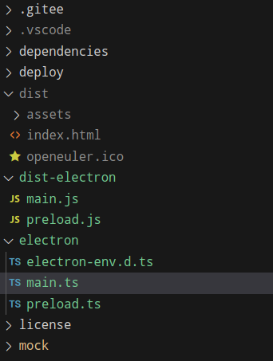

electron打包

依赖如下：

```json
"devDependencies": {
    "electron": "^13.0.0",
    "electron-builder": "^22.13.1",
    "electron-devtools-installer": "^3.1.0",
    "vue-cli-plugin-electron-builder": "~2.1.1"
}
```

报错：

```js
⨯ Get "https://npm.taobao.org/mirrors/electron/13.6.9/electron-v13.6.9-linux-x64.zip": Connect failed
github.com/develar/app-builder/pkg/download.(*Downloader).follow.func1
```


下载好electron-v13.6.9-linux-x64.zip，放在/home/lx/.cache/electron后，重新打包即可


## vite + electron

拿到一个vite项目，要集成electron并在内网开发，项目本身是monorepo结构，要下载项目依赖到内网。

以下是通过pnpm list --depth 9999命令获取版本号，下载依赖的node脚本。最开始想要从pnpm-lock.yaml中提取版本号和包名，但是这个锁文件和package.json不同，他没有resolved字段，也就没有.taz文件的下载地址，需要从npm源处下载。

但是当前脚本存在一个问题就是没法下载子项目依赖，只能放在子项目中再次下载，比较麻烦

```js
/**
 * 使用pnpm list --depth 9999从树型结构中提取依赖项和版本号，从npm源下载tarball
 */
const { exec } = require('child_process')
const fs = require('fs')
const https = require('https')
const path = require('path')

const tarballsDir = 'tarballs'
// 确保tarballs目录存在
if (!fs.existsSync(tarballsDir)) {
  fs.mkdirSync(tarballsDir)
}

function downloadTarball(tarballPath, version) {
  return new Promise((resolve, reject) => {
    let packageName
    let tarballUrl = `https://registry.npmmirror.com/`
    if (tarballPath.includes('/')) {
      packageName = tarballPath.split('/')[1]
    } else {
      packageName = tarballPath
    }
    tarballUrl += `${tarballPath}/-/${packageName}-${version}.tgz`

    const download = url => {
      https
        .get(url, response => {
          if (response.statusCode === 302) {
            // 处理重定向
            const redirectUrl = response.headers.location
            if (!redirectUrl) {
              reject(`Failed to download tarball for ${url}. Redirect URL not found.`)
              return
            }
            console.log(`Redirecting to: ${redirectUrl}`)
            download(redirectUrl) // 重新发起请求
            return
          }

          if (response.statusCode !== 200) {
            reject(`Failed to download tarball for ${url}. Status code: ${response.statusCode}`)
            return
          }

          const filePath = path.join(tarballsDir, `${packageName}-${version}.tgz`)
          const fileStream = fs.createWriteStream(filePath)
          response.pipe(fileStream)
          fileStream.on('finish', () => {
            fileStream.close()
            console.log(`Downloaded: ${packageName}-${version}.tgz`)
            resolve()
          })
        })
        .on('error', err => {
          filePath && fs.unlink(filePath, () => {})
          reject(`Error downloading ${url}: ${err}`)
        })
    }

    download(tarballUrl) // 开始下载
  })
}

async function compressTarballs() {
  const outputFilePath = path.join(__dirname, 'tarballs.tar.gz')
  const tarballsPath = path.join(__dirname, tarballsDir)

  // 使用 tar 命令压缩文件夹
  const command = `tar -zcvf tarballs.tar.gz ${tarballsDir}/`
  console.log(command)

  console.log('Compressing tarballs folder...')

  return new Promise((resolve, reject) => {
    exec(command, (error, stdout, stderr) => {
      if (error) {
        reject(`执行出错: ${error}`)
        return
      }
      if (stderr) {
        reject(`错误信息: ${stderr}`)
        return
      }
      resolve(`成功压缩: ${stdout}`)
    })
  })
}

async function flattenPnpmList() {
  // 执行pnpm list命令
  exec('pnpm list --depth 9999', async (error, stdout, stderr) => {
    if (error) {
      console.error('执行出错:', error)
      return
    }
    if (stderr) {
      console.error('错误信息:', stderr)
      return
    }

    // 将输出按行分割
    const lines = stdout.split('\n').slice(5)

    // 处理每一行，拉平展示
    const flattenedList = lines.map(line => {
      // 去除前导空格和依赖层级标识
      // 使用正则表达式匹配第一个 @ 符号或第一个英文字符
      const regex = /.*?([@a-zA-Z])/
      const match = line.match(regex)
      if (match) {
        // 返回匹配到的字符及其后面的部分
        return line.slice(match.index + match[0].length - 1)
      }

      return line
    })

    const downloadTasks = []
    // 控制并发数微4，并发太多服务器会拒绝响应
    const concurrencyLimit = 4
    let currentConcurrency = 0

    for (const item of flattenedList) {
      const [tarballPath, version] = item.split(' ')
      if (tarballPath && version) {
        while (currentConcurrency >= concurrencyLimit) {
          await new Promise(resolve => setTimeout(resolve, 100))
        }
        currentConcurrency++
        downloadTasks.push(
          downloadTarball(tarballPath, version)
            .catch(err => console.error(err))
            .finally(() => currentConcurrency--),
        )
      }
    }

    await Promise.all(downloadTasks)

    // 拼接结果字符串
    const result = flattenedList.join('\n')

    // 指定输出文件路径
    const outputPath = path.join(__dirname, 'tree.txt')

    // 将结果写入到tree.txt文件中
    fs.writeFile(outputPath, result, err => {
      if (err) {
        console.error('写入文件出错:', err)
        return
      }
      console.log('依赖列表已成功写入到', outputPath)
    })

    // 下载完成后压缩 tarballs 文件夹
    try {
      await compressTarballs()
    } catch (err) {
      console.error('压缩 tarballs 文件夹时出错:', err)
    }
  })
}

flattenPnpmList()

```

之后发现要获取同时获取子项目依赖信息可以通过`pnpm list --recursive --depth=9999 --json > tarballs.json`将信息输出到文件，这个文件中就包含了依赖的resolve字段,那就可以使用之前从package-lock.json下载依赖的逻辑

使用sh脚本，相比node脚本速度更慢，主要是使用wget下载，node脚本中可以控制请求并发，而wget未做限制，目前似乎是一个一个发起请求（后续优化）修改后的脚本内容如下

```sh
#!/bin/bash

# node版本需求18.12以上
pnpm list --recursive --depth=9999 --json > tarballs-lock.json

# 检查当前目录下是否存在tarballs-lock.json文件
if [ ! -f tarballs-lock.json ]; then
  echo "tarballs-lock.json在当前目录中未找到"
  exit 1
fi

# 如果tarballs目录不存在，则创建它
mkdir -p tarballs

# 从tarballs-lock.json文件中提取resolved字段
while read -r line; do
  if [[ $line =~ "resolved" ]]; then
    # 提取tarballs链接
    link=$(echo "$line" | cut -d '"' -f 4)
    # 检查链接是否已经下载过
    if [ ! -e "tarballs/$(basename "$link")" ]; then
      # 下载tarballs
      wget "$link" -P tarballs
    fi
  fi
done < tarballs-lock.json

# 压缩tarballs目录
tar -czf tarballs.tar.gz tarballs

echo "tarballs文件已下载到tarballs目录中，并压缩成tarballs.tar.gz"

```

当前整体项目参考[electron-vite-vue](https://github.com/electron-vite/electron-vite-vue.git)

主要使用的依赖项：

```json
"main": "dist-electron/main.js",
"scripts": {
    "dev": "vite",
    "build": "vite build",
    "electron:build": "vite build && electron-builder",
    "electron:deb": "vite build && electron-builder --linux deb",
    "electron:rpm": "vite build && electron-builder --linux rpm",
    "electron:appimage": "vite build && electron-builder --linux AppImage",
    "lint": "eslint .",
    "lint:fix": "eslint . --fix"
  },
"devDependencies": {
    "electron": "22.0.0",
    "electron-builder": "22.14.13",
    "vite": "5.4.14",
    "vite-plugin-electron": "^0.28.4",
}
```

vite.config.ts内容如下

```ts
import path from 'path'
import { defineConfig } from 'vite'
import vue from '@vitejs/plugin-vue'
import { viteMockServe } from 'vite-plugin-mock'
import electron from 'vite-plugin-electron/simple'

const BASE_PROXY_URL = 'http://localhost:11111'

export default () => {
  return defineConfig({
    base: './',
    resolve: {
      alias: {
        '@': path.resolve(__dirname, './src'),
      },
    },
    envPrefix: 'A_OPS',
    plugins: [
      vue(),
      // https://github.com/anncwb/vite-plugin-mock/tree/master/#readme
      viteMockServe({
        logger: true,
        mockPath: 'mock',
        localEnabled: true,
      }),
      electron({
        // 主进程配置
        main: {
          entry: 'electron/main.ts', // 主进程入口文件
          // vite: {
          //   // 主进程专用的 Vite 配置（覆盖全局配置）
          //   build: {
          //     outDir: 'dist-electron/', // 主进程构建输出目录
          //   },
          // },
          // 开发模式下 Electron 启动后的钩子函数
          onstart(args: any) {
            args.reload() // 触发主进程重启
          },
        },
        preload: {
          input: 'electron/preload.ts',
        }
      }),
    ],
    // build: {
    //   minify: 'terser',
    //   terserOptions: {
    //     compress: {
    //       drop_console: true,
    //       drop_debugger: true,
    //     },
    //   },
    //   rollupOptions: {
    //     output: {
    //       chunkFileNames: 'js/[name]-[hash].js',
    //       entryFileNames: 'js/[name]-[hash].js',
    //       assetFileNames: '[ext]/[name]-[hash].[ext]',
    //       manualChunks(id) {
    //         try {
    //           if (id.includes('node_modules')) {
    //             const name = id.split('node_modules/')[1].split('/')
    //             if (name[0] === '.pnpm') {
    //               return name[1]
    //             } else {
    //               return name[0]
    //             }
    //           }
    //         } catch (error) {
    //           console.error(error)
    //         }
    //       },
    //     },
    //   },
    // },
    server: {
      host: '0.0.0.0',
      hmr: true,
      port: 3000,
      proxy: {
        '/accounts': {
          target: BASE_PROXY_URL,
          secure: false,
          changeOrigin: true,
          ws: false,
        },
        '/hosts': {
          target: BASE_PROXY_URL,
          secure: false,
          changeOrigin: true,
          ws: false,
        },
        '/distribute': {
          target: BASE_PROXY_URL,
          secure: false,
          changeOrigin: true,
          ws: false,
        },
        '/vulnerabilities': {
          target: BASE_PROXY_URL,
          secure: false,
          changeOrigin: true,
          ws: false,
        },
        '/conftrace': {
          target: BASE_PROXY_URL,
          secure: false,
          changeOrigin: true,
          ws: false,
        },
        '/operations': {
          target: BASE_PROXY_URL,
          secure: false,
          changeOrigin: true,
          ws: false,
          rewrite: (path: string) => path,
        },
        '/api': {
          target: 'http://116.63.144.61:21579',
          changeOrigin: true,
          ws: false,
          rewrite: (path: string) => path,
          cookieDomainRewrite: '.euler-copilot-master.test.osinfra.cn',
        },
      },
    },
  })
}

```

electron打包配置文件electron-builder.json如下：

```json
// @see https://www.electron.build/configuration/configuration
{
  "$schema": "https://raw.githubusercontent.com/electron-userland/electron-builder/master/packages/app-builder-lib/scheme.json",
  "appId": "YourAppID",
  "asar": true,
  "productName": "YourAppName",
  "directories": {
    "output": "release/${version}"
  },
  "files": [
    "dist",
    "dist-electron"
  ],
  "mac": {
    "target": [
      "dmg"
    ],
    "artifactName": "${productName}-Mac-${version}-Installer.${ext}"
  },
  "win": {
    "target": [
      {
        "target": "nsis",
        "arch": [
          "x64"
        ]
      }
    ],
    "artifactName": "${productName}-Windows-${version}-Setup.${ext}"
  },
  "nsis": {
    "oneClick": false,
    "perMachine": false,
    "allowToChangeInstallationDirectory": true,
    "deleteAppDataOnUninstall": false
  },
  "linux": {
    "target": [
      "AppImage"
    ],
    "artifactName": "${productName}-Linux-${version}.${ext}"
  }
}

```

## 核心插件

### vite-plugin-electron

vite会将前端打包`vite-plugin-electron`负责在vite打包是提供eletron应用程序预览，并且提供热重载（HMR），他的配置项在vite.config.ts的plugin。electron中配置，原理可参考[掘金文章](https://juejin.cn/post/7085919755692933156)，[官方文档](https://vite.electron.js.cn/guide/core-plugins.html)，[vite插件](https://www.viterc.cn/en/vite-plugin-electron.html)

文件结构为：


vite将主进程文件和预加载文件根据vite.config.ts中的配置编译压缩成common.js模块，并在package.json中的mian中指明electron入口

主进程文件main.ts和预加载文件preload.ts如下：

```ts
// electron/main.js
const { app, BrowserWindow, globalShortcut } = require('electron')
const path = require('path')

console.log(1111, app.isPackaged)

function createWindow() {
  const mainWindow = new BrowserWindow({
    width: 1200,
    height: 800,
    webPreferences: {
      preload: path.join(__dirname, 'preload.js'),
      // 用于控制是否在渲染进程中启用上下文隔离，渲染进程与Electron和Node.js的API隔离
      // contextIsolation: true,
      // nodeIntegration: true,
    },
  })

  // process.env.NODE_ENV此时无法访问，一种方法是在使用命令启动electron项目是在前方加上"electron:dev": "NODE_ENV=development electron .",
  // 或者使用electron API app.isPackaged 对于大多数应用程序，此属性可用于区分开发和生产环境 https://www.electronjs.org/zh/docs/latest/api/app#appispackaged-%E5%8F%AA%E8%AF%BB
  // 加载 Vite 开发服务器或生产构建的 URL
  if (!app.isPackaged) {
    mainWindow.loadURL('http://localhost:3000')
    mainWindow.webContents.openDevTools()
  } else {
    mainWindow.loadFile(path.join(__dirname, '../dist/index.html'))
  }

  // 注册全局快捷键
  registerGlobalShortcut(mainWindow)
}

function registerGlobalShortcut(win) {
  // 注册快捷键 'Ctrl+Alt+Shift+D'
  globalShortcut.register('Ctrl+Alt+Shift+D', () => {
    // 检查窗口是否已经打开了开发者工具
    if (!win.webContents.isDevToolsOpened()) {
      win.webContents.openDevTools()
    } else {
      win.webContents.closeDevTools()
    }
  })
}

app.commandLine.appendSwitch('ignore-certificates-errors')

app.whenReady().then(() => {
  createWindow()

  app.on('activate', () => {
    if (BrowserWindow.getAllWindows().length === 0) {
      createWindow()
    }
  })
})

app.on('window-all-closed', () => {
  if (process.platform !== 'darwin') {
    app.quit()
  }
})

// 注销快捷键 when app is not focused
app.on('will-quit', () => {
  globalShortcut.unregisterAll()
})

app.on('certificate-error', (event, webContents, url, error, certificate, callback) => {
  callback(true)
})

```

```ts
// electron/preload.js
const { contextBridge, ipcRenderer } = require('electron')

contextBridge.exposeInMainWorld('electron', {
  send: (channel, data) => ipcRenderer.send(channel, data),
  on: (channel, func) => ipcRenderer.on(channel, (event, ...args) => func(...args)),
})

```

