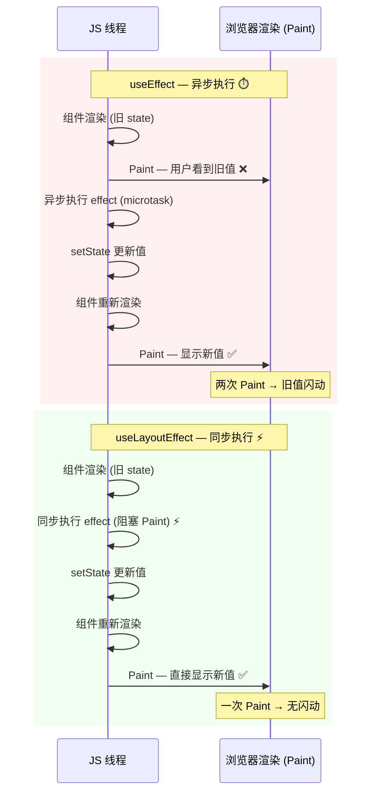

## 常用hook

### useState 

```tsx
import React, { useState, useEffect } from "react";
import logo from "./logo.svg";
import "./App.css";

async function queryData() {
  const data = await new Promise<number>((resolve) => {
    setTimeout(() => {
      resolve(666);
    }, 2000);
  });
  return data;
}

function App() {
  const [num, setNum] = useState(() => {
    const num1 = 1 + 2;
    const num2 = 2 + 3;
    return num1 + num2;
  });

  return <div onClick={() => setNum(num + 1)}>{num}</div>;
}

export default App;

```

**总结：**

- useState回调内只能写一些同步的计算逻辑，不支持异步
- useState 返回一个数组，包含 state 和 setXxx 的 api，一般我们都是用解构语法取
- setXxx 的 api 也有两种参数
  - 直接传新的值
  - 传一个函数，返回新的值，这个函数的参数是上一次的 state；`setNum((prev)=> prevent + 1)`

### useEffect

effect 被翻译为副作用，有了 effect 之后，每次执行函数，额外执行了一些逻辑，这些逻辑就是副作用。

```jsx
import React, { useState, useEffect } from "react";
import logo from "./logo.svg";
import "./App.css";

async function queryData() {
  const data = await new Promise<number>((resolve) => {
    setTimeout(() => {
      resolve(666);
    }, 2000);
  });
  return data;
}

function App() {
  const [num, setNum] = useState(0);

  // useEffect 参数的那个函数不支持 async
  // 现在这个组件会渲染两次，初始渲染和 2s 后 setNum 触发的渲染
  // 第二个参数 依赖数组 react 是根据它有没有变来决定是否执行 effect 函数的，如果没传则每次都执行
  // 也可以写任意的常量，因为它们都不变，所以不会触发 effect 的重新执行
  // 这个数组我们一般写依赖的 state，这样在 state 变了之后就会触发重新执行了;不传 deps 数组的时候也是每次都会重新执行 effect 函数
  useEffect(() => {
    console.log("xxx");
    queryData().then((data) => {
      setNum(data);
    });
  	const timer = setInterval(() => {
  	  console.log(num);
    }, 1000);

    return () => {
      console.log('clean up')
      clearInterval(timer);
    }
  }, [Date.now()]);

  return <div onClick={() => setNum((prevNum) => prevNum + 1)}>{num}</div>;
}

export default App;

```

**总结**

- 想用 async await 语法需要单独写一个函数，因为 useEffect 参数的那个函数不支持 async

- useEffect 里如果跑了一个定时器，依赖变了之后，再次执行 useEffect，又跑了一个，此时使用清理函数清除定时器，重新执行 effect 之前，会先执行清理函数

- 依赖数组中的数据为浅比较，依赖值本身的引用必须改变才会触发回调

  - ```jsx
    const [user, setUser] = useState({ name: 'Alice', age: 25 });
     
     useEffect(() => {
       console.log('user 变了');
     }, [user]); // 🔴 依赖是对象引用
     
     // ❌ 这样改不会触发 useEffect
     user.age = 26;
     setUser(user); // 同一个对象引用，React 认为没变
     
     // ✅ 这样才会触发（创建了新对象）
     setUser({ ...user, age: 26 }); // 新对象引用
     
     几个解决方案
     
    1. 把具体属性作为依赖（推荐）
     useEffect(() => {
       // ...
     }, [user.age, user.name]); // 只监听你关心的属性
     
     2. 用 useMemo 控制引用稳定性
     const memoizedUser = useMemo(() => user, [user.id, user.name]);
     useEffect(() => {
       // ...
     }, [memoizedUser]);
     
     3. 序列化后比较（"偷懒"技巧）
     useEffect(() => {
       // ...
     }, [JSON.stringify(user)]); // 字符串化后值变了就会触发
     
     ▎ ⚠️ 性能敏感场景慎用，而且对象属性顺序不稳定会有问题。
     
     4. 用 useRef + 自定义比较逻辑
     const prevUser = useRef();
     useEffect(() => {
       if (prevUser.current?.age !== user.age) {
         // age 变了才执行
       }
       prevUser.current = user;
     }, [user]);
    ```


### useLayoutEffect

和 useEffect 类似的还有一个 useLayoutEffect。

绝大多数情况下，你把 useEffect 换成 useLayoutEffect 也一样

js 执行和渲染是阻塞的，useEffect 的 **effect 函数会在操作 dom 之后异步执行**，异步执行就是用 setTimeout、Promise.then 等 api 包裹执行的逻辑。

这些逻辑会以单独的宏任务或者微任务的形式存在，然后进入 Event Loop 调度执行。

所以异步执行的 effect 逻辑就有两种可能：

- 可能在下次渲染之前，就能执行完这个 effect
- 也有可能下次渲染前，没时间执行这个 effect，所以就在渲染之后执行了

这样就导致有的时候**页面会出现闪动**，因为第一次渲染的时候的 state 是之前的值，渲染完之后执行 effect 改了 state，再次渲染就是新的值了。

一般这样也没啥问题，但如果你遇到这种情况，不想闪动那一下，就用 useLayoutEffect。

它和 useEffect 的区别是它的 effect 执行是同步的，也就是在同一个任务里

这样浏览器会等 effect 逻辑执行完再渲染。

好处自然就是不会闪动了。

下面是 useEffect 和 useLayoutEffect 的执行流程对比示意图：



**关键区别**：

- `useEffect`：渲染 → Paint（旧值可见）→ 异步执行 effect → setState → 重新渲染 → **再次 Paint** → ❌ 可能闪动
- `useLayoutEffect`：渲染 → **同步执行 effect（阻塞 Paint）** → setState → 重新渲染 → **一次 Paint** → ✅ 无闪动（但坏处也很明显，如果你的 effect 逻辑要执行很久，就阻塞渲染了）

### useReducer

前面用的 setState 都是直接修改值，那如果在修改值之前需要执行一些固定的逻辑呢？

这时候就要用 useReducer 了：

```jsx
import { Reducer, useReducer } from "react";

interface Data {
    result: number;
}

interface Action {
    type: 'add' | 'minus',
    num: number
}
function reducer(state: Data, action: Action) {

    switch(action.type) {
        case 'add':
            return {
                result: state.result + action.num
            }
        case 'minus': 
            return {
                result: state.result - action.num
            }
    }
    return state;
}

function App() {
  const [res, dispatch] = useReducer<Reducer<Data, Action>>(reducer, { result: 0});

  return (
    <div>
        <div onClick={() => dispatch({ type: 'add', num: 2 })}>加</div>
        <div onClick={() => dispatch({ type: 'minus', num: 1 })}>减</div>
        <div>{res.result}</div>
    </div>
  );
}

export default App;
```

点击加的时候，触发 add 的 action，点击减的时候，触发 minus 的 action。

使用useState 也可实现如上功能，但是如果要执行比较复杂的逻辑，用 useState 需要在每个地方都写一遍这个逻辑，而用 useReducer 则是把它封装到 reducer 里，通过 action 触发就好了

**当修改 state 的逻辑比较复杂，用 useReducer。**

继续看useReducer：

```jsx
const [res, dispatch] = useReducer<Reducer<Data, Action>, string>(reducer, 'zero', (param) => {
    return {
        result: param === 'zero' ? 0 : 1
    }
});
```

它还有另一种重载，通过函数来创建初始数据，这时候 useReducer 第二个参数就是传给这个函数的参数。

### useReducer + immer

此外，使用 reducer 有一个特别要注意的地方：

```jsx
function reducer(state: Data, action: Action) {
  switch (action.type) {
    case "add":
      // return {
      //   result: state.result + action.num,
      // };

      // 注意：如果你直接修改原始的 state 返回，是触发不了重新渲染的
      state.result += action.num;
      return state;
    case "minus":
      return {
        result: state.result - action.num,
      };
  }
  return state;
}
```

> 注意：如果你直接修改原始的 state 返回，是触发不了重新渲染的，必须返回一个新的对象才行。

如果对象结构很复杂，每次都创建一个新的对象会比较繁琐，而且性能也不好：

```jsx
function reducer(state: Data, action: Action) {

    switch(action.type) {
        case 'add':
            return {
                ...state,
                a: {
                    ...state.a,
                    c: {
                        ...state.a.c,
                        e: state.a.c.e + action.num,
                    },
                },
            }
    }
    return state;
}
```

复杂对象的修改就要用 immutable 相关的库了

```shell
npm install --save immer
```

```jsx
function reducer(state: Data, action: Action) {
  console.log(state);

  switch (action.type) {
    case "add":
      // 这里的 data 是一个复杂的对象结构，我们需要改的是其中的一个属性，但是为了创建新对象，要把其余属性依次复制一遍
      // 但是写起来很麻烦，也不好维护
      // return {
      //   ...state,
      //   a: {
      //     ...state.a,
      //     c: {
      //       ...state.a.c,
      //       e: state.a.c.e + action.num,
      //     },
      //   },
      // };

      // immer 是依赖 Proxy 实现的，它会监听你在函数里对属性的修改，然后帮你创建一个新对象。
      return produce(state, (state) => {
        state.a.c.e += action.num;
      });
  }
  return state;
}
```

immer 是依赖 Proxy 实现的，它会监听你在函数里对属性的修改，然后帮你创建一个新对象

reducer 需要返回一个新的对象，才会触发渲染，其实 useState 也是

```jsx
import { useState } from "react";
import { produce } from "immer";

/**
 * 在 react 里，只要涉及到 state 的修改，就必须返回新的对象，不管是 useState 还是 useReducer
 */
function App() {
  // reducer 需要返回一个新的对象，才会触发渲染，其实 useState 也是
  const [obj, setObj] = useState({
    a: {
      c: {
        e: 0,
        f: 0,
      },
      d: 0,
    },
    b: 0,
  });

  return (
    <div>
      <div
        onClick={() => {
          obj.a.c.e++;
          // 因为对象引用没变，同样不会重新渲染
          // setObj(obj);
          setObj(produce(obj, (obj) => {
            obj.a.c.e ++;
        }))
        }}
      >
        加
      </div>
      <div>{JSON.stringify(obj)}</div>
    </div>
  );
}

export default App;
```

**总结**

**在 react 里，只要涉及到 state 的修改，就必须返回新的对象，不管是 useState 还是 useReducer。**

如果是复杂的深层对象的修改，可以用 immer 来优化。

### useRef

React 推崇的是数据不可变

如何保存 dom 引用呢？这时候就需要用 useRef 了

```jsx
import { useEffect, useRef } from "react";

function App() {
    const inputRef = useRef<HTMLInputElement>(null);

    useEffect(() => {
        inputRef.current?.focus();
    });

    return (
        <div>
            <input ref={inputRef}></input>
        </div>
    );
}

export default App;
```

这里通过 ref 保存 input 元素的引用，然后在 useEffect 里调用它的 focus 方法。

ref 的内容是保存在 current 属性上的。

ref 其实就是一个有 current 属性的对象，除了可以保存 dom 引用，也可以放别的内容：

```jsx
import { useRef } from "react";

function App() {
    const numRef = useRef<number>(0);

    return (
        <div>
            <div onClick={() => {
                numRef.current += 1
            }}>{numRef.current}</div>
        </div>
    );
}

export default App;
```

但它不会触发重新渲染，想触发渲染，还是得配合 state


### forwardRef + useImperativeHandle

单个组件内如何拿到 ref 我们知道了，那如果是想把 ref 从子组件传递到父组件，这种有专门的 api： forwardRef

```jsx
import { useRef } from 'react';
import { useEffect } from 'react';
import React from 'react';

const child: React.ForwardRefRenderFunction<HTMLInputElement> = (props, ref) => {
  return <div>
    <input ref={ref}></input>
  </div>
}

const Father = React.forwardRef(child);

function App() {
  const ref = useRef<HTMLInputElement>(null);
 
  useEffect(()=> {
    console.log('ref', ref.current)
    ref.current?.focus()
  }, []);

  return (
    <div className="App">
      <Father ref={ref}/>
    </div>
  );
}

export default App;
```

其实 forwardRef就是把 ref 转发到组件内部来设置

不过被 forwardRef 包裹的组件的类型就要用 React.forwardRefRenderFunction 了

但有的时候，我不是想把原生标签暴露出去，而是暴露一些自定义内容。

这时候就需要 useImperativeHandle 的 hook 了。

```jsx
import { useRef } from 'react';
import { useEffect } from 'react';
import React from 'react';
import { useImperativeHandle } from 'react';

interface RefProps {
  aaa: () => void;
}

const child: React.ForwardRefRenderFunction<RefProps> = (props, ref) => {
  const inputRef = useRef<HTMLInputElement>(null);

  useImperativeHandle(ref, () => {
    return {
      aaa() {
        inputRef.current?.focus();
      }
    }
  }, [inputRef]);

  return <div>
    <input ref={inputRef}></input>
  </div>
}

const Father = React.forwardRef(child);

function App() {
  const ref = useRef<RefProps>(null);
 
  useEffect(()=> {
    console.log('ref', ref.current)
    ref.current?.aaa();
  }, []);

  return (
    <div className="App">
      <Father ref={ref}/>
    </div>
  );
}

export default App;
```

这样，父组件里拿到的 ref 就是 useImperativeHandle 第二个参数的返回值了。

### useContext

跨任意层组件传递数据，我们一般用 Context。

```jsx
import { createContext, useContext } from 'react';

const countContext = createContext(111);

function Aaa() {
  return <div>
      <countContext.Provider value={222}>
        <Bbb></Bbb>
      </countContext.Provider>
  </div>
} 

function Bbb() {
  return <div><Ccc></Ccc></div>
}

function Ccc() {
  const count = useContext(countContext);
  return <h2>context 的值为：{count}</h2>
}

export default Aaa;
```

用 createContext 创建 context，在 Aaa 里面使用 xxxContext.Provider 修改它的值，然后在 Ccc 里面用 useContext 取出来。

class 组件是通过 Consumer 来取 context 的值：

```jsx
import { createContext, Component } from 'react';

const countContext = createContext(111);

class Ccc extends Component {
  render() {
    return <h2>context 的 值为：{this.props.count}</h2>
  }
}

function Bbb() {
  return <div>
    <countContext.Consumer>{
        (count) => <Ccc count={count}></Ccc>
      }
    </countContext.Consumer>
  </div>
}
```

不过现在很少写 class 组件了。

**总结**

- **用 createContext 创建 context 对象，用 Provider 修改其中的值**
- **function 组件使用 useContext 的 hook 来取值**
- **class 组件使用 Consumer 来取值**

### memo + useMemo + useCallback

```jsx
import { memo, useEffect, useState } from "react";

function Aaa() {
    const [,setNum] = useState(1);

    useEffect(() => {
        setInterval(()=> {
            setNum(Math.random());
        }, 2000)
    },[]);

    return <div>
        <Bbb count={2}></Bbb>
    </div>
} 

interface BbbProps {
    count: number;
}

function Bbb(props: BbbProps) {
    console.log('bbb render');

    return <h2>{props.count}</h2>
}

export default Aaa;
```

bbb render 每 2s 都会打印一次，但很明显，这里 Bbb 并不需要再次渲染，这时可以加上 memo。

```jsx
import { memo, useEffect, useState } from "react";

function Aaa() {
    const [,setNum] = useState(1);

    useEffect(() => {
        setInterval(()=> {
            setNum(Math.random());
        }, 2000)
    },[]);

    return <div>
        <MemoBbb count={2}></MemoBbb>
    </div>
} 

interface BbbProps {
    count: number;
}

function Bbb(props: BbbProps) {
    console.log('bbb render');

    return <h2>{props.count}</h2>
}

const MemoBbb = memo(Bbb);

export default Aaa;
```

**memo 的作用是只有 props 变的时候，才会重新渲染被包裹的组件**

这样就只会打印一次bbb render了

我们让 2s 后 props 变：

```jsx
import { memo, useEffect, useState } from "react";

function Aaa() {
    const [,setNum] = useState(1);

    const [count, setCount] = useState(2);


    useEffect(() => {
        setInterval(()=> {
            setNum(Math.random());
        }, 2000)
    },[]);

    useEffect(() => {
        setTimeout(()=> {
            setCount(Math.random());
        }, 2000)
    },[]);

    return <div>
        <MemoBbb count={count}></MemoBbb>
    </div>
} 

interface BbbProps {
    count: number;
}

function Bbb(props: BbbProps) {
    console.log('bbb render');

    return <h2>{props.count}</h2>
}

const MemoBbb = memo(Bbb);

export default Aaa;
```

props 变了会触发 memo 的重新渲染，bbb render打印两次

用 memo 的话，一般还会结合两个 hook：useMemo 和 useCallback。

**memo 是防止 props 没变时的重新渲染，useMemo 和 useCallback 是防止 props 的不必要变化。**

```jsx
import { memo, useEffect, useState, useCallback } from "react";

function Aaa() {
  const [, setNum] = useState(1);

  useEffect(() => {
    setInterval(() => {
      // 这里会触发Aaa组件重新渲染
      setNum(Math.random());
    }, 2000);
  }, []);

  const [count, setCount] = useState(2);
  // --------------我们让 2s 后 props 变，此时Bbb会重新渲染
  useEffect(() => {
    setTimeout(() => {
      setCount(Math.random());
    }, 2000);
  }, []);
  // ------------------

  console.log("aaa render");

  // 此时memo 失效了，因为每次 function 都是新创建的，也就是每次 props 都会变，这样 memo 就没用了
  // function bbbCallback() {}

  // 它的作用就是当 deps 数组不变的时候，始终返回同一个 function，当 deps 变的时候，才把 function 改为新传入的
  const bbbCallback = useCallback(function () {
    // xxx
  }, []);

  return (
    <div>
      {/* <Bbb count={2}></Bbb> */}
      <MemoBbb count={count} callback={bbbCallback}></MemoBbb>
    </div>
  );
}

interface BbbProps {
  count: number;
  callback: Function;
}

function Bbb(props: BbbProps) {
  // 每 2s 都会打印,也就是说，每次都会触发 Bbb 组件的重新渲染
  // 但很明显，这里 Bbb 并不需要再次渲染
  console.log("bbb render");

  return <h2>{props.count}</h2>;
}

// memo 的作用是只有 props 变的时候，才会重新渲染被包裹的组件
// memo 是防止 props 没变时的重新渲染，useMemo 和 useCallback 是防止 props 的不必要变化。
const MemoBbb = memo(Bbb);

export default Aaa;
```

当我们给Bbb组件直接传递一个`function bbbCallback() {}`时，memo 失效了，**因为每次 function 都是新创建的，也就是每次 props 都会变，这样 memo 就没用了**

这时候就需要 useCallback，**它的作用就是当 deps 数组不变的时候，始终返回同一个 function，当 deps 变的时候，才把 function 改为新传入的。**

同理，useMemo 也是和 memo 打配合的，只不过它保存的不是函数，而是值：

```jsx
const count2 = useMemo(() => {
    return count * 10;
  }, [count]);
```

它是在 deps 数组变化的时候，计算新的值返回。

- **如果子组件用了 memo，那给它传递的对象、函数类的 props 就需要用 useMemo、useCallback 包裹，否则，每次 props 都会变，memo 就没用了。**
- **反之，如果 props 使用 useMemo、useCallback，但是子组件没有被 memo 包裹，那也没意义，因为不管 props 变没变都会重新渲染，只是做了无用功。**
- memo + useCallback、useMemo 是搭配着来的，少了任何一方，都会使优化失效

**但 useMemo 和 useCallback 也不只是配合 memo 用的：**

比如有个值的计算，需要很大的计算量，你不想每次都算，这时候也可以用 useMemo 来缓存。

### 总结

- **useState**：状态是变化的数据，是组件甚至前端应用的核心。useState 有传入值和函数两种参数，返回的 setState 也有传入值和传入函数两种参数。
- **useEffect**：副作用 effect 函数是在渲染之外额外执行的一些逻辑。它是根据第二个参数的依赖数组是否变化来决定是否执行 effect，可以返回一个清理函数，会在下次 effect 执行前执行。
- **useLayoutEffect**：和 useEffect 差不多，但是 useEffect 的 effect 函数是异步执行的，所以可能中间有次渲染，会闪屏，而 useLayoutEffect 则是同步执行的，所以不会闪屏，但如果计算量大可能会导致掉帧。
- **useReducer**：封装一些修改状态的逻辑到 reducer，通过 action 触发，当修改深层对象的时候，创建新对象比较麻烦，可以结合 immer
- **useRef**：可以保存 dom 引用或者其他内容，通过 xxRef.current 来取，改变它的内容不会触发重新渲染
- **forwardRef + useImperativeHandle**：通过 forwardRef 可以从子组件转发 ref 到父组件，如果想自定义 ref 内容可以使用 useImperativeHandle
- **useContext**：跨层组件之间传递数据可以用 Context。用 createContext 创建 context 对象，用 Provider 修改其中的值， function 组件使用 useContext 的 hook 来取值，class 组件使用 Consumer 来取值
- **memo + useMemo + useCallback**：memo 包裹的组件只有在 props 变的时候才会重新渲染，useMemo、useCallback 可以防止 props 不必要的变化，两者一般是结合用。不过当用来缓存计算结果等场景的时候，也可以单独用 useMemo、useCallback
