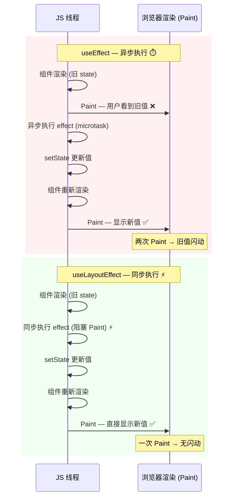

## 常用hook

### useState 

```tsx
import React, { useState, useEffect } from "react";
import logo from "./logo.svg";
import "./App.css";

async function queryData() {
  const data = await new Promise<number>((resolve) => {
    setTimeout(() => {
      resolve(666);
    }, 2000);
  });
  return data;
}

function App() {
  const [num, setNum] = useState(() => {
    const num1 = 1 + 2;
    const num2 = 2 + 3;
    return num1 + num2;
  });

  return <div onClick={() => setNum(num + 1)}>{num}</div>;
}

export default App;

```

**总结：**

- useState回调内只能写一些同步的计算逻辑，不支持异步
- useState 返回一个数组，包含 state 和 setXxx 的 api，一般我们都是用解构语法取
- setXxx 的 api 也有两种参数
  - 直接传新的值
  - 传一个函数，返回新的值，这个函数的参数是上一次的 state；`setNum((prev)=> prevent + 1)`

### useEffect

effect 被翻译为副作用，有了 effect 之后，每次执行函数，额外执行了一些逻辑，这些逻辑就是副作用。

```jsx
import React, { useState, useEffect } from "react";
import logo from "./logo.svg";
import "./App.css";

async function queryData() {
  const data = await new Promise<number>((resolve) => {
    setTimeout(() => {
      resolve(666);
    }, 2000);
  });
  return data;
}

function App() {
  const [num, setNum] = useState(0);

  // useEffect 参数的那个函数不支持 async
  // 现在这个组件会渲染两次，初始渲染和 2s 后 setNum 触发的渲染
  // 第二个参数 依赖数组 react 是根据它有没有变来决定是否执行 effect 函数的，如果没传则每次都执行
  // 也可以写任意的常量，因为它们都不变，所以不会触发 effect 的重新执行
  // 这个数组我们一般写依赖的 state，这样在 state 变了之后就会触发重新执行了;不传 deps 数组的时候也是每次都会重新执行 effect 函数
  useEffect(() => {
    console.log("xxx");
    queryData().then((data) => {
      setNum(data);
    });
  	const timer = setInterval(() => {
  	  console.log(num);
    }, 1000);

    return () => {
      console.log('clean up')
      clearInterval(timer);
    }
  }, [Date.now()]);

  return <div onClick={() => setNum((prevNum) => prevNum + 1)}>{num}</div>;
}

export default App;

```

**总结**

- 想用 async await 语法需要单独写一个函数，因为 useEffect 参数的那个函数不支持 async

- useEffect 里如果跑了一个定时器，依赖变了之后，再次执行 useEffect，又跑了一个，此时使用清理函数清除定时器，重新执行 effect 之前，会先执行清理函数

- 依赖数组中的数据为浅比较，依赖值本身的引用必须改变才会触发回调

  - ```jsx
     const [user, setUser] = useState({ name: 'Alice', age: 25 });
      
      useEffect(() => {
        console.log('user 变了');
      }, [user]); // 🔴 依赖是对象引用
      
      // ❌ 这样改不会触发 useEffect
      user.age = 26;
      setUser(user); // 同一个对象引用，React 认为没变
      
      // ✅ 这样才会触发（创建了新对象）
      setUser({ ...user, age: 26 }); // 新对象引用
      
      几个解决方案
      
     1. 把具体属性作为依赖（推荐）
      useEffect(() => {
        // ...
      }, [user.age, user.name]); // 只监听你关心的属性
      
      2. 用 useMemo 控制引用稳定性
      const memoizedUser = useMemo(() => user, [user.id, user.name]);
      useEffect(() => {
        // ...
      }, [memoizedUser]);
      
      3. 序列化后比较（"偷懒"技巧）
      useEffect(() => {
        // ...
      }, [JSON.stringify(user)]); // 字符串化后值变了就会触发
      
      ▎ ⚠️ 性能敏感场景慎用，而且对象属性顺序不稳定会有问题。
      
      4. 用 useRef + 自定义比较逻辑
      const prevUser = useRef();
      useEffect(() => {
        if (prevUser.current?.age !== user.age) {
          // age 变了才执行
        }
        prevUser.current = user;
      }, [user]);
    ```


### useLayoutEffect

和 useEffect 类似的还有一个 useLayoutEffect。

绝大多数情况下，你把 useEffect 换成 useLayoutEffect 也一样

js 执行和渲染是阻塞的，useEffect 的 **effect 函数会在操作 dom 之后异步执行**，异步执行就是用 setTimeout、Promise.then 等 api 包裹执行的逻辑。

这些逻辑会以单独的宏任务或者微任务的形式存在，然后进入 Event Loop 调度执行。

所以异步执行的 effect 逻辑就有两种可能：

- 可能在下次渲染之前，就能执行完这个 effect
- 也有可能下次渲染前，没时间执行这个 effect，所以就在渲染之后执行了

这样就导致有的时候**页面会出现闪动**，因为第一次渲染的时候的 state 是之前的值，渲染完之后执行 effect 改了 state，再次渲染就是新的值了。

一般这样也没啥问题，但如果你遇到这种情况，不想闪动那一下，就用 useLayoutEffect。

它和 useEffect 的区别是它的 effect 执行是同步的，也就是在同一个任务里

这样浏览器会等 effect 逻辑执行完再渲染。

好处自然就是不会闪动了。

下面是 useEffect 和 useLayoutEffect 的执行流程对比示意图：



**关键区别**：
- `useEffect`：渲染 → Paint（旧值可见）→ 异步执行 effect → setState → 重新渲染 → **再次 Paint** → ❌ 可能闪动
- `useLayoutEffect`：渲染 → **同步执行 effect（阻塞 Paint）** → setState → 重新渲染 → **一次 Paint** → ✅ 无闪动（但坏处也很明显，如果你的 effect 逻辑要执行很久，就阻塞渲染了）

### useReducer

前面用的 setState 都是直接修改值，那如果在修改值之前需要执行一些固定的逻辑呢？

这时候就要用 useReducer 了：

```jsx
import { Reducer, useReducer } from "react";

interface Data {
    result: number;
}

interface Action {
    type: 'add' | 'minus',
    num: number
}
function reducer(state: Data, action: Action) {

    switch(action.type) {
        case 'add':
            return {
                result: state.result + action.num
            }
        case 'minus': 
            return {
                result: state.result - action.num
            }
    }
    return state;
}

function App() {
  const [res, dispatch] = useReducer<Reducer<Data, Action>>(reducer, { result: 0});

  return (
    <div>
        <div onClick={() => dispatch({ type: 'add', num: 2 })}>加</div>
        <div onClick={() => dispatch({ type: 'minus', num: 1 })}>减</div>
        <div>{res.result}</div>
    </div>
  );
}

export default App;
```

点击加的时候，触发 add 的 action，点击减的时候，触发 minus 的 action。

使用useState 也可实现如上功能，但是如果要执行比较复杂的逻辑，用 useState 需要在每个地方都写一遍这个逻辑，而用 useReducer 则是把它封装到 reducer 里，通过 action 触发就好了

**当修改 state 的逻辑比较复杂，用 useReducer。**

继续看useReducer：

```jsx
const [res, dispatch] = useReducer<Reducer<Data, Action>, string>(reducer, 'zero', (param) => {
    return {
        result: param === 'zero' ? 0 : 1
    }
});
```

它还有另一种重载，通过函数来创建初始数据，这时候 useReducer 第二个参数就是传给这个函数的参数。

### useReducer + immer

此外，使用 reducer 有一个特别要注意的地方：

```jsx
function reducer(state: Data, action: Action) {
  switch (action.type) {
    case "add":
      // return {
      //   result: state.result + action.num,
      // };

      // 注意：如果你直接修改原始的 state 返回，是触发不了重新渲染的
      state.result += action.num;
      return state;
    case "minus":
      return {
        result: state.result - action.num,
      };
  }
  return state;
}
```

> 注意：如果你直接修改原始的 state 返回，是触发不了重新渲染的，必须返回一个新的对象才行。

如果对象结构很复杂，每次都创建一个新的对象会比较繁琐，而且性能也不好：

```jsx
function reducer(state: Data, action: Action) {

    switch(action.type) {
        case 'add':
            return {
                ...state,
                a: {
                    ...state.a,
                    c: {
                        ...state.a.c,
                        e: state.a.c.e + action.num,
                    },
                },
            }
    }
    return state;
}
```

复杂对象的修改就要用 immutable 相关的库了

```shell
npm install --save immer
```

```jsx
function reducer(state: Data, action: Action) {
  console.log(state);

  switch (action.type) {
    case "add":
      // 这种写法也行
      // return {
      //   ...state,
      //   result: state.result + action.num,
      // };

      // 用 immer 之后可以直接修改 state（proxy 的功劳）
      state.result += action.num;
      return;
    case "minus":
      return {
        ...state,
        result: state.result - action.num,
      };
  }
  return state;
}
```

用 immer 之后，直接在 reducer 里修改 state 就可以了，不需要每次都返回一个新的对象。

### useRef

`useRef` 是 React 提供的 Hook，用来创建和保存一个可变的引用值。**改变 `useRef` 的值不会触发组件重新渲染。**

使用场景：

- 存储 `setTimeout`、`setInterval` 返回的 `timer` 引用
- 保存对 DOM 元素的引用
- 保存任意可变的值，在组件的整个生命周期内保持不变

```tsx
import { useRef, useEffect } from "react";

function App() {
  const inputRef = useRef<HTMLInputElement>(null);

  useEffect(() => {
    // 组件挂载后自动聚焦输入框
    inputRef.current?.focus();
  }, []);

  return <input ref={inputRef} type="text" />;
}
```

**注意：** 不要在渲染期间读取或修改 `useRef.current`，它应该在事件处理、`useEffect` 等副作用中使用。

### forwardRef + useImperativeHandle

当父组件想操作子组件内部的 DOM 或方法时，可以通过 `forwardRef` + `useImperativeHandle` 暴露有限的接口。

```tsx
import { forwardRef, useImperativeHandle, useRef } from "react";

// 定义子组件暴露的方法类型
interface ChildRef {
  focus: () => void;
  validate: () => boolean;
}

const Child = forwardRef<ChildRef, {}>((props, ref) => {
  const inputRef = useRef<HTMLInputElement>(null);

  useImperativeHandle(ref, () => ({
    focus: () => {
      inputRef.current?.focus();
    },
    validate: () => {
      return inputRef.current?.value.length > 0;
    },
  }));

  return <input ref={inputRef} />;
});

function Parent() {
  const childRef = useRef<ChildRef>(null);

  const handleClick = () => {
    childRef.current?.focus();
    console.log(childRef.current?.validate());
  };

  return (
    <>
      <Child ref={childRef} />
      <button onClick={handleClick}>聚焦并验证</button>
    </>
  );
}
```

**总结：**
- `forwardRef` 让组件可以接收 `ref`
- `useImperativeHandle` 控制暴露给父组件的内容，不暴露整个 DOM 节点（避免破坏封装性）

### 自定义 Hooks

自定义 Hook 本质上是一个以 `use` 开头的函数，内部可以调用其他 Hook。用于抽取和复用有状态逻辑。

```tsx
import { useState, useEffect } from "react";

// 自定义 Hook：获取鼠标位置
function useMousePosition() {
  const [position, setPosition] = useState({ x: 0, y: 0 });

  useEffect(() => {
    const handler = (e: MouseEvent) => {
      setPosition({ x: e.clientX, y: e.clientY });
    };
    window.addEventListener("mousemove", handler);
    return () => window.removeEventListener("mousemove", handler);
  }, []);

  return position;
}

// 使用
function App() {
  const { x, y } = useMousePosition();
  return <div>鼠标位置：{x}, {y}</div>;
}
```

**自定义 Hook 要点：**
- 命名必须以 `use` 开头（React 约定，也是 lint 规则）
- 内部可以调用其他 Hook（`useState`、`useEffect` 等）
- 每次调用都是独立的 state，不共享
- 返回值可以是任意类型（值、对象、函数等）
- 自定义 Hook 还可以接收参数（就像普通函数一样灵活）

### 逻辑复用的进化

在 React 中，逻辑复用的方式经历了三个阶段：

| 阶段 | 方式 | 说明 |
|------|------|------|
| 1 | Mixins (已废弃) | 容易导致命名冲突和隐式依赖 |
| 2 | HOC / Render Props | 解决了 Mixin 的问题，但会导致组件嵌套过深（Wrapper Hell） |
| 3 | **自定义 Hooks** ✅ | 最简单的复用逻辑的方式 |

**HOC（高阶组件）示例：**
```tsx
function withMousePosition(Component: any) {
  return (props: any) => {
    const [position, setPosition] = useState({ x: 0, y: 0 });
    useEffect(() => {
      const handler = (e: MouseEvent) => setPosition({ x: e.clientX, y: e.clientY });
      window.addEventListener("mousemove", handler);
      return () => window.removeEventListener("mousemove", handler);
    }, []);
    return <Component {...props} mousePosition={position} />;
  };
}
```

**Render Props 示例：**
```tsx
function MouseTracker({ children }: { children: (pos: { x: number; y: number }) => ReactNode }) {
  const [position, setPosition] = useState({ x: 0, y: 0 });
  useEffect(() => {
    const handler = (e: MouseEvent) => setPosition({ x: e.clientX, y: e.clientY });
    window.addEventListener("mousemove", handler);
    return () => window.removeEventListener("mousemove", handler);
  }, []);
  return <>{children(position)}</>;
}
```

相比之下，自定义 Hook 既没有嵌套问题，也没有命名冲突，是最简洁的复用方式。

### 受控组件 vs 非受控组件

| 类型 | state 来源 | 控制方式 | 推荐场景 |
|------|-----------|---------|---------|
| **受控组件** | React state | `value` + `onChange` | 需要实时验证、动态禁用提交按钮等 |
| **非受控组件** | DOM 自身 | `ref` 读取值 | 简单表单、文件上传、不常变化的值 |

**受控组件示例：**
```tsx
function ControlledForm() {
  const [value, setValue] = useState("");

  const handleSubmit = () => {
    console.log(value);
  };

  return (
    <>
      <input value={value} onChange={(e) => setValue(e.target.value)} />
      <button onClick={handleSubmit}>提交</button>
    </>
  );
}
```

**非受控组件示例：**
```tsx
import { useRef } from "react";

function UncontrolledForm() {
  const inputRef = useRef<HTMLInputElement>(null);

  const handleSubmit = () => {
    console.log(inputRef.current?.value);
  };

  return (
    <>
      <input ref={inputRef} defaultValue="hello" />
      <button onClick={handleSubmit}>提交</button>
    </>
  );
}
```

**选择建议：** 表单状态少且简单时用非受控；需要实时校验、联动或动态 UI 时用受控。

### React 渲染流程

React 的渲染流程可以概括为两个阶段：

1. **Render 阶段**：调用组件函数，生成虚拟 DOM（React Element 树）
2. **Commit 阶段**：将虚拟 DOM 的变更同步到真实 DOM

```
┌──────────────┐     ┌──────────────┐     ┌──────────────┐
│  State 更新   │────▶│  Render 阶段  │────▶│  Commit 阶段  │
│ (setState)   │     │  (虚拟 DOM)   │     │  (真实 DOM)   │
└──────────────┘     └──────────────┘     └──────────────┘
                            │                      │
                            │ useEffect(fn)        │ useLayoutEffect(fn)
                            │ 异步执行             │ 同步执行
                            ▼                      ▼
                      浏览器渲染 (Paint)      浏览器渲染 (Paint)
```

**关键点：**
- React 的 Render 阶段是同步的（严格模式下会执行两次以检查纯函数）
- `useEffect` 的 callback 在 Commit 之后异步执行（延迟执行）
- `useLayoutEffect` 的 callback 在 Commit 之后、浏览器 Paint 之前**同步**执行
- 只有在 Render 阶段没有错误时，才会进入 Commit 阶段

### React 18 特性

#### 自动批处理 (Automatic Batching)

React 18 之前，只有在 React 事件处理函数中的 `setState` 才会批处理。Promise、setTimeout、原生事件等中的 `setState` 不会批处理。

React 18 之后，无论如何调用 `setState`，都会自动批处理。

```tsx
// React 18 — 所有情况都会批处理
const handleClick = () => {
  setCount(c => c + 1);
  setFlag(f => !f);
  // 只会触发一次渲染
};

// 包括 Promise、setTimeout 等
fetch('/api/data').then(() => {
  setCount(c => c + 1);
  setFlag(f => !f);
  // React 18 也只会触发一次渲染
});
```

#### startTransition

用于标记某些状态更新为"非紧急更新"，React 会优先处理紧急更新，在空闲时间才处理非紧急更新。

```tsx
import { startTransition, useState } from "react";

function App() {
  const [input, setInput] = useState("");
  const [list, setList] = useState<string[]>([]);

  const handleChange = (e: React.ChangeEvent<HTMLInputElement>) => {
    // 紧急更新：更新输入框
    setInput(e.target.value);

    // 非紧急更新：过滤大量列表
    startTransition(() => {
      const result = largeList.filter(item =>
        item.includes(e.target.value)
      );
      setList(result);
    });
  };

  return (
    <>
      <input value={input} onChange={handleChange} />
      <ListView list={list} />
    </>
  );
}
```

#### useDeferredValue

`useDeferredValue` 让你可以延迟更新 UI 的某些部分，和 `startTransition` 类似，但它是从值而非更新函数角度出发。

```tsx
import { useDeferredValue, useState } from "react";

function App() {
  const [input, setInput] = useState("");
  const deferredInput = useDeferredValue(input); // 延迟的值

  const list = filterLargeList(deferredInput);

  // 如果 input 和 deferredInput 不同，说明有延迟更新
  const isStale = input !== deferredInput;

  return (
    <>
      <input value={input} onChange={(e) => setInput(e.target.value)} />
      <ListView list={list} style={{ opacity: isStale ? 0.5 : 1 }} />
    </>
  );
}
```

### React 渲染机制补充

#### React 元素 vs 组件

```tsx
// React 元素（React Element）：
// 是用 JSX 或 React.createElement 创建的一个普通的 JS 对象
// 描述了你希望在屏幕上看到什么

const element = <h1>Hello</h1>;

// 组件（Component）：
// 是一个函数（或类），接收 props 并返回 React 元素
function MyComponent(props: { name: string }) {
  return <h1>Hello {props.name}</h1>;
}
```

**关键区别：**
- React 元素是**不可变的对象**，它就是虚拟 DOM 的节点
- 组件是**工厂函数**，每次渲染时 React 都会调用组件来生成新的 React 元素树
- 组件名称必须以大写字母开头，React 通过大小写区分 React 元素和组件

#### React 元素的结构

```tsx
// JSX 语法
const element = <div className="container">Hello</div>;

// 实际上编译为：
const element = React.createElement("div", { className: "container" }, "Hello");

// 最终 React 元素是一个普通对象：
// {
//   $$typeof: Symbol(react.element),
//   type: "div",
//   props: { className: "container", children: "Hello" },
//   key: null,
//   ref: null,
// }
```

### React 开发工具

- **React DevTools**：浏览器扩展，用于检查 React 组件树、state、props
- **Profiler**：React DevTools 内建，用于分析组件渲染性能

**为什么需要 React DevTools？** 浏览器自带的 Elements 面板只能看到 DOM 结构，看不到组件的 state、props、hooks 等信息。React DevTools 弥补了这个缺口。

## Profiler 性能分析

React Developer Tools 的 Profiler 面板可以记录组件的渲染时间和次数，帮助定位性能瓶颈。

使用步骤：

1. 打开浏览器 DevTools → React → Profiler
2. 点击录制按钮（⚪）
3. 在页面上进行操作
4. 停止录制，查看渲染火焰图

在火焰图中：
- 每个色块代表一次组件渲染
- 颜色越深（黄/红色）表示渲染耗时越长
- 灰色表示该次没有重新渲染

**常用优化手段（结合 Profiler）：**

| 问题 | 方案 |
|------|------|
| 父组件更新导致子组件不必要渲染 | `React.memo` |
| 昂贵的计算结果 | `useMemo` |
| 回调函数每次都新建 | `useCallback` |
| 大量列表渲染卡顿 | 虚拟列表（react-window） |
