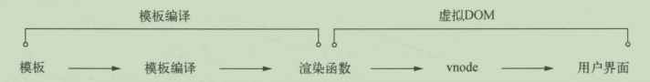
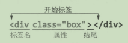

# vue模板编译



大体逻辑上分为三部分：

- 将模板解析为AST
- 遍历AST标记静态节点
- 使用AST生成渲染函数

分别抽象成三个模块实现功能：

- 解析器
- 优化器
- 代码生成器

## 解析器

- HTML解析器
- 文本解析器
- 过滤器解析器

> AST是js中使用对象描述的节点，对象中的属性用来保存节点所需的各种数据，多个独立节点通过parent和children属性连在一起形成的树叫做AST树。
>
> 以下为AST示例：
>
> ```json
> {
>  tag:"div",
>  type:1,
>  staticRoot:false,
>  static:false,
>  plain:true,
>  parent:undefined,
>  attrsList:[],
>  attrsMap:{},
>  children:[]
> }
> ```

解析HTML过程中会触发各种钩子函数包括开始标签钩子函数、结束标签钩子函数、文本钩子函数、注释钩子函数。

```js
parseHTML(template,{
    // 每当解析到标签开始位置时
    start(tag,attrs,unary){},
    // 每当解析到标签结束位置时
    end(){},
    // 每当解析到文本时
    charts(text){},
    // 每当解析到注释时
    comment(text){}
})
```

使用栈**构建AST层级**关系，解析HTML时是从前向后解析，每次触发start钩子时,将当前节点拖入栈中，每当触发钩子函数end时，就从栈中弹出一个节点。这样就能保证每当触发钩子函数start时，栈的最后一个节点为当前构建节点的父节点。

例如如下模板：

```html
<div>
	<h1>我是Berwin</h1>
    <p>今年23岁</p>
</div>
```


运行原理：简单来就是用HTML模板字符串来循环，每轮循环都从HTML模板字符串来循环，每轮循环都截取一小段字符串，重复上过程，摘到HTML模板被截陈空串时结束。

被截取的片段分多种类型：

- 开始标签
- 结束标签
- HTML注释
- DOCTYPE
- 条件注释
- 文本

### 截取开始标签

匹配开始标签的正则

https://www.baidufe.com/item/eb10deb92f2c05ca32cf.html

```js
/^<((?:[a-zA-Z_][\w\-\.]*\:)?[a-zA-Z_][\w\-\.]*)/
const startTagOpen = new RegExp(/^<((?:[a-zA-Z_][\w\-\.]*\:)?[a-zA-Z_][\w\-\.]*)/)
console.log('<div></div>'.match(startRegExp))
// [ '<div','div',index: 0,input: '<div></div>',groups: undefined ]

const start = '<div></div>'.match(startTagOpen)
start && const match = {
    tagName:start[1],
    attrs:[]
}
```

以上正则匹配了一部分的开始标签，开始标签实际上被分为了三部分：



根据编译模板的整体逻辑，会将匹配的开始标签的一部分截取出去

> template.subString(start[0].length)

### 截取标签属性

```html
<div class="box" id="el"></div>
```

```js
const startTagClose = /^\s*(\/?)>/
const attribute = new RegExp(/^\s*([^\s*"'<>\/=]+)(?:\s*(=)\s*(?:"([^"]*)"+|'([^]')*'+|([^\s"'=<>`]+)))?/)
let html = ' class="box" id="el" </div>'
let end ,attr
const match = {tagName:'div',attrs:[]}

// 剩余模板符不符合结束标签，符合标签属性的特征  时 解析并截取模板
while(!(end = html.match(startTagClose) && (attr = html.amtch(attribute))){
    html = html.subString(attr[0].length)
	match.attrs.push(attr)
}
```

解析后的数据

```js
{
    tagName: 'div',
    attrs:[
        [' class="box"'，'class','=','box',null,null],
        [' id="el"'，'id','=','el',null,null]
    ]
}
```

**解析自闭合标识**

自闭合标签没有子节点，在构建AST层级时，需要维护一个栈，用自闭合标识判断是否推入节点进栈 

```js
function parseStartTagEnd(html){
    const startTagClose = /^\s*(\/?)>/
    const end = html.math(startTagClose)
    const match{}
    
    if(end){
        match.unarySlash = end[1]
        html = html.substring(end[0].length)
        return match
    }
}

console.log('/><div></div>')   // {unarySlash:''}
console.log('></div>')    // {unarySlash:'/'}
```

### 截取结束标签

```js
/^<\/(?:([a-zA-z_][\w\-\.]*\:)?[a-zA-Z_][\w\-\.]*[^>]*>)/
```

截取结束标签结束后，截取模板，触发钩子函数

### 截取注释

```js
const comment = /^<!--/

if(comment.test(html)){
    const commentEnd = html.indexOf('-->')
    
    if(commentEnd >= 0){
        if(options.shouldKeepComment){
            options.comment(html.subString(4,commentEnd))
        }
        html = html.subString(commentEnd + 3)
        continue
    }
}
```


### 截取条件注释

